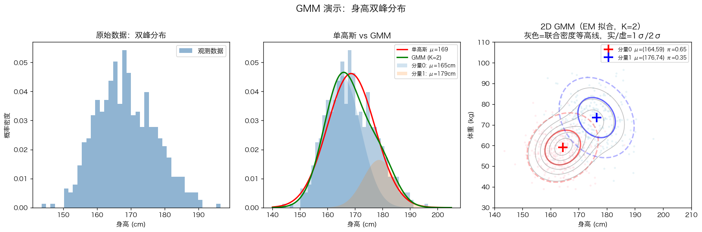
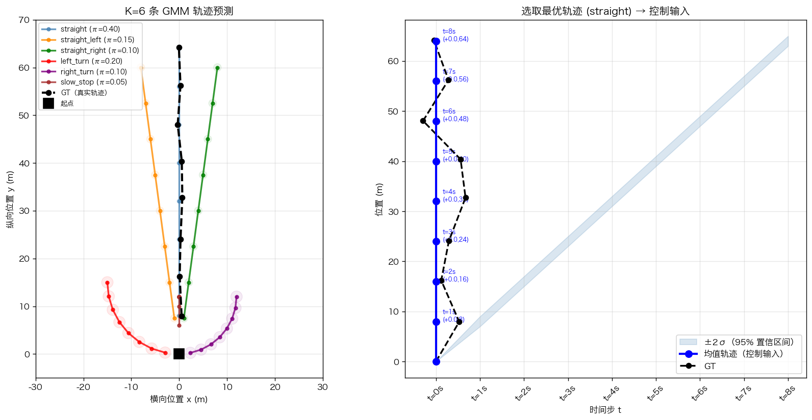

# 高斯混合模型（Gaussian Mixture Model，GMM）

## 从单个高斯说起

**单个高斯分布**描述一个随机变量的概率：最可能出现在均值 $\mu$ 附近，距离越远概率越低，衰减速度由方差 $\sigma^2$ 控制。

一维高斯分布：

$$p(x) = \frac{1}{\sqrt{2\pi\sigma^2}} \exp\left(-\frac{(x-\mu)^2}{2\sigma^2}\right)$$

二维高斯分布（描述平面上的位置 $(x, y)$）：

$$p(\mathbf{x}) = \frac{1}{2\pi|\Sigma|^{1/2}} \exp\left(-\frac{1}{2}(\mathbf{x}-\boldsymbol{\mu})^T\Sigma^{-1}(\mathbf{x}-\boldsymbol{\mu})\right)$$

其中协方差矩阵 $\Sigma$ 描述 $x$ 和 $y$ 方向各自的不确定性以及两者的相关性。

**1D 多峰 vs 2D 高斯的区别**：

- **1D 多峰 GMM**：同一个变量有多个聚集区域。例：男女身高混在一起形成双峰（163cm 附近和 175cm 附近各一个峰），这是**一个维度**上的多模态。
- **2D 高斯**：一个事件发生在**二维平面**的位置分布。例：一辆车左转后的终点，可能落在 (-20m, +15m) 附近，x 和 y 方向各有不确定性。
- **2D GMM**：在 2D 平面上有多个聚集区域——直行的终点在 (0, +30m) 附近，左转的终点在 (-20, +15m) 附近，是**两个维度上的多模态**。

驾驶里用 2D 高斯的原因：意图最终体现为一个 2D 位置（终点的 x, y）。左转的终点可能是 (-20m, +15m)，但执行有不确定性，实际可能落在 (-18m, +16m) 或 (-22m, +14m)——2D 高斯的均值是最可能的位置，$\sigma$ 描述执行不确定性范围。

**单个高斯的局限**：只能描述"一个峰"。真实驾驶有多种合理意图，中间区域（既不直行也不转弯）概率很低，单个高斯没法表达这种"多峰"分布。

---

## 混合高斯：多个高斯的加权叠加

**GMM** 把 $K$ 个高斯分布加权叠加，权重 $\pi_k$ 表示第 $k$ 个分量被选中的概率：

$$p(\mathbf{x}) = \sum_{k=1}^{K} \pi_k \cdot \mathcal{N}(\mathbf{x} \mid \boldsymbol{\mu}_k, \Sigma_k)$$

约束：$\pi_k \geq 0$，$\sum_{k=1}^{K} \pi_k = 1$。

**K 个分量是独立的吗？** 在 GMM 的定义里是的——每个分量是一个独立的高斯分布，分量之间没有耦合。但在运动预测里，分量之间其实有隐式关联：用同一个场景 encoder 的输出（场景上下文）生成所有 K 条轨迹，所以虽然分量在数学上是独立的，在实际生成过程中共享了同一份场景理解。

**GMM 是 K 个高斯的线性组合，能表达任何分布吗？**

是线性组合，系数（权重 $\pi_k$）加起来等于 1，这是正确的。关于表达能力：

**理论上**：当 $K \to \infty$ 时，GMM 可以以任意精度逼近任何连续概率分布（这是高斯函数作为基函数的稠密性保证）。直觉类比：就像傅里叶级数用正弦波的线性组合可以逼近任意周期函数，GMM 用高斯的线性组合可以逼近任意分布。

**实际能力受两个因素限制**：

1. **K 的大小**：K=3 只能表达 3 个峰，K=64 可以表达很复杂的分布。但 K 太大会让每个分量难以学习（WTA 时每个分量被选中的机会太少），实践中 K=6~64 是常见范围。

2. **高斯形状假设**：每个分量必须是椭圆形的高斯分布。如果真实数据的某个模态是弯曲的（比如一条弯曲道路上的轨迹分布），单个高斯描述不好，需要多个高斯去拼接逼近。

**和其他方法比较表达能力**：

| 方法 | 能表达什么形状 | 限制 |
|------|-------------|------|
| 单高斯 | 单椭圆 | 只有一个峰 |
| GMM（K=6） | 6 个椭圆的叠加 | 每个模态必须是椭圆 |
| GMM（K=64） | 复杂多峰，可近似弯曲分布 | 参数多，学习难度高 |
| 扩散模型 | 任意形状 | 无形状假设，但采样慢 |
| 归一化流（Normalizing Flow）| 任意形状 | 可精确推断，但结构复杂 |

对运动预测来说，**K=64 的 GMM 已经足够**：驾驶场景里的轨迹分布虽然多样，但每种意图（直行/左转/右转/减速）在局部近似都是椭圆形的，GMM 完全能覆盖。扩散模型的优势更多体现在联合分布（多 agent 的轨迹要互相一致），而不是单 agent 的轨迹分布。

**直觉**：从 GMM 采样一个点的过程是——先按概率 $\pi_k$ 随机选一个分量 $k$，然后从第 $k$ 个高斯里采一个样本。

---

## 用数字感受 GMM

假设一辆车在路口，K=3 个分量：

| 分量 | 意图 | 权重 $\pi_k$ | 均值 $\mu_k$（终点，相对当前位置） | 不确定性 $\sigma$ |
|------|------|------------|-------------------------------|----------------|
| k=1 | 直行 | 0.60 | (0m, +30m) | 2m |
| k=2 | 左转 | 0.25 | (-20m, +15m) | 3m |
| k=3 | 右转 | 0.15 | (+15m, +10m) | 3m |

**"终点"是什么？** 这里的终点不是车辆停下来不动的地方，而是**预测时间窗口结束时的位置**——WOMD 是 8 秒后的位置，Argoverse 是 3 秒后。车辆并不会停在那里，只是预测"8 秒后车辆在哪"。选 8 秒是因为：太短（1 秒）看不出意图（直行还是转弯还分不清），太长（30 秒）预测误差太大没有意义。

**K=3 能覆盖所有可能吗？** 不能，这只是简化示例。真实场景里有更多可能：直行时变道左、变道右、减速停车、路口直行到不同距离……Wayformer/MTR 用 K=64 或更多，训练时通过数据驱动让不同 seed 自动覆盖不同的高频行为模式。**不是手动枚举所有可能性，而是让数据告诉模型"这个场景里都有哪些合理未来"**，WTA loss 驱动不同 seed 分化成不同的覆盖区域（详见 Loss 一节）。

---

## "轨迹"是什么

**轨迹（trajectory）**：一段时间内车辆位置随时间变化的序列，通常表示为离散时间步上的位置 $(x_t, y_t)$。

常见表示方式：

| 表示方式 | 形式 | 优缺点 |
|---------|------|--------|
| **位置序列** | $[(x_1,y_1), (x_2,y_2), \ldots, (x_T,y_T)]$ | 最直接，但没有不确定性 |
| **GMM 序列** | 每步一个 2D 高斯 $\mathcal{N}(\mu_t, \Sigma_t)$ | 有不确定性，是运动预测主流 |
| **多项式参数** | 用低阶多项式拟合轨迹 | 连续可导，适合控制，但表达能力有限 |
| **速度/加速度序列** | $(v_t, a_t, \kappa_t)$，速度+加速度+曲率 | 物理约束自然满足，适合规划 |

GMM 序列是"概率轨迹"——不是一条确定的线，而是每步的位置分布。取均值 $(\mu_x, \mu_y)$ 就得到确定性的轨迹点序列，这是控制模块实际使用的形式。

**时间步长是多少？** 取决于数据集和应用场景：

- WOMD 标准：10Hz（100ms/步），预测 80 步 = 8 秒
- Argoverse 2：10Hz，预测 60 步 = 6 秒
- 车端控制：通常 10-100Hz，规划轨迹通常 5-10Hz

评测时通常下采样到每秒一个时间步（1Hz），因为高频时相邻步误差高度相关，ADE 受步数选择影响大；1Hz 步更能反映长期意图。

**相邻时间步之间的连续性**：你的直觉是对的——如果相邻两步的 2D 高斯有重叠，任意时刻的位置都是可能的。离散时间步只是采样点，真实轨迹是连续曲线，通常用**样条插值**在离散点之间生成连续路径供控制模块使用。

---

## GMM 作为轨迹输出

Wayformer、MTR 等运动预测模型对每个时间步 $t$ 分别输出一个 2D 高斯分布，整条轨迹是 $T$ 个高斯分布的序列。

**第 $k$ 条轨迹**，在每步 $t$ 输出：

$$Z_{k,t} = (\mu_x, \mu_y, \sigma_x, \sigma_y, \rho)$$

- $(\mu_x, \mu_y)$：这步最可能的位置（轨迹点）
- $(\sigma_x, \sigma_y)$：x、y 方向的位置不确定性（越大越不确定）
- $\rho$：x 和 y 的相关系数（轨迹偏斜方向，$\rho > 0$ 表示 x 大时 y 也大）

整个模型输出：

```
K 条轨迹 × T 步 × (μ_x, μ_y, σ_x, σ_y, ρ)   ← 轨迹分布
K 条轨迹 × 1 个概率 π_k                         ← 哪条轨迹更可能
```

取"轨迹点"时直接用 $(\mu_x, \mu_y)$；评测 minADE/minFDE 时用轨迹点计算距离；$\sigma$ 在离线评测中通常不直接用，但在回归 loss 里会被约束（见下方）。

### 从 GMM 输出到控制模块可用的轨迹

运动预测给下游（规划/控制）传的是：

1. **选哪条**：通常选概率最高的那条（$\pi_k$ 最大），或通过碰撞检测选最安全的
2. **提取轨迹点**：取该条轨迹每步的均值 $(\mu_x, \mu_y)$，得到离散位置序列
3. **样条插值**：在离散点之间生成高频连续曲线（10-100Hz），供底层控制器跟踪
4. **可选：利用 $\sigma$**：给路径添加安全边距——均值点 $\pm 2\sigma$ 是 95% 置信区间，规划模块可以要求路径周围这个范围内没有障碍物

```python
# 伪代码：从 GMM 输出到控制输入
best_k = np.argmax([traj["pi"] for traj in gmm_output])     # 选最高置信度
traj_points = gmm_output[best_k]["mu"]                       # [T, 2] 均值序列
smooth_traj = spline_interpolate(traj_points, hz=50)        # 插值到 50Hz
controller.track(smooth_traj)                                # 跟踪轨迹
```

**代码示例**：`src/gmm_trajectory.py` 演示了 K=6 条 GMM 轨迹的生成、minADE/minFDE/Brier-minFDE 计算、最优轨迹选取和可视化（图见文末「代码示例」节）。

---

## 用 GMM 计算 Loss

### 回归 loss：让均值接近 GT，同时校准不确定性

对 GT 轨迹计算负对数似然：

$$L_{\text{reg}} = -\sum_t \log \mathcal{N}(y_t \mid \mu_t, \Sigma_t)$$

展开（假设 x,y 独立，即 $\rho=0$）：

$$L_{\text{reg}} = \sum_t \left[\underbrace{\frac{(y_{x,t} - \mu_{x,t})^2}{2\sigma_{x,t}^2}}_{\text{x方向均值误差}} + \underbrace{\frac{(y_{y,t} - \mu_{y,t})^2}{2\sigma_{y,t}^2}}_{\text{y方向均值误差}} + \underbrace{\log\sigma_{x,t}}_{\text{x方差正则}} + \underbrace{\log\sigma_{y,t}}_{\text{y方差正则}}\right]$$

**变量含义**：
- $y_{x,t}, y_{y,t}$：GT 在第 $t$ 步的真实 x, y 位置
- $\mu_{x,t}, \mu_{y,t}$：模型预测的均值位置
- $\sigma_{x,t}, \sigma_{y,t}$：模型预测的不确定性（标准差）

**前两项（均值误差）**：看起来像 $(y-\mu)^2$——本质是加权的均方误差，$\sigma$ 越小权重越大（惩罚越重）。

**后两项（$\log\sigma$，方差正则）**：

这是关键设计。两项一起看：

$$\frac{(y-\mu)^2}{2\sigma^2} + \log\sigma$$

对 $\sigma$ 取导数：$-\frac{(y-\mu)^2}{\sigma^3} + \frac{1}{\sigma} = 0$，解得 $\sigma^* = |y - \mu|$。

也就是说，**最优的 $\sigma$ 恰好等于预测误差本身**——模型被迫诚实地报告"我预测了多准"。如果误差大，$\sigma$ 就大；如果误差小，$\sigma$ 就小。为什么不惩罚 $\sigma$ 大？因为大 $\sigma$ 本身并不是问题——如果预测误差本来就大，$\sigma$ 大是诚实的表现。惩罚的是"不诚实"：声称很确定（小 $\sigma$）但其实预测错了（大 $(y-\mu)^2$）。

### 分类 loss：让最优匹配的分量有高概率

$$L_{\text{cls}} = -\log \pi_{k^*}, \quad k^* = \arg\min_k \text{FDE}(Y_k, y_{\text{GT}})$$

这就是交叉熵 loss——和监督学习里的 softmax+CrossEntropy 完全一样。$\pi_k$ 经过 softmax 归一化，$-\log\pi_{k^*}$ 让"最优匹配那条"的概率最大化。

**Winner-Takes-All（WTA）机制**：只对 $k^*$ 那条计算 $L_{\text{reg}}$，其余 K-1 条不参与 loss。

**"专家"体现在哪里？** 具体体现在模型的 K 个可学习向量（seed 或意图锚点）上。Wayformer 里有 K=64 个随机初始化的向量，MTR 里有 K=64 个 k-means 初始化的意图锚点。WTA 驱动分化的机制：

- 场景 A（路口左转）：seed-7 碰巧预测的轨迹离 GT 最近，它是"赢家"，只有 seed-7 的参数被更新
- 场景 B（直行）：seed-2 最近，只更新 seed-2
- 大量迭代后：seed-7 的参数专门化为"左转预测"，seed-2 专门化为"直行预测"

如果不用 WTA（所有 K 条都计算 loss），每个 seed 都被所有场景的 GT 拉扯，最终每个 seed 都学到"所有情况的平均"——K 条轨迹会退化成 K 条几乎一样的"平均轨迹"，失去多模态能力。

**seed 和意图锚点具体在模型架构的哪里？**

**Wayformer 里的 seed（`src/rl_actor_critic.py` 类比：learned seeds）**：

Decoder 是 Transformer cross-attention 结构。输入端有 K 个可学习的初始 query 向量，就是 seed：

```python
# Wayformer Trajectory Decoder（简化伪代码）
self.seeds = nn.Parameter(torch.randn(K, D))   # K×D，随机初始化，参与梯度更新

def decode(self, scene_encoding):              # scene_encoding: [A, L, D]
    queries = self.seeds.unsqueeze(0).expand(A, -1, -1)  # [A, K, D]
    # Cross-attend to scene encoding
    queries = cross_attention(queries, scene_encoding)    # [A, K, D]
    # 每个 query 独立预测一条轨迹
    traj = self.traj_head(queries)    # [A, K, T, 4]  均值+方差
    prob = self.prob_head(queries)    # [A, K]         概率 logit
    return traj, softmax(prob)
```

`self.seeds` 就是那 K=64 个 D 维向量，是模型的**普通参数**，和网络里其他权重矩阵地位一样，在反向传播时被 WTA loss 更新。没有特殊的架构设计，就是 K 个向量。

**MTR 里的意图锚点（intention points）**：

MTR 多一步：用训练集所有 GT 轨迹终点做 k-means，得到 K=64 个二维坐标（(x, y) 位置），作为**初始化值**，然后对这些坐标做 positional encoding 得到 D 维向量，再作为 Decoder 的 query：

```python
# MTR Motion Decoder（简化伪代码）
# 离线预计算：K 个意图点（2D 坐标），k-means 聚类得到
self.intention_points = load_kmeans_centers(K=64)  # [K, 2]

def decode(self, scene_encoding):
    # 把 2D 坐标变成 D 维向量
    Q_I = MLP(sinusoidal_pe(self.intention_points))  # [K, D]，静态意图 query
    Q_S = Q_I.clone()                                 # [K, D]，动态搜索 query，初始化同上

    for layer in self.decoder_layers:
        C = cross_attn(Q_I, Q_S, scene_encoding)     # [K, D]
        traj = self.gmm_head(C)                      # [K, T, 6]
        Q_S = MLP(pe(traj[:, -1, :2]))               # 用预测终点更新动态 query
    return traj, prob
```

MTR 的 `intention_points` 是**固定的 2D 坐标**（不参与梯度更新），而通过 MLP(PE(...)) 转换成 D 维向量后的 `Q_I` 是参数（参与更新）。k-means 初始化的好处是一开始 K 个 query 就分散在不同的空间位置，比随机初始化收敛更快。

**核心区别**：两者都是 K 个 D 维向量作为 Decoder 的初始 query，本质都是普通的模型参数。区别在于初始化方式（随机 vs k-means 聚类）和是否动态更新（Wayformer 的 seed 是静态的，MTR 的动态 query 每层都被当前预测结果更新）。

---

## GT 不唯一时，监督学习还能做吗？

GT（Ground Truth）是数据集里记录的真实车辆未来轨迹，"这次实际发生的那条"。但 GT 有两个层面的问题：

**标注误差（小问题）**：传感器精度和标注算法有误差，GT 坐标可能差 0.1-0.2 米。对 1-2 米量级的 ADE 影响可以接受，大量样本的随机误差统计上互相抵消，监督学习对小噪声鲁棒。

**1-2 米量级是什么体感？** 普通轿车宽约 1.8 米，车道宽约 3.5 米。1 米误差大约是"半个车身的横向偏差"。在笔直行驶时，1 米偏差人几乎感觉不到；在变道或路口场景，1 米可能意味着"变道还是没变"的区别。**业界主流模型目前的 minADE 在 0.5-1 米量级，minFDE 在 1-2 米量级**——换算成驾驶体感大约是"大部分时候预测到了正确的意图，但执行轨迹的细节会有半个车身到一个车身的误差"。

**当前业界指标水平（2026 年 WOMD 排行榜，K=6）**：

| 方法 | minADE | minFDE | MR | mAP | 体感 |
|------|--------|--------|----|-----|------|
| 早期 LSTM | ~1.5m | ~3.5m | ~25% | ~0.15 | 方向基本对，位置偏很多 |
| Wayformer | 0.545m | 1.126m | 12.3% | 0.41 | 方向和距离基本对，细节有偏差 |
| MTR | ~0.50m | ~1.07m | ~11% | ~0.45 | 当前主流水平 |
| 理论上限 | ~0.2m | ~0.5m | <5% | >0.6 | 估计（受 GT 标注误差限制） |

**未来多模态性（本质矛盾）**：同一个输入（当前场景），直行和左转都是合理的未来，没有哪个"更对"。传统监督学习的前提是"给定 X 存在唯一正确的 Y"，而运动预测里这个前提不成立。

**三种应对方式**：

**1. 接受不完整的监督，用 min-over-K 缓解**：不要求"猜中 GT"，改成"K 个猜测里至少有一个足够近就算对"（minADE）。降低要求，不是完美方案，但在没有更好方案之前能用。

**2. 学概率分布而不是点**：不学"输出 GT 轨迹"，改学"输出包含 GT 的高概率分布"。GMM 的负对数似然 loss 做的就是这件事——不要求 $\mu$ 精确等于 GT，只要求 GT 落在分布的高概率区域。

**3. 多 GT 标注（探索中）**：WOMD Interactive Split 开始标注同一场景的两种合理未来（agent A 让行 vs agent B 优先），模型需要同时覆盖两种情况。最"正确"的方向，但标注成本极高，目前覆盖有限。

**多 GT 之间有没有偏好？** 有——WOMD Interactive Split 标注时会根据交规和场景上下文标注哪种更"正确"，这个偏好可以通过调整 loss 权重让模型学进去：更"正确"的 GT 出现时，对应那条轨迹的 $L_{\text{reg}}$ 乘以更大的权重。但实践中大多数工作还是平等对待多个 GT，差异化权重的效果还在研究中。

**"在仿真环境里检验驾驶行为是否安全合理"**：不完全等于"生成的 K 条都符合约束"。NAVSIM 的做法是：用模型输出的某条轨迹替换真实 ego，检验这条轨迹执行后是否碰撞、偏离车道、不舒适。它检的是"选择执行的那条"的安全性，不是"所有 K 条都安全"。

---

## GMM vs 其他多模态输出方式

| 方式 | 做法 | 优点 | 缺点 | 使用现状（2026） |
|------|------|------|------|----------------|
| **GMM** | 参数化 K 个高斯 | 紧凑，有概率解释，$\sigma$ 表达不确定性 | 假设每个模态是高斯，形状有限 | **主流**，Wayformer/MTR 标准配置 |
| **轨迹采样** | 直接输出 K 条轨迹点，无概率 | 灵活，无分布假设 | 不知道哪条更可能，难和置信度结合 | 常见于早期工作和某些 RL 方法 |
| **目标候选点** | 密集撒候选点 + 分类 | 覆盖全面 | 候选点数量决定性能，计算爆炸 | 被 query-based 方法取代，逐渐过时 |
| **扩散模型** | 从噪声去噪采样轨迹 | 可建模任意复杂分布，联合分布 | 采样慢，推理成本高，不确定性难量化 | 学术主流上升趋势，工业部署有限 |

**2026 年厂商实际选择**：

工业界（Tesla、Waymo、华为、小鹏等）的主流选择仍然是 **GMM 或类 GMM 方法（GMM + anchor）**，原因是：
- **推理速度快**：车端芯片资源有限，GMM 一次前向传播出结果，扩散模型需要多步去噪，延迟高 5-20 倍
- **置信度可解释**：$\pi_k$ 直接给出"哪条更可能"，规则层容易利用
- **工程成熟**：GMM loss 已在大量工程中验证稳定，扩散模型在 OOD 场景下的稳定性还不如 GMM

扩散模型在**仿真场景生成**（需要多样性、不关心实时性）上已被广泛采用，但在**车端实时预测**上还主要在实验阶段。Waymo 的 MotionDiffuser 是学术工作，实际部署的 Waymo 系统用的是 GMM 变体（据公开演讲推断，非官方确认）。

---

## 代码示例

**`src/gmm_demo.py`**：用男女身高双峰数据演示 GMM，包含 EM 算法手动实现、1D vs 2D 高斯区别说明。

```
python src/gmm_demo.py
```



三个子图：左=原始双峰数据；中=单高斯 vs GMM 拟合对比（单高斯失真，GMM 两个分量各自覆盖一个峰）；右=2D GMM 示例（身高+体重，椭圆为 1σ 范围）。

---

**`src/gmm_trajectory.py`**：模拟 K=6 条 GMM 轨迹预测，计算 minADE/minFDE/Brier-minFDE，选取最优轨迹，展示从 GMM 输出到控制输入的流程。

```
python src/gmm_trajectory.py
```



左图：K=6 条候选轨迹（颜色区分意图）+ 不确定性圆圈 + GT（黑色虚线）；右图：选取最高置信度轨迹后，均值点序列（控制输入）+ ±2σ 置信区间 + GT 对比。

---

## 和 wiki 内其他概念的关联

- [Wayformer](../30-papers/wayformer-2207.05844.md)：用 GMM 输出 K 条多模态轨迹，K=64 训练压缩到 K=6 评测
- [MTR: Motion Transformer](../30-papers/mtr-2209.13508.md)：Motion Query Pair 驱动不同分量专门化，K=64 意图锚点
- [TrafficGen](../30-papers/trafficgen-2210.06609.md)：用 GMM 描述车辆放置位置分布（静态，非轨迹）
- [自动驾驶模型评测全栈概览](../00-overview/av-model-evaluation.md)：minADE/minFDE/Brier-minFDE 等指标的完整说明
- [Bellman 方程](./bellman-equation.md)：EM 算法（GMM 训练的标准方法）和 Bellman 同属迭代收敛的算法家族
