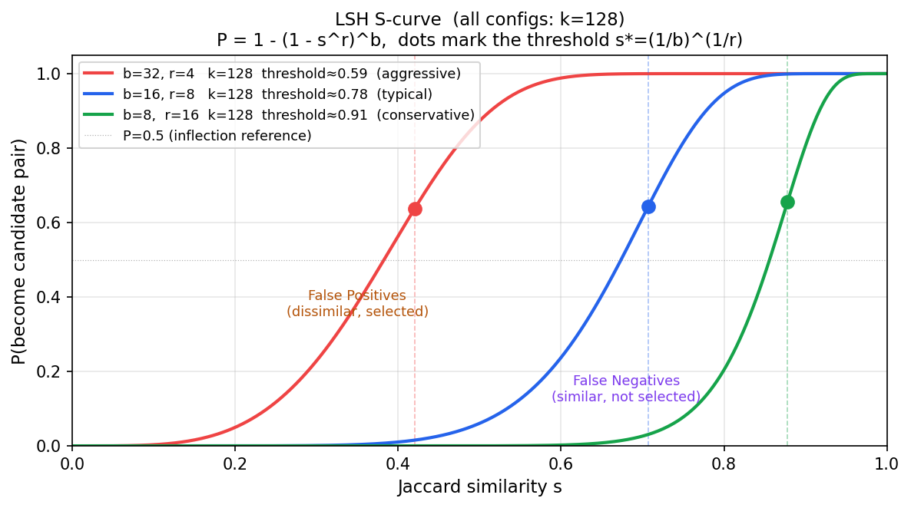
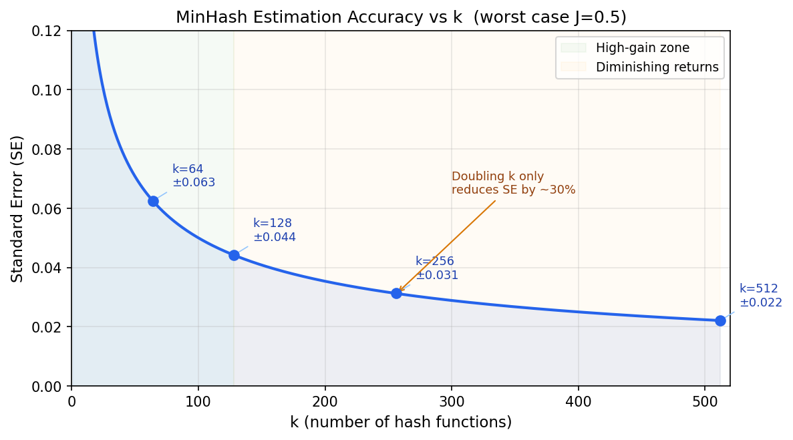

# MinHash

## 是什么

MinHash（Minimum Hash）是 Andrei Broder 于 1997 年提出的一种近似集合相似度算法，核心目标是：**在不两两比较的情况下，快速找出大量集合中的近重复对**。

在 LLM 预训练数据处理中用来做 document-level 去重：判断两篇文档是否"基本相同"（复制粘贴、轻微改写）。

**为什么不直接用精确哈希**：精确哈希只能找到完全相同的文档，改一个词就产生完全不同的哈希值。MinHash 对轻微改写有鲁棒性。

**为什么不直接两两比较**：1 亿篇文档两两比较需要 $10^{16}$ 次操作，完全不可行。MinHash + LSH 可以把复杂度降到接近线性。

---

## 一、MinHash 与 Jaccard 相似度的关系

### Jaccard 相似度

MinHash 估计的目标是 Jaccard 相似度（Paul Jaccard，1901 年提出）：

$$J(A, B) = \frac{|A \cap B|}{|A \cup B|}$$

直觉：两个集合有多少重叠，范围 0（完全不同）到 1（完全相同）。

Jaccard 有名的原因是定义极简（交集/并集），直觉清晰，不需要向量化或归一化，在信息检索、生态学、基因组学、推荐系统等领域独立被发现和使用。

**J 不是"重复概率"**：$J(A,B)$ 是两个集合的客观属性，是一个固定的数。"这两篇文档是否重复"是一个**判断**，由你设定的阈值决定（如 $J > 0.8$ 则判为重复）。J 是相似程度，不是重复概率。

### 这里用的哈希函数是什么

MinHash 里的哈希函数和密码学哈希（MD5、SHA）的目的不同，但底层要求有一个共同点：**把输入映射到一个均匀分布的输出空间**。

具体要求：
- **均匀性**：集合里的每个元素，被哈希到任意位置的概率相等。这样"最小值"才不会系统性地偏向某类元素。
- **独立性**：$k$ 个哈希函数之间要相互独立，这样 $k$ 次估计才是独立的随机变量，才能用大数定律收敛。
- **不需要抗碰撞**：MinHash 不在乎两个不同元素哈希到同一个值（碰撞），因为它只关心"最小值是否相等"这个事件，不需要从哈希值反推原始元素。

实践中通常用 **MurmurHash** 或 **xxHash** 这类非密码学哈希函数——它们均匀性好、速度极快（比 SHA256 快 10–100 倍），不需要密码学安全性。用 $k$ 个不同的种子（seed）初始化同一个哈希函数，就能得到 $k$ 个"独立"的哈希函数（严格说是近似独立，实践中足够）。

### 单个哈希函数的情况

对于一个随机哈希函数 $h$，有如下性质：

$$P\bigl(\min_{x \in A} h(x) = \min_{x \in B} h(x)\bigr) = J(A, B)$$

**证明**

把 $A \cup B$ 里的所有元素按哈希值从小到大排列。因为哈希均匀，这个顺序等价于对 $A \cup B$ 做随机排列，每个元素排第一的概率相等。

关键等价关系：**"排第一的元素属于 $A \cap B$"↔"$A$ 和 $B$ 的最小哈希值相等"**

为什么等价？分两个方向：

→ 方向：设排第一的元素 $x \in A \cap B$。$x$ 同时在 $A$ 里，所以 $x$ 是 $A$ 里哈希值最小的元素（因为 $x$ 在整个 $A \cup B$ 里都排第一）；同理 $x$ 也是 $B$ 里哈希值最小的元素。于是 $\min_A h = h(x) = \min_B h$，两集合最小哈希值相等。

← 方向：设 $\min_A h = \min_B h = v$。设 $A$ 里哈希值为 $v$ 的元素是 $x$，$B$ 里哈希值为 $v$ 的元素是 $y$。因为哈希函数对不同输入产生相同值的概率极低（近似忽略），$x = y$，即同一个元素同时在 $A$ 和 $B$ 里，$x \in A \cap B$。这个元素就是排第一的那个。

所以：

$$P(\text{最小哈希相等}) = P(\text{排第一的元素} \in A \cap B) = \frac{|A \cap B|}{|A \cup B|} = J(A, B)$$

**用 max 或 median 可以吗？**

可以，任何固定的排名位置（第一、最后、第 $k$ 小）都满足同样的等价关系，证明结构完全相同。实践中用 min 有两个工程优势：哈希值通常是无符号整数，min 天然有界且实现简单；此外 min 在流式处理（一次遍历更新）中比 median 更高效。

所以单个哈希函数给出的是一个 0/1 的随机变量：相等（1）或不相等（0），期望等于 $J(A,B)$，但方差很大——单次估计要么完全对要么完全错。

### k 个哈希函数：收敛速度

用 $k$ 个独立的随机哈希函数，对每个集合取 $k$ 个最小哈希值，估计量是这 $k$ 次 0/1 结果的平均值，是 $J$ 的无偏估计，标准误差为：

$$\text{SE} = \sqrt{\frac{J(1-J)}{k}} \leq \frac{0.5}{\sqrt{k}}$$

上界在 $J = 0.5$ 时取到（最难估准的情况）。

| k | 最坏情况标准误差 |
|---|---|
| 64 | ±0.063 |
| 128 | ±0.044 |
| 256 | ±0.031 |
| 512 | ±0.022 |

标准误差是估计值的**波动幅度**，不是错误概率。$k=128$、真实 $J=0.8$ 时，95% 情况下估计值落在 $[0.730, 0.870]$ 以内。统计原理的完整推导见[附录：统计基础](#附录统计基础)。

**k = 128 的时间开销**：$n$ 词的文档生成 $n - 4$ 个 5-gram（每个窗口滑动一步），所以 200 词 ≈ 196 个 5-gram，1000 词 ≈ 996 个 5-gram。1000 词大约是 2–3 页 A4，对应约 1000 个 5-gram，计算 128 个哈希值约需 **1–6ms**（MurmurHash，单核，128,000 次哈希操作）。k 翻倍时间线性翻倍，但标准误差只减少 $1/\sqrt{2} \approx 30\%$，边际收益递减——这是选 128–256 而不是 512 的主要原因。

---

## 二、特征化：把文档变成集合

MinHash 需要把文档表示成一个**集合**才能计算 Jaccard。特征化的选择直接影响"相似"的定义。

### n-gram（最常用）

把文本切成连续的 n 个 token 的片段，取所有片段构成集合。

**字符级 n-gram**：
```
文本: "hello"
3-gram: {"hel", "ell", "llo"}
```

**词级 n-gram（shingle）**：
```
文本: "the quick brown fox"
2-gram: {"the quick", "quick brown", "brown fox"}
```

**n 的选择**：
- n 太小（1-gram）：集合元素太常见，不同文档的 Jaccard 虚高，去重精度差
- n 太大（10-gram）：集合元素太稀疏，轻微改写就会导致相似度骤降，漏报多
- 文本去重通常用 **5-gram 词级**：对词序变化有一定鲁棒性，又不会过于稀疏

### 不同领域的典型特征化方式

| 领域 | 特征化方式 | 原因 |
|------|-----------|------|
| 文本去重（NLP） | 词级 5-gram | 对改写鲁棒，粒度合适 |
| 网页去重（搜索引擎） | 字符级 3–5-gram | 对语言无关，处理多语言更方便 |
| 代码去重 | token 级 n-gram（AST token） | 代码 token 比自然语言 token 更有语义 |
| 基因组学 | k-mer（DNA 子序列） | DNA 序列天然是字符集合，k=21 是常用值 |
| 推荐系统 | 用户行为集合（点击/购买的 item ID） | 直接用 item ID 作为集合元素，不需要 n-gram |
| 图像去重 | 感知哈希（pHash）的 bit 集合 | 图像没有自然的"词"，用像素特征替代 |

**核心原则**：特征化方式决定了"相似"的含义。用词级 n-gram，相似 = 词序相近；用 item ID 集合，相似 = 行为模式相近。选特征化方式之前要先想清楚"我想找的是什么意义上的相似"。

---

## 三、大规模化：LSH（Locality Sensitive Hashing）

### 问题

有了 $n$ 篇文档的签名向量之后，如果要两两比较，仍然是 $O(n^2)$ 的操作。1 亿篇文档 = $5 \times 10^{15}$ 次比较，不可行。

### LSH 的核心思路

LSH 的目标是：**不比较所有对，只比较"可能相似"的对**。

方法是把签名向量切成 $b$ 个 band，每个 band 有 $r$ 行（$b \times r = k$）：

```
签名向量（k=12，b=3，r=4）：

band 1: [h1, h2, h3, h4]
band 2: [h5, h6, h7, h8]
band 3: [h9, h10, h11, h12]
```

对每个 band，把该 band 的 $r$ 个值拼在一起做哈希，得到一个桶 ID。**两篇文档只要在任意一个 band 里落入同一个桶，就成为候选对**，再做精确比较。

**LSH 怎么降低了复杂度**：关键在于"同一个桶"这个条件。不是拿每篇文档和所有其他文档比，而是只比较落入同一个桶的文档对。

具体来说：对每个 band，把所有文档按桶 ID 分组，只有同一个桶里的文档才两两比较。如果每个桶平均有 $c$ 篇文档，候选对数量是 $O(n \cdot c)$ 而不是 $O(n^2)$。

为什么 $c$ 会很小？一个 band 有 $r$ 个值，每个值的范围是哈希空间（比如 $2^{32}$），$r$ 个值拼在一起哈希后，两篇文档落入同一个桶的概率是 $s^r$（$s$ 是 Jaccard 相似度）。当 $s$ 很低时（比如 $s=0.3$，$r=8$），$0.3^8 \approx 0.00007$，每 10000 篇文档里平均只有 0.7 篇会和某篇文档落入同桶——桶里文档数极少。只有高相似度的文档对（$s$ 接近 1）才会大概率落入同一个桶，这正是我们想要的。

**类比**：1 亿人里找双胞胎，不是让每两个人都比对，而是先按生日分组，再在同一天生日的人里比对。大多数组只有几个人，只有极少数组人多——总比较次数从 $O(n^2)$ 降到接近 $O(n)$。

### 为什么这样有效：S 曲线

两篇文档被 LSH 选为候选对的概率，是 Jaccard 相似度 $s$ 的函数：

$$P(\text{成为候选对}) = 1 - (1 - s^r)^b$$

推导：一个 band 内 $r$ 个位置全部相同的概率是 $s^r$（每个位置相等的概率是 $s$，独立）；所有 $b$ 个 band 都不相同的概率是 $(1-s^r)^b$；至少一个 band 相同（即被选为候选对）的概率是 $1-(1-s^r)^b$。

这个函数的形状是一条 **S 曲线**：
- $s$ 很低时，概率接近 0（低相似度的文档对很少被选中）
- $s$ 很高时，概率接近 1（高相似度的文档对几乎都被选中）
- 中间有个陡峭的跳变区，跳变位置由 $b$ 和 $r$ 控制



### 转折点 s*

S 曲线斜率最大的点，就是"从几乎选不到"切换到"几乎全选到"的临界位置，也叫**阈值**。

找斜率最大点 = 找一阶导数 $dP/ds$ 的最大值点 = 令二阶导数 $d^2P/ds^2 = 0$。完整推导繁琐，但结果是：

$$s^* \approx (1/b)^{1/r}$$

**直觉**：转折点出现在"$s^r = 1/b$"时，即一个 band 内全部相同的概率恰好等于 $1/b$。此时 $b$ 个 band 里恰好有约 1 个 band 会相同，正好是"开始被选为候选对"的临界状态，所以斜率在这里最陡。

### b 和 r 的权衡

固定 $k$，$b \times r = k$：

| 参数变化 | 转折点 | 效果 |
|---------|--------|------|
| 增大 $b$（减小 $r$） | 左移，更低 | 召回率更高，但误报增多，计算量增大 |
| 减小 $b$（增大 $r$） | 右移，更高 | 精确率更高，但漏报增多 |

**典型配置**（$k=128$，目标阈值 0.8）：$b=16$，$r=8$，转折点 $\approx (1/16)^{1/8} \approx 0.78$。

### 误检和漏检

- **漏检**（False Negative）：真实相似度 $s$ 高于阈值，但 LSH 没选中。原因：S 曲线在转折点左侧概率不为 0，但很低。
- **误检**（False Positive）：真实相似度 $s$ 低于阈值，但 LSH 选中了。原因：S 曲线在转折点右侧概率不为 1，存在"碰巧落入同一个桶"的情况。

这就是为什么 LSH 之后还需要精确验证：进入同一个桶的文档对，还需要计算真实签名相似度或真实 Jaccard，过滤掉 LSH 的误检。

---

## 四、其他需要知道的概念

### 实现变体：one-permutation MinHash

标准 MinHash 需要 $k$ 个独立哈希函数，计算 $k$ 次。**One-permutation MinHash**（Li & König, 2011）只需要一次随机排列，把签名向量分成 $k$ 个区间，每个区间取最小值。速度是标准 MinHash 的 $k$ 倍，精度略低但在实践中差距很小。大规模系统（如 Google、Meta 的数据管道）通常用这个变体。

### 误差来源

MinHash 的误差有两个来源：
1. **估计误差**：用 $k$ 个哈希函数估计 Jaccard，误差 $O(1/\sqrt{k})$（前面已讨论）
2. **特征化误差**：n-gram 集合不完全等价于"文档相似"，特征化方式会引入系统性偏差（比如两篇讨论完全不同话题的文章，如果都有大量常见词，n-gram Jaccard 可能虚高）

第二类误差通常用**预处理**缓解：去停用词、lowercase、去标点，减少无意义的高频 n-gram。

### 去重策略：保留哪一篇

MinHash 找到近重复对之后，需要决定保留哪一篇。常见策略：
- **保留最新版本**（URL-level 去重后已处理）
- **保留最长文档**（内容更完整）
- **保留来源质量更高的文档**（配合域名质量分）

**"每组"是什么，和桶的关系**：这里的"组"不是桶，是**连通分量（connected component）**，两者是不同的概念：

- **桶**：LSH 的中间产物，同一个桶里的文档"可能相似"（候选对）。一篇文档可能落入多个桶（有 $b$ 个 band，每个 band 都有一个桶）。桶只是找候选对的工具，不是最终的分组。
- **连通分量**：精确验证后，把确认相似的文档对连成一张图（节点是文档，边是"确认相似"关系），图里每个连通分量就是一"组"近重复文档。

举例：
```
文档 A 和 B 相似（J=0.85）
文档 B 和 C 相似（J=0.82）
文档 A 和 C 不直接比较（没落入同一个桶），但通过 B 间接连通

→ {A, B, C} 是一个连通分量，整组只保留一篇
```

**桶的数量很多，每个桶很小**：有 $b$ 个 band，每个 band 的桶 ID 是哈希值（范围很大），所以桶的数量可以达到数百万甚至更多，每个桶平均只有几篇文档。桶不是"文档的最终归属"，一篇文档会同时出现在 $b$ 个桶里（每个 band 一个）。

Llama 3 等大规模管道通常用 connected components 算法：先把所有近重复对连成图，每个连通分量只保留一篇（通常是质量最高的）。

### 和 SimHash 的关系

SimHash（Charikar, 2002）是另一种常用的近似相似度哈希，用于估计**余弦相似度**而不是 Jaccard。Google 用它做网页去重。

- MinHash：适合集合相似度（Jaccard），文本去重的标准选择
- SimHash：适合向量相似度（余弦），对词频有加权，对长文档更鲁棒

两者不是竞争关系，适用场景不同。

---

## 工作流程总结

```
原始文档集合
    ↓
1. 特征化：文档 → n-gram 集合
   "the quick brown fox" → {"the quick", "quick brown", "brown fox"}

    ↓
2. MinHash 签名：k 个哈希函数，各取最小值
   doc_A → [3, 7, 2, 9, 1, 5, ...]  ← k 维向量
   doc_B → [3, 4, 2, 9, 8, 5, ...]

    ↓
2.5. 逐位比较估计 Jaccard（不是整体比较）
   [3, 7, 2, 9, 1, 5, ...]
   [3, 4, 2, 9, 8, 5, ...]
    ✓  ✗  ✓  ✓  ✗  ✓  ...
   相等位数 / k = 估计的 Jaccard
   （每一位相等的概率恰好等于真实 Jaccard）

    ↓
3. LSH 分桶：把签名切成 b 个 band，每个 band 哈希到一个桶
   → 同桶的文档对成为"候选近重复对"
   （目的：避免对所有文档对做两两比较）

    ↓
4. 精确验证：对候选对计算真实相似度，过滤误报

    ↓
5. 去重：每组近重复文档保留一篇
```

**关键理解**：步骤 2.5 是整个算法的核心。k 位签名不是作为一个整体来比较"相同/不同"，而是**逐位比较**，用相等的比例来估计 Jaccard。这就是为什么 k 越大估计越准——相当于做了 k 次独立实验，取平均值，方差按 $1/\sqrt{k}$ 收缩。

---

## 参数选择速查

| 参数 | 典型值 | 说明 |
|------|--------|------|
| n-gram 大小 | 5（词级） | 对改写鲁棒，不过于稀疏 |
| 签名长度 k | 128–256 | 标准误差约 ±0.03–0.04 |
| 相似度阈值 | 0.7–0.8 | 根据去重激进程度调整 |
| band 数 b | k/8 左右 | 使转折点对准目标阈值 |
| band 行数 r | 8 左右 | 同上，b × r = k |

---

## 和 Line-level 去重的关系

MinHash 解决"整篇文档近重复"。但有一类重复它处理不了：文档主体独特，但附带了大量在整个数据集里反复出现的模板行（版权声明、Cookie 提示、导航菜单）。

**Line-level 去重**（借鉴 [ccNet](./ccnet.md)，Wenzek et al., 2019）专门处理这个问题：将数据按语言分桶（每桶约 30M 文档），统计每行出现次数，超过阈值（Llama 3 用 6 次）的行从所有文档中删除。复杂度 $O(n)$，比 MinHash 更便宜。两者互补，不是替代。

---

## 业界实现：用库还是自己写？

**短答案**：小规模用库，大规模（亿级文档）自己写或深度定制。

### 主要现成库

**datasketch**（Python，最常用）

```
pip install datasketch
```

提供 MinHash、MinHashLSH、MinHashLSHForest 等完整实现。接口简洁，适合原型开发和中等规模（千万级文档以内）。内部用 MurmurHash，支持自定义参数。

**text-dedup**（Google Research，2022）

专门为 NLP 预训练数据去重设计，支持 MinHash、SimHash、suffix array 等多种方法，有完整的命令行接口，可以直接处理 HuggingFace datasets 格式的数据。是目前最接近"开箱即用的工业级工具"的开源实现。

**Spark + 自定义 MinHash**

大规模（百亿 token 级别）通常在 Spark 上实现分布式 MinHash，Spark MLlib 有内置的 MinHashLSH，但通常需要针对文本去重场景做定制（调整特征化方式、桶策略等）。

### 为什么大规模要自己写

1. **内存布局**：库的通用实现通常用 Python 对象存储签名，亿级文档下内存开销不可接受。自己写可以用 numpy 数组或 C++ 连续内存布局，内存减少 10–100 倍。

2. **哈希函数选择**：datasketch 默认用 hashlib（较慢），大规模管道通常换成 MurmurHash3 的 C 扩展，速度快 5–10 倍。

3. **分布式策略**：LSH 分桶后的候选对匹配，需要跨机器的 join 操作，库通常不处理这部分，需要自己设计分布式流程。

4. **管道集成**：真实管道里 MinHash 只是一个步骤，需要和前后的过滤、质量打分等步骤无缝衔接，库的接口通常不够灵活。

**结论**：学习和实验用 datasketch，生产环境用 text-dedup 或自定义实现。理解原理比会用库更重要——大规模场景下你总会遇到需要改库的地方。

---

## Demo

两个 demo 文件在 `tools/` 目录下。

### Demo 1：从零实现（无第三方依赖）

```bash
python tools/minhash_from_scratch.py
```

代码：[`tools/minhash_from_scratch.py`](../../tools/minhash_from_scratch.py)

演示完整流程：n-gram 特征化 → MinHash 签名（k=128）→ LSH 分桶（b=16, r=8）→ 候选对验证。用 hashlib.md5 + seed 模拟 k 个独立哈希函数（演示用，速度慢，生产环境换 mmh3）。

**典型输出**：

```
── 真实 Jaccard 相似度 ──
  doc_A vs doc_B: 0.714   ← 轻微改写，高相似
  doc_C vs doc_D: 0.091   ← 语义相似但词重叠低
  doc_A vs doc_C: 0.000
  doc_A vs doc_E: 0.000

── MinHash 估计的 Jaccard ──
  doc_A vs doc_B: 0.703   ← 误差 0.011，在理论上界 ±0.044 以内
  doc_C vs doc_D: 0.086
  doc_A vs doc_C: 0.000
  doc_A vs doc_E: 0.000

── LSH 候选对（b=16, r=8，转折点阈值≈0.78）──
  doc_A vs doc_B  估计 Jaccard=0.703
```

### Demo 2：使用 datasketch 库扫描真实 wiki 文档

```bash
pip install datasketch
# 扫描 wiki 目录，输出最相似的文档对
python tools/minhash_datasketch.py wiki
# 调整阈值和输出数量
python tools/minhash_datasketch.py . --threshold 0.4 --top-k 15
```

代码：[`tools/minhash_datasketch.py`](../../tools/minhash_datasketch.py)

这个版本可以直接扫描真实的 Markdown 文档目录，输出文档统计、各步骤耗时、最相似的前 N 对文档、LSH 近邻结果。

---

## 参考

- Broder, 1997: *On the resemblance and containment of documents*（MinHash 原始论文）
- Indyk & Motwani, 1998: *Approximate Nearest Neighbors: Towards Removing the Curse of Dimensionality*（LSH 理论基础）
- Li & König, 2011: *Theory and Applications of b-Bit Minwise Hashing*（one-permutation 变体）
- Charikar, 2002: *Similarity Estimation Techniques from Rounding Algorithms*（SimHash）
- Wenzek et al., 2019: *CCNet* → [ccNet](./ccnet.md)
- datasketch：`pip install datasketch`，Python 实现，适合原型开发
- text-dedup（Google Research）：工业级去重工具，支持多种方法
- mmh3：`pip install mmh3`，MurmurHash3 的 Python 绑定，生产环境哈希首选

---

## 附录：统计基础

MinHash 的误差分析涉及几个统计概念，这里从头讲清楚。

### 用样本估计总体

你想知道一枚硬币正面朝上的概率 $p$，但不能无限次投掷。你投了 $k$ 次，观察到 $m$ 次正面，用 $\hat{p} = m/k$ 来估计 $p$。

MinHash 是同样的结构：每个哈希函数给出一个 0/1 的观测（最小哈希是否相等），做 $k$ 次，用平均值估计真实 Jaccard。

### 无偏估计

**无偏**的意思是：如果你反复做这个估计（每次重新采样），估计值的平均等于真实值。

对于硬币：$E[\hat{p}] = E[m/k] = p$，所以 $\hat{p}$ 是 $p$ 的无偏估计。

对于 MinHash：每个位置的期望是 $J$，$k$ 个位置的平均期望还是 $J$，所以 $\hat{J}$ 是 $J$ 的无偏估计。

无偏不代表每次估计都准，只代表没有系统性偏差（不会总是偏高或总是偏低）。

### 方差和标准误差

单次估计不一定准，但它的波动有多大？这用**方差**来衡量。

**伯努利变量的方差**：一个取值 0 或 1、成功概率为 $p$ 的随机变量，方差是：

$$\text{Var}(X) = p(1-p)$$

直觉：$p = 0$ 或 $p = 1$ 时方差为 0（结果确定，没有波动）；$p = 0.5$ 时方差最大（最不确定）。

**$k$ 个独立变量均值的方差**：把 $k$ 个独立同分布的变量加起来再除以 $k$，方差缩小 $k$ 倍：

$$\text{Var}\!\left(\frac{X_1 + \cdots + X_k}{k}\right) = \frac{p(1-p)}{k}$$

**标准误差**（Standard Error）是方差的平方根，单位和原始值相同，更直观：

$$\text{SE} = \sqrt{\frac{p(1-p)}{k}}$$

对 MinHash：把 $p$ 换成 $J$，得到 $\text{SE} = \sqrt{J(1-J)/k}$。

### 置信区间

由**中心极限定理**，当 $k$ 足够大时，$\hat{J}$ 近似服从正态分布，均值为 $J$，标准差为 SE。

正态分布有一个标准结论：
- 约 **68%** 的概率，估计值落在 $[J - \text{SE},\ J + \text{SE}]$ 以内（1σ 区间）
- 约 **95%** 的概率，估计值落在 $[J - 2\cdot\text{SE},\ J + 2\cdot\text{SE}]$ 以内（2σ 区间）

**具体例子**：真实 $J = 0.8$，$k = 128$：

$$\text{SE} = \sqrt{\frac{0.8 \times 0.2}{128}} \approx 0.035$$

- 68% 置信区间：$[0.765,\ 0.835]$
- 95% 置信区间：$[0.730,\ 0.870]$

### 最坏情况：为什么 J = 0.5 时标准误差最大

$J(1-J)$ 这个表达式，在 $J = 0.5$ 时取最大值 $0.25$。可以用求导验证：

$$\frac{d}{dJ}[J(1-J)] = 1 - 2J = 0 \implies J = 0.5$$

所以 $J = 0.5$ 是"最难估准"的情况，此时 $\text{SE} = 0.5/\sqrt{k}$。

### 收敛速度：$O(1/\sqrt{k})$

标准误差 $\propto 1/\sqrt{k}$，意味着精度的边际收益递减：



关键观察：
- $k$ 从 0 增加到 64：SE 从 ∞ 降到 0.063，收益巨大
- $k$ 从 64 增加到 128：SE 从 0.063 降到 0.044，继续有效
- $k$ 从 128 增加到 256：SE 从 0.044 降到 0.031，收益已经在减少
- $k$ 从 256 增加到 512：SE 从 0.031 降到 0.022，翻倍计算量只换来 30% 的精度提升

### 标准误差 vs 错误概率

这是两个不同的概念：

| 概念 | 含义 | 例子 |
|------|------|------|
| 标准误差 | 估计值的波动幅度（连续量） | SE = 0.035，估计值在真实值附近浮动 |
| 错误概率 | 判断错误的概率（离散事件） | 阈值 0.8，真实 J=0.75，判断为"不相似"的概率 |

MinHash 的标准误差描述的是估计精度；去重任务最终关心的是错误概率（漏报率和误报率），这由标准误差 + 阈值设置共同决定：

具体例子：阈值 = 0.8，$k = 128$，SE ≈ 0.035

- 真实 $J = 0.9$（明显重复）：需要 $\hat{J}$ 偏低超过 0.1（约 $3\sigma$），漏报概率 < 0.3%
- 真实 $J = 0.82$（刚好超过阈值）：需要 $\hat{J}$ 偏低超过 0.02（约 $0.6\sigma$），漏报概率约 27%
- 真实 $J = 0.75$（明显不重复）：需要 $\hat{J}$ 偏高超过 0.05（约 $1.4\sigma$），误报概率约 8%

结论：**SE 小不能保证错误率低，还要看真实 $J$ 离阈值的距离**。MinHash 对"明显重复"和"明显不重复"的判断很可靠，但对"边界情况"（真实 $J$ 接近阈值）天然有较高错误率，这是无法通过增大 $k$ 完全消除的。
