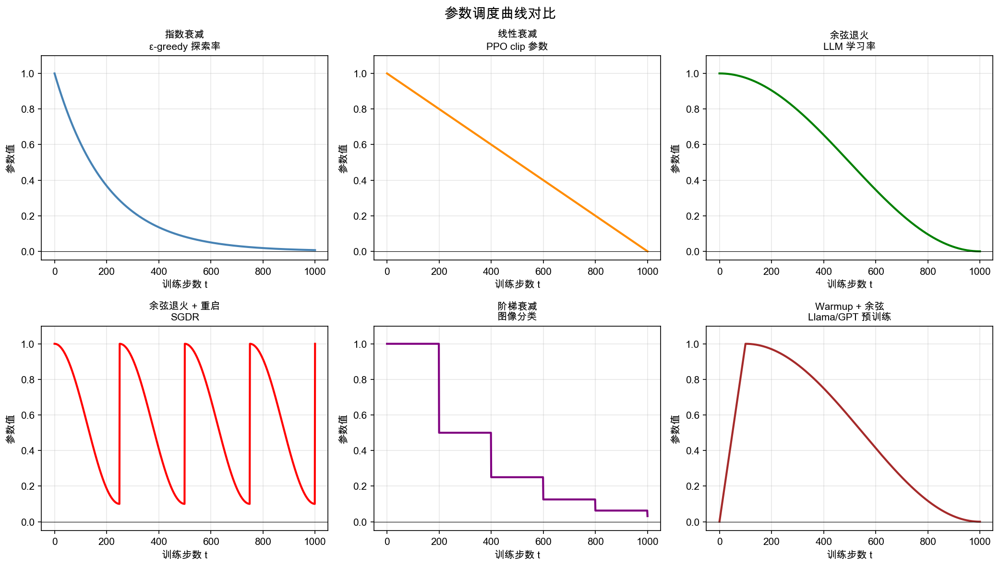

# 参数调度：衰减、Warmup 与 Clip

## 核心问题

ML 训练中有一类反复出现的需求：**某个参数在训练初期应该大，随着训练进行应该变小**。

- 学习率：初期大步探索，后期小步精修
- ε-greedy 探索率：初期多探索，后期锁定最优
- PPO 的 clip 范围：训练稳定后可以收紧约束

这背后有一个共同直觉：**训练是一个"从不确定到确定"的过程**。初期模型什么都不知道，需要大幅更新；后期已经接近好的解，大幅更新反而会破坏已有的成果。

但有一个重要的例外——PPO 的 clip **不是**随时间衰减的，它是每步都生效的硬约束。放在同一篇里讲，是因为它们都在回答"怎么控制更新幅度"，只是控制的维度不同。

---

## 调度的形式

所有调度形式都是在回答同一个问题：**参数从大到小，走什么形状的曲线？**



运行 `python src/decay_schedules.py` 可以重新生成此图，同时输出各曲线的数值对比表。

### 指数衰减

$$\alpha(t) = \alpha_0 \cdot e^{-\lambda t}$$

前期衰减快，后期趋于 0 但**永远不会到达 0**。

```
t=0:   1.000
t=100: 0.607  （衰减了 40%）
t=250: 0.287
t=500: 0.082  （已经很小）
t=1000: 0.007 （接近 0 但还有值）
```

**适合**：ε-greedy 探索率。探索率不需要精确归零——有一点点残余探索是好事，防止策略退化。

**不适合**：学习率。如果学习率永远不归零，训练后期仍在做微小扰动，影响收敛精度。

---

### 线性衰减

$$\alpha(t) = \alpha_0 \cdot \max\!\left(0,\ 1 - \frac{t}{T}\right)$$

匀速减小，在 $t = T$ 时精确归零。

**适合**：PPO 的 clip 参数 ε（从 0.2 线性衰减到 0）。训练后期策略已经很稳定，收紧 clip 约束，最终完全关闭探索。

**直觉**：如果你知道训练会跑 N 步，线性衰减是最"公平"的分配——每步消耗等量的"探索预算"。

---

### 余弦退火

$$\alpha(t) = \alpha_{\min} + \frac{1}{2}(\alpha_{\max} - \alpha_{\min})\left(1 + \cos\frac{\pi t}{T}\right)$$

中间衰减快，两端慢。最后阶段曲线非常平滑，避免训练末期的剧烈震荡。

```
t=0:   1.000  （慢慢开始下降）
t=250: 0.854  （前25%只降了不到15%）
t=500: 0.500  （中点）
t=750: 0.146  （开始加速）
t=1000: 0.000 （平滑归零）
```

**为什么 LLM 预训练首选余弦退火？**

线性衰减在末期的斜率不变，最后一步还在做"中等幅度"的更新。余弦退火末期斜率趋近 0，最后几步几乎不动——这让 loss 曲线在训练末期非常平稳，checkpoint 质量更稳定。Llama、GPT-4、Mistral 等主流 LLM 都用这个形式。

---

### 余弦退火 + Warm Restart（SGDR）

每隔 $T_{\text{cycle}}$ 步把参数重置到初始值，重新开始退火。

```
0──────250──────500──────750──────1000
↑             ↑             ↑
重置           重置           重置
```

**为什么要重启？** 训练过程可能陷入局部最优。重启时学习率突然回到高位，给了模型一次"跳出去"的机会，然后重新收敛到（可能更好的）位置。

在 LLM 训练里不常用（训练代价太高，不想随机跳）。在中小规模实验和 fine-tuning 里偶尔出现。

---

### 阶梯衰减

每隔 $N$ 步，参数乘以一个系数 $k < 1$：

```
t=0~199:   1.000
t=200~399: 0.500  （×0.5）
t=400~599: 0.250  （×0.5）
t=600~799: 0.125
...
```

**适合**：有明确训练阶段的任务，比如 ResNet 在 ImageNet 上的训练（第 30/60/90 epoch 各降一次）。训练者对"哪个阶段该用多大学习率"有先验知识时，阶梯衰减很直观。

**不适合**：LLM 预训练（训练步数极多，没有明确的阶段划分，人工调 drop 时机很困难）。

---

### Warmup + 余弦退火

**LLM 预训练的标准做法**，分两段：

1. **Warmup 阶段**（前 $N$ 步）：学习率从 0 线性升到最大值
2. **退火阶段**：从最大值余弦退火到接近 0

```
  Warmup+余弦 | ▁▃▄▆█▇▇▇▇▇▇▇▇▇▆▆▆▅▅▄▄▃▃▂▂▁▁ |
```

**Warmup 为什么必要？**

训练最开始，模型参数是随机初始化的，各层的梯度数值差异极大。如果一开始就用最大学习率，某些层会收到极大的梯度更新，导致参数跑到很差的区域（"梯度爆炸"的一种形式）。Warmup 让模型先用小步慢慢"找方向"，等各层梯度稳定后再加速。

Llama 3 的 warmup 大约是 2000 步（总训练步数的 0.2%），GPT-4 具体数值未公开但结构类似。

---

## PPO 的 Clip：和衰减是两件事

上面所有调度都是"参数随时间单调变化"。PPO 的 clip 不是这个——它是**每次参数更新时的单步约束**，和时间无关。

**PPO clip 做的事**：

```python
ratio = π_new(a|s) / π_old(a|s)      # 新旧策略的概率比
clipped_ratio = clip(ratio, 1-ε, 1+ε) # 截断到 [0.8, 1.2]
loss = -min(ratio * A, clipped_ratio * A)  # 取保守的那个
```

| 原始 ratio | clip 后 | 说明 |
|-----------|--------|------|
| 0.50 | 0.80 | 新策略把概率砍了一半，太激进，截断 |
| 0.90 | 0.90 | 在范围内，通过 |
| 1.00 | 1.00 | 没变化，通过 |
| 1.30 | 1.20 | 概率增加了 30%，太多，截断 |
| 2.00 | 1.20 | 概率翻倍，截断 |

**直觉**：不管这步的 advantage 有多高（这个动作有多好），单步最多把概率改变 20%。这是一个**每步都生效的硬约束**，不随训练进度变化。

**和衰减的区别**：

| | 参数调度（衰减） | PPO clip |
|---|---|---|
| **控制维度** | 整体训练进度（随时间） | 单次更新幅度（每步） |
| **变化方向** | 单调递减 | 固定不变（或线性衰减到 0） |
| **目的** | 从探索过渡到精修 | 防止单步更新破坏已有策略 |
| **类比** | 随着经验积累，每次下注越来越保守 | 每一笔交易，最多押注 ±20% |

PPO 里有时会对 clip 的 ε 本身也做线性衰减（从 0.2 → 0），这是把两件事叠加在一起：既有每步的硬约束，又有整体训练进度的收紧。

---

## 选哪种调度？决策树

```
用于 LLM 预训练？
  → 是：Warmup + 余弦退火（工业标准）

用于 RL 探索率（ε）？
  → 知道训练总步数：线性衰减到 0
  → 不确定何时停止：指数衰减（不会归零，保留残余探索）

用于 PPO/RL 训练的学习率？
  → 余弦退火，通常加 warmup

用于图像分类等有明确训练阶段的任务？
  → 阶梯衰减

需要逃离局部最优（中小规模实验）？
  → 余弦 + warm restart
```

---

## 背后有什么约束？

调度形式没有硬性的数学约束，但有两条工程经验：

1. **最终值应该接近 0**（学习率和 clip ε）：让训练最后收敛，而不是一直震荡。指数衰减严格不归零，但足够小时效果等价。

2. **总更新量（曲线下面积）要合理**：衰减太快 → 模型没学够就停了；衰减太慢 → 后期更新幅度还很大，破坏已有成果。余弦退火之所以受欢迎，一部分原因是它在"分配更新预算"上比线性更合理（前期多、后期少）。

---

## 和 wiki 内其他概念的关联

- [强化学习基础](./rl-fundamentals.md)：ε-greedy 探索率是参数调度在 RL 里的应用，衰减让 ε 从探索过渡到利用
- [PPO 逐行讲解](./ppo-explained.md)：clip 机制的代码细节，以及 PPO 为什么需要 clip
- [RLHF](./rlhf.md)：InstructGPT/PPO 训练管线里学习率调度的实际配置
