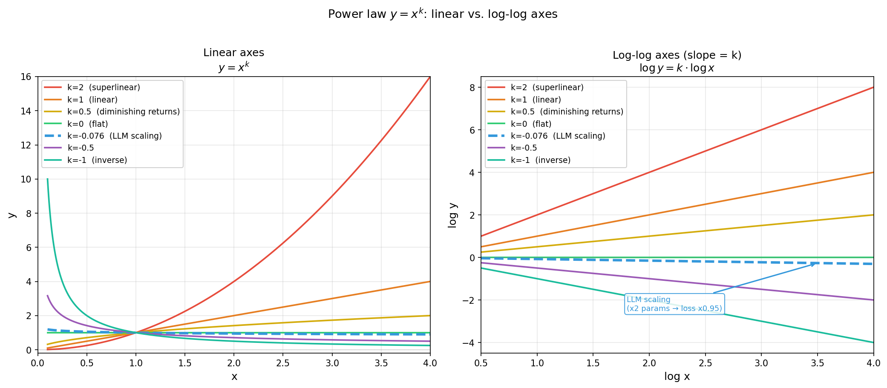

# 幂律与 Scaling（Power Law）

## 什么是幂律

**幂律**（power law）描述两个量之间的关系：一个量是另一个量的某次幂。最简单的形式：

$$y = a \cdot x^k$$

其中 $k$ 是幂律指数（exponent）。当 $k < 0$ 时，$x$ 增大，$y$ 减小——这是 Kaplan scaling law 里的形式：

$$L \approx \left(\frac{N_c}{N}\right)^{\alpha} = N_c^\alpha \cdot N^{-\alpha}$$

即参数量 $N$ 增大，loss $L$ 减小，指数是 $-\alpha$。

**幂律最重要的性质——翻倍法则：**

如果 $y = a \cdot x^k$，那么 $x$ 翻倍时：
$$y_{new} = a \cdot (2x)^k = 2^k \cdot a \cdot x^k = 2^k \cdot y_{old}$$

$x$ 翻倍，$y$ 乘以 $2^k$。无论 $x$ 从什么基数出发，翻倍带来的乘数因子永远是 $2^k$——这叫**尺度不变性**（scale invariance）。$a$ 只是缩放基准，不影响翻倍的乘数。

**拆开分析各种情况**（$a > 0$，关注 $k$ 的大小）：

| $k$ 的范围 | $x$ 翻倍后 $y$ 的变化 | 现实含义 | 例子 |
|---|---|---|---|
| $k = 0$ | $y$ 不变（$2^0 = 1$） | $x$ 根本不影响 $y$ | 某些架构超参对 LLM loss 的影响 |
| $0 < k < 1$ | $y$ 增大，但不到 2 倍 | $y$ 随 $x$ 正向增长，但越来越慢 | 城市人口 vs GDP（收益递减）|
| $k = 1$ | $y$ 翻倍（$2^1 = 2$） | 线性正比关系 | 买 2 倍的苹果，花 2 倍的钱 |
| $k > 1$ | $y$ 增大，超过 2 倍 | 超线性增长，大的越来越大 | 城市规模 vs 专利数（超线性，$k \approx 1.15$）|
| $-1 < k < 0$ | $y$ 减小，但只减少一点点 | 正向改善但极慢，需要翻很多倍才有感觉 | **LLM scaling**（$k \approx -0.076$，翻倍只降 5%）|
| $k = -1$ | $y$ 减半 | 经典反比关系 | 速度翻倍，同等距离用时减半 |
| $k < -1$ | $y$ 减小，且降到不足原来的一半 | 快速衰减 | 比较少见的自然规律 |

**不同 $k$ 值下的示意图（双 log 坐标）：**

斜率 = $k$；正斜率表示 $y$ 随 $x$ 增大，负斜率表示 $y$ 随 $x$ 减小。LLM scaling 对应 $k \approx -0.076$（图中蓝色虚线），斜率极平缓（接近水平线）——即便横轴跨越数个数量级，纵轴也只降一点点。

**在各领域中的直觉举例：**

- **$k = -0.076$（LLM scaling）**：参数量从 10 亿增到 1000 亿（翻 100 倍）：$2^{-0.076 \times 6.6} \approx 0.60$，loss 降到原来的 60%——需要翻 100 倍才降 40%，这就是为什么大模型需要多个数量级的扩展。
- **$k = -1$（Zipf 词频）**：第 1 名词频是第 2 名的 2 倍，第 10 名的 10 倍，第 100 名的 100 倍——排名翻倍，词频减半。
- **$k = 0.75$（Kleiber 代谢律）**：体重翻倍（$k=0.75$），代谢率变为 $2^{0.75} \approx 1.68$ 倍——不是翻倍，而是增加 68%，说明大动物单位体重的代谢率更低（更高效）。
- **$k = -0.5$**：如果某资源的成本 $\propto$ 需求量的 $-0.5$ 次幂，需求翻倍，成本只降 29%（$2^{-0.5} \approx 0.71$）。

Kaplan 的指数（0.05–0.1）非常小（落在 $-1 < k < 0$ 且靠近 0 的区间），说明每次翻倍只有几个百分点的改善——需要翻几十倍才能明显看到效果，这就解释了为什么 LLM scaling 需要几个数量级的参数增长才有质变。

**Kaplan 指数下，参数倍增 vs loss 下降（取 $\alpha = 0.076$，即 $k = -0.076$）：**

| 参数量倍增倍数 | $2^k$ 的幂次 | loss 变为原来的 | loss 下降幅度 |
|---|---|---|---|
| ×2（翻 1 倍）| $2^{-0.076}$ | 95% | 约 5% |
| ×4（翻 2 倍）| $4^{-0.076}$ | 90% | 约 10% |
| ×10 | $10^{-0.076}$ | 84% | 约 16% |
| ×100 | $100^{-0.076}$ | 71% | 约 29% |
| ×1000 | $1000^{-0.076}$ | 60% | 约 40% |
| ×10000 | $10000^{-0.076}$ | 50% | 约 50% |

规律：要把 loss 减半，需要参数量增加约 **10000 倍**（4 个数量级）。论文原文中 Figure 1 横跨约 6 个数量级的参数量（$10^3$ 到 $10^9$），loss 大约下降了 60%，与此吻合。

## 在对数坐标上看幂律

幂律有一个显著特征：**在双对数坐标（log-log plot）上，幂律是一条直线**。

取对数：$\log y = \log a + k \log x$

这是 $\log y$ 关于 $\log x$ 的线性方程，斜率就是 $k$。

**为什么要用"双"对数，单对数不行吗？**

对数坐标（单 log）的作用是：把"指数关系"（$y = e^{-ax}$）变成直线——横轴线性，纵轴对数，指数曲线就变直了。这常用在展示"指数增长/衰减"时（如病毒传播、放射性衰变）。

双对数（两个轴都取对数）的作用不同：它把"幂律关系"变成直线。因为 $\log y = \log a + k \log x$，这是 $\log x$ 和 $\log y$ 之间的线性关系，必须两个轴都取对数才能看出直线。

**三种坐标下各种关系的形状：**

| 关系类型 | 普通坐标 | 单 log（y 轴对数）| 双 log |
|---|---|---|---|
| 线性（$y = ax$） | 直线 | 曲线 | 曲线 |
| 指数（$y = e^{ax}$） | 曲线（快速增长）| 直线 | 曲线 |
| 幂律（$y = x^k$） | 曲线 | 曲线 | **直线** |

所以判断某数据是否遵循幂律，最直接的方法就是画双 log 图，看是不是直线。

这就是 Kaplan 论文 Figure 1 那张图的意义：横轴是 $\log N$（或 $\log D$、$\log C$），纵轴是 $\log L$，实验数据点落在一条直线上——直接说明幂律成立。

**指数关系 vs 幂律的直觉区别**：指数关系（$y = e^{-ax}$）衰减很快，如果 $x$ 从 1 增到 100，$y$ 会掉到接近零；幂律（$y = x^{-0.076}$）衰减极慢，同样从 1 到 100（翻了约 6.6 倍的 2 的幂），$y$ 只降约 40%。地震频率、LLM scaling 都是幂律，因为它们跨越了许多数量级而没有"归零"。

## 幂律在其他领域的出现

幂律是自然界和人类社会中最普遍的规律之一，远不止 LLM scaling：

| 领域 | 例子 | $x$（自变量）| $y$（因变量）| $a$（基准常数）| $k$（指数）| 翻倍法则 |
|---|---|---|---|---|---|---|
| 语言学 | **齐普夫定律** | 词频排名 $r$ | 词频 $f$ | 最高频词的频率 | $-1$ | 排名翻倍，词频减半 |
| 城市规模 | **城市人口分布** | 城市规模排名 $r$ | 城市人口 $P$ | 最大城市人口 | $-1$ | 排名翻倍，人口减半 |
| 互联网 | **网页链接数** | 链接数 $k$ | 该链接数的节点数量 | — | $-2$ 到 $-3$ | 链接数翻倍，拥有该链接数的网页数降至 1/4–1/8 |
| 地震 | **古腾堡-里克特** | 震级 $M$（注：指数关系）| 频率 $N$ | — | （$\log N \propto -bM$，$b \approx 1$，非严格幂律）| 震级 +1 级，频率降低约 10 倍 |
| 财富分配 | **帕累托分布** | 财富排名 $r$ | 个人财富 $W$ | — | $-1.16$ 到 $-2$ | 财富排名翻倍，对应财富降至约 45%–50% |
| 生物 | **Kleiber 代谢律** | 体重 $M$（kg）| 基础代谢率 $B$（W）| $\approx 4.1$ | $0.75$ | 体重翻倍，代谢率变为 $2^{0.75} \approx 1.68$ 倍 |
| 深度学习 | **Kaplan/Chinchilla** | 参数量 $N$（或 $D$、$C$）| 训练 loss $L$ | $N_c^\alpha$（临界规模相关）| $-0.05$ 到 $-0.10$ | 参数翻倍，loss 降约 5% |

**几个例子的具体数字：**

**齐普夫定律（Zipf's Law）**：在任意一本书或一个语料库里，词频按排名的幂律分布，指数约为 -1。取英语来说：
- 排名第 1 的词（"the"）在英语文本中出现频率约 7%
- 排名第 2 的词（"of"）约 3.5%（第 1 名的 1/2）
- 排名第 10 的词约 0.7%（第 1 名的 1/10）
- 排名第 100 的词约 0.07%（第 1 名的 1/100）

规律：排名 $r$ 的词频 $\propto r^{-1}$，即排名翻倍，词频减半。这个规律在中文、日文、乃至编程语言的 token 里也成立。

**城市规模（Zipf's Law for cities）**：美国城市按人口排名，前几名大致满足：
- 纽约（约 800 万）≈ 洛杉矶（约 400 万）× 2
- 洛杉矶 ≈ 芝加哥（约 270 万）× 1.5
- 整体趋势：城市人口 $\propto$ 排名$^{-1}$

**帕累托分布（财富）**：意大利经济学家帕累托 1906 年发现意大利 20% 的人拥有 80% 的土地。这个 80/20 比例对应幂律指数约 $k \approx -1.16$。现代数据显示财富集中度更高，指数更接近 -1.5 到 -2。

**为什么幂律普遍出现？** 没有统一的理论解释，但几类常见机制：

1. **乘法过程（multiplicative process）**：财富增长靠年收益率复利——今年资产 × 1.1，明年再 × 1.08，后年 × 1.12……每步都是乘法而非加法。当每步乘数是独立随机的，最终结果的对数是很多独立项的累加，由中心极限定理趋向正态分布——也就是说，$\log(\text{财富})$ 呈正态，即财富本身呈**对数正态分布**。对数正态分布在中间部分和正态很像，但在尾部（极端大值）衰减比正态慢得多，形状上接近幂律。这就是"尾部近似幂律"的意思：不是整体都是幂律，而是最富那 1% 的分布用幂律描述比正态更准确。

2. **优先连接（preferential attachment）**：这是 Barabási-Albert 模型里的机制，直觉如下——想象 Twitter 刚兴起时：有 100 个粉丝的账号，新用户关注它的概率比只有 10 个粉丝的账号高 10 倍。已有粉丝越多，增粉越快，差距越来越大。这种"富者更富"（rich-get-richer）的正反馈，在数学上可以证明最终产生幂律分布：粉丝数 $k$ 的账号数量 $\propto k^{-\gamma}$，通常 $\gamma \approx 2\text{--}3$。翻倍法则在这里体现为：粉丝 1000 的账号数量，是粉丝 2000 的账号数量的 $2^\gamma \approx 4\text{--}8$ 倍。互联网链接数、论文引用数、城市人口都有类似机制。

3. **临界现象**：水在 100°C 沸腾时处于相变临界点。在临界点，液态分子团的大小分布也遵循幂律——各种尺度的波动同时存在，系统"自相似"。这类幂律和前两种机制不同，来自物理学的普适性（universality），但与 LLM 的联系目前还不清楚。

4. **最优性**：有些系统被优化来最高效地使用资源，幂律会自然出现在最优解里。例如，生物体的血管分支结构在最小化输送能耗的约束下，会产生体重 vs 代谢率的 3/4 次幂关系（Kleiber's Law）。对 LLM 的猜测：语言本身有层次化结构（词、短语、句子、段落），Transformer 在学习这种结构的最优表示时，可能自然地在参数量 vs 表示精度之间产生幂律关系——但这目前仍是推测。

对于 LLM，Kaplan 等人没有给出理论解释，只是经验观测。有人推测这与 Transformer 对自然语言的层次化表示有关，但目前这仍是开放问题。

## 幂律的局限性

- **有上下界**：任何现实中的幂律都只在某个范围内成立。**Kaplan 实验的范围**：模型参数量 768 到 15 亿（$\approx 10^3$ 到 $1.5 \times 10^9$），训练 token 数 $2.2 \times 10^7$ 到 $2.3 \times 10^{10}$，计算量跨 8 个量级（$10^{12}$ 到 $10^{21}$ FLOPs）。超出这个范围——比如 GPT-4 的 $\sim 10^{24}$ FLOPs——幂律是否仍成立是外推，没有保证。事实上 Chinchilla 在更大规模上重新实验发现指数估计有偏差，这正是"外推失效"的一个例证。

- **小指数意味着慢改善**：Kaplan 的 $\alpha \approx 0.076$ 说明收益递减极慢——但也意味着永远有收益，没有"数据墙"或"参数上限"（在实验范围内）。

- **与下游任务的关系**：loss 遵循幂律不代表下游任务性能也遵循幂律——实际上某些能力（数学、代码）会在某个规模阈值突然涌现（emergent abilities），而不是平滑提升。关于这一现象有几种解释：
  - **测量假象说**（Wei et al. 2022 之后的争议）：有研究认为"涌现"可能是评估指标不连续导致的——比如用"完全正确率"衡量数学题，模型在某个规模前几乎全部做错（分数 0），超过阈值后开始做对（分数突然上升），但如果用"部分正确率"衡量，可能会看到平滑提升。Schaeffer et al.（2023）"Are Emergent Abilities of Large Language Models a Mirage?"直接论证了这一点。
  - **能力合成说**：某些任务需要多个子能力同时到位才能完成（比如多步推理需要记忆、推断、格式化都达到一定水平），每个子能力可能都在平滑提升，但只有当所有子能力同时足够强时，整体任务成功率才会突然跳升。
  - **真实涌现说**：也有可能某些能力确实需要某种"质变"，模型达到某个规模后才具备了全新的表示能力。目前这三种解释在学界都有支持者，没有定论。

## 和 wiki 内其他概念的关联

- [Scaling Laws for Neural Language Models](../30-papers/scaling-laws-neural-lm-2001.08361.md)：Kaplan 论文是 LLM scaling 的第一个系统幂律分析
- [Chinchilla Scaling Laws](../30-papers/chinchilla-2203.15556.md)：修正了 Kaplan 的指数，使用相同的幂律框架但得出不同的最优分配
- [Scaling Data-Constrained LMs](../30-papers/scaling-data-constrained-lms-2305.16264.md)：用指数衰减函数扩展了幂律框架，建模重复数据的边际价值递减
- [Perplexity](./perplexity.md)：perplexity 是 $e^L$，loss 遵循幂律意味着 perplexity 遵循幂律的指数变换
