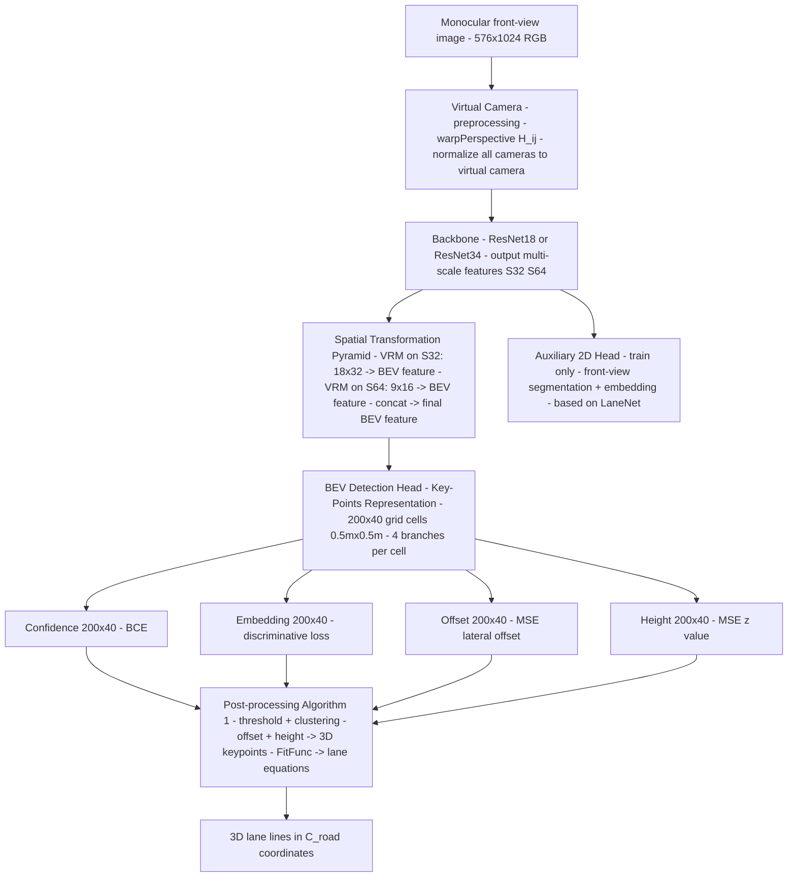

# BEV-LaneDet: a Simple and Effective 3D Lane Detection Baseline（Wang et al., HAOMO.AI, 2022）

一句话总结：BEV-LaneDet 用三个简单模块解决单目 3D 车道线检测：Virtual Camera（同质化多车相机参数）+ Key-Points Representation（BEV 网格逐格检测）+ Spatial Transformation Pyramid（双尺度 MLP 特征投影），在 OpenLane 上 F-Score 58.4（vs PersFormer 47.8），102 FPS PyTorch / 185 FPS TensorRT，HAOMO.AI + 西安交通大学，arXiv 2022。

## 基本信息

- 论文：BEV-LaneDet: a Simple and Effective 3D Lane Detection Baseline
- 作者：Ruihao Wang、Jian Qin*（通讯）、Kaiying Li、Yaochen Li、Dong Cao、Jintao Xu
- 机构：HAOMO.AI Technology Co., Ltd. + 西安交通大学
- arXiv：2210.06006（2022-10，更新至 2023-03）
- 发表状态：arXiv preprint

---

## 核心问题

**如何高效、准确地从单目前视摄像头直接预测 3D 车道线？**

### 3D vs 2D 车道线检测的根本区别

2D 车道线检测在图像平面预测像素级结果，再通过 IPM（Inverse Perspective Mapping）投影到地面——这依赖"地面是平的"假设，在上下坡、道路起伏时失效。3D 车道线检测直接在三维道路坐标系 C_road = (x, y, z) 中预测车道线的空间位置，包含高度 z。

### 先前方法的问题

| 方法类型 | 代表 | 缺陷 |
|---------|------|------|
| 基于 IPM | 3D-LaneNet, Gen-LaneNet, PersFormer | 强依赖相机内外参，无法处理地面起伏和车辆振动 |
| Anchor-based 3D 表示 | 3D-LaneNet, CLGO | 需要设计 3D anchor 先验，场景适应性弱 |
| Tile-based anchor-free | 3D-LaneNet+ | 每格预测直线段，复杂且不准 |
| Transformer 空间变换 | PersFormer, BEVFormer | 计算代价高，对自动驾驶芯片部署不友好 |
| MLP 空间变换 | CrossView [21] | 固定空间映射，难以整合相机内外参，性能差 |

**BEV-LaneDet 的核心立场**：用预处理阶段的 Virtual Camera 统一相机参数，使得简单的 MLP 空间变换（无需大型 Transformer）也能实现跨车型泛化，同时保持极高推理速度。

---

## 方法 / 核心机制

### 五模块架构总览



---

### 模块 1：Virtual Camera（虚拟相机预处理）

**解决的问题**：不同车辆安装的摄像头内外参各异，导致同一物理场景在不同相机图像中呈现不同的空间关系，训练数据分布不一致。

**核心思路**：在图像输入网络之前，用单应矩阵 H_{i,j} 把当前相机图像 warp 成一张"虚拟相机"拍摄的图像。虚拟相机的内外参 (K_j, R_j, T_j) 固定为训练集中所有相机参数的**均值**，所有车型使用同一个虚拟相机标准。

**推导原理**：

当前相机 i 和虚拟相机 j 共面于道路平面 P_road（z=0 平面），因此可以用单应矩阵建立图像对应关系。

在 P_road 上选 4 个点 x^k = (x^k, y^k, 0)^T，分别投影到两个相机图像：

- 当前相机像素：u_i^k，由内参 K_i、外参 R_i/T_i 计算
- 虚拟相机像素：u_j^k，由固定的 K_j、R_j/T_j 计算

**Eq. 1**：

```
H_{i,j} · u_i^k = u_j^k
```

用最小二乘法求解 H_{i,j}（4 组对应点，8 个约束）。

**推理时**：只需调用 `cv2.warpPerspective(img, H_{i,j})` 即可完成转换，无需网络前向计算，几乎零开销。

---

### 模块 2：Key-Points Representation（KPR，关键点表示）

**BEV 坐标系**：道路地面坐标 C_road = (x, y, z)：
- x：纵向（前方），范围 [3m, 103m]
- y：横向（左右），范围 [-10m, 10m]
- z：高度

将 C_road 的 x-y 平面划分为 200×40 个网格单元，每格 **0.5m × 0.5m**。

**每个格子四路并行预测**：

| 分支 | 输出 shape | 物理含义 | 激活 |
|------|-----------|---------|------|
| **Confidence** | [200, 40] | 该格内是否有车道线经过（0/1）| sigmoid |
| **Embedding** | [200, 40] | 实例区分的特征向量（用于聚类区分多条车道线）| — |
| **Offset** | [200, 40] | 车道线精确位置相对格中心的 y 方向偏移，归一化后减 0.5，范围 (-0.5, 0.5) | sigmoid 后 -0.5 |
| **Height** | [200, 40] | 格内关键点的平均 z 高度（米）| — |

**格子大小消融（Table 5）**：0.5m + offset 是最优配置（F-Score 58.4）；0.5m 无 offset 仅 57.9；1.0m 降至 55.8。

---

### 模块 3：Spatial Transformation Pyramid（STP，空间变换金字塔）

**核心组件 View Relation Module（VRM）**：

受 CrossView [21]（Pan et al., IEEE RA-L 2020）启发，用一个**可学习的线性映射矩阵 R**，将前视图特征展平后变换为 BEV 特征展平。这是一个固定参数的全连接映射（不含注意力机制）。

**公式（Eq. 2）**：

```
f_t[i] = concat(
    R^S32(f^S32[1], ..., f^S32[HW_S32]),   # VRM on S32 features: 18x32 -> BEV
    R^S64(f^S64[1], ..., f^S64[HW_S64])    # VRM on S64 features:  9x16 -> BEV
)
```

**为什么用 S32 + S64（低分辨率特征）而不是 S8**：

- 低分辨率特征含有更多全局语义信息
- 特征展平后维度小，映射矩阵 R 参数量小，更容易学习
- Table 6 消融结果：S32+S64 最优（58.4 F-Score）；S8 单独使用反而差（56.4）

**与 Transformer（PersFormer/BEVFormer）的对比**：纯线性映射，无注意力，部署友好，是速度优势的关键来源（102 FPS vs PersFormer 21 FPS）。

**为什么 Virtual Camera 让 MLP 可行**：VRM 是固定映射，不能自适应不同相机参数。Virtual Camera 把输入统一化，使得固定映射也能泛化到多车型。

---

### 后处理：聚类 → 3D 车道线

后处理（Algorithm 1）：

1. 按置信度阈值 S_threshold 筛选正格子 → E_list
2. 对 embedding 向量做均值漂移式聚类（距离阈值 D_gap）→ 每个聚类对应一条车道线
3. 对每个正格子加 offset 得到精确 y 坐标，加 height 得到 z 坐标 → R_lines（3D 关键点序列）
4. FitFunc 对关键点做曲线拟合 → R_fit（最终 3D 车道线方程）

---

## 伪代码（PyTorch 风格，含 shape）

> 注：VRM 内部 BEV 中间分辨率（`H_bev_mid × W_bev_mid`）和上采样至 200×40 的路径，论文未给出具体数值；此处用合理估计，标注为「推断」。

```python
import torch
import torch.nn as nn
import torch.nn.functional as F
import torchvision.models as models
import cv2

# ─────────────────────────────────────────────
# 0. Virtual Camera 预处理  （CPU，无可训练参数）
# ─────────────────────────────────────────────
def virtual_camera_warp(img_np, H_ij):
    """
    img_np : (H_orig, W_orig, 3) numpy array，单张图像
    H_ij   : (3, 3) 单应矩阵，由相机内外参均值离线计算得到
    return : (576, 1024, 3) numpy array
    """
    return cv2.warpPerspective(img_np, H_ij, (1024, 576))


# ─────────────────────────────────────────────
# 1. View Relation Module (VRM)
#    前视图特征 → BEV 特征的固定线性映射
#    基于 CrossView (Pan et al., IEEE RA-L 2020)
# ─────────────────────────────────────────────
class VRM(nn.Module):
    def __init__(self, in_c, in_h, in_w, out_c, out_h, out_w):
        super().__init__()
        # 唯一可训练层：一个全连接映射
        # 参数量 = (in_c * in_h * in_w) × (out_c * out_h * out_w)
        # 用低分辨率特征（S32/S64）来控制参数量
        self.fc = nn.Linear(in_c * in_h * in_w, out_c * out_h * out_w)
        self.out_c, self.out_h, self.out_w = out_c, out_h, out_w

    def forward(self, x):
        # x : [B, in_c, in_h, in_w]
        B = x.size(0)
        y = self.fc(x.flatten(1))                              # [B, out_c*out_h*out_w]
        return y.reshape(B, self.out_c, self.out_h, self.out_w) # [B, out_c, out_h, out_w]


# ─────────────────────────────────────────────
# 2. Spatial Transformation Pyramid (STP)
#    双尺度 VRM + 上采样到 200×40 BEV 分辨率
# ─────────────────────────────────────────────
class STP(nn.Module):
    def __init__(self, c32=512, c64=512):
        super().__init__()
        C_MID = 64          # VRM 输出通道数（推断）
        H_MID, W_MID = 25, 10  # VRM 输出的中间 BEV 分辨率（推断；论文未指定）

        # 两个独立 VRM，分别处理 S32（18×32）和 S64（9×16）
        self.vrm32 = VRM(c32, 18, 32, C_MID, H_MID, W_MID)
        self.vrm64 = VRM(c64,  9, 16, C_MID, H_MID, W_MID)

        # 拼接后 2*C_MID=128 通道，上采样到 200×40（推断路径；论文未指定具体结构）
        self.upsample = nn.Sequential(
            nn.ConvTranspose2d(128, 64, kernel_size=4, stride=2, padding=1),  # 25×10 -> 50×20
            nn.BatchNorm2d(64), nn.ReLU(inplace=True),
            nn.ConvTranspose2d(64,  64, kernel_size=4, stride=2, padding=1),  # 50×20 -> 100×40
            nn.BatchNorm2d(64), nn.ReLU(inplace=True),
            nn.Conv2d(64, 64, 3, padding=1),                                   # 100×40 -> 100×40
            nn.BatchNorm2d(64), nn.ReLU(inplace=True),
            nn.Upsample(size=(200, 40), mode='bilinear', align_corners=False), # 100×40 -> 200×40
        )

    def forward(self, s32, s64):
        # s32 : [B, 512, 18, 32]
        # s64 : [B, 512,  9, 16]
        bev32 = self.vrm32(s32)                    # [B, 64, 25, 10]
        bev64 = self.vrm64(s64)                    # [B, 64, 25, 10]
        bev_cat = torch.cat([bev32, bev64], dim=1) # [B, 128, 25, 10]
        bev_feat = self.upsample(bev_cat)          # [B, 64, 200, 40]
        return bev_feat


# ─────────────────────────────────────────────
# 3. BEV 检测头 (Key-Points Representation)
#    四路并行 1×1 卷积，对 200×40 格逐格预测
# ─────────────────────────────────────────────
class KPRHead(nn.Module):
    def __init__(self, in_c=64, emb_dim=8):
        super().__init__()
        self.conf_head   = nn.Conv2d(in_c, 1,       1)  # 置信度
        self.emb_head    = nn.Conv2d(in_c, emb_dim,  1)  # 实例 embedding
        self.offset_head = nn.Conv2d(in_c, 1,       1)  # y 方向偏移
        self.z_head      = nn.Conv2d(in_c, 1,       1)  # 高度 z

    def forward(self, bev_feat):
        # bev_feat : [B, 64, 200, 40]
        conf   = torch.sigmoid(self.conf_head(bev_feat))              # [B, 1, 200, 40]  ∈ (0,1)
        emb    = self.emb_head(bev_feat)                               # [B, E, 200, 40]  未激活
        offset = torch.sigmoid(self.offset_head(bev_feat)) - 0.5      # [B, 1, 200, 40]  ∈ (-0.5, 0.5)
        z      = self.z_head(bev_feat)                                 # [B, 1, 200, 40]  米，未激活
        return conf, emb, offset, z


# ─────────────────────────────────────────────
# 4. 辅助 2D 车道线头（仅训练时启用）
#    基于 LaneNet (Wang et al., 2018)
# ─────────────────────────────────────────────
class Aux2DHead(nn.Module):
    def __init__(self, in_c=512, emb_dim=8):
        super().__init__()
        self.seg_head = nn.Conv2d(in_c, 1,      1)
        self.emb_head = nn.Conv2d(in_c, emb_dim, 1)

    def forward(self, s32):
        # s32 : [B, 512, 18, 32]
        return self.seg_head(s32), self.emb_head(s32)  # [B,1,18,32], [B,E,18,32]


# ─────────────────────────────────────────────
# 5. 完整模型
# ─────────────────────────────────────────────
class BEVLaneDet(nn.Module):
    def __init__(self, backbone='resnet34'):
        super().__init__()
        resnet = models.resnet34(pretrained=True)
        # 取到 layer4，输出 stride=32 特征
        self.backbone = nn.Sequential(*list(resnet.children())[:-2])  # [B, 512, 18, 32]
        self.pool_s64  = nn.MaxPool2d(2, 2)                            # [B, 512,  9, 16]
        self.stp       = STP(c32=512, c64=512)
        self.kpr_head  = KPRHead(in_c=64, emb_dim=8)
        self.aux2d     = Aux2DHead(in_c=512, emb_dim=8)

    def forward(self, img_vc, training=False):
        # img_vc : [B, 3, 576, 1024]  (经 Virtual Camera warp 后的图像)

        # ① Backbone
        s32 = self.backbone(img_vc)   # [B, 512, 18, 32]
        s64 = self.pool_s64(s32)      # [B, 512,  9, 16]

        # ② 前视图 → BEV 特征
        bev_feat = self.stp(s32, s64) # [B, 64, 200, 40]

        # ③ BEV 检测（4 分支）
        conf, emb, offset, z = self.kpr_head(bev_feat)
        # conf   : [B, 1, 200, 40]  lane-or-not per cell
        # emb    : [B, 8, 200, 40]  instance embedding for clustering
        # offset : [B, 1, 200, 40]  精细 y 偏移 (cell 单位，-0.5~0.5)
        # z      : [B, 1, 200, 40]  高度 (m)

        if training:
            seg2d, emb2d = self.aux2d(s32)  # 2D 辅助分支，仅训练时走
            return conf, emb, offset, z, seg2d, emb2d

        return conf, emb, offset, z   # 推理时只返回 BEV 头输出


# ─────────────────────────────────────────────
# 6. 损失函数
# ─────────────────────────────────────────────
def compute_loss(conf, emb, offset, z, seg2d, emb2d,
                 gt_conf, gt_offset, gt_z, gt_seg, gt_emb, gt_emb2d):

    obj = gt_conf.bool().squeeze(1)   # [B, 200, 40]  正例 mask

    # 置信度：BCE，全格子
    L_conf = F.binary_cross_entropy(conf.squeeze(1), gt_conf.float().squeeze(1))

    # 偏移：MSE，只在正例格子
    L_off = F.mse_loss(offset.squeeze(1)[obj], gt_offset.squeeze(1)[obj])

    # 高度：MSE，只在正例格子
    L_z = F.mse_loss(z.squeeze(1)[obj], gt_z.squeeze(1)[obj])

    # 实例 embedding：判别式 loss（intra-cluster 收缩 + inter-cluster 排斥）
    # 公式引自 De Brabandere et al.，具体实现需要 gt_lane_id per cell
    L_emb3d = discriminative_loss(emb, gt_emb)    # 略，见参考实现

    # 辅助 2D 损失
    L_seg2d = F.binary_cross_entropy_with_logits(seg2d, gt_seg)
    L_emb2d = discriminative_loss(emb2d, gt_emb2d)

    # 加权求和（λ 权重论文未给出，此处均设 1.0）
    return L_conf + L_off + L_z + L_emb3d + L_seg2d + L_emb2d


# ─────────────────────────────────────────────
# 7. 后处理（推理时）
# ─────────────────────────────────────────────
@torch.no_grad()
def post_process(conf, emb, offset, z, conf_thresh=0.5, emb_gap=0.5,
                 cell_x=0.5, cell_y=0.5, x_start=3.0, y_start=-10.0):
    """
    conf   : [1, 1, 200, 40]
    emb    : [1, E, 200, 40]
    offset : [1, 1, 200, 40]
    z      : [1, 1, 200, 40]
    return : list of lanes, each lane = Tensor [K, 3]  (x, y, z) in C_road (m)
    """
    conf  = conf.squeeze()    # [200, 40]
    emb   = emb.squeeze()     # [E, 200, 40]
    offset= offset.squeeze()  # [200, 40]
    z     = z.squeeze()       # [200, 40]

    # Step1：阈值过滤 → 正例格子坐标
    pos = (conf > conf_thresh).nonzero(as_tuple=False)  # [N, 2]  (xi, yi)
    if pos.shape[0] == 0:
        return []

    xi, yi = pos[:, 0].float(), pos[:, 1].float()   # cell 索引

    # Step2：把格子索引转换为 C_road 坐标（加 offset 精化 y）
    x_road = xi * cell_x + x_start                  # [N]  x ∈ [3, 103] m
    y_road = (yi + offset[pos[:,0], pos[:,1]]) * cell_y + y_start  # [N]  y ∈ [-10, 10] m
    z_road = z[pos[:,0], pos[:,1]]                   # [N]  高度 m

    keypoints = torch.stack([x_road, y_road, z_road], dim=1)  # [N, 3]

    # Step3：对 embedding 做聚类，每个簇对应一条车道线
    pos_emb = emb[:, pos[:,0], pos[:,1]].T            # [N, E]
    clusters = mean_shift_cluster(pos_emb, emb_gap)   # list of bool masks

    # Step4：每个聚类做多项式拟合得到最终车道线
    lanes = []
    for mask in clusters:
        pts = keypoints[mask]           # [K, 3]
        lane = fit_polynomial_3d(pts)   # 由 x 预测 (y, z) 的三次多项式（同 Gen-LaneNet 约定）
        lanes.append(lane)

    return lanes   # list of lane representations，在 C_road 坐标系中
```

---

## 训练 vs 推理差异

| 方面 | 训练 | 推理 |
|------|------|------|
| **输入** | Virtual Camera warp 后的 576×1024 图像 | 同，Virtual Camera 仍需执行 |
| **辅助 2D 头** | 启用，计算 L_seg^{2d} + L_emb^{2d}（LaneNet 风格）| **不启用**，仅 BEV 头工作 |
| **损失计算** | 六项 loss 加权求和 | 无 |
| **后处理** | 无（直接从 GT 计算 loss）| 阈值过滤 → embedding 聚类 → FitFunc 拟合 |
| **输出** | loss 值 | list of 3D lane curves in C_road |

**推理输入**：标准 RGB 图像 + 当前相机的内外参（用于计算 H_{i,j}，只需一次）。
**推理输出**：每条车道线的 3D 关键点序列（x, y, z 在道路坐标系中）。

---

## Loss 函数

**总 Loss（Eq. 7）**：

```
L_total = λ_conf·L_conf + λ_emb·L_emb + λ_off·L_off + λ_Z·L_Z + λ_seg2d·L_seg2d + λ_emb2d·L_emb2d
```

（各 λ 权重在论文中未给出具体数值）

| Loss | Eq. | 监督目标 | 设计 |
|------|-----|---------|------|
| **L_conf**（置信度）| Eq.3 | 每格是否有车道线 | Binary Cross Entropy，全 200×40 格计算 |
| **L_offset**（偏移）| Eq.4 | 格内 y 方向精确偏移 | MSE，只对有车道线的格子（1_obj）计算 |
| **L_emb^{3d}**（嵌入）| Eq.5 | 实例区分 | 判别式 loss（L_var + L_dist），引自 De Brabandere et al.；同格同车道拉近，不同车道推远 |
| **L_Z**（高度）| Eq.6 | 格内平均 z 高度 | MSE，只对有车道线的格子计算 |
| **L_seg^{2d}** | — | 前视图车道线分割 | 引自 LaneNet [20]，训练辅助 |
| **L_emb^{2d}** | — | 前视图车道线实例区分 | 引自 LaneNet [20]，训练辅助 |

---

## 训练配置

| 参数 | OpenLane | Apollo 3D |
|------|---------|---------|
| Epochs | 10 | 80 |
| Hardware | Tesla V100 | — |
| Optimizer/LR/BS | **论文未给出** | — |

**推理速度**（ResNet34）：

| 框架 | FPS |
|------|-----|
| PyTorch | 102 |
| TensorRT | 185 |
| TensorRT（R18）| 272 |

---

## 关键结果 / 数据

### OpenLane（真实世界数据集）

| 方法 | F-Score | X-near | X-far | Z-near | Z-far | FPS |
|------|---------|--------|-------|--------|-------|-----|
| 3D-LaneNet | 40.2 | 0.278 | 0.823 | 0.159 | 0.714 | — |
| Gen-LaneNet | 29.7 | 0.309 | 0.877 | 0.160 | 0.750 | 54 |
| PersFormer | 47.8 | 0.322 | 0.778 | 0.213 | 0.681 | 21 |
| **BEV-LaneDet** | **58.4** | 0.309 | **0.659** | 0.244 | **0.631** | **102/185** |

场景分解（F-Score）：

| 方法 | All | Up&Down | Curve | Night | Intersection |
|------|-----|---------|-------|-------|-------------|
| PersFormer | 47.8 | 42.4 | 52.8 | 37.9 | 37.9 |
| **BEV-LaneDet** | **58.4** | **48.7** | **63.1** | **53.4** | **50.3** |

### Apollo 3D Lane Synthetic

| 场景 | 方法 | F-Score | X-near | X-far |
|------|------|---------|--------|-------|
| Balanced | PersFormer | 92.9 | 0.054 | 0.356 |
| Balanced | **BEV-LaneDet** | **98.7** | **0.016** | 0.242 |
| Rarely Observed | PersFormer | 87.5 | 0.107 | 0.782 |
| Rarely Observed | **BEV-LaneDet** | **99.1** | **0.031** | 0.594 |

---

## 消融实验

**三个模块逐步累加（Table 4，OpenLane val）**：

| VC | STP | KPR | F-Score | 提升 | X-near | X-far |
|----|-----|-----|---------|------|--------|-------|
| — | — | — | 51.2 | baseline | 0.37 | 0.79 |
| ✓ | — | — | 54.5 | +3.3 | 0.32 | 0.60 |
| — | ✓ | — | 53.2 | +2.0 | 0.37 | 0.79 |
| — | — | ✓ | 55.3 | +4.1 | 0.36 | 0.79 |
| ✓ | — | ✓ | 56.7 | +5.5 | 0.36 | 0.69 |
| ✓ | ✓ | ✓ | **58.4** | **+7.2** | **0.31** | **0.66** |

**关键发现**：
- KPR 单独贡献最大（+4.1），offset 是关键（去掉 offset 后 F-Score 从 58.4→57.9，X-near 从 0.309→0.429）
- VC 贡献 +3.3，且与 KPR 有协同效应（VC+KPR=+5.5 > 3.3+4.1 的线性叠加缩减后）
- STP 单独贡献 +2.0，但与 VC+KPR 组合后产生整体 +7.2

**特征尺度（Table 6）**：S32+S64 最优；加入 S128 反而轻微下降（S32+S64+S128 = 58.3 vs S32+S64 = 58.4）。

---

## 局限性

论文明确指出：
1. **Z 方向精度较弱**："由于工作更关注 BEV 平面，Z error 指标上表现不好"。（在 Apollo 数据集上 Z-near/Z-far 比 PersFormer 部分指标更差）
2. 论文未展开更多局限性分析。

隐含局限：
- Optimizer/LR/BatchSize 等训练细节未公开，复现困难
- 虚拟相机参数（K_j, R_j, T_j 具体数值）未公开
- 仅评测正向行驶场景，对逆行/多车道复杂拓扑的鲁棒性未分析

---

## 现状与影响

**一句话定性：实用的 3D 车道线检测基线，速度和精度均衡，Virtual Camera 和 KPR 两个设计思路有工业参考价值；整体方案已被 LaneSegNet、MapTR 等端到端体系吸纳或超越。**

- BEV-LaneDet 在 2022 年底发布时以 +10.6 F-Score 的优势击败 PersFormer，成为 OpenLane 的强基线。
- **Virtual Camera** 的思路（归一化跨车型相机参数）在工业界有直接价值：不同车型无需重新训练，只需离线计算 H_{i,j}。
- **KPR（网格逐格预测 + offset）** 是一种类 FCOS/anchor-free 思路在 BEV 车道线上的应用，比 anchor 设计更灵活。
- **被超越的方向**：
  - 端到端模型（MapTR、LaneSegNet）把车道线检测纳入统一地图构建框架，不再是独立任务
  - OpenLane-V2 等更复杂 benchmark 要求车道中心线拓扑推理，BEV-LaneDet 的独立检测范式应对有限
  - 2024 年后 OpenLane 榜单 F-Score 已超过 70+
- **今天（2026）的视角**：BEV-LaneDet 更多是理解 3D 车道线检测问题定义和基础方法的好起点，而非当前 SOTA 的参照。Virtual Camera 预处理思路仍有价值，KPR 思路被后续工作广泛借鉴。

---

## 和 wiki 内其他概念的关联

- **[MapTR](maptr-2208.14437.md)**：BEV-LaneDet 检测"车道线"，MapTR 构建包含车道线的完整矢量化地图；后者包含前者的功能，但复杂度更高
- **[无图规划（HD Map Free）](../00-overview/av-mapless-planning.md)**：3D 车道线检测是在线建图的基础任务之一；BEV-LaneDet 的 BEV 输出可以作为规划模块的输入
- **[nuScenes](nuscenes-1903.11027.md)**：BEV-LaneDet 使用 OpenLane（基于 Waymo 数据）评测，不在 nuScenes 上评测，但 BEV 感知范式相通
- **[自动驾驶模型评测全栈概览](../00-overview/av-model-evaluation.md)**：3D 车道线的 F-Score/X-error/Z-error 评测体系是 AV 感知层的一个子方向
- **[BEV（鸟瞰图）](../90-meta/glossary-names.md)**：BEV-LaneDet 完全工作在 BEV 空间，是 BEV 感知范式的代表应用之一
- **[Axial-DeepLab](axial-deeplab-2003.07853.md)**：空间变换金字塔（STP）的多尺度融合思路与 FPN 相通

---

## 附录：完整输入特征

### 图像输入

| 字段 | 值 |
|------|-----|
| 分辨率 | 576 × 1024（H × W）|
| 通道 | RGB 3 通道 |
| 坐标系 | 像素坐标，Virtual Camera 变换后统一 |

### BEV 坐标系

| 字段 | 值 |
|------|-----|
| x（纵向/前方）| [3m, 103m]，共 200 格，每格 0.5m |
| y（横向）| [-10m, 10m]，共 40 格，每格 0.5m |
| z（高度）| 不约束范围，由 M_Z 直接预测（米）|
| 原点 | 自车当前位置 |

### 虚拟相机参数

固定为训练集所有相机内外参的均值，具体数值未在论文中公开。推理时只需提前计算 H_{i,j} 矩阵。

---

## 值得看的部分 / 相关资料

- **Figure 1**：三个模块的直觉示意图，最快建立整体认知
- **Algorithm 1**：后处理聚类算法，理解如何从网格预测还原成车道线
- **Table 4**（三模块消融）：每个模块贡献的量化分析，是理解各组件作用的核心
- **Section 3.1**（Virtual Camera 推导）：同质化相机参数的完整数学过程
- **PersFormer**（arXiv:2203.11089）：BEV-LaneDet 的主要对比基线，理解差距来源
- **Gen-LaneNet**（Guo et al., ECCV 2018）：F-Score/X-error/Z-error 评测体系的出处
- **OpenLane dataset**（Yuan et al., 2022）：BEV-LaneDet 的主要评测数据集
