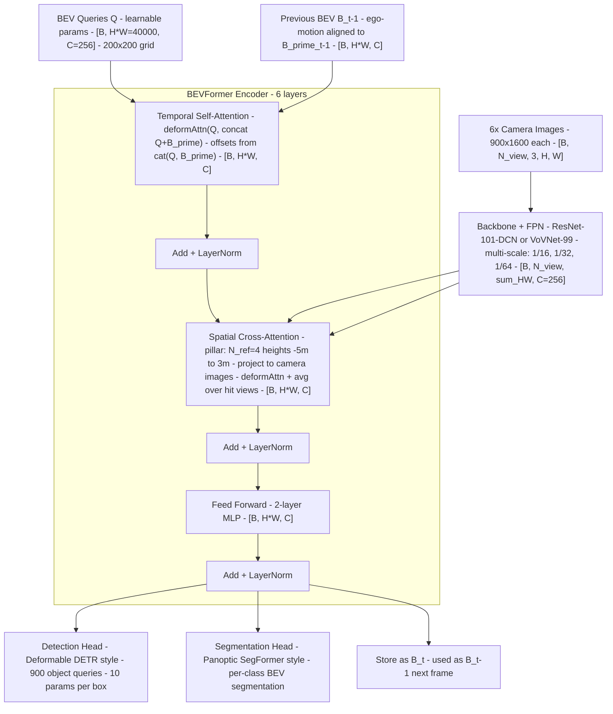

# BEVFormer: Learning Bird's-Eye-View Representation from Multi-Camera Images via Spatiotemporal Transformers（Li et al., ECCV 2022）

一句话总结：BEVFormer 用预定义 200×200 BEV 查询 + 空间交叉注意力（从多摄像头采样）+ 时序自注意力（对齐历史 BEV 帧）实现纯视觉端到端 BEV 感知，nuScenes val NDS 0.517，比 DETR3D +9.2 pts，成为 camera-only BEV 感知的标准基线，上海 AI Lab + 南京大学，ECCV 2022。

## 基本信息

- 论文：BEVFormer: Learning Bird's-Eye-View Representation from Multi-Camera Images via Spatiotemporal Transformers
- 作者：Zhiqi Li\*、Wenhai Wang\*、Hongyang Li\*（并列第一）、Enze Xie、Chonghao Sima、Tong Lu、Yu Qiao、Jifeng Dai（通讯）
- 机构：上海 AI Lab + 南京大学 + 香港大学
- arXiv：2203.17270（2022-03）
- 发表：ECCV 2022
- 代码：https://github.com/zhiqi-li/BEVFormer

---

## 核心问题

**如何从多路摄像头生成统一的 BEV（鸟瞰图）特征，同时利用时序信息？**

BEV 表示是自动驾驶的理想中间表示：位置和尺度清晰，可直接对接感知、预测、规划三层。问题是如何从 2D 图像生成准确的 BEV 特征。

**先前方法的问题**：

| 问题类型 | 代表方法 | 缺陷 |
|---------|---------|------|
| 单目/多视图独立处理 | 大多数 2D 检测器 | 无法捕获跨相机信息 |
| 基于深度估计 | Lift-Splat-Shoot（Philion & Fidler, ECCV 2020）| 依赖深度精度，误差累积 |
| 3D query 投影采样 | DETR3D（Wang et al., CoRL 2021）| 无 BEV 表示，无时序信息 |
| 简单时序叠加 | — | 额外计算负担和干扰信息 |

**BEVFormer 的核心立场**：用**预定义的网格状 BEV 查询**驱动两种注意力——空间交叉注意力（SCA）从图像中聚合信息，时序自注意力（TSA）利用历史 BEV 特征——不依赖深度估计，完全可学习地生成 BEV 特征。

---

## 方法 / 核心机制

### 架构总览

**Backbone 与 FPN**：BEVFormer 的 backbone 是 ResNet-101-DCN（或 VoVNet-99），后接 **FPN（Feature Pyramid Network，特征金字塔网络）**。FPN 把 backbone 不同层的特征图（低分辨率→高分辨率）通过自顶向下路径 + 横向连接融合成统一通道数的多尺度特征，输出 3 个尺度：1/16（56×100）、1/32（28×50）、1/64（14×25），通道数统一为 C=256。这些多尺度特征展平后拼接成 `[B, N_view, sum_HW, C]`，供 SCA 在不同尺度上采样。



### BEV 查询（Grid-shaped BEV Queries）

- 形状：`Q ∈ ℝ^{H×W×C}`，H=W=200，C=256
- **可学习参数**（随机初始化后训练），加上可学习位置编码
- 每个查询 Q_p 位于 BEV 平面上的 (x, y) 位置，负责对应格子区域
- 感知范围：X、Y 轴均为 **[-51.2m, 51.2m]**，分辨率 **s = 0.512m/格**
- 格子中心 = 自车位置

### 空间交叉注意力（SCA）

**核心思路**：把每个 BEV 查询"抬升"成 3D 空间中的一根柱子（Pillar），在柱子上均匀采样 N_ref = 4 个参考点（高度 -5m 到 3m），将其投影到各摄像头图像，再用 Deformable Attention 采样图像特征。

**BEV 坐标 → 真实世界坐标（Eq. 3）**：

```
x' = (x − W/2) × s
y' = (y − H/2) × s
# ego car 在 BEV 中心，(x', y') 是以自车为原点的真实世界坐标（米）
```

**3D 参考点投影到相机图像（Eq. 4）**：

```
z_ij · [x_ij  y_ij  1]^T = T_i · [x'  y'  z'_j  1]^T
# T_i ∈ ℝ^{3×4}：第 i 个相机的投影矩阵（内参×外参）
# z'_j：第 j 个高度锚点（-5m 到 3m 均匀采样，N_ref=4）
# (x_ij, y_ij)：投影后的 2D 图像坐标
```

**SCA 公式（Eq. 2）**：

```
SCA(Q_p, F_t) = (1/|V_hit|) Σ_{i ∈ V_hit} Σ_{j=1}^{N_ref} DeformAttn(Q_p, P(p,i,j), F_t^i)
```

- V_hit：投影点落在图像范围内的摄像头集合（只对这些摄像头做 attention）
- 1/|V_hit|：取命中摄像头的平均，处理多摄像头重叠区域
- F_t^i：第 i 个摄像头的多尺度 FPN 特征（1/16、1/32、1/64 三个尺度，C=256）
- 每个参考点周围再采 4 个 Deformable Attention 采样点

### 时序自注意力（TSA）

**核心思路**：将上一时刻的 BEV 特征 B_{t-1} 按自车运动（ego-motion）对齐到当前帧坐标系，记为 B'_{t-1}，再和当前 BEV 查询 Q 一起做 Deformable Self-Attention。

**与标准 Deformable Attention 的区别**：偏移量 Δp 由 **concat(Q, B'_{t-1})** 预测，而非仅由 Q 预测，使偏移感知时序变化。

**TSA 公式（Eq. 5）**：

```
TSA(Q_p, {Q, B'_{t-1}}) = Σ_{V ∈ {Q, B'_{t-1}}} DeformAttn(Q_p, p, V)
```

**Ego-motion 对齐的具体实现**：自车从 t-1 到 t 运动了 (Δx, Δy, Δθ)，历史 BEV B_{t-1} 的坐标系以 t-1 时刻自车为原点。要让它和 t 时刻对齐，需要做 2D 仿射变换：先按 Δθ 旋转，再按 (Δx, Δy) 平移。PyTorch 中的实现：

```python
# ego_motion: [B, 3]  → (dx, dy, dtheta) 由车辆定位系统提供（非学习）
cos, sin = dtheta.cos(), dtheta.sin()
# 构造 2×3 仿射矩阵
theta = [[cos, -sin, dx/range], [sin, cos, dy/range]]   # [B, 2, 3]
grid = F.affine_grid(theta, B_prev.shape)                # [B, H, W, 2]
B_prev_aligned = F.grid_sample(
    B_prev.reshape(B, H, W, C).permute(0,3,1,2),        # [B, C, H, W]
    grid, align_corners=False
).permute(0,2,3,1).reshape(B, H*W, C)                   # [B, H*W, C]
```

**Stop-gradient 处理**：训练时历史 BEV 特征 {B_{t-3}, B_{t-2}, B_{t-1}} 全部 `.detach()`（断开梯度），不参与反向传播。原因：若反传梯度到历史帧的 backbone，计算图会跨越多帧，显存和算力开销不可接受。推理时本身不需要梯度，无影响。

**第一帧处理**：无历史 BEV 时，用 {Q, Q} 替代 {Q, B'_{t-1}}（TSA 退化为普通自注意力）。

### 编码器层结构

```
BEVFormerLayer（重复 6 次）:
  Q ← Q + TSA(Q, B'_prev)    # 时序：历史 BEV 信息
  Q ← LayerNorm(Q)
  Q ← Q + SCA(Q, F_t)         # 空间：从图像采样
  Q ← LayerNorm(Q)
  Q ← Q + FFN(Q)
  Q ← LayerNorm(Q)
```

输出的 BEV 特征 B_t 同时服务于检测头（Deformable DETR 风格，900 个 object queries）和分割头（Panoptic SegFormer 风格）。

---

## 模型输入详解

### 图像数据的 shape 变换全流程

文档中出现了多种张量 shape，容易混淆。以下按处理顺序，逐步追踪图像从原始像素到最终被模型使用的全部变换：

```
阶段 0：原始图像（传感器输出）
  shape: [B, 6, 3, 900, 1600]
         B  N_view  RGB  H_img  W_img
  含义：batch 内每帧有 6 个摄像头，每个输出 900×1600 的 RGB 图像

        ↓  ResNet-101-DCN backbone（逐个摄像头独立处理）

阶段 1：backbone 多层输出（3 个尺度）
  1/16 尺度: [B, 6, 256, 56, 100]    # 900/16≈56, 1600/16=100
  1/32 尺度: [B, 6, 256, 28,  50]    # 900/32≈28, 1600/32=50
  1/64 尺度: [B, 6, 256, 14,  25]    # 900/64≈14, 1600/64=25
             B  N_view  C   H_i   W_i
  含义：ResNet 不同层的特征图，分辨率递减，通道数各不同

  ⚠️ 为什么 C 在 H、W 前面？
  PyTorch 的 CNN 惯例是 [B, C, H, W]（channels-first），和 TensorFlow 的
  [B, H, W, C]（channels-last）相反。这只是框架惯例，不影响数学含义。
  PyTorch 选 channels-first 是因为它的内存布局让 conv2d 更快。

  CNN 的一般规律：每经过一个 stage（含 pooling 或 stride-2 conv），
  空间尺寸减半、通道数翻倍。所以 ResNet 的通道从 64→256→512→1024→2048，
  空间从 H×W 逐步缩小到 H/32×W/32。FPN 再把通道统一回 256。

        ↓  FPN（自顶向下融合 + 横向连接，统一通道数为 C=256）

阶段 2：FPN 多尺度特征（仍然是 3 个尺度，通道数已统一）
  shape 同阶段 1（FPN 不改分辨率，只融合语义并统一通道）

        ↓  每个尺度展平 H_i×W_i → 拼接

阶段 3：展平拼接后的多尺度特征 ← 这是代码中 img_feats
  shape: [B, 6, 7350, 256]
         B  N_view  sum_HW  C
  含义：每个摄像头的 3 个尺度特征展平后拼接
        sum_HW = 56×100 + 28×50 + 14×25 = 5600 + 1400 + 350 = 7350
  代码变量：img_feats（SCA 的输入）
```

### BEV 查询（完全独立于图像，不是从图像派生的）

```
BEV 查询 Q
  shape: [B, 40000, 256]
         B   H*W    C
  含义：200×200=40000 个格子，每格一个 256 维查询向量
  来源：nn.Parameter（可学习参数）+ nn.Parameter（位置编码），随机初始化后由训练学习
  注意：Q 和 img_feats 维度相同（都是 [B, ?, 256]），但含义完全不同：
        img_feats 的 7350 = 多尺度图像像素
        Q 的 40000 = BEV 网格位置
```

### 两者如何交互：Cross-Attention 的本质

SCA（空间交叉注意力）连接了这两种张量：每个 BEV 查询 Q_p 通过 3D 参考点投影到摄像头图像上，从 `img_feats` 中采样特征。输入是 `[B, 6, 7350, 256]` 的图像特征 + `[B, 40000, 256]` 的 BEV 查询，输出仍然是 `[B, 40000, 256]` 的 BEV 查询（特征被图像信息更新了）。

**Q 和输出 shape 为什么一样？这是 cross-attention 的通用规则，不是 BEVFormer 特有的。**

Cross-attention 的核心公式是 `output = softmax(Q K^T / sqrt(d_k)) V`。精确的 shape 规则：

```
Cross-Attention 的 shape 规则（精确版）：
  Q:      [B, N_q,  d_q]    ← N_q 个查询，每个 d_q 维
  K:      [B, N_kv, d_k]    ← N_kv 个 key（d_k 必须 = d_q，因为要做 Q K^T）
  V:      [B, N_kv, d_v]    ← N_kv 个 value（d_v 可以 ≠ d_q）

  Q K^T:  [B, N_q, N_kv]   ← 注意力权重矩阵
  output: [B, N_q, d_v]     ← 行数跟 Q（N_q），列数跟 V（d_v）

  所以：output 的行数 = Q 的行数（决定"有多少个输出"）
       output 的列数 = V 的列数（决定"每个输出多少维"）
       和 K/V 的行数 N_kv 无关（N_kv 在矩阵乘法中被消掉了）
```

在 BEVFormer（以及绝大多数 Transformer 实现）中，d_q = d_k = d_v = 256，所以 output shape 恰好等于 Q shape。但严格来说，行数跟 Q，列数跟 V。

```
  N_q 和 N_kv 可以完全不同！
  BEVFormer: N_q=40000 (BEV格子)   N_kv=7350 (图像像素)
  DETR:      N_q=100 (object queries) N_kv=H*W (图像像素)
  TNT规划:   N_q=64 (目标点)        N_kv=场景 polyline 数
```

**那 BEVFormer 的 Q shape 为什么恰好是 200×200=40000？** 因为 BEVFormer 的设计目标就是输出 200×200 的 BEV 网格特征——每个格子需要一个查询去"询问"对应位置的信息，所以 Q 的数量 = BEV 网格数量。如果你想要更精细的 BEV（比如 400×400），就需要 160000 个 Q。

**对比 TNT/DETR 的不同设计**：在 TNT 的规划场景中，Q 是 64 个目标终点的 embedding，输出是 64 个目标的轨迹——Q 数量 = 目标数量 ≠ 轨迹点数。轨迹的多个时间步是由后续的 MLP 回归出来的，不是由 cross-attention 直接输出的。DETR 中 Q 是 100 个 object query，输出 100 个检测框。共同规则仍然是：**Q 的数量决定输出的数量**。

**Q 是可学习参数，训练完后的角色？** 训练完后，Q 冻结在模型权重里，推理时每帧都用同一组 Q。可以理解为 Q 学到了"每个 BEV 位置应该用什么方式去图像中找信息"——类似于学到了 40000 个"提问模板"。位置 (100, 100) 对应的 Q 学到了"去图像中找自车正前方的信息"，位置 (0, 0) 学到了"去找左后方的信息"。

**7350×6=44100 和 40000 能直接加在一起吗？** 不能，也不需要。Cross-attention 不是把 Q 和 K/V "加"在一起——它是让 Q "查看" K/V 并从中提取信息。两者的维度数量可以完全不同，只需要特征通道数 C 一致（都是 256）。这正是 cross-attention 的价值：它能把任意长度的信息源压缩/重组到 Q 指定的格式中。

### 投影矩阵的角色

`proj_matrices: [B, 6, 3, 4]` 是每个摄像头的投影矩阵 T_i = K × [R|t]，其中 K 是 3×3 相机内参（焦距/光心），[R|t] 是 3×4 外参（相机在车身坐标系中的位置和朝向）。

**这些矩阵不是可学习参数**——它们来自传感器标定（nuScenes 数据集自带），每帧固定。模型用它们做几何投影，不做学习：

```
用途：SCA 中把 BEV 3D 参考点投影到 2D 图像坐标
  给定 BEV 网格位置 (x', y') + 高度锚点 z'
  → 齐次坐标 [x', y', z', 1]
  → 乘投影矩阵 T_i：pixel = T_i × [x', y', z', 1]^T
  → 得到 (u, v) 像素坐标
  → 在该位置附近用 Deformable Attention 采样图像特征
```

所以投影矩阵告诉模型"BEV 上的这个 3D 点，对应到 6 个摄像头图像的哪个像素位置"。这是纯几何运算，不涉及学习。模型**学习的是**在那个像素附近如何做 attention（偏移量和权重）。

### 其他输入变量

| 代码变量 | Shape | 含义 | 来源 |
|---------|-------|------|------|
| `proj_matrices` | `[B, 6, 3, 4]` | 每个摄像头的投影矩阵 T_i = K × [R\|t] | 传感器标定（nuScenes 自带），非学习参数 |
| `B_prev` | `[B, 40000, 256]` 或 `None` | 上一帧的 BEV 特征 | 上一帧模型输出缓存，第一帧为 None |
| `z_anchors` | `[4]` | 高度锚点（-5m, -2.33m, 0.33m, 3m）| `torch.linspace(-5, 3, 4)`，固定值 |
| `bev_xy` | `[40000, 2]` | 每个 BEV 格子的真实世界 (x,y) 坐标（米）| grid 索引 × 0.512m：`x'=(xi-100)*0.512` |
| `ego_motion` | `[B, 3]` | 自车运动 (Δx, Δy, Δθ) | 车辆定位/IMU（nuScenes `ego_pose`）|

---

## PyTorch 伪代码（含 shape）

> 注：MSDeformAttn 来自 Deformable DETR（Zhu et al., ICLR 2021）。ego-motion warp 的具体矩阵变换论文未给出精确公式，标注「推断」。

```python
import torch
import torch.nn as nn
import torch.nn.functional as F
from ops.modules import MSDeformAttn   # Deformable DETR 的可变形注意力算子


# ─────────────────────────────────────────────
# 1. Temporal Self-Attention (TSA)
# ─────────────────────────────────────────────
class TemporalSelfAttention(nn.Module):
    """
    n_heads: 多头注意力的头数（8）。和标准 multi-head attention 一样，把 C=256
             拆成 8 个 32 维子空间，每个头独立学自己的注意力模式，最后拼回 256。
    n_points: 每个头在参考点周围采样的偏移点数（4）。标准 attention 会看所有位置
              （O(N²) 复杂度），Deformable Attention 只看参考点附近的 n_points 个
              位置（O(N×n_points)），大幅降低计算量。
    """
    def __init__(self, embed_dim=256, n_heads=8, n_points=4):
        super().__init__()
        # offsets 由 cat(Q, B_prev) 预测（区别于标准 DeformAttn 只用 Q）
        # 输出维度 = n_heads × 2(xy偏移) × n_points = 8×2×4 = 64
        self.offset_proj = nn.Linear(embed_dim * 2, n_heads * 2 * n_points)
        # 注意力权重：每个头的 n_points 个采样点各分一个权重
        # 输出维度 = n_heads × n_points = 8×4 = 32
        self.attn_weight_proj = nn.Linear(embed_dim * 2, n_heads * n_points)
        self.value_proj = nn.Linear(embed_dim, embed_dim)
        self.out_proj = nn.Linear(embed_dim, embed_dim)
        self.n_heads = n_heads
        self.n_points = n_points

    def forward(self, Q, B_prev):
        # Q      : [B, H*W, C]  当前 BEV 查询
        # B_prev : [B, H*W, C]  上一帧 BEV（已用 ego-motion 对齐，见注）
        B, HW, C = Q.shape

        # 预测偏移量（从 concat(Q, B_prev) 而非只从 Q）
        feat = torch.cat([Q, B_prev], dim=-1)           # [B, H*W, 2C=512]
        offsets = self.offset_proj(feat)                 # [B, H*W, 64] = 8头×2坐标×4点
        weights = self.attn_weight_proj(feat).softmax(-1)# [B, H*W, 32] = 8头×4点

        # 对 Q 和 B_prev 分别做 deformable attention 并求和
        V_Q    = self.value_proj(Q)                      # [B, H*W, C]
        V_Bprev= self.value_proj(B_prev)                 # [B, H*W, C]

        # deformable_sample 做的事情：
        #   对于每个查询位置 p，找到它在 V 上的参考坐标（即 p 自身在 BEV 网格中的位置），
        #   然后在参考坐标附近采样 n_points=4 个偏移点（偏移量由 offsets 给出），
        #   用双线性插值取出这 4 个点的特征值，按 weights 加权求和。
        #   相当于"只看附近 4 个点"的稀疏 attention，而非看所有 40000 个位置。
        out = deformable_sample(V_Q, offsets, weights) \
            + deformable_sample(V_Bprev, offsets, weights)
        return self.out_proj(out)                        # [B, H*W, C]


# ─────────────────────────────────────────────
# 2. Spatial Cross-Attention (SCA)
# ─────────────────────────────────────────────
class SpatialCrossAttention(nn.Module):
    """
    SCA __init__ 的目标：预计算两组固定坐标，后续 forward 中用它们构造 3D 参考点。

    参数含义：
      n_ref=4:    每个 BEV 格子在垂直方向上采样的高度数（-5m 到 3m 均匀 4 个点），
                  把 2D BEV 位置"抬升"成一根 3D 柱子（pillar），4 个采样高度。
      n_points=4: Deformable Attention 在每个参考点（投影到图像后的 2D 位置）
                  周围再采样的偏移点数。所以每个 BEV 格子实际采样 4高度×4偏移=16 个点。
      s=0.512:    BEV 网格分辨率，0.512 米/格。200 格 × 0.512 = 102.4m 覆盖范围。
      n_levels=3: FPN 多尺度特征的层数（1/16, 1/32, 1/64 三个尺度）。
      n_heads=8:  多头注意力的头数。
    """
    def __init__(self, embed_dim=256, n_heads=8, n_levels=3,
                 n_ref=4, n_points=4,
                 z_min=-5.0, z_max=3.0,
                 bev_h=200, bev_w=200, s=0.512):
        super().__init__()
        self.n_ref = n_ref
        self.n_points = n_points

        # ── 预计算 1：高度锚点 ──
        # 4 个均匀高度：-5.0, -2.33, 0.33, 3.0（米）
        # 覆盖地面以下到建筑物高度的范围
        z_anchors = torch.linspace(z_min, z_max, n_ref)
        self.register_buffer('z_anchors', z_anchors)    # [4]

        # ── 预计算 2：BEV 网格的真实世界坐标 ──
        # 目标：把网格索引 (xi, yi) ∈ [0,199] 转换成以自车为原点的米制坐标
        # 公式：x' = (xi - 100) × 0.512，y' = (yi - 100) × 0.512
        # 例：格子 (0, 0) → (-51.2m, -51.2m)，格子 (100, 100) → (0, 0) = 自车位置
        xi = torch.arange(bev_w).float()                # [200] = 0,1,...,199
        yi = torch.arange(bev_h).float()                # [200]
        gy, gx = torch.meshgrid(yi, xi, indexing='ij')  # 各 [200, 200]
        bev_x = (gx - bev_w / 2) * s                    # [200, 200] 米制 x 坐标
        bev_y = (gy - bev_h / 2) * s                    # [200, 200] 米制 y 坐标
        bev_xy = torch.stack([bev_x, bev_y], dim=-1).reshape(-1, 2)
        self.register_buffer('bev_xy', bev_xy)           # [40000, 2]
        # register_buffer 的作用：把 tensor 绑到模型上，随模型一起 .cuda()/.save()，
        # 但不参与梯度计算（不是 nn.Parameter）。因为这些坐标是固定的几何常量。

        # 可学习层
        self.value_proj = nn.Linear(embed_dim, embed_dim)
        self.out_proj   = nn.Linear(embed_dim, embed_dim)
        self.multi_scale_deform = MSDeformAttn(embed_dim, n_levels, n_heads, n_points)

    def forward(self, Q, img_feats, proj_matrices):
        """
        Q             : [B, H*W, C]         BEV 查询
        img_feats     : [B, N_view, sum_HW, C]  多尺度 FPN 特征（展平）
        proj_matrices : [B, N_view, 3, 4]   相机投影矩阵 T_i
        """
        B, HW, C = Q.shape
        N_view = proj_matrices.shape[1]

        # ① 构造 3D 参考点 [HW, N_ref, 3]
        bev_xy = self.bev_xy.unsqueeze(1).expand(HW, self.n_ref, 2)  # [HW, N_ref, 2]
        z = self.z_anchors.unsqueeze(0).expand(HW, -1)               # [HW, N_ref]
        ref_3d = torch.cat([bev_xy, z.unsqueeze(-1)], dim=-1)        # [HW, N_ref, 3]
        ref_3d_h = torch.cat(
            [ref_3d, torch.ones(*ref_3d.shape[:-1], 1, device=ref_3d.device)], dim=-1
        )                                                              # [HW, N_ref, 4]

        # ② 投影到各摄像头图像：把每个 3D 参考点变成 6 个摄像头上的 2D 像素坐标
        #
        # 这一步做的数学运算很简单，就是矩阵乘法：
        #   pixel_homogeneous = T_i × [x', y', z', 1]^T
        # 其中 T_i 是 3×4 投影矩阵，[x', y', z', 1] 是 3D 齐次坐标
        # 结果是 3 维齐次像素坐标 [u*d, v*d, d]，除以 d 得到 (u, v)
        #
        # 下面用 einsum 把这个矩阵乘法批量化到所有 batch×摄像头×格子×高度：

        # 先把 ref_3d_h 扩展到 [B, N_view, HW*N_ref, 4] 以匹配 proj_matrices
        ref_3d_batch = ref_3d_h.unsqueeze(0).unsqueeze(0).expand(B, N_view, -1, -1, -1)
        #   ref_3d_h:    [HW, N_ref, 4]        每个格子×每个高度的齐次3D坐标
        #   扩展后:       [B, N_view, HW, N_ref, 4]
        #   reshape 后:   [B, N_view, HW*N_ref, 4]  把格子和高度合并

        # einsum 拆解：
        #   proj_matrices: [B, V, 3, 4]     V=N_view=6
        #   ref_3d_flat:   [B, V, HW*4, 4]  (这里的 hw 下标对应 HW*N_ref 个点)
        #   'bvij, bvhwj -> bvhwi' 的含义：
        #     b: batch        ← 保留
        #     v: 摄像头编号    ← 保留
        #     hw: 参考点编号   ← 保留
        #     j: 求和维度（3D 坐标的 4 个分量，做点积）← 消去
        #     i: 输出的 3 个分量（齐次像素坐标）← 保留
        #   等价于普通写法：proj[b,v,hw,i] = sum_j(T[b,v,i,j] * ref[b,v,hw,j])
        #   即对每个 batch、每个摄像头、每个 3D 点，做一次 3×4 矩阵 × 4×1 向量
        proj = torch.einsum('bvij,bvhwj->bvhwi', proj_matrices,
                            ref_3d_batch.reshape(B, N_view, HW * self.n_ref, 4))
        proj = proj.reshape(B, N_view, HW, self.n_ref, 3)
        # proj: [B, 6, 40000, 4, 3]  → 每个点的齐次像素坐标 [u*d, v*d, d]

        # 齐次坐标 → 归一化像素坐标：除以深度 d（第 3 个分量）
        pts_2d = proj[..., :2] / proj[..., 2:3].clamp(min=1e-5)     # [B, N_view, HW, N_ref, 2]
        # pts_2d 的值域 [0,1] 表示图像归一化坐标（0=左上角，1=右下角）

        # ③ 判断 hit（投影点在图像范围内）
        valid = (pts_2d[..., 0] >= 0) & (pts_2d[..., 0] <= 1) \
              & (pts_2d[..., 1] >= 0) & (pts_2d[..., 1] <= 1)       # [B, N_view, HW, N_ref]
        n_hit = valid.float().sum(1).clamp(min=1)                    # [B, HW, N_ref]

        # ④ 对每个 hit 摄像头做 MSDeformAttn，按 hit 数平均
        out = torch.zeros(B, HW, C, device=Q.device)
        for i in range(N_view):
            ref_2d_i = pts_2d[:, i]                                  # [B, HW, N_ref, 2]
            attn_i = self.multi_scale_deform(
                query=Q,                                             # [B, HW, C]
                reference_points=ref_2d_i,                          # [B, HW, N_ref, 2]
                input_flatten=img_feats[:, i],                      # [B, sum_HW, C]
            )                                                        # [B, HW, C]
            hit_mask = valid[:, i].any(-1).unsqueeze(-1).float()    # [B, HW, 1]
            out = out + attn_i * hit_mask

        out = out / n_hit.any(-1).float().unsqueeze(-1).clamp(min=1)# 平均 hit 摄像头
        return self.out_proj(out)                                    # [B, H*W, C]


# ─────────────────────────────────────────────
# 3. 单个编码器层
# ─────────────────────────────────────────────
class BEVFormerLayer(nn.Module):
    def __init__(self, embed_dim=256):
        super().__init__()
        self.tsa  = TemporalSelfAttention(embed_dim)
        self.norm1 = nn.LayerNorm(embed_dim)
        self.sca  = SpatialCrossAttention(embed_dim)
        self.norm2 = nn.LayerNorm(embed_dim)
        self.ffn  = nn.Sequential(
            nn.Linear(embed_dim, embed_dim * 4),
            nn.GELU(),
            nn.Linear(embed_dim * 4, embed_dim),
        )
        self.norm3 = nn.LayerNorm(embed_dim)

    def forward(self, Q, B_prev, img_feats, proj_matrices):
        # Q        : [B, H*W, C]
        # B_prev   : [B, H*W, C]  ego-motion aligned（推断：affine_grid + grid_sample）
        # img_feats: [B, N_view, sum_HW, C]
        # proj_mats: [B, N_view, 3, 4]

        # "Q + self.tsa(Q, B_prev)" 是残差连接（residual connection）：
        # tsa 输出的是一个"修正量"（delta），加回原始 Q 上。
        # 好处：(1) 梯度直通——即使 tsa 输出全 0，梯度也能通过 "+" 直传到前面的层；
        #       (2) 模块只需学"在 Q 的基础上改什么"，而非从零重建整个特征。
        # 这是 Transformer 的标准模式：每个子层都是 LayerNorm(x + SubLayer(x))。
        Q = self.norm1(Q + self.tsa(Q, B_prev))       # 残差 + LayerNorm
        Q = self.norm2(Q + self.sca(Q, img_feats, proj_matrices))
        Q = self.norm3(Q + self.ffn(Q))
        return Q                                  # [B, H*W, C]


# ─────────────────────────────────────────────
# 4. 检测头（Deformable DETR 风格）
# ─────────────────────────────────────────────
class DeformableDETRHead(nn.Module):
    def __init__(self, embed_dim=256, num_queries=900, num_classes=10, num_dec_layers=6):
        super().__init__()
        self.object_queries = nn.Embedding(num_queries, embed_dim)  # 900 个可学习 query
        # decoder 每层：self-attn(query间) + cross-attn(query→BEV feat) + FFN
        self.decoder = nn.ModuleList([
            DeformableDecoderLayer(embed_dim) for _ in range(num_dec_layers)
        ])
        self.cls_head = nn.Linear(embed_dim, num_classes)           # 分类
        self.reg_head = nn.Sequential(                              # 回归 10 参数
            nn.Linear(embed_dim, embed_dim), nn.ReLU(),
            nn.Linear(embed_dim, 10),                               # (x,y,z,l,w,h,cos,sin,vx,vy)
        )

    def forward(self, bev_feat):
        # bev_feat: [B, H*W, C]  来自 BEV 编码器
        B = bev_feat.shape[0]
        queries = self.object_queries.weight.unsqueeze(0).expand(B, -1, -1)  # [B, 900, C]
        for layer in self.decoder:
            queries = layer(queries, bev_feat)         # cross-attn: query attend to BEV feat
        cls = self.cls_head(queries)                   # [B, 900, num_classes]
        reg = self.reg_head(queries)                   # [B, 900, 10]
        return {'logits': cls, 'boxes': reg}
        # 推理时取 top-300（置信度截断），匈牙利匹配把 900 预测和 GT 配对


# ─────────────────────────────────────────────
# 5. 分割头（Panoptic SegFormer 风格）
# ─────────────────────────────────────────────
class PanopticSegHead(nn.Module):
    def __init__(self, embed_dim=256, num_classes=4):
        super().__init__()
        # 4 类: drivable_area, ped_crossing, walkway, carpark
        self.upsample = nn.Sequential(
            nn.ConvTranspose2d(embed_dim, 128, 4, stride=2, padding=1),
            nn.BatchNorm2d(128), nn.ReLU(),
            nn.ConvTranspose2d(128, 64, 4, stride=2, padding=1),
            nn.BatchNorm2d(64), nn.ReLU(),
        )
        self.cls_conv = nn.Conv2d(64, num_classes, 1)

    def forward(self, bev_feat):
        # bev_feat: [B, H*W, C] → reshape to [B, C, H, W]
        B = bev_feat.shape[0]
        x = bev_feat.reshape(B, 200, 200, 256).permute(0, 3, 1, 2)  # [B, 256, 200, 200]
        x = self.upsample(x)                                         # [B, 64, 800, 800]
        return self.cls_conv(x)                                       # [B, num_classes, 800, 800]


# ─────────────────────────────────────────────
# 6. 完整 BEVFormer 前向传播
# ─────────────────────────────────────────────
class BEVFormer(nn.Module):
    def __init__(self, num_layers=6, embed_dim=256, bev_h=200, bev_w=200):
        super().__init__()
        # 可学习 BEV 查询 + 位置编码
        self.bev_queries  = nn.Parameter(torch.randn(bev_h * bev_w, embed_dim))
        self.bev_pos_emb  = nn.Parameter(torch.randn(bev_h * bev_w, embed_dim))
        self.encoder = nn.ModuleList(
            [BEVFormerLayer(embed_dim) for _ in range(num_layers)]
        )
        self.det_head = DeformableDETRHead(embed_dim, num_queries=900)
        self.seg_head = PanopticSegHead(embed_dim)

    def forward(self, img_feats, proj_matrices, B_prev=None):
        """
        img_feats    : [B, N_view, C, H, W]  各摄像头 FPN 特征（或展平多尺度版本）
        proj_matrices: [B, N_view, 3, 4]     相机投影矩阵
        B_prev       : [B, H*W, C] | None    上一帧存储的 BEV 特征（ego-motion 对齐后）
        """
        B = img_feats.shape[0]

        # ① 初始化 BEV 查询
        Q = (self.bev_queries + self.bev_pos_emb).unsqueeze(0).expand(B, -1, -1)
        # Q: [B, H*W=40000, C=256]

        # ② 若无历史帧，用 Q 自身替代（TSA 退化为自注意力）
        if B_prev is None:
            B_prev = Q.clone()                                # 第一帧 fallback
        else:
            B_prev = ego_motion_align(B_prev, ...)            # affine_grid + grid_sample，见上文 TSA 节

        # ③ 6 层 BEV 编码器
        for layer in self.encoder:
            Q = layer(Q, B_prev, img_feats, proj_matrices)   # [B, H*W, C]

        B_t = Q.reshape(B, 200, 200, 256)                    # [B, H, W, C]  存储备下帧用

        # ④ 任务头
        det_out = self.det_head(Q)   # 300 个 3D 框（置信度截断）
        seg_out = self.seg_head(Q)   # [B, n_class, H, W]  语义分割

        return det_out, seg_out, B_t


# ─────────────────────────────────────────────
# 7. 损失函数（检测 + 分割，联合训练）
# ─────────────────────────────────────────────
def compute_loss(det_pred, seg_pred, det_gt, seg_gt):
    # 检测：L1 回归 10 参数（l, w, h, x, y, z, cos_theta, sin_theta, vx, vy）
    # 匹配策略同 Deformable DETR（匈牙利匹配）
    L_det = F.l1_loss(det_pred['boxes'], det_gt['boxes'])    # Deformable DETR 风格
    L_cls = F.cross_entropy(det_pred['logits'], det_gt['labels'])

    # 分割：per-class IoU loss（Panoptic SegFormer 风格，论文未给出精确公式）
    L_seg = dice_loss(seg_pred, seg_gt) + F.binary_cross_entropy_with_logits(seg_pred, seg_gt)

    return L_det + L_cls + L_seg
```

---

## 训练 vs 推理差异

| 方面 | 训练 | 推理 |
|------|------|------|
| **历史 BEV 来源** | 随机从过去 5 帧中采样 3 帧生成 {B_{t-3}, B_{t-2}, B_{t-1}}，**不反传梯度** | 使用上一帧真实 B_{t-1} |
| **数据增强** | 随机时序采样增加 ego-motion 多样性 | 无 |
| **检测头** | 900 个 object queries，匈牙利匹配监督 | 取置信度最高的 300 个 box |
| **第一帧** | 用 {Q, Q} 替代 {Q, B'_{t-1}}（TSA 退化）| 同 |
| **输入帧数** | 4 帧（含当前帧）| 滑动窗口，每帧用上一帧的 B_t |

**为什么训练时随机采样历史帧，推理时用真实上一帧？** 训练时从过去 5 帧中随机抽 3 帧（而非固定用 t-1/t-2/t-3），有两个目的：(1) **数据增强**——随机跳帧制造更大的 ego-motion 差异（比如跳过 t-2 直接用 t-3，相当于自车移动了更远），让模型学到处理不同时间间隔的能力；(2) **避免过拟合**——如果训练时永远用连续帧，模型可能对"帧间只移动一小步"这种模式过拟合，泛化到推理时（帧间距固定）反而不鲁棒。推理时没有选择余地——只有上一帧可用（实时流式处理），不能跳帧。

**推理输入**：6 路 RGB 图像 (900×1600 each) + 相机投影矩阵（内参×外参预先提供）。

**推理输出**：N 个 3D 检测框（类别、位置、速度）+ BEV 语义分割图（可驾驶区域、车道线等）。

---

## Loss 函数

检测头基于 Deformable DETR（Zhu et al., ICLR 2021），分割头基于 Panoptic SegFormer（Cheng et al., 2022）。

| 任务 | Loss | 监督内容 |
|------|------|---------|
| 3D 检测 | L1 regression | 每个 box 的 10 参数（l,w,h,x,y,z,cos θ,sin θ,v_x,v_y）|
| 3D 检测 | 分类 CrossEntropy | 类别标签（匈牙利匹配后）|
| BEV 分割 | 分割 loss（LaneNet 风格）| 车辆/道路/车道线 per-pixel 分类 |

多任务联合训练：共享 backbone 和 BEV 编码器，检测头和分割头各自独立。论文指出联合训练时 road 和 lane 分割存在**负迁移（negative transfer）**。

---

## 训练配置

| 参数 | 值 |
|------|-----|
| Optimizer | AdamW，weight decay = 1×10⁻² |
| Learning rate | 2×10⁻⁴；backbone lr ×0.1 |
| LR schedule | Cosine annealing |
| Batch size | 1 per GPU（含 6 路图像）|
| Epochs | 24 |
| Hardware | V100 |
| 历史帧策略 | 训练时随机采样 3 帧（来自过去 2s），推理时用真实上一帧 |

---

## 关键结果 / 数据

### nuScenes val（3D 检测）

| 方法 | Backbone | NDS↑ | mAP↑ | mATE↓ | mAOE↓ | mAVE↓ |
|------|---------|------|------|-------|-------|-------|
| FCOS3D | R101 | 0.415 | 0.343 | 0.725 | 0.422 | 1.292 |
| DETR3D | R101 | 0.425 | 0.346 | 0.773 | 0.383 | 0.842 |
| BEVFormer-S（无时序）| R101 | 0.448 | 0.375 | 0.725 | 0.391 | 0.802 |
| **BEVFormer** | **R101** | **0.517** | **0.416** | **0.673** | **0.372** | **0.394** |

**BEVFormer vs DETR3D：+9.2 NDS，+7.0 mAP；速度相关指标（mAVE）大幅改善（0.842 → 0.394），时序信息对速度预测贡献最大。**

### nuScenes test（3D 检测）

| 方法 | Backbone | NDS↑ | mAP↑ |
|------|---------|------|------|
| FCOS3D | R101 | 0.428 | 0.358 |
| BEVFormer-S | R101 | 0.462 | 0.409 |
| **BEVFormer** | **R101** | **0.535** | **0.445** |
| DETR3D | V2-99 | 0.479 | 0.412 |
| **BEVFormer** | **V2-99** | **0.569** | **0.481** |

### nuScenes val（BEV 分割，IoU）

| 方法 | Car | Vehicles | Road | Lane |
|------|-----|----------|------|------|
| Lift-Splat | 42.1 | 41.7 | 77.7 | 20.0 |
| BEVFormer-S | 43.1 | 43.2 | **80.7** | 21.3 |
| **BEVFormer** | **44.8** | **44.8** | 80.1 | **25.7** |

### 推理速度（Table 6，R101，V100）

| 配置 | BEV尺寸 | 层数 | BEVFormer FPS | NDS |
|------|---------|------|--------------|-----|
| 默认 | 200×200 | 6 | **1.7** | 0.517 |
| B（小 BEV）| 100×100 | 6 | 2.0 | 0.504 |
| C（单层）| 200×200 | 1 | 2.1 | 0.501 |
| D（最轻）| 100×100 | 1 | 2.3 | 0.478 |

---

## 消融实验

### SCA 注意力机制对比（Table 5）

| 注意力类型 | NDS↑ | mAP↑ | mATE↓ | mAOE↓ |
|-----------|------|------|-------|-------|
| VPN（BEV 基线）| 0.334 | 0.252 | 0.926 | 0.598 |
| Lift-Splat（BEV 基线）| 0.397 | 0.348 | 0.784 | 0.537 |
| Global attention（BEV 100×100）| 0.404 | 0.325 | 0.837 | 0.442 |
| Points（仅参考点，无偏移）| 0.423 | 0.351 | 0.753 | 0.442 |
| **Local（完整 Deformable SCA）**| **0.448** | **0.375** | **0.725** | **0.391** |

**关键发现**：完整 Deformable SCA > 仅参考点 > 全局注意力 > 无 BEV 方法。

### TSA 设计消融（Table 8）

A = ego-motion 对齐 B_{t-1}；R = 随机采样训练帧；B = 用 cat(Q, B_prev) 预测偏移

| A | R | B | NDS↑ | mAP↑ |
|---|---|---|------|------|
| ✗ | ✓ | ✓ | 0.510 | 0.410 |
| ✓ | ✗ | ✓ | 0.513 | 0.410 |
| ✓ | ✓ | ✗ | 0.513 | 0.404 |
| **✓** | **✓** | **✓** | **0.517** | **0.416** |

**ego-motion 对齐贡献最大**（+0.7 NDS）；三个设计缺一不可。

### 帧数消融（Table 7）

| 帧数 | NDS↑ | mAP↑ | mAVE↓ |
|------|------|------|-------|
| 1 | 0.448 | 0.375 | 0.802 |
| 2 | 0.490 | 0.388 | 0.467 |
| 4 | **0.517** | **0.416** | **0.394** |
| 5 | 0.517 | 0.412 | 0.387 |

4 帧性能收敛；速度预测（mAVE）对历史帧数最敏感（1帧→4帧：0.802→0.394）。

---

## 局限性

论文明确陈述（Section 5）：

> "At present, camera-based methods still have a particular gap with LiDAR-based methods in effect and efficiency. Accurate inference of 3D location from 2D information remains a long-stand challenge for camera-based methods."

仅两句，未展开。隐含局限：
- 推理速度仅 1.7 FPS（backbone 占主要耗时 391ms）；
- 联合检测+分割训练时 road/lane 分割存在负迁移；
- 对历史帧数有依赖（第一帧没有历史 BEV，性能下降约 7 NDS）。

---

## 现状与影响

**一句话定性：camera-only BEV 感知领域的奠基性工作，时序 BEV 特征融合的标准范式；整体架构已被更高效的替代方案超越，但 SCA 和 TSA 的设计思路仍被广泛引用。**

- BEVFormer 发布时以大幅领先 DETR3D (+9.2 NDS) 确立了 camera BEV 感知的新标杆，直接触发了大量后续工作。
- **直接影响**：
  - **BEVFormer v2**（Li et al., 2022）：加入深度估计辅助，进一步提升
  - **TPVFormer**（Huang et al., CVPR 2023，wiki 已有）：把 BEVFormer 的 BEV 扩展到三视图，做 3D occupancy
  - **BEVFusion**（多种版本）：把 BEVFormer 的 camera BEV 与 LiDAR BEV 融合
  - **UniAD**（wiki 已有）：以 BEVFormer 作为共享 BEV 编码器，驱动五个下游任务
  - **SparseDrive/VAD**：接受 BEVFormer 风格的 BEV 特征进行规划
- **被超越方向**：
  - **速度**：1.7 FPS 不满足实时需求；后续 Sparse4D、StreamPETR 等方法用稀疏 query 代替密集 BEV 网格，速度提升 10× 以上
  - **精度**：BEVFormer v2、BEVDet4D、SOLOFusion、VideoBEV 等 2023-2024 年方法在 nuScenes 测试集上均超过 BEVFormer
  - **2026 年视角**：nuScenes test NDS 0.569 已属中等水平（当前 SOTA 超过 0.7）；但 SCA 的"投影+deformable采样"思路和 TSA 的"ego-motion对齐历史BEV"思路仍是理解 BEV 感知方法的基础。

---

## 和 wiki 内其他概念的关联

- **[TPVFormer](tpvformer-2302.07817.md)**：直接以 BEVFormer 为出发点，将 BEV 扩展为三视图；paper 中明确 cite BEVFormer 作为前驱
- **[UniAD](uniad-2212.10156.md)**：UniAD 的 BEV 编码器实质上是 BEVFormer，在此基础上串联跟踪/预测/规划
- **[VoxFormer](voxformer-2302.12251.md)**：VoxFormer cite BEVFormer 的 Deformable Attention 设计；不同之处是 VoxFormer 在 3D 体素空间操作
- **[MapTR](maptr-2208.14437.md)**：MapTR 的 BEV 特征可以用 BEVFormer 生成（MapTR 也 cite BEVFormer）
- **[nuScenes](nuscenes-1903.11027.md)**：BEVFormer 的主要评测数据集
- **[Deformable DETR](deformable-detr-2010.04159.md)**：BEVFormer 的核心算子 MSDeformAttn 直接来自 Deformable DETR；SCA 和 TSA 都是 MSDeformAttn 的应用
- **[FPN](fpn-1612.03144.md)**：BEVFormer 的 backbone（ResNet-101）后接 FPN 生成多尺度特征，供 SCA 在不同尺度上采样
- **[DETR](detr-2005.12872.md)**：BEVFormer 检测头基于 Deformable DETR decoder + object queries + 匈牙利匹配，架构来源是 DETR
- **[位置编码（PE）](../20-concepts/positional-encoding.md)**：BEV queries 的可学习位置编码是 BEV 网格的关键设计
- **[Attention 优化技术](../20-concepts/attention-optimization.md)**：SCA 使用 Deformable Attention（MSDeformAttn），是对标准 Softmax Attention 的稀疏替代

---

## 附录：完整输入特征

### 摄像头图像

| 字段 | 值 |
|------|-----|
| 相机数 | N_view = 6（nuScenes 全向配置）|
| 单相机分辨率 | 900 × 1600（H × W）|
| 通道 | RGB 3 通道 |
| FPN 输出尺度 | 1/16（56×100）、1/32（28×50）、1/64（14×25），C=256 |

### 相机参数（外部提供，非学习）

| 字段 | 说明 |
|------|------|
| 投影矩阵 T_i | [3×4]，内参 K × 外参 [R｜t]，每帧预先提供 |
| 用途 | SCA（Spatial Cross-Attention，见上文"空间交叉注意力"一节）中把 3D 参考点投影到 2D 像素坐标 |

### BEV 查询

| 字段 | 值 |
|------|-----|
| Shape | [200, 200, 256] = H×W×C |
| 感知范围 | X、Y 均为 [-51.2m, 51.2m] |
| 分辨率 | 0.512m / 格 |
| 类型 | 可学习参数（+ 可学习位置编码）|
| 初始化 | 随机（从数据中学习）|

### 历史 BEV 特征（时序输入）

| 字段 | 说明 |
|------|------|
| B_{t-1} | 上一帧的 BEV 特征 [B, H×W, C]，存储并在下帧重用 |
| 对齐方式 | 用自车在 t-1 → t 的运动（旋转+平移）对 BEV 平面做仿射变换（`F.affine_grid` + `F.grid_sample`），详见上文 TSA 节 |
| 训练时处理 | 对 {B_{t-3},B_{t-2},B_{t-1}} 调用 `.detach()` 断开梯度（stop-gradient），避免反传跨帧 backbone，详见上文 TSA 节 |

---

## 值得看的部分 / 相关资料

- **Figure 2**：SCA 的可视化，直观展示从 BEV 查询到 3D pillar 到相机投影的过程
- **Table 5**（SCA 消融）：对比 Global/Points/Local 三种注意力机制，量化 Deformable Attention 的价值
- **Table 8**（TSA 消融）：ego-motion 对齐、随机帧采样、偏移预测方式三者的贡献分解
- **Deformable DETR**（Zhu et al., ICLR 2021）：BEVFormer 的核心算子 MSDeformAttn 来源
- **BEVFormer v2**（arXiv 2211.10439）：同一团队的升级版，加入深度辅助
- **UniAD**（wiki 已有）：把 BEVFormer 接入端到端自动驾驶的代表性工作
