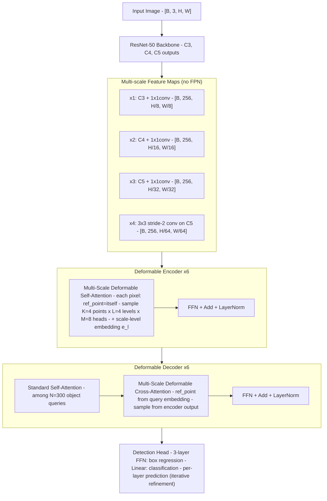

# Deformable DETR: Deformable Transformers for End-to-End Object Detection（Zhu et al., ICLR 2021）

一句话总结：Deformable DETR 用可变形注意力模块（MSDeformAttn）替换 DETR 中的标准 Transformer attention——每个 query 只在参考点附近采样 K=4 个点（而非看所有像素），天然支持多尺度特征图，复杂度从 O(N²) 降到 O(N)，收敛速度比 DETR 快 10×，小物体检测显著改善，COCO AP 46.2（two-stage），SenseTime + USTC，ICLR 2021。

## 基本信息

- 论文：Deformable DETR: Deformable Transformers for End-to-End Object Detection
- 作者：Xizhou Zhu\*、Weijie Su\*、Lewei Lu、Bin Li、Xiaogang Wang、Jifeng Dai†（通讯）
- 机构：SenseTime Research + USTC + CUHK
- arXiv：2010.04159（2020-10）
- 发表：ICLR 2021
- 代码：https://github.com/fundamentalvision/Deformable-DETR

---

## 核心问题

**DETR 为什么收敛慢、小物体差？如何解决？**

DETR（Carion et al., ECCV 2020）用 Transformer 取代了目标检测的手工组件（anchor、NMS），但有两个严重缺陷：

| 问题 | 原因 | 后果 |
|------|------|------|
| 收敛极慢（500 epochs vs Faster R-CNN 的 ~50）| 初始化时 attention 权重几乎均匀分布在所有像素上，需要很长训练才能学到稀疏的有意义模式 | 训练成本高 10-20× |
| 小物体检测差 | Transformer encoder 的自注意力是 O(H²W²)，无法使用高分辨率特征图（显存爆炸）| 只能用低分辨率 C5（stride 32），丢失小物体细节 |

**两个问题的共同根源**：标准 Transformer attention 看所有像素位置（dense attention），在图像域既慢又浪费——大部分像素和当前 query 无关。

**Deformable DETR 的核心立场**：受 deformable convolution（Dai et al., ICCV 2017）启发，让每个 query 只在参考点附近采样固定 K 个点。这样 (1) 初始化时就已聚焦在参考点附近，收敛快；(2) 复杂度与空间尺寸线性相关，可以直接处理多尺度高分辨率特征图。

---

## 方法 / 核心机制

### 架构总览



### Deformable Attention 从零讲解

> 如果你看完 DETR 来到这里，最大的困惑可能是：DETR 里 attention 是 Q·K^T·V 三步，这里怎么突然变成了一堆 Δp、A、bilinear sample？下面从"DETR 的 attention 哪里有问题"出发，一步步推导出 Deformable Attention 的每一个组件。

**输入输出 shape**：和标准 attention 一样，**输入 [B, N_q, C] → 输出 [B, N_q, C]**，shape 不变。"输出行数 = Q 行数"的规则仍然成立——每个 query 产生一个输出向量。所以 Deformable Attention 可以直接替换标准 attention，Transformer 层的其他部分（残差连接、LayerNorm、FFN）完全不需要改。

#### 第 0 步：回顾 DETR 的 attention 在做什么

DETR encoder 里的 self-attention：

```
对于特征图上每个像素 q（共 HW 个）：
  1. 计算 q 和所有 HW 个像素的相似度 → softmax → 权重 [HW]
  2. 用权重对所有 HW 个像素的 value 加权求和 → 输出 [C]

问题：每个像素都要看 HW 个位置 → O(H²W²) 复杂度
      800×1333 图像 → HW ≈ 20000 → 20000² = 4 亿次运算/像素
```

#### 第 1 步：核心洞察——大部分 attention 权重接近 0

训练好的 DETR encoder 的 attention map（Figure 3）显示：每个像素的 attention 几乎只集中在目标物体上，其他区域权重接近 0。也就是说 20000 个位置中，可能只有几十个真正有用。

**想法**：既然最终只看少数位置，不如一开始就只看少数位置——跳过 Q·K^T 这步，直接预测"去哪里看"。

#### 第 2 步：从"看所有位置"到"只看 K 个位置"

给每个像素 q 一个**参考点** p_q（就是 q 自身在特征图上的坐标），然后在参考点附近采样 K=4 个位置：

```
标准 attention：
  q 看所有 20000 个位置 → 权重 [20000] → 加权求和

Deformable attention：
  q 有一个参考点 p_q = (0.3, 0.5)      ← q 自身的归一化坐标
  模型预测 4 个偏移 Δp_1...Δp_4         ← 从 q 的特征向量用线性层预测
  采样位置 = p_q + Δp_k                  ← 4 个位置，在参考点附近
  模型预测 4 个权重 A_1...A_4            ← 从 q 的特征向量用线性层预测，softmax
  在 4 个采样位置用双线性插值取特征值
  输出 = Σ_k A_k · value(p_q + Δp_k)   ← 加权求和
```

**关键区别**：没有 Q·K^T 步骤——"去哪里看"（Δp）和"看到的多重要"（A）都由 q 自身的特征直接预测。

#### 第 3 步：用具体数字走一遍

假设特征图 25×34 = 850 个像素，C=256，单头（M=1），K=4 个采样点：

```
输入：
  q 是第 420 个像素，特征 z_q: [256]
  q 的参考点 p_q = (0.5, 0.49)   ← 归一化坐标，约在特征图中心

Step 1：预测偏移（linear: 256 → 4×2 = 8）
  Δp = linear(z_q)               → [(-0.02, +0.03), (+0.05, -0.01),
                                     (-0.01, -0.04), (+0.03, +0.02)]
  4 个 2D 偏移

  ⚠️ 偏移不一定很小——模型可以学到任意大的偏移。但论文用了精心的初始化
  （Appendix A.4）：bias 初始化为 8 个方向的规则网格 {(-k,-k),(-k,0),...,(k,k)}，
  再乘以 1/(L×K) 缩放因子，使得初始采样点紧贴参考点周围。
  训练过程中偏移可以增大，但因为参考点本身已经接近有用的位置，
  模型通常不需要大幅偏移就能找到有信息的特征。
  这也是 Deformable DETR 收敛快的原因之一：初始化时采样点就在合理位置附近，
  不像标准 attention 初始化时权重均匀分布在所有 20000 个位置上。

Step 2：计算采样坐标
  sampling_points = p_q + Δp
  = [(0.48, 0.52), (0.55, 0.48), (0.49, 0.45), (0.53, 0.51)]
  这 4 个点散布在参考点周围

Step 3：预测权重（linear: 256 → 4，然后 softmax）
  raw_weights = linear(z_q)       → [1.2, 0.8, 0.3, -0.1]
  A = softmax(raw_weights)        → [0.42, 0.28, 0.17, 0.13]
  4 个非负权重，和为 1

Step 4：在采样位置取特征值（双线性插值）

  注意：这里的"4 个采样点"和双线性插值的"4 个网格点"是两回事！
  - "4 个采样点"是 Deformable Attention 的设计：模型选择去看 4 个位置
  - "双线性插值"是对每一个采样点独立做的：因为采样坐标是小数（如 0.48），
    不在整数网格上，需要从周围 4 个整数格子的已有值插值出来

  双线性插值的过程（对 v_1 = sample(feature_map, (12.0, 17.7)) 为例）：
    采样坐标 (12.0, 17.7) 落在整数网格之间
    周围 4 个格子：(12,17) (12,18) (13,17) (13,18)  ← 这是特征图上已有的像素
    距离权重：
      (12,17): (1-0.0)×(1-0.7) = 0.30    ← 行方向距离 0.0，列方向距离 0.7
      (12,18): (1-0.0)×0.7     = 0.70
      (13,17): 0.0×(1-0.7)     = 0.00
      (13,18): 0.0×0.7         = 0.00
    v_1 = 0.30 × feat[12,17] + 0.70 × feat[12,18] + ...
    → 得到一个 [256] 维向量

  对每个采样点独立做一次双线性插值：
  v_1 = bilinear_sample(feature_map, (0.48, 0.52))   → [256]
  v_2 = bilinear_sample(feature_map, (0.55, 0.48))   → [256]
  v_3 = bilinear_sample(feature_map, (0.49, 0.45))   → [256]
  v_4 = bilinear_sample(feature_map, (0.53, 0.51))   → [256]
  （PyTorch 中对应 F.grid_sample，一个 CUDA 算子搞定）

Step 5：加权求和
  output = 0.42 * v_1 + 0.28 * v_2 + 0.17 * v_3 + 0.13 * v_4
  → [256]   这就是像素 q 的更新后特征
```

**一句话总结**：每个像素"自己决定看附近哪 4 个位置，以及各看多重"。

**和卷积的关系**：这个过程本质上就是一种"卷积核位置可学习、权重也可学习"的广义卷积：

```
标准 3×3 卷积：
  采样位置：固定 9 个格子（参考点周围 3×3 网格）     ← 不可学习
  权重：    固定 9 个权重（同一个 kernel 对所有位置通用）← 可学习但对所有输入相同

Deformable Convolution（Dai et al., 2017）：
  采样位置：9 个格子 + 9 个可学习偏移（由输入特征预测）← 内容相关
  权重：    固定 9 个权重                              ← 对所有输入相同

Deformable Attention（本文）：
  采样位置：K 个可学习偏移（由 query 特征预测）        ← 内容相关
  权重：    K 个可学习权重（由 query 特征预测）        ← 也内容相关！
  + 多头（M=8）+ 多尺度（L=4）+ value 投影

  论文原文也说：当 M=1, K=1, W'_m=I 时退化为 deformable convolution。
```

**Deformable Attention = Deformable Conv + 多头 + 多尺度 + value 投影 + 内容相关权重**。比标准 attention 更接近卷积，但比卷积更灵活（位置和权重都随输入内容变化）。

#### 第 4 步：加上多头（M=8）

和标准 Multi-Head Attention 一样，把 C=256 拆成 M=8 个头，每头 C_v=32 维。每个头独立预测自己的 4 个偏移和 4 个权重：

```
每个头 m：
  Δp_m: 4 个 2D 偏移（不同头看不同位置）
  A_m:  4 个权重
  v_m:  在采样位置取 32 维特征
  out_m = Σ_k A_mk · v_mk        → [32]

把 8 个头拼起来：
  [out_1 | out_2 | ... | out_8] = [32×8] = [256]

最后过一个输出投影 W_out: [256→256]
```

总预测参数：
- 偏移：`linear(256 → 8头 × 4点 × 2坐标 = 64)`
- 权重：`linear(256 → 8头 × 4点 = 32)`

#### 第 5 步：加上多尺度（L=4）→ MSDeformAttn

从 1 个特征图扩展到 L=4 个尺度。每个头在**每个尺度**各采样 K=4 个点：

```
每个头 m，每个尺度 l：
  Δp_ml: 4 个 2D 偏移
  A_ml:  4 个权重

一个头的采样点 = 4 尺度 × 4 点 = 16 个
权重归一化：Σ_{l=1}^{4} Σ_{k=1}^{4} A_mlk = 1  ← 跨尺度 softmax！

这意味着模型自动学会了"这个 query 应该从哪个尺度取信息"：
  小物体 → 权重集中在高分辨率尺度（x1: stride 8）
  大物体 → 权重集中在低分辨率尺度（x4: stride 64）
```

总预测参数（完整 MSDeformAttn）：
- 偏移：`linear(256 → 8头 × 4尺度 × 4点 × 2坐标 = 256)`
- 权重：`linear(256 → 8头 × 4尺度 × 4点 = 128)`

每个 query 总共采样 8 × 4 × 4 = **128 个点**（vs 标准 attention 看 20000 个点）。

#### 对比总结

```
标准 Attention（DETR）:
  输入 → W_Q, W_K, W_V 投影 → Q·K^T 算相似度 → softmax → 加权求和 V
  决策方式：内容匹配（Q 和 K 越相似权重越大）
  看多少位置：全部（HW 个）
  复杂度：O(HW × HW × C) = O(H²W²C)

Deformable Attention（Deformable DETR）:
  输入 → linear 预测 Δp → 在 ref_point + Δp 处双线性插值取 V → linear 预测权重 → 加权求和
  决策方式：位置预测（query 自己决定去哪里看）
  看多少位置：M×L×K = 128 个
  复杂度：O(HW × MLK × C) ≈ O(HW × 128 × C)  ← 和 HW 线性相关
```

---

### Deformable Attention Module（公式版，Eq. 2）

上面的直觉版对应的数学公式：

```
DeformAttn(z_q, p_q, x) = Σ_{m=1}^{M} W_m [ Σ_{k=1}^{K} A_mqk · W'_m · x(p_q + Δp_mqk) ]

其中：
  z_q:       query 特征 [C]
  p_q:       参考点坐标（归一化 [0,1]²）
  x:         输入特征图 [C, H, W]
  M=8:       注意力头数
  K=4:       每头采样点数
  Δp_mqk:    采样偏移（2D，由 z_q 通过线性投影预测）
  A_mqk:     注意力权重（标量，由 z_q 预测后 softmax 归一化，Σ_k A_mqk = 1）
  W'_m:      value 投影矩阵 [C_v × C]
  W_m:       输出投影矩阵 [C × C_v]
  x(p_q + Δp_mqk): 在偏移位置用双线性插值取特征值
```

**与标准 attention 的关键区别**：
- 没有显式的 K/Q 点积——偏移量 Δp 和权重 A 都直接由 query 特征 z_q 通过线性层预测
- 总采样点数 = M × K = 8 × 4 = 32（vs 标准 attention 看所有像素）
- 复杂度 O(N_q × MK) 与 N_k 无关

**与 deformable convolution 的关系**：当 M=1, K=1, W'_m 固定为单位矩阵时，退化为 deformable convolution。

### Multi-Scale Deformable Attention（MSDeformAttn，Eq. 3）

扩展到多尺度特征图：每个 query 从 L 个尺度各采样 K 个点。

```
MSDeformAttn(z_q, p̂_q, {x^l}) = Σ_{m=1}^{M} W_m [ Σ_{l=1}^{L} Σ_{k=1}^{K} A_mlqk · W'_m · x^l(φ_l(p̂_q) + Δp_mlqk) ]

其中：
  L=4:        特征图尺度数
  p̂_q:       归一化参考点坐标 [0,1]²
  φ_l(p̂_q):  把归一化坐标重映射到第 l 层的实际坐标
  A_mlqk:     注意力权重，Σ_l Σ_k A_mlqk = 1（跨尺度归一化）
  总采样点:    M × L × K = 8 × 4 × 4 = 128
```

**关键优势**：不需要 FPN——MSDeformAttn 本身就在多尺度间交换信息。实验证实加 FPN 不再提升性能（Table 2）。

### Encoder

- 输入/输出：多尺度特征图 {x^l}（L=4 层，统一 C=256 通道）
- 每层：MSDeformAttn self-attention（每个像素以自身为参考点）+ FFN
- 加入可学习的 **scale-level embedding** e_l 区分不同尺度
- 6 层堆叠

### Decoder

- 输入：N=300 个 object queries
- 每层包含三个子模块：
  1. **标准 self-attention**：object queries 之间的交互（保持不变，不用 deformable）
  2. **MSDeformAttn cross-attention**：object queries 从 encoder 多尺度特征中采样
  3. **FFN**
- 每个 object query 的 **参考点**由其 embedding 通过线性层 + sigmoid 预测
- 检测头预测 **相对于参考点的偏移**（而非绝对坐标），加速收敛

### 多尺度特征图构建（不用 FPN）

```
ResNet backbone 输出：
  C3: [B, 512,  H/8,  W/8]   → 1×1 conv → x1: [B, 256, H/8,  W/8]
  C4: [B, 1024, H/16, W/16]  → 1×1 conv → x2: [B, 256, H/16, W/16]
  C5: [B, 2048, H/32, W/32]  → 1×1 conv → x3: [B, 256, H/32, W/32]
  C5                          → 3×3 conv stride 2 → x4: [B, 256, H/64, W/64]
```

注意：**不使用 FPN 的 top-down 路径**——因为 MSDeformAttn 本身跨尺度采样，已经实现了多尺度信息融合。

### 变体：Iterative Bounding Box Refinement

每个 decoder 层基于上一层的预测框进行迭代精化：

```
b̂_q^d = sigmoid(Δb_q^d + sigmoid⁻¹(b̂_q^{d-1}))
```

第 d 层预测的是相对于第 d-1 层输出框的残差偏移。各层的预测头不共享参数。梯度截断在 sigmoid⁻¹(b̂^{d-1}) 处（类似 RAFT 的 detach 策略）。

### 变体：Two-Stage Deformable DETR

1. **第一阶段**：encoder-only，每个像素直接预测一个 bounding box（3-layer FFN 回归 + linear 分类）。取 top-scoring 框作为 region proposals。不用 NMS。
2. **第二阶段**：proposals 的坐标作为 decoder object queries 的参考点，proposals 的特征作为 positional embedding，送入 decoder 做迭代精化。

---

## 模型输入详解

### Tensor Shape 变换全流程

```
阶段 0：输入图像
  shape: [B, 3, H, W]    e.g. [2, 3, 800, 1199]

        ↓  ResNet-50 backbone

阶段 1：backbone 多层输出
  C3: [B,  512, H/8,  W/8]     stride 8
  C4: [B, 1024, H/16, W/16]    stride 16
  C5: [B, 2048, H/32, W/32]    stride 32

        ↓  1×1 conv 统一通道 + 3×3 stride-2 conv 生成 C6

阶段 2：多尺度特征图（L=4 层，全部 C=256）
  x1: [B, 256, H/8,  W/8]      stride 8    ← 检测小物体
  x2: [B, 256, H/16, W/16]     stride 16
  x3: [B, 256, H/32, W/32]     stride 32
  x4: [B, 256, H/64, W/64]     stride 64   ← 检测大物体

        ↓  展平 + 拼接（encoder 内部操作）

阶段 3：展平后的多尺度特征
  shape: [B, sum_HW, 256]
  sum_HW = H/8×W/8 + H/16×W/16 + H/32×W/32 + H/64×W/64
  例：800×1199 → 100×150 + 50×75 + 25×38 + 13×19 = 19747
  每个位置附带 scale-level embedding e_l 标识所属尺度

        ↓  Encoder × 6（MSDeformAttn self-attention）
        ↓  Decoder × 6（self-attention + MSDeformAttn cross-attention）

阶段 4：输出
  [B, 300, 256]  → 300 个 object query 特征
  → Detection head: [B, 300, 4] box + [B, 300, num_classes] cls
```

---

## PyTorch 伪代码（含 shape）

```python
import torch
import torch.nn as nn
import torch.nn.functional as F


# ─────────────────────────────────────────────
# 1. Multi-Scale Deformable Attention (MSDeformAttn)
# ─────────────────────────────────────────────
class MSDeformAttn(nn.Module):
    """
    核心模块。每个 query 从 L 个尺度各采样 K 个点，共 L×K 个点。
    M=8 heads, K=4 points/head/level, L=4 levels → 总共 128 个采样点。
    """
    def __init__(self, d_model=256, n_heads=8, n_levels=4, n_points=4):
        super().__init__()
        self.n_heads = n_heads
        self.n_levels = n_levels
        self.n_points = n_points

        # 从 query 特征预测：采样偏移 + 注意力权重
        self.sampling_offsets = nn.Linear(
            d_model, n_heads * n_levels * n_points * 2   # 8×4×4×2 = 256
        )
        self.attention_weights = nn.Linear(
            d_model, n_heads * n_levels * n_points       # 8×4×4 = 128
        )
        # value 投影
        self.value_proj = nn.Linear(d_model, d_model)
        # 输出投影
        self.output_proj = nn.Linear(d_model, d_model)

    def forward(self, query, reference_points, input_flatten, input_spatial_shapes):
        """
        query:               [B, N_q, C]         query 特征
        reference_points:    [B, N_q, n_levels, 2]  每个 query 在各尺度的归一化参考点
        input_flatten:       [B, sum_HW, C]      多尺度特征展平拼接
        input_spatial_shapes: [n_levels, 2]       每层的 (H_l, W_l)
        """
        B, N_q, C = query.shape
        N_kv = input_flatten.shape[1]

        # ① value 投影，拆成多头
        value = self.value_proj(input_flatten)                    # [B, sum_HW, C]
        value = value.reshape(B, N_kv, self.n_heads, C // self.n_heads)

        # ② 从 query 预测采样偏移
        offsets = self.sampling_offsets(query)                    # [B, N_q, M*L*K*2]
        offsets = offsets.reshape(B, N_q, self.n_heads,
                                 self.n_levels, self.n_points, 2)

        # ③ 从 query 预测注意力权重（跨尺度+跨采样点 softmax）
        weights = self.attention_weights(query)                   # [B, N_q, M*L*K]
        weights = weights.reshape(B, N_q, self.n_heads,
                                  self.n_levels * self.n_points)
        weights = F.softmax(weights, dim=-1)                      # Σ_{l,k} = 1
        weights = weights.reshape(B, N_q, self.n_heads,
                                  self.n_levels, self.n_points)

        # ④ 计算采样位置 = reference_point + offset
        sampling_locations = reference_points[:, :, None, :, None, :] \
                           + offsets                               # [B, N_q, M, L, K, 2]

        # ⑤ 双线性插值采样 + 加权求和（CUDA 自定义算子实现）
        output = ms_deform_attn_forward(
            value, sampling_locations, weights, input_spatial_shapes
        )                                                          # [B, N_q, C]

        return self.output_proj(output)                            # [B, N_q, C]


# ─────────────────────────────────────────────
# 2. Encoder Layer
# ─────────────────────────────────────────────
class DeformableEncoderLayer(nn.Module):
    def __init__(self, d_model=256, d_ffn=1024):
        super().__init__()
        self.self_attn = MSDeformAttn(d_model)
        self.norm1 = nn.LayerNorm(d_model)
        self.ffn = nn.Sequential(
            nn.Linear(d_model, d_ffn), nn.ReLU(),
            nn.Linear(d_ffn, d_model),
        )
        self.norm2 = nn.LayerNorm(d_model)

    def forward(self, src, ref_points, spatial_shapes):
        # src: [B, sum_HW, C]  ref_points: [B, sum_HW, L, 2]
        src2 = self.self_attn(src, ref_points, src, spatial_shapes)
        src = self.norm1(src + src2)          # 残差 + LayerNorm
        src = self.norm2(src + self.ffn(src))
        return src                             # [B, sum_HW, C]


# ─────────────────────────────────────────────
# 3. Decoder Layer
# ─────────────────────────────────────────────
class DeformableDecoderLayer(nn.Module):
    def __init__(self, d_model=256, n_heads=8, d_ffn=1024):
        super().__init__()
        # 标准 self-attention（object queries 之间）
        self.self_attn = nn.MultiheadAttention(d_model, n_heads)
        self.norm1 = nn.LayerNorm(d_model)
        # MSDeformAttn cross-attention（queries → 多尺度特征）
        self.cross_attn = MSDeformAttn(d_model)
        self.norm2 = nn.LayerNorm(d_model)
        self.ffn = nn.Sequential(
            nn.Linear(d_model, d_ffn), nn.ReLU(),
            nn.Linear(d_ffn, d_model),
        )
        self.norm3 = nn.LayerNorm(d_model)

    def forward(self, tgt, memory, ref_points, spatial_shapes):
        # tgt: [B, N=300, C]  memory: [B, sum_HW, C]
        q = k = tgt
        tgt2 = self.self_attn(q.transpose(0,1), k.transpose(0,1),
                               tgt.transpose(0,1))[0].transpose(0,1)
        tgt = self.norm1(tgt + tgt2)                               # 残差

        tgt2 = self.cross_attn(tgt, ref_points, memory, spatial_shapes)
        tgt = self.norm2(tgt + tgt2)                               # 残差

        tgt = self.norm3(tgt + self.ffn(tgt))
        return tgt                                                  # [B, 300, C]


# ─────────────────────────────────────────────
# 4. 完整 Deformable DETR
# ─────────────────────────────────────────────
class DeformableDETR(nn.Module):
    def __init__(self, d_model=256, num_queries=300, num_classes=80,
                 num_encoder_layers=6, num_decoder_layers=6):
        super().__init__()
        self.backbone = ResNet50()
        # 多尺度投影（不用 FPN）
        self.input_proj = nn.ModuleList([
            nn.Conv2d(512, d_model, 1),     # C3 → x1
            nn.Conv2d(1024, d_model, 1),    # C4 → x2
            nn.Conv2d(2048, d_model, 1),    # C5 → x3
            nn.Sequential(                   # C5 → x4（stride 2）
                nn.Conv2d(2048, d_model, 3, stride=2, padding=1)),
        ])
        # scale-level embedding
        self.level_embed = nn.Parameter(torch.randn(4, d_model))   # [L, C]
        # encoder
        self.encoder = nn.ModuleList([
            DeformableEncoderLayer(d_model) for _ in range(num_encoder_layers)
        ])
        # decoder
        self.decoder = nn.ModuleList([
            DeformableDecoderLayer(d_model) for _ in range(num_decoder_layers)
        ])
        # object queries
        self.query_embed = nn.Embedding(num_queries, d_model * 2)  # content + positional
        # reference point 预测
        self.reference_points = nn.Linear(d_model, 2)
        # detection heads（iterative refinement 时各层不共享）
        self.class_head = nn.Linear(d_model, num_classes)
        self.bbox_head = nn.Sequential(
            nn.Linear(d_model, d_model), nn.ReLU(),
            nn.Linear(d_model, d_model), nn.ReLU(),
            nn.Linear(d_model, 4),
        )

    def forward(self, images):
        # images: [B, 3, H, W]
        features = self.backbone(images)     # C3, C4, C5

        # ① 构建多尺度特征图
        srcs = []
        for i, proj in enumerate(self.input_proj):
            if i < 3:
                srcs.append(proj(features[i]))       # 1×1 conv
            else:
                srcs.append(proj(features[2]))       # 3×3 stride-2 on C5
        # srcs: [x1, x2, x3, x4]，各 [B, 256, H_l, W_l]

        # 加 scale-level embedding + 展平拼接
        src_flatten = []
        spatial_shapes = []
        for lvl, src in enumerate(srcs):
            B, C, H_l, W_l = src.shape
            spatial_shapes.append((H_l, W_l))
            src = src.flatten(2).transpose(1, 2)     # [B, H_l*W_l, C]
            src = src + self.level_embed[lvl]         # 加 scale embedding
            src_flatten.append(src)
        src_flatten = torch.cat(src_flatten, dim=1)   # [B, sum_HW, C]

        # encoder 参考点 = 每个像素自身的归一化坐标
        enc_ref_points = get_reference_points(spatial_shapes)  # [B, sum_HW, L, 2]

        # ② Encoder
        memory = src_flatten
        for layer in self.encoder:
            memory = layer(memory, enc_ref_points, spatial_shapes)
        # memory: [B, sum_HW, C]

        # ③ Decoder
        query_embed = self.query_embed.weight                 # [300, 2C]
        query_pos, query_content = query_embed.split(256, dim=-1)
        tgt = query_content.unsqueeze(0).expand(B, -1, -1)   # [B, 300, C]
        # decoder 参考点：从 query embedding 预测
        dec_ref_points = self.reference_points(query_pos).sigmoid()  # [B, 300, 2]
        dec_ref_points = dec_ref_points[:, :, None, :].expand(-1, -1, 4, -1)

        for layer in self.decoder:
            tgt = layer(tgt, memory, dec_ref_points, spatial_shapes)
        # tgt: [B, 300, C]

        # ④ Detection head
        cls_out = self.class_head(tgt)                        # [B, 300, 80]
        box_out = self.bbox_head(tgt).sigmoid()               # [B, 300, 4]
        return cls_out, box_out


# ─────────────────────────────────────────────
# 5. 损失函数（同 DETR）
# ─────────────────────────────────────────────
def compute_loss(cls_pred, box_pred, targets):
    # 匈牙利匹配：用 cls + L1 + GIoU 的组合 cost 做二分匹配
    indices = hungarian_matcher(cls_pred, box_pred, targets)

    # 分类：Focal Loss（weight=2，区别于 DETR 的 CrossEntropy）
    L_cls = focal_loss(cls_pred, targets['labels'], indices)

    # 回归：L1 + GIoU（同 DETR）
    L_l1 = F.l1_loss(box_pred[matched], targets['boxes'][matched])
    L_giou = giou_loss(box_pred[matched], targets['boxes'][matched])

    return L_cls + 5 * L_l1 + 2 * L_giou
    # Focal Loss 使用 loss weight=2（论文 Section 5 提到）
```

---

## 训练 vs 推理差异

| 方面 | 训练 | 推理 |
|------|------|------|
| **Object queries** | 300 个 | 同 |
| **损失计算** | 匈牙利匹配 + Focal Loss + L1 + GIoU | 不需要 |
| **Iterative refinement** | 每层 decoder 都计算 loss（辅助 loss）| 只取最后一层输出 |
| **Two-stage 第一阶段** | encoder 输出每像素预测 box + cls | 取 top-300 proposals |
| **后处理** | — | 取置信度最高的检测框（不需要 NMS）|
| **Epochs** | 50（vs DETR 的 500）| — |

**推理输入**：单张 RGB 图像，短边 resize 到 800。

**推理输出**：最多 300 个检测框，每个含 (类别, 置信度, bx, by, bw, bh)。归一化坐标，无需 NMS。

---

## Loss 函数

沿用 DETR 的匈牙利匹配框架，但分类 loss 改用 Focal Loss：

| 组件 | Loss | 权重 | 说明 |
|------|------|------|------|
| 分类 | Focal Loss | 2 | 替换 DETR 的 CrossEntropy，处理类别不平衡 |
| Box 回归 | L1 | 5 | 预测归一化坐标 (bx, by, bw, bh) |
| Box 回归 | GIoU | 2 | 尺度不变的 box 质量度量 |

Iterative refinement 时每层 decoder 都计算辅助 loss（同 DETR）。

---

## 训练配置

| 参数 | 值 |
|------|-----|
| Backbone | ResNet-50（ImageNet 预训练）|
| Optimizer | Adam，lr = 2×10⁻⁴，weight decay = 10⁻⁴ |
| LR schedule | 50 epochs，第 40 epoch 衰减 ×0.1 |
| Batch size | 2 images/GPU |
| Object queries | N = 300（DETR 用 100）|
| MSDeformAttn | M=8 heads, K=4 points, L=4 levels |
| Backbone lr | ×0.1 |
| 线性投影 lr | ×0.1（reference points 和 sampling offsets）|
| 数据集 | COCO 2017 train（118k），eval on val（5k）|
| Hardware | NVIDIA Tesla V100 |

---

## 关键结果 / 数据

### vs DETR（Table 1，COCO val，ResNet-50）

| 方法 | Epochs | AP | AP_50 | AP_S | AP_M | AP_L | Params | FLOPs | Train GPU-hrs |
|------|--------|-----|-------|------|------|------|--------|-------|--------------|
| Faster R-CNN + FPN | 109 | 42.0 | 62.1 | 26.6 | 45.4 | 53.4 | 42M | 180G | 380 |
| DETR | 500 | 42.0 | 62.4 | 20.5 | 45.8 | 61.1 | 41M | 86G | 2000 |
| DETR-DC5 | 500 | 43.3 | 63.1 | 22.5 | 47.3 | 61.1 | 41M | 187G | 7000 |
| **Deformable DETR** | **50** | **43.8** | **62.6** | **26.4** | **47.1** | **58.0** | **40M** | **173G** | **325** |
| + iter. bbox refine | 50 | 45.4 | 64.7 | 26.8 | 48.3 | 61.7 | 40M | 173G | 325 |
| ++ two-stage | 50 | **46.2** | **65.2** | **28.8** | **49.2** | **61.7** | 40M | 173G | 340 |

**关键对比**：
- **收敛速度**：Deformable DETR 50 epochs > DETR 500 epochs，训练成本降低 **6×**（325 vs 2000 GPU-hrs）
- **小物体**：AP_S 26.4 vs DETR 的 20.5（+5.9），得益于多尺度特征
- **Two-stage 最佳**：AP 46.2，50 epochs 即超越所有 DETR 变体

### 收敛速度对比（Figure 3）

Deformable DETR 在 ~20 epochs 就达到 DETR 500 epochs 的水平（AP ~43）。

### COCO test-dev SOTA（Table 3）

| 方法 | Backbone | TTA | AP |
|------|---------|-----|-----|
| FCOS | ResNeXt-101 | | 44.7 |
| ATSS | ResNeXt-101 + DCN | ✓ | 50.7 |
| **Deformable DETR** | ResNeXt-101 + DCN | ✓ | **52.3** |

---

## 消融实验

### MSDeformAttn 设计选择（Table 2，COCO val，ResNet-50）

| MS inputs | MS attention | K | FPNs | AP | AP_S |
|-----------|-------------|---|------|-----|------|
| ✓ | ✓ | 4 | FPN | 43.8 | 26.5 |
| ✓ | ✓ | 4 | BiFPN | 43.9 | 25.6 |
| | | 1 | w/o | 39.7 | 21.2 |
| ✓ | | 1 | w/o | 41.4 | 24.1 |
| ✓ | | 4 | w/o | 42.3 | 24.8 |
| **✓** | **✓** | **4** | **w/o** | **43.8** | **26.4** |

**关键发现**：
- **多尺度输入 +1.7 AP**（尤其小物体 +2.9 AP_S）
- **多尺度 attention（跨尺度采样）再 +1.5 AP**——这使得 FPN 不再需要
- **K=4 > K=1**（+0.9 AP）：更多采样点有帮助但边际递减
- **加 FPN 无改善**（43.8 vs 43.8）：MSDeformAttn 已完成多尺度融合

---

## 局限性

论文未设专节讨论局限性。隐含的局限：

- **自定义 CUDA 算子**：MSDeformAttn 的双线性插值采样需要自定义 CUDA kernel，部署复杂度高于标准 attention
- **仍需匈牙利匹配**：训练时的 bipartite matching 是 O(N³) 操作，虽然 N=300 时可接受
- **大物体 AP_L 不如 DETR**：Table 1 中 AP_L 58.0 vs DETR 61.1——高分辨率采样点可能丢失全局上下文
- **参考点初始化敏感**：decoder 的参考点预测依赖 query embedding 的线性投影，初始化策略需要仔细调参（Appendix A.4）

---

## 现状与影响

**一句话定性：目标检测 Transformer 化的关键工程突破——MSDeformAttn 成为后续几乎所有视觉 Transformer 检测/感知方法的标准稀疏 attention 算子，影响力超越论文本身。**

- **MSDeformAttn 作为独立算子的影响远大于 Deformable DETR 作为检测器的影响**：
  - **BEVFormer**（wiki 已有）：SCA 的核心就是 MSDeformAttn，用于从图像特征中采样 BEV 信息
  - **[DINO](dino-2203.03605.md)**（Zhang et al., ICLR 2023）：在 Deformable DETR 基础上加对比去噪训练（CDN）+ 混合查询选择 + Look Forward Twice，COCO AP 63.3，首个登顶 COCO 排行榜的端到端 Transformer 检测器
  - **Co-DETR**（Zong et al., ICCV 2023）：当前 COCO 检测 SOTA 之一
  - **Mask2Former**（Cheng et al., CVPR 2022）：使用 MSDeformAttn 做分割
  - **DAB-DETR、DN-DETR**：改进 query 的初始化方式，底层仍用 MSDeformAttn

- **被超越方向**：
  - **作为检测器**：DINO/Co-DETR/RT-DETR 等在精度和速度上全面超越原版 Deformable DETR
  - **但 MSDeformAttn 本身仍是基础设施**：2026 年几乎所有需要"Transformer + 多尺度视觉特征"的方法都直接使用或改编 MSDeformAttn

- **2026 年视角**：Deformable DETR 论文的核心贡献在于证明了"稀疏采样 + 多尺度"可以同时解决收敛和效率问题。MSDeformAttn 已成为计算机视觉基础设施的一部分，类似于 FPN 的地位。

---

## 和 wiki 内其他概念的关联

- **[DETR](detr-2005.12872.md)**：Deformable DETR 直接解决 DETR 的两个缺陷（慢收敛、小物体差），保留了匈牙利匹配和 set prediction 框架
- **[BEVFormer](bevformer-2203.17270.md)**：BEVFormer 的 SCA 和 TSA 都使用 MSDeformAttn 算子——SCA 在图像特征上做 deformable cross-attention，TSA 在历史 BEV 上做 deformable self-attention
- **[FPN](fpn-1612.03144.md)**：Deformable DETR 证明 MSDeformAttn 可以替代 FPN 做多尺度融合，但 BEVFormer 仍然使用 FPN（因为 BEVFormer 的 SCA 不直接处理 backbone 特征）
- **[MapTR](maptr-2208.14437.md)**：MapTR 的 decoder 使用 deformable attention 做 BEV 特征查询
- **[Attention 优化技术](../20-concepts/attention-optimization.md)**：MSDeformAttn 是稀疏 attention 的代表方案——通过减少 attend 的位置数（K=4）而非近似注意力矩阵来降低复杂度

---

## 附录：完整输入特征

### 输入图像

| 字段 | 值 |
|------|-----|
| 数量 | 1 张 |
| 分辨率 | 短边 resize 到 800，长边不超过 1333 |
| 通道 | RGB 3 通道 |

### 多尺度特征图

| 层 | 来源 | stride | 通道 | 空间尺寸（800×1199 输入时）|
|----|------|--------|------|--------------------------|
| x1 | C3 + 1×1 conv | 8 | 256 | 100×150 |
| x2 | C4 + 1×1 conv | 16 | 256 | 50×75 |
| x3 | C5 + 1×1 conv | 32 | 256 | 25×38 |
| x4 | C5 + 3×3 stride-2 | 64 | 256 | 13×19 |

### Object Queries

| 字段 | 值 |
|------|-----|
| 数量 | N = 300 |
| 维度 | 256（content）+ 256（positional）|
| 类型 | nn.Embedding，可学习 |
| Reference point | 由 positional embedding 通过 Linear + sigmoid 预测 |

---

## 值得看的部分 / 相关资料

- **Figure 2**：Deformable Attention Module 的完整示意图——从 query 预测 offsets 和 weights 的流程
- **Eq. 2 vs Eq. 3**：单尺度 → 多尺度的扩展，是理解 MSDeformAttn 的关键
- **Table 2**（消融）：清晰展示多尺度输入/多尺度 attention/采样点数各自的贡献
- **Figure 3**（收敛曲线）：Deformable DETR 20 epochs ≈ DETR 500 epochs
- **Figure 6**（Appendix）：MSDeformAttn 的采样点可视化，直观展示 encoder 和 decoder 的 attention 模式差异
- **Appendix A.4**：偏移量初始化策略——8 个方向的规则初始化，对训练稳定性很重要
- **DINO**（Zhang et al., ICLR 2023）：Deformable DETR 的直接升级，加入对比去噪训练
