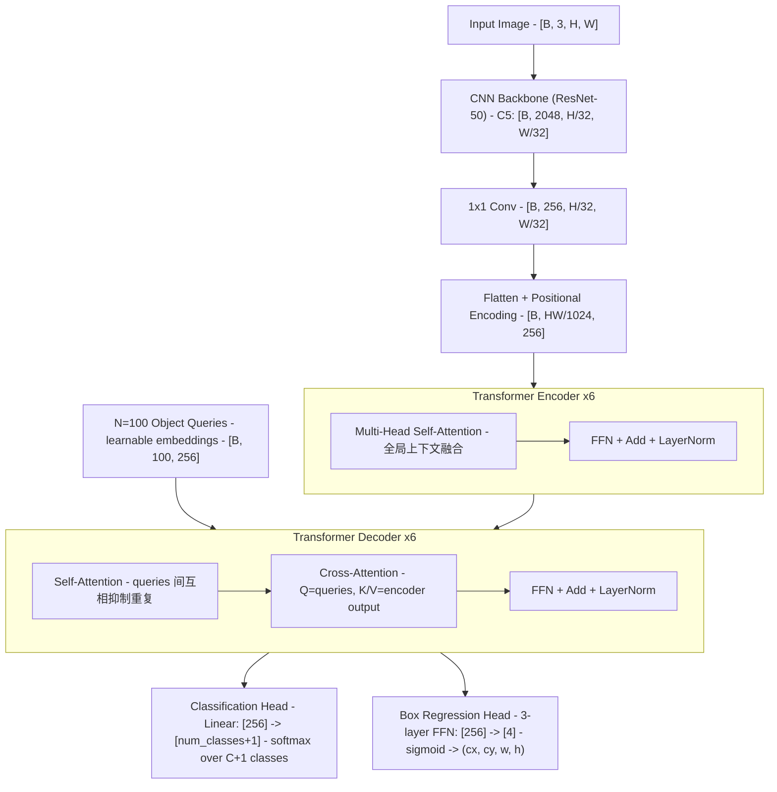

# DETR: End-to-End Object Detection with Transformers（Carion et al., ECCV 2020）

一句话总结：第一个把目标检测重新表述为**集合预测问题**的端到端框架——用 Transformer 编解码器 + 匈牙利二分匹配损失彻底消除 NMS 和 anchor 生成，在 COCO 上与 Faster R-CNN 持平，大目标显著更优，并可直接扩展到全景分割，开创了"检测即集合预测"范式。

**"检测即集合预测"的含义**：传统检测器（Faster R-CNN/YOLO）是"对每个位置/anchor 做分类和回归"→ 产生大量重叠预测 → 用 NMS 后处理去重。DETR 把问题重新定义为：模型直接输出一个**固定大小的预测集合**（100 个 slot），通过匈牙利匹配让每个 slot 负责最多一个目标。集合没有顺序，不会重复，所以不需要 NMS。这就是"集合预测"——输出是一个集合，不是一个列表。

## 基本信息

- 论文：End-to-End Object Detection with Transformers
- 作者：Nicolas Carion\*、Francisco Massa\*、Gabriel Synnaeve、Nicolas Usunier、Alexander Kirillov、Sergey Zagoruyko（\* 等同贡献）
- 机构：Facebook AI Research（FAIR）
- 发表：ECCV 2020
- arXiv：2005.12872v3（2020 年 5 月提交）
- 代码：https://github.com/facebookresearch/detr

---

## 核心问题

**目标检测的 pipeline 充满手工设计的后处理组件，妨碍端到端训练。**

传统检测框架（Faster R-CNN、YOLO 等）需要：
1. **Anchor 生成**：预定义大量候选框，高度依赖超参数（尺度、比例、步长）
2. **NMS（非极大值抑制，Non-Maximum Suppression）**：传统检测器对同一物体会产生多个重叠预测框（因为多个 anchor 都被激活），需要用 NMS 去重——按置信度排序，保留最高分的框，删除与它 IoU 超过阈值（如 0.5）的所有框，重复直到处理完。问题：NMS 是手工规则，不可微分，无法端到端训练；IoU 阈值需要调参；在密集场景中容易误删正确预测
3. **编码/解码 box 坐标**：预测框坐标相对于 anchor 的偏移，需要精心设计的编解码

这些组件导致：
- 训练目标（分类 + 回归损失）与推理流程（NMS）存在训练-推理不一致
- 超参数多（anchor 比例、NMS 阈值），针对数据集需要专门调优
- 难以真正端到端训练

**DETR 的核心洞察**：目标检测本质上是"给定图像，输出一个目标集合"——集合预测问题。用二分匹配把预测集合和真实集合一一对应，就可以消除重复预测，不再需要 NMS。

---

## 方法 / 核心机制

### 架构总览（Figure 2）



**关键参数**：默认 N=100；backbone 为 ResNet-50 或 ResNet-101；Transformer d=256，8 个注意力头，6 层 encoder + 6 层 decoder。

### 关键设计 1：二分匹配损失（Hungarian Loss）

**为什么需要匹配？**

假设图中有 3 个物体，模型输出 100 个预测 slot。问题：哪个 slot 该负责哪个物体？如果随机指定（比如"slot 1 负责最大的物体"），模型学到的分工会不稳定。DETR 的做法：每次前向传播都用**匈牙利算法**（一种 O(N³) 的二分图最优匹配算法）找到代价最小的一一对应关系。

**具体流程**：
1. 计算 100×3 的代价矩阵：每个 slot 对每个 GT 的匹配代价 = -分类概率 + L1 距离 + (1 - GIoU)
2. 用匈牙利算法求全局最优的一一匹配（3 个 slot 被选中，97 个 slot 分配给 ∅）
3. 按匹配结果计算损失：被选中的 3 个 slot 计算分类 + 回归 loss，其余 97 个只计算 ∅ 分类 loss

```
例：图中有 3 个物体（狗、猫、车），模型 100 个 slot
  匈牙利匹配结果：slot 7→狗, slot 23→猫, slot 51→车
  其余 97 个 slot 的 GT label = ∅（no object）
  loss = loss(slot7, 狗) + loss(slot23, 猫) + loss(slot51, 车) + Σ loss(其他, ∅)
```

**效果**：每个 GT box 被唯一一个预测 slot 负责，从根源消除重复预测，不再需要 NMS。

**与 anchor-based 方法的对比**：Faster R-CNN 用 IoU 阈值把 anchor 分为正/负样本（多个 anchor 可以匹配同一 GT），需要 NMS 去重；DETR 用二分匹配保证一一对应，不会重复。

### 关键设计 2：Transformer Encoder 的全局推理

Encoder 使用全图 self-attention，让每个 feature token 关注图像任意位置。

**"0 层 encoder → AP 降 3.9 点"是什么意思？** 消融实验：把 encoder 层数设为 0（即不用 encoder，backbone 特征直接送 decoder），AP 从 40.6 降到 36.7（-3.9）。说明 encoder 的全局 self-attention 对性能很关键——没有它，特征只有局部信息（来自 CNN 的感受野），无法做全局推理。大目标受影响最大（AP_L -6.0），因为大物体需要远距离像素间的关联。

**"分离重叠目标实例"是什么意思？** 论文 Figure 3 展示了训练好的 encoder 的 attention map：当图像中有两头紧挨的奶牛时，左边奶牛身上的像素的 attention 集中在左边奶牛上，右边奶牛身上的像素的 attention 集中在右边奶牛上——encoder 自发学会了"把属于同一实例的像素聚在一起"。这相当于在 encoder 阶段就完成了初步的实例分割，后续 decoder 的 object query 可以更容易地各自锁定一个目标。这也解释了为什么 DETR 在大物体上远超 Faster R-CNN（+7.8 AP_L）——全局 self-attention 天然擅长处理需要远距离关联的大物体。

### 关键设计 3：Object Queries 与 Decoder

N 个 object queries 是可学习的 embedding（nn.Embedding(100, 256)），随机初始化后由训练学习。

**为什么是 256 维而不是 4 维（框坐标）？** Object query 不是直接表示框的坐标——它是 decoder cross-attention 的 Q 向量。要和 encoder 输出（K/V，也是 256 维）做点积计算 attention weight，维度必须匹配。256 维让 query 有足够容量编码复杂的"搜索策略"：不只是"在哪里找"，还包括"找什么大小"、"找什么类别倾向"。最终的 4 维框坐标由 prediction head（3 层 FFN）从 256 维 decoder 输出中回归得到。

**怎么控制 100 个 query 覆盖全图？** 不需要显式控制——训练过程中匈牙利匹配迫使每个 query 负责不同的目标，queries 间的 **self-attention** 让它们互相"推开"避免重复——具体来说：100 个 query 之间做 self-attention，每个 query 能看到其他 99 个 query 正在关注什么。如果 query A 和 query B 都在看同一个物体，self-attention 让它们"协商"：一个留下，另一个转去关注别的区域。这是一种可学习的、可微分的去重机制，功能上等价于 NMS 但不需要手工阈值。论文 Figure 7 可视化了训练好的 100 个 query 各自偏好的位置/尺寸：有的 query 专门负责左上角的小物体，有的负责中间的大物体，自发形成了空间分工。这种分工是训练出来的，不需要手工设计。

- Decoder 用 self-attention（queries 间互相抑制重复）+ cross-attention（查询 encoder 输出）
- N 个 query 并行解码，非自回归
- **辅助损失（auxiliary decoding losses）**：每层 decoder 的输出都接一个共享的 prediction head 计算损失（而非只在最后一层计算）。好处：让浅层 decoder 也能直接受到监督信号，梯度不需要穿过 6 层才到达第 1 层，大幅加速收敛。效果：从 1 层到 6 层，AP 从 33.8 涨到 42.0（+8.2），说明深层 decoder 逐步精化预测

### 关键设计 4：Box 预测

FFN 预测头输出：
- 类别：softmax over C+1 classes（含 ∅）
- 框：归一化中心坐标 (cx, cy) + (w, h)，值域 [0,1]

损失 = L1 loss + GIoU loss。

**L1 loss 的问题**：L1 直接算坐标差的绝对值，对大框和小框一视同仁。一个 10 像素的偏差，对 20 像素的小框是灾难（50% 偏移），对 200 像素的大框无所谓（5% 偏移）——但 L1 给它们相同的惩罚。

**GIoU（Generalized IoU）loss 如何解决**：GIoU 衡量两个框的重叠程度，天然是尺度不变的。

```
IoU  = |A ∩ B| / |A ∪ B|                        # 交集/并集，值域 [0, 1]
GIoU = IoU - |C \ (A ∪ B)| / |C|                # C = 包含 A 和 B 的最小外接矩形
                                                  # 值域 [-1, 1]，越大越好
GIoU Loss = 1 - GIoU                             # 值域 [0, 2]，越小越好
```

GIoU 比普通 IoU 好在：即使两个框完全不重叠（IoU=0），GIoU 仍然能通过外接矩形给出梯度方向（告诉模型"往哪个方向移才能靠近"）。

**为什么两者都需要**：消融（Table 4）显示，仅 GIoU 损失 AP 降 0.7（GIoU 对框中心位置不够敏感），仅 L1 则大目标性能差。L1 提供精确的坐标回归信号，GIoU 提供尺度不变的重叠度量，互补。

---

## 模型输入详解

### Tensor Shape 变换全流程

```
阶段 0：输入图像
  shape: [B, 3, H, W]    e.g. [2, 3, 800, 1066]

        ↓  ResNet-50 backbone（stride 32）

阶段 1：backbone 输出
  C5: [B, 2048, H/32, W/32]    e.g. [2, 2048, 25, 34]

        ↓  1×1 conv 降通道

阶段 2：特征图
  [B, 256, H/32, W/32]         e.g. [2, 256, 25, 34]

        ↓  flatten(2) + transpose → 加 positional encoding

阶段 3：序列化特征（encoder 输入）
  [B, HW, 256]                 e.g. [2, 850, 256]
  HW = H/32 × W/32 = 25 × 34 = 850

        ↓  Encoder × 6（self-attention，O(HW²) 复杂度）

阶段 4：encoder 输出（memory）
  [B, HW, 256]                 shape 不变

        ↓  Decoder × 6（self-attn among queries + cross-attn to memory）
        ← 100 object queries: [B, 100, 256]

阶段 5：decoder 输出
  [B, 100, 256]                每个 query 对应一个预测 slot

        ↓  Prediction heads

阶段 6：输出
  cls: [B, 100, num_classes+1]  分类（含 ∅ = no object）
  box: [B, 100, 4]              归一化 (cx, cy, w, h) ∈ [0,1]
```

---

## PyTorch 伪代码（含 shape）

```python
import torch
import torch.nn as nn
import torch.nn.functional as F


# ─────────────────────────────────────────────
# 1. DETR 完整前向传播
# ─────────────────────────────────────────────
class DETR(nn.Module):
    def __init__(self, num_classes=91, d_model=256, nhead=8,
                 num_encoder_layers=6, num_decoder_layers=6,
                 num_queries=100):
        super().__init__()
        self.backbone = ResNet50()
        self.conv = nn.Conv2d(2048, d_model, 1)             # 降通道
        self.pos_embed = PositionalEncoding2D(d_model)       # 固定正弦位置编码
        self.encoder = nn.TransformerEncoder(
            nn.TransformerEncoderLayer(d_model, nhead, dim_feedforward=2048),
            num_layers=num_encoder_layers,
        )
        self.decoder = nn.TransformerDecoder(
            nn.TransformerDecoderLayer(d_model, nhead, dim_feedforward=2048),
            num_layers=num_decoder_layers,
        )
        self.query_embed = nn.Embedding(num_queries, d_model)  # 100 个可学习 query
        self.class_head = nn.Linear(d_model, num_classes + 1)  # +1 for ∅
        self.bbox_head = nn.Sequential(
            nn.Linear(d_model, d_model), nn.ReLU(),
            nn.Linear(d_model, d_model), nn.ReLU(),
            nn.Linear(d_model, 4),                             # (cx, cy, w, h)
        )

    def forward(self, images):
        # images: [B, 3, H, W]
        features = self.backbone(images)                       # C5: [B, 2048, H/32, W/32]
        src = self.conv(features)                              # [B, 256, H/32, W/32]
        B, C, H_f, W_f = src.shape

        # 位置编码 + 展平为序列
        pos = self.pos_embed(src)                              # [B, 256, H_f, W_f]
        src = src.flatten(2).permute(2, 0, 1)                 # [HW, B, 256]  (seq_len first)
        pos = pos.flatten(2).permute(2, 0, 1)                 # [HW, B, 256]

        # Encoder: self-attention over image features
        memory = self.encoder(src + pos)                       # [HW, B, 256]

        # Decoder: object queries cross-attend to memory
        queries = self.query_embed.weight.unsqueeze(1).expand(-1, B, -1)
        # queries: [100, B, 256]
        tgt = torch.zeros_like(queries)                        # decoder 输入初始化为 0

        # ⚠️ 为什么 pos 在 encoder 和 decoder 中都要加？
        # encoder 输入时加了 pos（src + pos），但经过 6 层 self-attention + FFN 后，
        # 位置信息会逐渐被"稀释"到内容特征中，不再是纯粹的位置信号。
        # decoder 做 cross-attention 时需要知道 memory 中每个 token 的空间位置
        # （才能让 object query "定位"到图像的某个区域），所以再加一次 pos。
        # 实际上 DETR 原始实现中，pos 在每层 attention 的 Q 和 K 上都会加，
        # 不只是在输入处加一次。这里的伪代码做了简化。
        hs = self.decoder(tgt + queries, memory + pos)         # [100, B, 256]
        hs = hs.permute(1, 0, 2)                              # [B, 100, 256]

        # Prediction heads（共享参数，应用于每个 query）
        cls_out = self.class_head(hs)                          # [B, 100, 92]
        box_out = self.bbox_head(hs).sigmoid()                 # [B, 100, 4]
        return cls_out, box_out


# ─────────────────────────────────────────────
# 2. 匈牙利匹配 + 损失
# ─────────────────────────────────────────────
def hungarian_loss(cls_pred, box_pred, targets):
    """
    cls_pred: [B, 100, 92]    box_pred: [B, 100, 4]
    targets:  list of dicts, each with 'labels' [n_gt] and 'boxes' [n_gt, 4]
    """
    # ① 计算匹配代价矩阵
    # cost = -p(c_i) + λ_L1 * L1(b_pred, b_gt) + λ_giou * (1 - GIoU(b_pred, b_gt))
    # 用 scipy.optimize.linear_sum_assignment 求最优匹配

    indices = hungarian_matcher(cls_pred, box_pred, targets)

    # ② 匹配后计算损失
    # 分类：CrossEntropy（∅ 类权重 ×0.1 下调，因为大部分 slot 预测 ∅）
    L_cls = F.cross_entropy(cls_pred_matched, target_labels,
                            weight=class_weights)   # ∅ weight = 0.1

    # 回归：L1 + GIoU（仅对匹配到 GT 的 slot）
    L_l1 = F.l1_loss(box_pred_matched, target_boxes)
    L_giou = 1 - generalized_iou(box_pred_matched, target_boxes)

    return L_cls + 5 * L_l1 + 2 * L_giou
```

---

## 训练 vs 推理差异

| 方面 | 训练 | 推理 |
|------|------|------|
| **输入** | 单张图像，短边 ≥ 480 随机 resize（数据增强）| 短边固定 800 |
| **Object queries** | 100 个 | 同 |
| **匈牙利匹配** | 每次前向计算最优匹配 | 不需要 |
| **辅助 loss** | 每层 decoder 都计算 loss（共 6 层，加速收敛）| 只取最后一层 |
| **∅ 类权重** | CrossEntropy 中 ∅ 权重 ×0.1（因 ~95 个 slot 预测 ∅）| — |
| **后处理** | — | 取置信度 > 阈值的预测框，**不需要 NMS** |
| **Epochs** | 300（baseline）/ 500（+，schedule ×3）| — |
| **Dropout** | 0.1（Transformer 内部）| 关闭 |

**推理输入**：单张 RGB 图像。

**推理输出**：最多 100 个预测，每个含 (类别概率分布, cx, cy, w, h)。大部分 slot 预测 ∅，取非 ∅ 且置信度高的即为检测结果。不需要 NMS。

---

## Loss 函数

| 组件 | Loss | 权重 | 说明 |
|------|------|------|------|
| 分类 | CrossEntropy | 1 | softmax over C+1 类（含 ∅），∅ 权重降为 0.1 |
| Box 回归 | L1 | 5 | 归一化坐标 (cx, cy, w, h)，对绝对尺寸敏感 |
| Box 回归 | GIoU | 2 | 尺度不变，解决 L1 对不同大小框的偏差 |
| 辅助 loss | 同上 | 同上 | 每层 decoder 输出都接预测头，加速收敛 |

匈牙利匹配的代价函数和损失函数使用相同组件（分类概率 + L1 + GIoU），但匹配代价中分类项取 -p(c_i)（越高代价越低）。

---

## 训练配置

| 参数 | 值 |
|------|-----|
| Backbone | ResNet-50（ImageNet 预训练）|
| Optimizer | AdamW，lr = 10⁻⁴，weight decay = 10⁻⁴ |
| Backbone lr | ×0.1 |
| LR schedule | 第 200 epoch 衰减 ×0.1（300 epoch 总训练）|
| Batch size | 4 images/GPU（具体 GPU 数未明确说明）|
| Object queries | N = 100 |
| Transformer | d=256, 8 heads, 6 enc + 6 dec layers, FFN dim=2048 |
| Dropout | 0.1 |
| 数据增强 | 短边随机 resize（480-800），随机裁剪到最大 1333 |
| 数据集 | COCO 2017 train（118k images），eval on val（5k）|

---

## 关键结果

### COCO 检测（Table 1，与 Faster R-CNN 对比）

| 模型 | GFLOPS/FPS | #params | AP | AP_S | AP_M | AP_L |
|---|---|---|---|---|---|---|
| Faster RCNN-R101-FPN+ | 246/20 | 60M | **44.0** | **27.2** | 48.1 | 56.0 |
| DETR | 86/28 | 41M | 42.0 | 20.5 | 45.8 | **61.1** |
| DETR-DC5 | 187/12 | 41M | 43.3 | 22.5 | 47.3 | 61.1 |
| DETR-R101 | 152/20 | 60M | 43.5 | 21.9 | 48.0 | **61.8** |
| DETR-DC5-R101 | 253/10 | 60M | **44.9** | 23.7 | **49.5** | **62.3** |

关键发现：
- **整体 AP 与 Faster R-CNN 持平**（42-44.9 AP）
- **AP_S（小目标）显著落后**：-5.5 AP（原始 DETR vs Faster RCNN-FPN）
- **AP_L（大目标）显著领先**：+7.8 AP（61.1 vs 52.0），来自全局 self-attention 的长程推理
- DETR 参数量更少（41M vs 42M），FPS 更快（28 vs 26）

### COCO 全景分割（Table 5）

| 模型 | Backbone | PQ | PQ_th（things）| PQ_st（stuff）|
|---|---|---|---|---|
| PanopticFPN++ | R101 | 44.1 | **51.0** | 36.3 |
| DETR | R50 | 43.4 | 48.2 | **36.3** |
| DETR-R101 | R101 | **45.1** | 50.5 | **37.0** |

- DETR 在 stuff（背景类）上大幅领先（归因于 encoder 的全局推理）
- 在 things（前景实例）上比 FPN 方法稍弱（mask AP 差 6-8 点）

### 关键消融结论

| 组件 | 去掉后的代价 |
|---|---|
| Encoder layers（0层）| AP -3.9，AP_L -6.0 |
| Decoder layers（1→6层）| AP +8.2，AP_50 +9.5 |
| FFN | AP -2.3 |
| 空间位置编码（encoder 中）| AP -1.3（minor） |
| 输出位置编码（object queries）| 必须保留，删掉 AP -7.8 |
| GIoU loss | AP -0.7（AP_M/AP_L 显著变差）|

---

## 局限性

1. **小目标性能差**：AP_S 比 Faster R-CNN 低 5.5 点；encoder self-attention 分辨率受 backbone stride 限制（/32），DETR-DC5 通过扩张卷积提高分辨率但计算量翻 2 倍（187 vs 86 GFLOPS）
2. **训练速度极慢**：需要 500 epochs（与 Faster R-CNN 的 3x schedule ~37 epochs 相比）；早期训练匹配不稳定，辅助损失缓解但不彻底
3. **全局 self-attention 计算复杂度高**：O((HW/1024)²) 对高分辨率输入代价大
4. **decoder 无法直接感知精细局部特征**：在 things 类的细粒度 mask 上弱于 FPN-based 方法

---

## 现状与影响

一句话定性：**DETR 开创了"检测即集合预测 + 端到端匹配"范式，是自 Faster R-CNN 以来目标检测最有影响力的架构革新之一；但其小目标弱、训练慢的缺陷由 Deformable DETR（2020）和后续工作迅速修补，DETR 本身已不是工程首选，却成为此后所有 detection transformer 系列的起点。**

- **直接后续**：
  - **Deformable DETR**（Zhu et al., ICLR 2021，arXiv:2010.04159）：用可变形注意力替换全局 self-attention，收敛从 500→50 epochs，小目标 AP 大幅提升，是工程中更常用的 baseline
  - **DAB-DETR / DN-DETR / [DINO](dino-2203.03605.md)**（2022–2023）：引入 anchor query、denoising training，DINO 的对比去噪+混合查询选择+Look Forward Twice 三项改进让 DETR 范式首次登顶 COCO 排行榜（63.3 AP test-dev），ICLR 2023
  - **Grounding DINO、RT-DETR**：把 DETR 范式推进到开放词汇检测和实时检测领域
- **对领域的核心贡献**：
  - 证明了 NMS 和 anchor 是可以被消除的 inductive bias，而非检测的必要条件
  - 二分匹配损失成为集合预测任务的标准方法（轨迹预测、关系检测等广泛借用）
  - Object query 机制被复用到 PointNet 之外的所有 query-based 检测头（包括 UniAD 等 E2E AD 系统）
- **在自动驾驶中的角色**：UniAD、BEV Transformer 等 AV 感知方案的检测头直接采用 DETR decoder + object query 设计，DETR 是这些方案的直接架构来源
- **被超越的维度**：Deformable DETR 在 COCO AP 和训练效率上全面超越原始 DETR；但 DETR 的架构简洁性和理论清晰度使其成为最常被引用的教学基准

---

## 和 wiki 内其他概念的关联

- **[Deformable DETR](deformable-detr-2010.04159.md)**：用 MSDeformAttn 替换 DETR 的标准 attention，解决收敛慢和小物体差的问题，收敛 10× 快，是 DETR 的直接工程升级
- **[BEVFormer](bevformer-2203.17270.md)**：BEVFormer 的检测头是 Deformable DETR 风格的 decoder + object queries，而 Deformable DETR 的 object query 机制直接来自 DETR
- **[FPN](fpn-1612.03144.md)**：DETR 不使用 FPN（只用单尺度 C5），这是其小物体差的原因之一；Deformable DETR 通过多尺度 attention 替代了 FPN
- [Transformer 架构](../20-concepts/transformer-architecture.md)：DETR 是 Encoder-Decoder Transformer 的典型工程应用——encoder 做全局上下文融合，decoder 用 cross-attention 从 encoder 输出中"查询"目标
- [Attention 直觉：Self/Cross/Local](../20-concepts/attention-intuition.md)：DETR decoder 是 cross-attention 的经典用例——object query 作为 Q，encoder 输出作为 K/V
- [UniAD](uniad-2212.10156.md)：UniAD 的感知/预测/规划模块全部用 query-based 设计串联，object query 机制直接来自 DETR
- [PointNet：点云深度学习](pointnet-1612.00593.md)：PointNet 用 max pooling 处理无序点集，DETR 用匈牙利匹配处理无序预测集合，都是"集合→集合"的置换不变映射
- [Perceiver](perceiver-2103.03206.md)：Perceiver 的 cross-attention bottleneck 与 DETR decoder 的 object query 设计哲学相似——都用小的可学习 query 集从大特征空间中提取信息

---

## 值得看的部分

- **Section 3.1（集合预测损失）**：匈牙利算法如何应用于目标检测的推导，是理解 DETR 为什么不需要 NMS 的核心，两页完整自洽
- **Figure 2（架构图）**：CNN → flatten → positional encoding → Transformer encoder → decoder with object queries → FFN → N 个并行预测，一图说清全流程
- **Figure 3（Encoder self-attention 可视化）**：训练好的 encoder 注意力图已经自发地把不同奶牛实例分离——直观解释为什么 encoder 对大目标如此重要
- **Figure 6（Decoder attention 可视化）**：decoder 专注于目标的四肢/头部等极值点，与 encoder 形成分工——"encoder 分离实例，decoder 定位边界"
- **Table 2（encoder 层数消融）**：0→3→6→12 层，AP 从 36.7→40.1→40.6→41.6，验证全局推理对性能的边际递增收益
- **Figure 7（object query 专化可视化）**：N=100 个 slot 各自学习了不同的位置/尺寸偏好，证明 object queries 之间有隐式分工（类似"负责扫描不同区域的探针"）
- **Section 4.4（全景分割扩展）**：用最小改动（加 mask head）复用 DETR 框架做全景分割，展示架构的可扩展性；"stuff 类明显超越 FPN"揭示了 transformer 全局推理在场景理解上的真正优势

---

## 附录：完整输入特征

### 输入图像

| 字段 | 值 |
|------|-----|
| 数量 | 1 张 |
| 分辨率 | 短边 resize 到 800（训练时随机 480-800），长边不超过 1333 |
| 通道 | RGB 3 通道 |
| 预处理 | ImageNet 均值/方差归一化 |

### Backbone 输出

| 字段 | 值 |
|------|-----|
| 层 | C5（ResNet 的 conv5 输出）|
| stride | 32 |
| 通道 | 2048（经 1×1 conv 降到 256）|
| 空间尺寸 | H/32 × W/32，e.g. 25×34 for 800×1066 输入 |

### Object Queries

| 字段 | 值 |
|------|-----|
| 数量 | N = 100 |
| 维度 | 256 |
| 类型 | nn.Embedding，可学习，每个 query 学习不同的位置/尺寸偏好 |
| 作用 | decoder 中作为 Q，cross-attend 到 encoder output（K/V）|

### 输出格式

| 字段 | Shape | 值域 | 含义 |
|------|-------|------|------|
| 类别 | [B, 100, 92] | softmax 概率 | 91 COCO 类 + 1 个 ∅ 类 |
| Box | [B, 100, 4] | [0, 1] | 归一化 (cx, cy, w, h)，相对于图像尺寸 |
