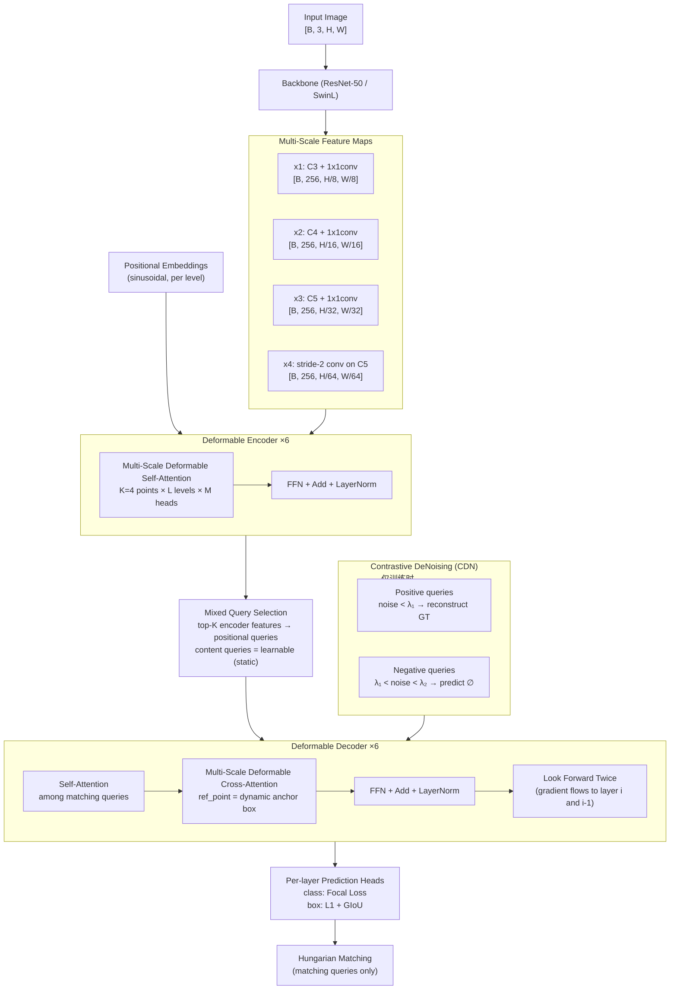

# DINO: DETR with Improved DeNoising Anchor Boxes（Zhang et al., ICLR 2023）

一句话总结：在 DN-DETR / DAB-DETR / Deformable DETR 基础上提出三项改进——**对比去噪训练（CDN）**、**混合查询选择（Mixed Query Selection）**、**Look Forward Twice**——ResNet-50 在 COCO 12 epoch 达 49.4 AP（比 DN-DETR +6.0），SwinL 预训练后 63.3 AP test-dev 成为**首个登顶 COCO 排行榜的端到端 Transformer 检测器**，IDEA Research + HKUST + Tsinghua，ICLR 2023。

## 基本信息

- 论文：DINO: DETR with Improved DeNoising Anchor Boxes for End-to-End Object Detection
- 作者：Hao Zhang\*、Feng Li\*、Shilong Liu\*、Lei Zhang†、Hang Su、Jun Zhu、Lionel M. Ni、Heung-Yeung Shum（\* 等同贡献，† 通讯）
- 机构：HKUST + Tsinghua + IDEA (International Digital Economy Academy)
- arXiv：2203.03605（2022-03，v4 2022-07）
- 发表：ICLR 2023（Poster）
- 代码：https://github.com/IDEA-Research/DINO

---

## 核心问题

**DETR 系列已经消除了 NMS/anchor，但在精度上仍落后于经典检测器——收敛慢、查询初始化差、去噪训练不充分是三大瓶颈。**

截至 2022 年，DETR 系列存在两个层面的问题：

| 层面 | 问题 | 此前进展 | DINO 之前的残留差距 |
|------|------|---------|-------------------|
| **性能** | DETR-like 最优模型（DN-DETR）在 COCO 12 epoch 仅 43.4 AP，远落后于 HTC++（50+）等经典检测器 | Deformable DETR 解决了收敛慢和小物体问题；DAB-DETR 引入动态 anchor query；DN-DETR 引入去噪训练 | DETR-like 从未在 COCO 排行榜超过经典检测器 |
| **可扩展性** | 没有 DETR-like 模型在大 backbone + 大数据集上验证过 | — | 不清楚 DETR 范式能否 scale |

**DINO 的核心立场**：前序工作（Deformable DETR / DAB-DETR / DN-DETR）的三个关键组件都还有优化空间——去噪训练可以加入对比信号、查询初始化可以混合使用编码器输出、box 精化的梯度传播可以更充分。三个改进叠加后，DETR-like 首次全面超越经典检测器。

---

## 方法 / 核心机制

### 架构总览（Figure 2）



DINO 的整体架构沿用 Deformable DETR（多尺度可变形 encoder-decoder），在此基础上引入三个新模块。

### 背景：DINO 的三个前作

理解 DINO 必须先知道它继承了什么：

1. **Deformable DETR**（Zhu et al., ICLR 2021）：用 MSDeformAttn 替换标准 attention，收敛从 500→50 epochs，支持多尺度特征图。还提出了 "two-stage" 变体（即 query selection）——从 encoder 输出选 top-K 特征作为初始 query。DINO 继承了可变形 attention 和 query selection 思路。

2. **DAB-DETR**（Liu et al., 2022）：把 DETR 的 object query 显式拆分为 positional part（4D anchor box: x, y, w, h）和 content part（语义特征）。4D anchor box 在每层 decoder 动态精化。DINO 继承了动态 anchor box 机制。

3. **DN-DETR**（Li et al., 2022）：在 decoder 中引入 denoising 分支——给 GT box 加噪声后送入 decoder，训练模型还原原始 GT。DN loss 稳定了匈牙利匹配的不确定性，加速收敛。DINO 在此基础上改为对比去噪。

### 改进 1：对比去噪训练（Contrastive DeNoising, CDN）

**DN-DETR 的局限**：DN-DETR 只有正样本——给 GT box 加小噪声（|Δx| < λ/2 等），训练模型还原。但它不会教模型"拒绝"远离 GT 的 anchor，导致两个问题：
1. 密集场景中多个 anchor 靠近同一目标时，模型难以选择，产生重复预测
2. 离 GT 较远的 anchor 也可能被匈牙利匹配选中

**CDN 的做法**：对每个 GT box 同时生成正样本和负样本：
- **正样本**：噪声幅度 < λ₁（内圈），训练目标 = 还原 GT box（L1 + GIoU + Focal Loss）
- **负样本**：噪声幅度在 λ₁ 和 λ₂ 之间（外圈），训练目标 = 预测 "no object"（Focal Loss）

```
对每个 GT box b = (x, y, w, h):
  正样本: Δx ~ Uniform(-λ₁·w/2, λ₁·w/2), ... → loss = reconstruction
  负样本: λ₁ < |Δ| < λ₂ → loss = classify as "no object"

λ₂ 取较小值，确保负样本是 hard negatives（靠近 GT 但不够近）
```

**效果**：CDN 在小物体上改善最显著——12 epoch AP_S +1.3（Figure 4c），因为小物体的 anchor 更容易混淆。ATD(100) 指标（anchor 距 GT 的 top-K L1 距离均值）在 CDN 下显著下降。

### 改进 2：混合查询选择（Mixed Query Selection）

DETR 系列对 decoder query 初始化有三种策略（Figure 5）：

| 策略 | 谁用 | positional query | content query |
|------|------|-----------------|---------------|
| (a) Static | DETR, DN-DETR | learnable embedding | all zeros / learnable |
| (b) Pure QS | Deformable DETR two-stage | encoder top-K → linear | encoder top-K → linear |
| (c) **Mixed QS (DINO)** | DINO | **encoder top-K → anchor box** | **learnable (static)** |

**Pure Query Selection 的问题**：Deformable DETR 的 "two-stage" 用 encoder 的 top-K 特征同时初始化 positional 和 content query。但 encoder 特征是初步的——一个特征可能覆盖多个物体或只覆盖部分物体，直接当 content query 会误导 decoder。

**Mixed QS 的做法**：只用 top-K encoder 特征初始化 anchor box（positional query），content query 保持 learnable（每次推理相同的初始化）。这样：
- positional query 从 encoder 获得良好的空间先验（"在哪里找"）
- content query 由 decoder 自己通过 cross-attention 逐层填充（"找什么"）
- 第一层 decoder 的 content query 被迫只关注空间先验，避免被初步 encoder 特征误导

### 改进 3：Look Forward Twice

**背景**：在 Deformable DETR 中，每层 decoder 输出一个 box offset Δb_i，加到输入 anchor b_{i-1} 上得到预测 b'_i = Update(b_{i-1}, Δb_i)。辅助 loss 在每层计算。但梯度从 b'_i 的 loss 只能影响 layer i 的参数（因为 b_{i-1} 是 detached 的）。这叫 "Look Forward Once"。

**Look Forward Twice**：让 layer i 的 loss 也能通过 b'_i 影响 layer (i-1) 的参数。具体做法：

```
# Look Forward Once (Deformable DETR):
Δb_i = Layer_i(b_{i-1}, ...)
b'_i = Update(b_{i-1}, Δb_i)          # b_{i-1} detached from layer i-1
b_i = Detach(b'_i)                      # 传给 layer i+1
b_i^(pred) = Update(b'_{i-1}, Δb_i)   # ← 不存在

# Look Forward Twice (DINO):
Δb_i = Layer_i(b_{i-1}, ...)
b'_i = Update(b_{i-1}, Δb_i)
b_i = Detach(b'_i)                      # 传给 layer i+1 (仍然 detach)
b_i^(pred) = Update(b'_{i-1}, Δb_i)   # ← 用未 detach 的 b'_{i-1} + Δb_i 作为辅助 loss 的预测
```

关键区别：`b_i^(pred)` 同时依赖 layer i 的 Δb_i 和 layer (i-1) 的 b'_{i-1}（未 detach），所以辅助 loss 的梯度能同时优化两层的参数。"Twice"指每个 Δb_i 被用于更新两个预测——自己层的和下一层的。

**效果**：+0.4 AP（Table 4, Row 5 vs Row 4）。

---

## 架构伪代码（PyTorch 风格）

```python
import torch
import torch.nn as nn
import torch.nn.functional as F


class DINO(nn.Module):
    """DINO: DETR with Improved DeNoising Anchor Boxes."""

    def __init__(self, num_classes=80, d_model=256, nhead=8,
                 num_encoder_layers=6, num_decoder_layers=6,
                 num_queries=900, num_feature_levels=4):
        super().__init__()
        self.backbone = ResNet50()
        # 多尺度投影: C3/C4/C5 → 256-d, 加一层 stride-2 conv
        self.input_proj = nn.ModuleList([
            nn.Conv2d(c, d_model, 1) for c in [512, 1024, 2048]
        ] + [nn.Sequential(nn.Conv2d(2048, d_model, 3, stride=2, padding=1))])

        self.encoder = DeformableTransformerEncoder(
            d_model, nhead, num_encoder_layers, num_feature_levels)
        self.decoder = DeformableTransformerDecoder(
            d_model, nhead, num_decoder_layers, num_feature_levels)

        # Mixed Query Selection: content queries 是可学习的
        self.content_queries = nn.Embedding(num_queries, d_model)

        # 每层 decoder 共享 prediction head 结构，但参数独立
        self.class_head = nn.ModuleList([
            nn.Linear(d_model, num_classes) for _ in range(num_decoder_layers)
        ])
        self.bbox_head = nn.ModuleList([
            MLP(d_model, d_model, 4, num_layers=3)
            for _ in range(num_decoder_layers)
        ])

        self.num_queries = num_queries

    def forward(self, images, targets=None):
        # images: [B, 3, H, W]

        # --- Backbone + Multi-scale projection ---
        C3, C4, C5 = self.backbone(images)
        srcs = [proj(feat) for proj, feat in
                zip(self.input_proj[:3], [C3, C4, C5])]
        srcs.append(self.input_proj[3](C5))
        # srcs: list of 4 tensors, shapes:
        #   [B, 256, H/8, W/8], [B, 256, H/16, W/16],
        #   [B, 256, H/32, W/32], [B, 256, H/64, W/64]

        # --- Deformable Encoder ---
        memory = self.encoder(srcs)  # [B, ΣH_lW_l, 256]

        # --- Mixed Query Selection ---
        # 从 encoder 最后一层 top-K 特征初始化 positional queries (anchor boxes)
        enc_cls = self.class_head[-1](memory)     # [B, ΣH_lW_l, num_classes]
        topk_scores, topk_idx = enc_cls.max(-1)[0].topk(self.num_queries)
        # topk_idx: [B, 900]

        # positional queries: top-K 特征位置 → 4D anchor box
        init_anchors = self._idx_to_anchor(topk_idx, srcs)  # [B, 900, 4]
        # content queries: learnable, 不依赖图像
        content_q = self.content_queries.weight.unsqueeze(0).expand(
            images.size(0), -1, -1)  # [B, 900, 256]

        # --- CDN queries (仅训练) ---
        if self.training and targets is not None:
            dn_queries, dn_anchors, dn_meta = self._prepare_cdn(
                targets, init_anchors)
            # dn_queries: [B, num_dn, 256]
            # dn_anchors: [B, num_dn, 4]
            # 拼接到 matching queries 前面
            content_q = torch.cat([dn_queries, content_q], dim=1)
            init_anchors = torch.cat([dn_anchors, init_anchors], dim=1)

        # --- Deformable Decoder with Look Forward Twice ---
        all_cls, all_box = [], []
        anchors = init_anchors
        for i, layer in enumerate(self.decoder.layers):
            # layer 内部: self-attn → deformable cross-attn → FFN
            content_q = layer(content_q, memory, ref_points=anchors)
            # content_q: [B, N, 256]

            delta_box = self.bbox_head[i](content_q).sigmoid()  # [B, N, 4]
            cls_out = self.class_head[i](content_q)             # [B, N, num_classes]

            # Look Forward Twice: 预测用未 detach 的 anchors
            refined = self._update_anchor(anchors, delta_box)   # [B, N, 4]
            all_box.append(refined)
            all_cls.append(cls_out)

            # 传给下一层的 anchors 需要 detach
            anchors = refined.detach()

        return all_cls, all_box  # 每层 decoder 的输出，用于辅助 loss

    def _update_anchor(self, anchor, delta):
        """inverse_sigmoid(anchor) + delta → sigmoid → refined anchor."""
        return (inverse_sigmoid(anchor) + delta).sigmoid()
```

### 完整前向传播示例

```python
model = DINO(num_classes=80)
images = torch.randn(2, 3, 800, 1066)  # batch=2

# 训练时
targets = [{'labels': torch.tensor([0, 15]), 'boxes': torch.tensor([[0.5, 0.5, 0.3, 0.4],
                                                                      [0.2, 0.3, 0.1, 0.15]])}]
all_cls, all_box = model(images, targets)
# all_cls: list of 6 × [2, 900+num_dn, 80]
# all_box: list of 6 × [2, 900+num_dn, 4]

# 推理时
all_cls, all_box = model(images)
# all_cls: list of 6 × [2, 900, 80]  — 取最后一层
# all_box: list of 6 × [2, 900, 4]
cls_final = all_cls[-1].sigmoid()  # [2, 900, 80]
box_final = all_box[-1]            # [2, 900, 4] — (cx, cy, w, h) ∈ [0, 1]
# 取 score > threshold 的预测作为最终检测结果（无 NMS）
```

---

## 训练 vs 推理差异

| 方面 | 训练 | 推理 |
|------|------|------|
| **CDN 分支** | 有：每个 GT 生成正+负 denoising queries | 无 |
| **Decoder 输入** | matching queries (900) + CDN queries | matching queries (900) only |
| **Attention mask** | CDN queries 与 matching queries 之间加 attention mask 隔离 | 无需 mask |
| **辅助 loss** | 每层 decoder 都计算 loss（Look Forward Twice） | 只取最后一层 |
| **匈牙利匹配** | 对 matching queries 的输出做匹配 | 不需要 |
| **后处理** | — | score > threshold，**不需要 NMS** |
| **Epochs** | 12 / 24 / 36（1× / 2× / 3× schedule）| — |

**推理输入**：单张 RGB 图像。

**推理输出**：最多 900 个预测，每个含 (类别概率, cx, cy, w, h)。取高置信度非背景预测为检测结果。

**仅训练时存在的模块**：CDN 分支（正/负 denoising queries）、attention mask 隔离 CDN 与 matching queries、辅助 loss（中间 decoder 层）。

**参数来源**：backbone 使用 ImageNet 预训练权重；SwinL 版本额外在 Objects365 上预训练检测头。

---

## Loss 函数

### Matching 部分（900 queries）

| 组件 | Loss | 说明 |
|------|------|------|
| 分类 | **Focal Loss** | 解决正负样本极度不均衡（~900 中只有几个匹配到 GT） |
| Box 回归 | **L1 + GIoU** | L1 提供精确坐标信号，GIoU 提供尺度不变的重叠度量 |
| 匹配代价 | -score + λ_L1·L1 + λ_GIoU·(1 - GIoU) | 匈牙利算法最小化全局代价 |
| 辅助 loss | 同上 | 每层 decoder 输出都计算，Look Forward Twice 传递梯度 |

### CDN 部分（仅训练）

| 样本类型 | Box Loss | Classification Loss |
|---------|----------|-------------------|
| 正样本（noise < λ₁）| L1 + GIoU（还原 GT）| Focal Loss（预测正确类别）|
| 负样本（λ₁ < noise < λ₂）| 无 | Focal Loss（预测 "no object"）|

**与 DETR 的关键区别**：DETR 用 CrossEntropy（C+1 类含 ∅），DINO 用 Focal Loss（二值分类各类别独立），不需要 ∅ 类权重下调。

**与 DN-DETR 的关键区别**：DN-DETR 只有正样本去噪；DINO 的 CDN 加入负样本，教模型主动拒绝远离 GT 的 anchor。

---

## 训练配置

| 参数 | ResNet-50 | SwinL |
|------|-----------|-------|
| Backbone | ResNet-50（ImageNet-1K 预训练）| SwinL（ImageNet-22K 预训练）|
| 预训练数据 | — | Objects365（1.7M images）|
| 训练数据 | COCO train2017（118K images）| COCO train2017 |
| Optimizer | AdamW | AdamW |
| LR schedule | 12 / 24 / 36 epoch（step decay）| 12 / 24 / 36 epoch |
| Batch size | 2 images/GPU × 8 A100 GPU = 16 total | 同 |
| GPU 显存 | 16 GB per GPU | — |
| 训练时间 | ~55 min/epoch（8× A100）| — |
| Feature levels | 4（C3/C4/C5 + stride-2）或 5 | 4 或 5 |
| Queries | 900（matching part）| 900 |
| CDN groups | 多组（正+负各 n 个/组）| 同 |
| Denoising queries | 100 CDN query pairs（100 正 + 100 负 = 200 queries）| 同 |
| DN λ₁, λ₂ | λ₁ < λ₂（具体值见 Appendix D）| 同 |

---

## 关键结果

### COCO val2017 — 12 epoch（Table 1, ResNet-50）

| 模型 | Epochs | AP | AP₅₀ | AP₇₅ | AP_S | AP_M | AP_L | Params | GFLOPS |
|------|--------|-----|------|------|------|------|------|--------|--------|
| Faster R-CNN (5scale) | 12 | 37.9 | 58.8 | 41.1 | 22.4 | 41.1 | 49.1 | 40M | 207 |
| DETR (DC5) | 12 | 15.5 | 29.4 | 14.5 | 4.3 | 15.1 | 26.7 | 41M | 225 |
| Deformable DETR (4scale) | 12 | 41.1 | — | — | — | — | — | 40M | 196 |
| DAB-DETR (DC5)† | 12 | 38.9 | 60.3 | 39.8 | 19.2 | 40.9 | 55.4 | 44M | 256 |
| DN-Deformable-DETR (4scale)† | 12 | 43.4 | 61.9 | 47.2 | 24.8 | 46.8 | 59.4 | 48M | 265 |
| **DINO-4scale** | **12** | **49.0**(+5.6) | **66.6** | **53.5** | **32.0**(+7.2) | **52.3** | **63.0** | 47M | 279 |
| **DINO-5scale** | **12** | **49.4**(+6.0) | **66.9** | **53.8** | **32.3**(+7.5) | **52.5** | **63.9** | 47M | 860 |

关键发现：
- **比 DN-DETR +6.0 AP**（12 epoch），是 DETR 系列单次最大跳跃
- **小物体 +7.5 AP**（AP_S 24.8 → 32.3），CDN 贡献显著
- 参数量和计算量与 DN-DETR 几乎相同（47M vs 48M）

### COCO val2017 — 24/36 epoch（Table 2）

| 模型 | Epochs | AP | AP₅₀ | AP₇₅ | AP_S | AP_M | AP_L |
|------|--------|-----|------|------|------|------|------|
| Deformable DETR | 50 | 46.2 | 65.2 | 50.0 | 28.8 | 49.2 | 61.7 |
| DN-Deformable-DETR | 50 | 48.6 | 67.4 | 52.7 | 31.0 | 52.0 | 63.7 |
| **DINO-4scale** | **24** | **50.4**(+1.8) | 68.3 | 54.8 | 33.3 | 53.7 | 64.8 |
| **DINO-5scale** | **24** | **51.3**(+2.7) | 69.1 | 56.0 | 34.5 | 54.2 | 65.8 |
| DINO-4scale | 36 | 50.9(+2.3) | 69.0 | 55.3 | 34.6 | 54.1 | 64.6 |
| DINO-5scale | 36 | **51.2**(+2.6) | 69.0 | 55.8 | 35.0 | 54.3 | 65.3 |

### COCO test-dev — SOTA 对比（Table 3, SwinL backbone）

| 方法 | Params | Backbone 预训练 | 检测预训练 | End-to-end | val2017 AP | test-dev AP |
|------|--------|----------------|----------|-----------|-----------|------------|
| SwinV2-G | 3.0B | IN-22K-ext-70M | — | ✗ | 61.9 | 63.1 |
| Florence | ≥ 637M | FLD-900M | FLD-9M | ✗ | — | 62.4 |
| **DINO-SwinL** | **218M** | **IN-22K-4M** | **O365** | **✓** | **63.1 → 63.2** | **63.2 → 63.3** |

**DINO 首次让端到端 Transformer 检测器登顶 COCO 排行榜**，且模型仅 218M 参数（SwinV2-G 的 1/15）、预训练数据仅 O365 1.7M（Florence 的 1/5）。

### 训练效率（Table 5, ResNet-50, 8× A100）

| 模型 | Batch/GPU | 时间/epoch | GPU 显存 | Epochs | AP |
|------|-----------|-----------|---------|--------|-----|
| Faster R-CNN | 8 | ~60 min | 13 GB | 108 | 42.0 |
| DETR | 8 | ~16 min | 26 GB | 300 | 41.2 |
| Deformable DETR | 2 | ~55 min | 16 GB | 50 | 45.4 |
| **DINO** | **2** | **~55 min** | **16 GB** | **12** | **47.9** |

DINO 与 Deformable DETR 训练效率相同（每 epoch 时间和显存一致），但 12 epoch 已超越 Deformable DETR 50 epoch 的结果。

---

## 消融实验（Table 4, Table 6–7）

### 三项创新的逐步叠加（Table 4, ResNet-50, 12 epoch）

| Row | 模型 | QS 类型 | CDN | LFT | AP | AP₅₀ | AP_S | AP_M | AP_L |
|-----|------|---------|-----|-----|-----|------|------|------|------|
| 1 | DN-DETR | No | No | No | 43.4 | 61.9 | 24.8 | 46.8 | 59.4 |
| 2 | Optimized DN-DETR | No | No | No | 44.9 | 62.8 | 26.9 | 48.2 | 60.0 |
| 3 | Strong baseline (pure QS) | Pure | No | No | 46.5 | 64.2 | 29.6 | 49.8 | 61.0 |
| 4 | Row3 + mixed QS | **Mixed** | No | No | 47.0 | 64.2 | 31.1 | 50.1 | 61.5 |
| 5 | Row4 + LFT | Mixed | No | **✓** | 47.4 | 64.8 | 29.9 | 50.8 | 61.9 |
| 6 | **DINO (Row5 + CDN)** | **Mixed** | **✓** | **✓** | **47.9** | **65.3** | **31.2** | **50.9** | **61.9** |

每项贡献：Mixed QS +0.5、LFT +0.4、CDN +0.5（总计 +1.4 over strong baseline）。

### Encoder/Decoder 层数（Table 6, 12 epoch）

| Encoder/Decoder | 6/6 | 4/6 | 3/6 | 2/6 | 6/4 | 6/2 | 4/4 | 2/4 | 2/2 |
|-----------------|-----|-----|-----|-----|-----|-----|-----|-----|-----|
| AP | 47.4 | 46.2 | 45.8 | 45.4 | 46.0 | 44.4 | 44.1 | 41.2 | — |

Decoder 层数对性能影响大于 encoder——因为 DINO 的 box 逐层精化高度依赖多层 decoder。

### CDN query 数量（Table 7）

| DN queries | 100 CDN | 1000 DN | 200 DN | 100 DN | 50 DN | 10 DN | No DN |
|-----------|---------|---------|--------|--------|-------|-------|-------|
| AP | **47.9** | 47.6 | 47.4 | 47.4 | 46.7 | 46.0 | 45.1 |

100 CDN query pairs（200 queries total）效果最佳。注意 100 CDN 含正+负各 100，而 1000 DN 是纯正样本——CDN 100 对 > DN 1000，说明对比信号比单纯增加正样本更有效。

---

## 局限性

1. **仍依赖 Deformable Attention**：DINO 的核心效率来自 MSDeformAttn（Zhu et al., ICLR 2021），自身贡献主要在训练策略层面（CDN/MQS/LFT），而非注意力机制本身的改进
2. **CDN 的超参数**：λ₁ 和 λ₂ 需要调整，论文提到 "usually adopt small λ₂"，但具体敏感度分析有限
3. **SwinL 结果依赖 Objects365 预训练**：63.3 AP 需要先在 Objects365（1.7M images）上预训练，纯 COCO 训练无法达到此水平
4. **没有与 YOLO 系列的推理速度对比**：论文关注精度而非实时性，FPS 数据仅在 Table 1 部分模型给出

---

## 现状与影响

一句话定性：**DINO 是 DETR 范式从"promising but inferior"到"SOTA"的转折点——证明了端到端 Transformer 检测器可以全面超越经典检测器，其技术（CDN/MQS/LFT）被后续工作广泛继承，但 DINO 本身已被 Grounding DINO / RT-DETR / Co-DETR 等工作在各维度超越，"DINO"这个名字更多作为后续模型的前缀出现。**

- **当时的贡献（2022–2023）**：
  - 首个在 COCO test-dev 超越所有经典检测器的端到端 Transformer 模型
  - 终结了 "DETR-like models are inferior to classical detectors" 的论调
  - 三项技术（CDN/MQS/LFT）成为后续 DETR 变体的标准组件

- **直接后续**：
  - **Grounding DINO**（Liu et al., ECCV 2024）：把 DINO 扩展到开放集检测（open-set detection），接受文本 prompt，成为 SAM 等基础模型的检测前端
  - **RT-DETR**（Zhao et al., CVPR 2024）：在 DINO 基础上优化推理速度，首个实时 DETR
  - **Co-DETR**（Zong et al., ICCV 2023）：用协同训练进一步提升 DINO 精度
  - **DINO 的组件被 BEV 感知方法采用**：BEVFormer v2 等方法的检测头沿用 DINO 风格的 decoder

- **2026 年视角**：
  - CDN 的核心思想（对比信号辅助匹配）仍活跃于新的检测 Transformer 中
  - DINO 本身不再是工程首选——Grounding DINO / RT-DETR 在开放性和速度上更实用
  - 但在 COCO 封闭集检测评测中，DINO 仍是重要 baseline
  - 核心贡献 vs 实现：DINO 的贡献更偏训练策略（CDN/LFT），这些策略可以移植到其他架构，与具体实现较为分离

---

## 和 wiki 内其他概念的关联

- **[DETR](detr-2005.12872.md)**：DINO 的始祖——集合预测 + 匈牙利匹配消除 NMS/anchor 的范式由 DETR 开创，DINO 是该谱系的第四代（DETR → Deformable DETR → DAB-DETR/DN-DETR → DINO）
- **[Deformable DETR](deformable-detr-2010.04159.md)**：DINO 的直接基线——MSDeformAttn、多尺度特征图、query selection 都继承自 Deformable DETR，DINO 在此基础上加 CDN/MQS/LFT
- **[FPN](fpn-1612.03144.md)**：DINO 不使用 FPN——多尺度特征直接由 backbone + 1×1 conv 提供，MSDeformAttn 天然在多尺度上采样，替代了 FPN 的 top-down 融合
- **[BEVFormer](bevformer-2203.17270.md)**：BEVFormer 的检测头采用 Deformable DETR 风格的 decoder + object queries，DINO 的改进（尤其 CDN 和 LFT）可直接迁移
- **[匈牙利算法](../20-concepts/hungarian-algorithm.md)**：DINO 的 matching part 仍使用匈牙利二分匹配分配预测 slot，CDN 部分不需要匹配（GT 直接指定）
- **[UniAD](uniad-2212.10156.md)**：UniAD 的感知模块采用 DETR decoder + object query 设计，DINO 的训练技巧（CDN 等）可增强此类模块

---

## 值得看的部分

- **Section 3.3（Contrastive Denoising Training）+ Figure 3**：CDN 正负样本的同心圆图示非常直观——内圈正样本还原 GT，外圈负样本预测 ∅，一页纸说清核心创新
- **Figure 5（三种查询初始化对比）**：Static / Pure QS / Mixed QS 的三格对比图，一眼看懂 DINO 为什么只初始化 positional query
- **Figure 6（Look Forward Once vs Twice）**：梯度流向图，清楚展示为什么 "Twice" 能让 layer i 的 loss 也优化 layer i-1 的参数
- **Table 4（消融实验）**：6 行渐进叠加，从 DN-DETR 43.4 → DINO 47.9，每项贡献可量化
- **Table 3（SOTA 对比）**：DINO 用 1/15 的参数、1/5 的预训练数据超越所有经典检测器，是论文的高潮结论
- **Figure 4（ATD 和 AP_S 曲线）**：CDN 对小物体改善的定量证据，ATD 指标定义值得关注

---

## 附录：完整输入特征

### 输入图像

| 字段 | 值 |
|------|-----|
| 数量 | 1 张 |
| 分辨率 | 短边 resize（COCO 标准增强），长边不超过 1333 |
| 通道 | RGB 3 通道 |
| 预处理 | ImageNet 均值/方差归一化 |

### Backbone 输出（Multi-scale）

| 层级 | 来源 | Stride | 通道 | 空间尺寸（以 800×1066 为例）|
|------|------|--------|------|--------------------------|
| x1 | C3 + 1×1 conv | 8 | 256 | 100 × 134 |
| x2 | C4 + 1×1 conv | 16 | 256 | 50 × 67 |
| x3 | C5 + 1×1 conv | 32 | 256 | 25 × 34 |
| x4 | C5 + 3×3 stride-2 conv | 64 | 256 | 13 × 17 |

4-scale 总 token 数：100×134 + 50×67 + 25×34 + 13×17 = 13,400 + 3,350 + 850 + 221 ≈ **17,821**

### Decoder Queries

| 字段 | 值 |
|------|-----|
| Matching queries | 900 |
| CDN queries（训练）| 2 × n × num_cdn_groups（每个 GT 产生 1 正 + 1 负，使用多个 CDN group）|
| Positional query | 4D anchor box (cx, cy, w, h)，由 Mixed QS 从 encoder top-K 初始化 |
| Content query | 256-d，learnable embedding，不依赖图像 |

### 输出格式

| 字段 | Shape | 值域 | 含义 |
|------|-------|------|------|
| 类别 | [B, 900, 80] | sigmoid 概率（每类独立）| 80 COCO 类（无 ∅ 类，用 Focal Loss）|
| Box | [B, 900, 4] | [0, 1] | 归一化 (cx, cy, w, h)，相对于图像尺寸 |
