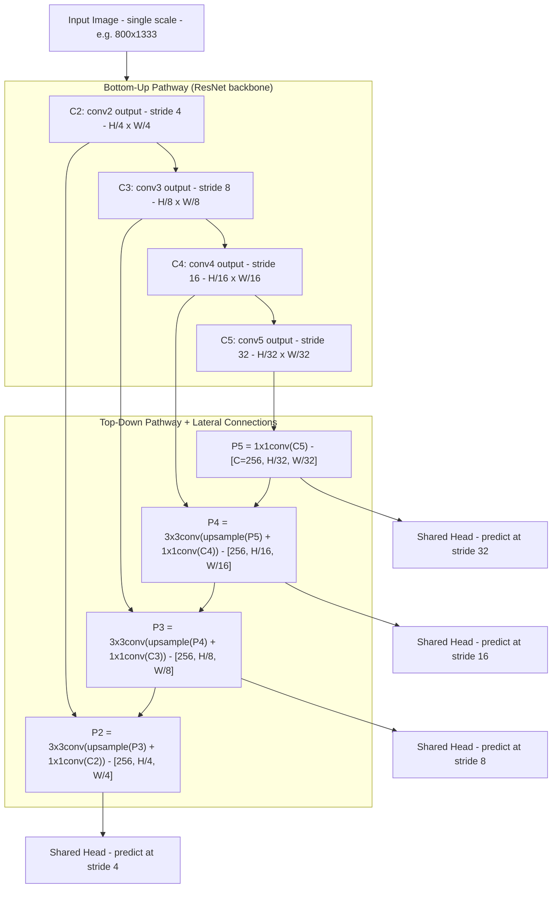

# FPN: Feature Pyramid Networks for Object Detection（Lin et al., CVPR 2017）

一句话总结：FPN 用 top-down 路径 + lateral connections 把 CNN backbone 不同层的特征融合成统一通道数、多尺度、语义强的特征金字塔，用单张图像取代耗时的图像金字塔，COCO 检测 AP 36.2（SOTA），是后续几乎所有目标检测和 BEV 感知方法的标准特征提取器，Facebook AI Research (FAIR)，CVPR 2017。

## 基本信息

- 论文：Feature Pyramid Networks for Object Detection
- 作者：Tsung-Yi Lin、Piotr Dollár、Ross Girshick、Kaiming He、Bharath Hariharan、Serge Belongie
- 机构：Facebook AI Research (FAIR) + Cornell University
- arXiv：1612.03144（2016-12）
- 发表：CVPR 2017
- 代码：基于 py-faster-rcnn / Caffe2 实现

---

## 核心问题

**如何用单张输入图像生成既有高分辨率又有强语义的多尺度特征？**

目标检测需要处理不同尺度的物体。之前的方法各有缺陷：

| 方法 | 做法 | 缺陷 |
|------|------|------|
| 图像金字塔（a）| 对输入图像缩放多次，每个尺度独立提特征 | 推理慢 4× 以上，训练端到端不可行（显存）|
| 单尺度特征（b）| 只用 backbone 最后一层 | 丢失高分辨率信息，小物体检测差 |
| 直接用 backbone 各层（c）| SSD 风格，直接在各层预测 | 浅层语义弱，深层分辨率低，语义鸿沟 |

**FPN 的核心立场**：backbone 自身就有多尺度的金字塔结构（分辨率逐层降低），但各层之间存在**语义鸿沟**（浅层语义弱、深层语义强）。通过 top-down 路径把高层语义信息传回浅层，再加 lateral connections 保留精确位置信息，就能生成**所有尺度都语义强**的特征金字塔。

---

## 方法 / 核心机制

### 架构总览



### Bottom-Up Pathway（自底向上）

标准 backbone（ResNet）的前向传播。每个 stage 的最后一个 residual block 的输出作为该层的特征：

- **C2**：conv2 输出，stride 4（原图的 1/4 分辨率）
- **C3**：conv3 输出，stride 8
- **C4**：conv4 输出，stride 16
- **C5**：conv5 输出，stride 32

不使用 conv1（C1），因为内存占用太大且语义太弱。

### Top-Down Pathway + Lateral Connections（自顶向下 + 横向连接）

核心操作分三步，从 C5 开始向 C2 逐层迭代：

1. **1×1 conv（lateral connection）**：把 bottom-up 特征通道数降为 d=256
2. **2× nearest neighbor upsample**：把上一层 top-down 特征放大到同分辨率
3. **逐元素相加**：把 lateral 特征和 upsampled 特征合并
4. **3×3 conv**：消除上采样的混叠（aliasing），生成最终输出 P_k

```
P5 = conv1x1(C5)                              # [256, H/32, W/32]  顶层直接降通道
P4 = conv3x3(upsample(P5) + conv1x1(C4))      # [256, H/16, W/16]
P3 = conv3x3(upsample(P4) + conv1x1(C3))      # [256, H/8,  W/8]
P2 = conv3x3(upsample(P3) + conv1x1(C2))      # [256, H/4,  W/4]
```

**设计要点**：
- 所有输出 {P2, P3, P4, P5} 通道数统一为 d=256
- 1×1 和 3×3 conv 之后**不加非线性激活**（ReLU），论文实验发现对结果影响很小
- 所有 P_k 共享同一个 prediction head（参数共享），这是因为 FPN 使各层语义水平对齐了

### 为什么有效（直觉）

- **C5 语义最强但分辨率最低**：知道"这是什么"但不知道"精确在哪"
- **C2 分辨率最高但语义最弱**：知道"精确在哪"但不知道"这是什么"
- **FPN 的 top-down + lateral**：把 C5 的语义信息逐层传递到 C2 的分辨率上，每一层同时获得**强语义 + 精确位置**

---

## 模型输入详解

### Tensor Shape 变换全流程（以 ResNet-50 为例）

```
阶段 0：输入图像
  shape: [B, 3, H, W]   e.g. [1, 3, 800, 1333]
  含义：单张 RGB 图像，短边 resize 到 800

        ↓  ResNet-50 backbone（4 个 stage）

阶段 1：Bottom-up 各层输出（通道数各不同）
  C2: [B,  256, H/4,  W/4]    # conv2 输出，stride 4
  C3: [B,  512, H/8,  W/8]    # conv3 输出，stride 8
  C4: [B, 1024, H/16, W/16]   # conv4 输出，stride 16
  C5: [B, 2048, H/32, W/32]   # conv5 输出，stride 32

        ↓  FPN top-down + lateral

阶段 2：FPN 输出（通道数统一为 256）
  P2: [B, 256, H/4,  W/4]     # 最高分辨率，检测小物体
  P3: [B, 256, H/8,  W/8]
  P4: [B, 256, H/16, W/16]
  P5: [B, 256, H/32, W/32]    # 最低分辨率，检测大物体
  (P6: [B, 256, H/64, W/64])  # 仅 RPN 用，P5 stride-2 下采样

        ↓  各层独立预测

阶段 3：每层 attach 共享 head
  RPN 场景：3x3 conv → 两个 1x1 conv（分类+回归）
  Fast R-CNN 场景：RoI Pooling → 2 fc → 分类+回归
```

---

## PyTorch 伪代码（含 shape）

```python
import torch
import torch.nn as nn
import torch.nn.functional as F


# ─────────────────────────────────────────────
# 1. FPN 核心模块
# ─────────────────────────────────────────────
class FPN(nn.Module):
    def __init__(self, in_channels_list, out_channels=256):
        """
        in_channels_list: backbone 各 stage 输出的通道数
                          e.g. [256, 512, 1024, 2048] for ResNet-50
        out_channels:     FPN 统一输出通道数 d=256
        """
        super().__init__()
        # lateral connections: 1x1 conv 降通道
        self.lateral_convs = nn.ModuleList([
            nn.Conv2d(in_c, out_channels, 1)
            for in_c in in_channels_list
        ])
        # output convs: 3x3 conv 消除上采样混叠
        self.output_convs = nn.ModuleList([
            nn.Conv2d(out_channels, out_channels, 3, padding=1)
            for _ in in_channels_list
        ])

    def forward(self, features):
        """
        features: [C2, C3, C4, C5]
          C2: [B,  256, H/4,  W/4]
          C3: [B,  512, H/8,  W/8]
          C4: [B, 1024, H/16, W/16]
          C5: [B, 2048, H/32, W/32]
        """
        # ① lateral: 统一通道数为 256
        laterals = [
            lat_conv(f) for lat_conv, f in zip(self.lateral_convs, features)
        ]
        # laterals[i]: [B, 256, H_i, W_i]

        # ② top-down: 从最高层往最低层逐层 upsample + add
        for i in range(len(laterals) - 1, 0, -1):
            laterals[i - 1] = laterals[i - 1] + F.interpolate(
                laterals[i], scale_factor=2, mode='nearest'
            )                                                    # element-wise add

        # ③ 3x3 conv 消除混叠
        outputs = [
            out_conv(lat) for out_conv, lat in zip(self.output_convs, laterals)
        ]
        # outputs = [P2, P3, P4, P5], 每个 [B, 256, H_i, W_i]
        return outputs


# ─────────────────────────────────────────────
# 2. RPN Head（在 FPN 各层共享参数）
# ─────────────────────────────────────────────
class RPNHead(nn.Module):
    def __init__(self, in_channels=256, num_anchors=3):
        super().__init__()
        self.conv = nn.Conv2d(in_channels, in_channels, 3, padding=1)
        self.cls  = nn.Conv2d(in_channels, num_anchors * 2, 1)    # obj/non-obj
        self.reg  = nn.Conv2d(in_channels, num_anchors * 4, 1)    # dx,dy,dw,dh

    def forward(self, feature_map):
        # feature_map: [B, 256, H_k, W_k]  某层 P_k
        t = F.relu(self.conv(feature_map))    # [B, 256, H_k, W_k]
        cls_out = self.cls(t)                 # [B, num_anchors*2, H_k, W_k]
        reg_out = self.reg(t)                 # [B, num_anchors*4, H_k, W_k]
        return cls_out, reg_out


# ─────────────────────────────────────────────
# 3. Fast R-CNN Head（2-fc MLP，在各层共享）
# ─────────────────────────────────────────────
class FastRCNNHead(nn.Module):
    def __init__(self, in_channels=256, roi_size=7, num_classes=81):
        super().__init__()
        self.roi_pool = nn.AdaptiveAvgPool2d(roi_size)           # 7x7
        self.fc1 = nn.Linear(in_channels * roi_size * roi_size, 1024)
        self.fc2 = nn.Linear(1024, 1024)
        self.cls = nn.Linear(1024, num_classes)
        self.reg = nn.Linear(1024, num_classes * 4)

    def forward(self, roi_feat):
        # roi_feat: [N_roi, 256, 7, 7]  RoI pooling 输出
        x = roi_feat.flatten(1)               # [N_roi, 256*7*7=12544]
        x = F.relu(self.fc1(x))               # [N_roi, 1024]
        x = F.relu(self.fc2(x))               # [N_roi, 1024]
        cls_out = self.cls(x)                  # [N_roi, 81]
        reg_out = self.reg(x)                  # [N_roi, 81*4]
        return cls_out, reg_out


# ─────────────────────────────────────────────
# 4. 完整 Faster R-CNN + FPN 前向传播
# ─────────────────────────────────────────────
class FasterRCNNFPN(nn.Module):
    def __init__(self):
        super().__init__()
        self.backbone = ResNet50()              # 输出 [C2, C3, C4, C5]
        self.fpn = FPN([256, 512, 1024, 2048])
        self.rpn_head = RPNHead(256, num_anchors=3)
        self.rcnn_head = FastRCNNHead(256, num_classes=81)

    def forward(self, images):
        # images: [B, 3, H, W]
        features = self.backbone(images)        # [C2, C3, C4, C5]
        pyramid = self.fpn(features)            # [P2, P3, P4, P5]

        # RPN: 在每层独立预测 proposals
        rpn_outputs = [self.rpn_head(p) for p in pyramid]
        # 每层 anchor 尺度不同: P2→32², P3→64², P4→128², P5→256²
        # 每层 3 个 aspect ratio: 1:2, 1:1, 2:1

        proposals = generate_proposals(rpn_outputs)  # NMS 后 top-1000

        # Fast R-CNN: 按 RoI 大小分配到对应 P_k
        # k = floor(k0 + log2(sqrt(wh)/224)), k0=4
        roi_feats = roi_pooling(pyramid, proposals)  # [N_roi, 256, 7, 7]
        cls, reg = self.rcnn_head(roi_feats)

        return cls, reg


# ─────────────────────────────────────────────
# 5. 损失函数
# ─────────────────────────────────────────────
def compute_loss(rpn_cls, rpn_reg, rcnn_cls, rcnn_reg, targets):
    # RPN loss（同 Faster R-CNN 原版）
    L_rpn_cls = F.cross_entropy(rpn_cls, targets['rpn_labels'])
    L_rpn_reg = smooth_l1_loss(rpn_reg, targets['rpn_bbox'])

    # Fast R-CNN loss
    L_rcnn_cls = F.cross_entropy(rcnn_cls, targets['rcnn_labels'])
    L_rcnn_reg = smooth_l1_loss(rcnn_reg, targets['rcnn_bbox'])

    return L_rpn_cls + L_rpn_reg + L_rcnn_cls + L_rcnn_reg
```

### RoI 到 FPN 层级的分配公式（Eq. 1）

```
k = floor(k0 + log2(sqrt(w*h) / 224))
```
- k0 = 4（224×224 的 RoI 映射到 P4）
- RoI 越小 → k 越小 → 映射到更高分辨率的层（P2/P3）
- RoI 越大 → k 越大 → 映射到更低分辨率的层（P4/P5）

---

## 训练 vs 推理差异

| 方面 | 训练 | 推理 |
|------|------|------|
| **输入** | 单张图像，短边 800px | 同 |
| **RPN proposals** | 每张图 256 anchors 采样（正负各半）| top-1000 proposals（NMS 后）|
| **Fast R-CNN RoIs** | 每张图 512 RoIs（正负 1:3）| top-1000 经 NMS |
| **预测头参数** | 各层共享 | 同 |
| **输出** | loss 值 | 检测框 + 类别 + 置信度 |

**推理输入**：单张 RGB 图像（任意尺寸，resize 短边到 800）。

**推理输出**：N 个检测框（类别、置信度、bounding box 坐标），经 NMS 去重。

---

## Loss 函数

FPN 本身不引入新 loss，沿用 Faster R-CNN 的标准 loss：

| 阶段 | Loss | 说明 |
|------|------|------|
| RPN 分类 | CrossEntropy | anchor 是否包含物体（二分类）|
| RPN 回归 | Smooth L1 | anchor 到 GT box 的偏移 (dx, dy, dw, dh) |
| Fast R-CNN 分类 | CrossEntropy | RoI 的物体类别（81 类含背景）|
| Fast R-CNN 回归 | Smooth L1 | RoI 到 GT box 的偏移 |

---

## 训练配置

| 参数 | 值 |
|------|-----|
| Backbone | ResNet-50 / ResNet-101（ImageNet 预训练）|
| 输入尺度 | 短边 800 像素 |
| Optimizer | SGD，weight decay = 0.0001，momentum = 0.9 |
| Learning rate | 0.02 → 0.002（step decay）|
| Batch size | 2 images/GPU × 8 GPUs |
| RPN | 256 anchors/image，30k+10k mini-batches |
| Fast R-CNN | 512 RoIs/image，60k+20k mini-batches |
| 数据集 | COCO trainval35k（80k train + 35k val subset）|
| 评测集 | COCO minival（5k）/ test-std |

---

## 关键结果 / 数据

### RPN Proposal Quality（Table 1，ResNet-50，COCO minival）

| 方法 | AR^1k | AR^1k_s（小物体）| AR^1k_m | AR^1k_l |
|------|-------|-----------------|---------|---------|
| Baseline on C4 | 48.3 | 32.0 | 58.7 | 62.2 |
| Baseline on C5 | 44.9 | 25.3 | 55.5 | 64.2 |
| **FPN** | **56.3** | **44.9** | **63.4** | **66.2** |

**FPN vs C4 baseline：AR^1k +8.0，小物体 +12.9。**

### Object Detection（Table 3，Faster R-CNN，ResNet-50，COCO minival）

| 方法 | AP | AP@0.5 | AP_s | AP_m | AP_l |
|------|-----|--------|------|------|------|
| Baseline on C4（conv5 head）| 31.6 | 53.1 | 13.2 | 35.6 | 47.1 |
| **FPN（2fc head）** | **33.9** | **56.9** | **17.8** | **37.7** | **45.8** |

**FPN vs baseline：AP +2.3，AP@0.5 +3.8，小物体 AP_s +4.6。**

### COCO Test-Std（Table 4，ResNet-101）

| 方法 | AP | AP@0.5 | AP_s | AP_m | AP_l |
|------|-----|--------|------|------|------|
| Faster R-CNN+++ (2015 winner) | 34.9 | 55.7 | 15.6 | 38.7 | 50.9 |
| AttractioNet (2016 winner) | 35.3 | 52.9 | 14.7 | 37.6 | 51.9 |
| **FPN + Faster R-CNN** | **35.8** | **58.5** | **17.5** | **38.7** | **47.8** |

单模型 SOTA，超越所有 COCO 2015/2016 竞赛冠军。

### 推理速度（Section 5.2.2）

| 配置 | 推理时间（per image）| 设备 |
|------|-------------------|------|
| ResNet-50 baseline（C4 + conv5 head）| 0.32s | NVIDIA M40 |
| **ResNet-50 + FPN（feature sharing）** | **0.148s** | NVIDIA M40 |
| ResNet-101 + FPN | 0.172s | NVIDIA M40 |

FPN 反而更快：虽然多了 FPN 层，但 2-fc head 比 conv5 head 轻量。

---

## 消融实验

### FPN 各组件贡献（Table 1，RPN，ResNet-50）

| 配置 | lateral? | top-down? | AR^1k |
|------|----------|-----------|-------|
| (a) Baseline on C4 | ✗ | ✗ | 48.3 |
| (c) **FPN（完整）** | **✓** | **✓** | **56.3** |
| (d) Bottom-up pyramid（无 top-down）| ✓ | ✗ | 49.5 |
| (e) Top-down pyramid（无 lateral）| ✗ | ✓ | 46.1 |
| (f) Only P2（最高分辨率单层）| ✓ | ✓ | 51.3 |

**关键发现**：
- **Top-down 是最重要的**：去掉 top-down (d) 退化到 baseline 水平，说明直接用 bottom-up 各层语义鸿沟太大
- **Lateral connections 提供精确位置**：去掉 lateral (e) AR 下降 10 points（56.3→46.1），说明仅靠 upsampled 特征定位不够精确
- **金字塔 > 单层**：只用 P2 (f) 也不错但不如全金字塔，验证了多尺度预测的价值
- **更多 anchor 不等于更好**：(f) 有 750k anchors 但不如 (c) 的 200k anchors

### Fast R-CNN 消融（Table 2）

结论一致：去掉 top-down 或 lateral 都显著降低 AP，其中去掉 top-down 影响最大（AP 从 33.9 降到 24.9）。

---

## 局限性

论文本身未展开讨论局限性。隐含的局限：

- **额外计算开销**：虽然比图像金字塔快很多，但 FPN 增加了 1×1/3×3 卷积层和上采样操作
- **设计非常简洁但也意味着容量有限**：lateral connection 仅用逐元素加法（非 concatenation），无非线性，信息融合能力有上界
- **C1 被排除**：stride-2 的最高分辨率层因显存问题被丢弃，对极小物体可能仍有影响
- **仅在 COCO 上评测**：未验证在其他领域（如医学图像、遥感）的效果

---

## 现状与影响

**一句话定性：计算机视觉领域最成功的通用特征提取器之一，2017 年提出至今（2026）仍是几乎所有检测/分割/BEV 感知方法的标准组件——不是"被引用的历史工作"，而是"正在运行的基础设施"。**

- **直接影响极为广泛**：
  - **Mask R-CNN**（He et al., CVPR 2017）：在 FPN 基础上加 mask 分支，成为实例分割标准。论文末尾提到 FPN 已帮助拿下 COCO 检测/分割/关键点全部赛道冠军
  - **RetinaNet**（Lin et al., ICCV 2017）：FPN + Focal Loss，one-stage 检测器首次超越 two-stage
  - **YOLO v4/v5/v8**：均采用 FPN 或其变体（PANet/BiFPN）作为 neck
  - **BEVFormer**（wiki 已有）：backbone 后接 FPN 生成多尺度特征供 SCA 采样
  - **DETR/Deformable DETR**（wiki 已有）：使用 FPN 多尺度特征作为 encoder 输入
  - **所有现代目标检测 backbone**：ResNet/ResNeXt/Swin Transformer/ConvNeXt 几乎都默认搭配 FPN

- **被改进方向**：
  - **PANet**（Liu et al., CVPR 2018）：在 FPN 的 top-down 之后再加一条 bottom-up 路径
  - **BiFPN**（Tan et al., CVPR 2020）：EfficientDet 使用的加权双向 FPN
  - **NAS-FPN**（Ghiasi et al., CVPR 2019）：用 NAS 搜索最优 FPN 连接模式
  - 但这些改进的提升幅度都不大，说明 FPN 的原始设计已经足够好

- **2026 年视角**：FPN 是少数真正"改变了整个领域默认做法"的论文之一。论文的核心思想（top-down + lateral = 多尺度语义对齐）已成为教科书级知识。即使在 Transformer 时代（如 Swin Transformer），FPN 仍被广泛使用。引用量超过 15000。

---

## 和 wiki 内其他概念的关联

- **[BEVFormer](bevformer-2203.17270.md)**：BEVFormer 的 backbone (ResNet-101) 后接 FPN 生成 3 个尺度的多尺度特征 {1/16, 1/32, 1/64}，供 SCA 在不同尺度上采样——这正是 FPN 的标准用法
- **[DETR](detr-2005.12872.md)**：DETR 的 encoder 输入来自 backbone + FPN（原版用 C5，Deformable DETR 用多尺度 FPN 特征）
- **[BEV 概念页](../20-concepts/bev-bird-eye-view.md)**：BEV 概念页提到 FPN 作为多尺度特征提取的标准步骤
- **[PointNet](pointnet-1612.00593.md)**：对比——PointNet 处理点云不需要多尺度金字塔（点云本身没有"分辨率"概念），FPN 解决的是 2D 图像的多尺度问题

---

## 附录：完整输入特征

### 输入图像

| 字段 | 值 |
|------|-----|
| 数量 | 1 张（单尺度输入，不用图像金字塔）|
| 分辨率 | 短边 resize 到 800 像素，长边不超过 1333 |
| 通道 | RGB 3 通道 |
| 预处理 | ImageNet 均值/方差归一化 |

### Bottom-Up 各层输出（以 ResNet-50 为例）

| 层 | stride | 空间尺寸（800×1333 输入时）| 通道数 |
|----|--------|--------------------------|--------|
| C2 | 4 | 200×333 | 256 |
| C3 | 8 | 100×167 | 512 |
| C4 | 16 | 50×84 | 1024 |
| C5 | 32 | 25×42 | 2048 |

### FPN 输出

| 层 | stride | 空间尺寸 | 通道数 | 对应 anchor 尺度 |
|----|--------|---------|--------|----------------|
| P2 | 4 | 200×333 | 256 | 32² |
| P3 | 8 | 100×167 | 256 | 64² |
| P4 | 16 | 50×84 | 256 | 128² |
| P5 | 32 | 25×42 | 256 | 256² |
| P6 | 64 | 13×21 | 256 | 512²（仅 RPN 用）|

每层 3 种 aspect ratio（1:2, 1:1, 2:1），共 15 种 anchor。

---

## 值得看的部分 / 相关资料

- **Figure 1**：四种多尺度特征方法的对比示意图（图像金字塔 / 单尺度 / 直接用各层 / FPN），一图理解 FPN 定位
- **Figure 3**：FPN building block 的 lateral + top-down + merge 示意
- **Table 1**：RPN 消融实验，清晰展示 top-down 和 lateral 各自的贡献
- **Table 3**：Faster R-CNN 端到端结果，展示 FPN 在完整检测系统中的提升
- **Mask R-CNN**（He et al., arXiv 1703.06870）：FPN 的直接下游应用，实例分割标准
- **PANet**（Liu et al., CVPR 2018）：FPN 的第一个改进，加了 bottom-up 回传路径
