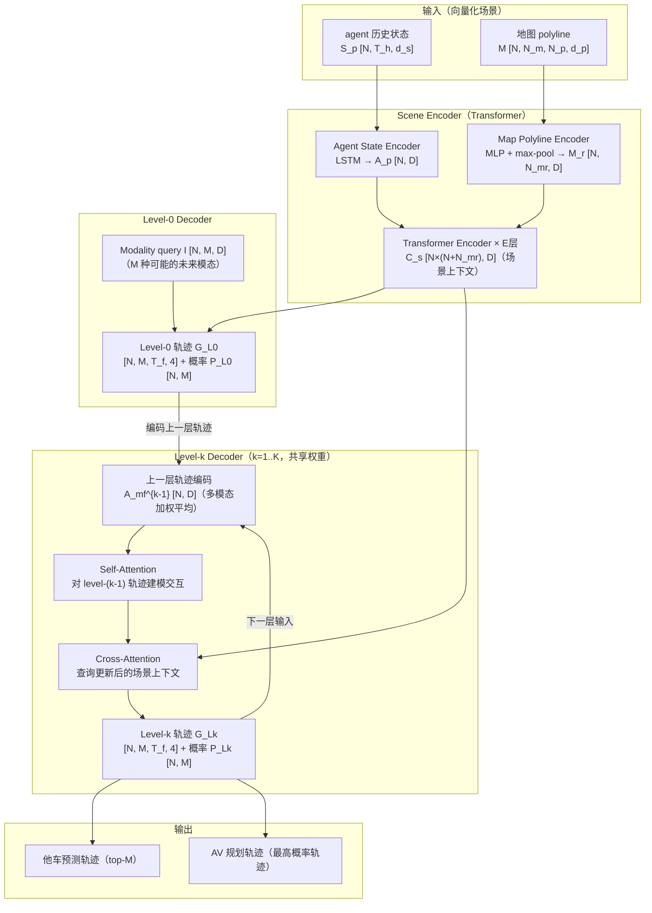

# GameFormer: Game-theoretic Modeling and Learning of Transformer-based Interactive Prediction and Planning（Huang et al., ICCV 2023）

一句话总结：GameFormer 把预测和规划统一进 level-k 博弈框架，用分层 Transformer decoder 迭代精化——每一层考虑"其他 agent 会如何回应上一层的预测"，在 WOMD 联合预测和 nuPlan 规划 benchmark 上同时达到 SOTA，ICCV 2023。

## 基本信息

- 论文：GameFormer: Game-theoretic Modeling and Learning of Transformer-based Interactive Prediction and Planning for Autonomous Driving
- 作者：Zhiyu Huang†、Haochen Liu†、Chen Lv（† 同等贡献）
- 机构：Nanyang Technological University（南洋理工大学）
- arXiv：2303.05760（2023-03）
- 发表：ICCV 2023
- 代码：https://mczhi.github.io/GameFormer/

---

## 核心问题

现有预测模型把各 agent 的未来轨迹独立建模，把 AV 的规划动作视为外部条件（conditional prediction），而不是博弈的参与者。这导致两个问题：

1. **单向交互**：预测模型只考虑"如果 AV 这样规划，他车会怎么走"，忽略了"他车的反应会反过来影响 AV 的最优规划"——这种双向影响在并线、路口让行等高风险场景中至关重要
2. **预测和规划解耦**：规划模块被动接受预测结果而不影响它，导致规划无法考虑"我的动作会改变他车行为"这一事实

**level-k 博弈理论**：认知科学里的框架，描述了不同"推理深度"的主体：
- Level-0：完全不考虑他人，独立行动
- Level-1：认为他人是 level-0，预测他人的 level-0 行为并据此决策
- Level-k：认为他人是 level-(k-1)，在此基础上做最优响应

这和人类驾驶的直觉一致——路口看到对方犹豫，自己就先走；对方加速，自己就让行。

---

## 方法：架构总览



最终用最后一层（level-K）的输出：他车轨迹作为预测结果，AV 最高概率轨迹作为规划轨迹。

### Level-0 Decoder

不考虑他车反应，仅依赖场景上下文和可学习的模态 query $I \in \mathbb{R}^{N \times M \times D}$ 独立预测每个 agent 的 M 种可能未来：

$$Z_{L_0} = \text{CrossAttn}(Q = [C_{s,A_p}, I],\ KV = C_s)$$

输出 GMM 参数 $G_{L_0} \in \mathbb{R}^{N \times M \times T_f \times 4}$（每步 $\mu_x, \mu_y, \log\sigma_x, \log\sigma_y$）和概率 $P_{L_0} \in \mathbb{R}^{N \times M}$。

### Level-k Decoder（k ≥ 1）

接收 level-(k-1) 的多模态轨迹，编码成交互特征，再通过 cross-attention 精化当前层预测：

```python
# 1. 编码上一层的多模态轨迹（M 种轨迹按概率加权平均）
A_mf_prev = MLP_maxpool(G_{L_{k-1}})    # [N, M, D] → 加权 → [N, D]

# 2. Self-Attention：所有 agent 的上一层轨迹互相感知（建模 agent 间反应）
A_fi = SelfAttn(A_mf_prev)              # [N, D]

# 3. Cross-Attention：用精化后的交互信息查询场景上下文
updated_context = concat([A_fi, C_s])   # [N+N_m+N, D]
Z_Lk = CrossAttn(Q = [Z_{L_{k-1}}, A_mf_prev],
                 KV = updated_context)  # [N, M, D]

# 4. 输出当前层轨迹和概率
G_Lk = MLP(Z_Lk)    # [N, M, T_f, 4]
P_Lk = MLP(Z_Lk)    # [N, M]
```

**关键约束**：agent $A_0$（AV）不能看自己的未来交互特征（只能看他车的），防止循环依赖。

### Loss 函数

每层 decoder 都计算 loss（深度监督），总 loss 为各层之和：

$$\mathcal{L}_i^k(\pi_i^{(k)}) = w_1 \mathcal{L}_{IL}(\pi_i^{(k)}) + w_2 \mathcal{L}_{Inter}(\pi_i^{(k)}, \pi_{-i}^{(k-1)})$$

- **模仿 loss** $\mathcal{L}_{IL}$：GMM NLL，让预测的最近模态贴近 GT 轨迹（WTA 机制）
- **交互 loss** $\mathcal{L}_{Inter}$：斥力势场，让当前层轨迹远离 level-(k-1) 他车轨迹的可能位置，防止碰撞

$$\mathcal{L}_{Inter} = \sum_{m=1}^{M} \sum_{t=1}^{T_f} \max_{\substack{j \neq i \\ n \in 1:M}} \frac{1}{d(\hat{s}_{m,t}^{(i,k)},\ \hat{s}_{n,t}^{(j,k-1)}) + 1}$$

---

## 训练 vs 推理差异

| 方面 | 训练 | 推理 |
|------|------|------|
| **输入** | WOMD/nuPlan 日志，含 GT 轨迹用于 loss | agent 历史状态 + 地图（向量化场景） |
| **输出使用** | 所有 K 层都计算 loss（深度监督）| 只用最后一层：他车取 top-M 轨迹，AV 取最高概率轨迹作为规划 |
| **交互 loss** | 每层 k≥1 都计算斥力 loss | 不计算，仅前向推理 |
| **规划轨迹** | GT 专家轨迹作为 AV 的模仿 loss GT | 直接取最后一层 AV 的最高概率模态输出 |
| **可选后处理** | — | 可加 cost-based refinement planner（基于输出轨迹做进一步碰撞优化）|

**推理输入**：
- `agent_states`：N 个 agent（含 AV）的历史状态序列，`[N, T_h, d_s]`
- `map_polylines`：本地地图 polyline，`[N, N_m, N_p, d_p]`（每个 agent 各自取最近的 N_m 条段）

**推理输出**：
- AV 规划轨迹：`[T_f=5s, 2]`（最高概率模态的均值点）
- 他车预测轨迹：`[N-1, M, T_f, 2]`（M 种模态）

---

## 关键结果

### WOMD 联合预测（Table 1，两个 agent 的联合轨迹预测）

| 方法 | minADE ↓ | minFDE ↓ | Miss Rate ↓ | mAP ↑ |
|------|---------|---------|------------|-------|
| SceneTrans | 0.9774 | 2.1892 | 0.4942 | 0.1192 |
| MTR | 0.9181 | 2.0633 | 0.4411 | 0.2037 |
| GameFormer (J, M=6) | **0.9161** | **1.9373** | **0.4531** | 0.1376 |
| GameFormer (M, M=64) | 0.9721 | 2.2146 | 0.4933 | 0.1923 |

联合预测（J, M=6）在位置误差上超过 MTR，但 mAP 低（Joint M=6 的概率校准弱于 MTR 的 K=64）。

### 开环规划（Table 3，WOMD 选定场景）

| 方法 | Collision Rate ↓ | Miss Rate ↓ | Planning ADE@3s ↓ |
|------|----------------|------------|-----------------|
| MTR-e2e | 2.32 | 8.88 | 0.888 |
| DIPP | 2.33 | 8.44 | 0.928 |
| **GameFormer** | **1.98** | **7.53** | **0.836** |

碰撞率比 MTR-e2e 和 DIPP 更低，说明博弈建模对安全规划有实质改善。

### 闭环规划（Table 4，WOMD 选定场景）

| 方法 | Success Rate ↑ | Progress (m) ↑ | Position error@8s ↓ |
|------|---------------|--------------|-------------------|
| DIPP | 68.1% | 41.1 | 26.1 |
| **Ours** | **73.2%** | **44.9** | **21.0** |
| DIPP (w/ refinement) | 92.2% | 51.9 | 12.5 |
| **Ours (w/ refinement)** | **94.5%** | **52.7** | **11.1** |

加 refinement 后成功率 94.5%，优于同样加 refinement 的 DIPP。

### nuPlan 规划（Table 5）

| 方法 | Overall | OL | CL non-reactive | CL reactive |
|------|---------|-----|----------------|------------|
| Hoplan | 0.875 | 0.852 | 0.890 | 0.881 |
| Multi-path | 0.848 | 0.876 | 0.817 | 0.851 |
| **GameFormer** | **0.829** | **0.840** | 0.809 | 0.838 |
| IDM Planner | 0.591 | 0.294 | 0.724 | 0.755 |

学习方法里排名靠前，但低于 Hoplan（规则+学习混合方法）。

### 消融：decoding level 数量（Table 2）

| Level | Collision Rate ↓ | Miss Rate ↓ |
|-------|----------------|------------|
| 0 | 3.84% | 11.54% |
| 4 | **1.98%** | **7.53%** |
| 6 | 2.38% | 8.26% |

Level-4 最优（对应人类的认知推理深度），更多层反而轻微变差（过度推理）。

---

## 训练细节

论文 Section 4.1 给出的配置（prediction-oriented model）：

| 配置项 | 值 |
|--------|-----|
| Encoder 层数 E | 6 |
| 隐层维度 D | 256 |
| Decoding levels K | 6（prediction model）/ 4（planning model，消融最优）|
| 模态数 M | 6（joint）/ 64（marginal，用 EM aggregation）|
| 邻近 agent 数 | 20（prediction）/ 10（planning）|
| 地图 polyline 数 N_m | 最近若干条（论文未明确指定数量）|
| 训练数据 | WOMD 全量训练集（prediction）/ WOMD 选定 10K 场景 + nuPlan（planning）|
| 优化器 | 论文未明确说明（推断为 AdamW，参考同类工作）|

注：论文未公开 batch size、学习率等具体超参，代码库（https://mczhi.github.io/GameFormer/）为实现细节的最佳参考。

---

## 局限性

1. **计算代价随 K 增加**：每增加一个 decoding level，需要额外一次全场景 self-attention + cross-attention，K=4 时计算量约为 K=0 的 4 倍
2. **联合预测 mAP 偏低**：Joint M=6 的模态覆盖不如 MTR 的 K=64，mAP 低于 MTR（0.1376 vs 0.2037）
3. **输入仍为结构化场景**：依赖感知模块提供干净的 agent 状态和地图，不带感知，无法处理感知噪声
4. **闭环 reactive 场景**：nuPlan CL reactive 场景（他车会对 AV 的行为做出真实反应）中性能提升有限，说明博弈建模还不够精确

---

## 现状与影响

**一句话定性**：GameFormer 是"预测+规划联合建模"方向的标志性工作，level-k 博弈框架成为后续联合预测规划论文的常用参照，nuPlan 上的规划结果证明了显式建模 agent 交互对安全规划的实质价值。

- **后续工作**：PLUTO（2024）、HiVT-based planners 等在 nuPlan 上进一步提升，均引用 GameFormer 的博弈建模思路
- **截至 2026 年**：GameFormer Planner 仍是 nuPlan 学习类方法的重要基线；level-k 博弈迭代精化的 decoder 结构被多篇后续工作采用
- **与 MTR 的关系**：GameFormer 的 Encoder 设计参考了 MTR，但 Decoder 从单纯预测扩展为联合预测+规划，是从"只预测他车"迈向"同时规划自车"的关键步骤

---

## 和 wiki 内其他概念的关联

- [MTR: Motion Transformer](./mtr-2209.13508.md)：GameFormer 的 Encoder 设计参考 MTR，Decoder 是在 MTR 迭代精化基础上加入博弈层次
- [MTR++](./mtrpp-2306.17770.md)：同期工作，侧重多 agent 联合预测而非规划；GameFormer 侧重博弈框架和规划输出
- [Wayformer](./wayformer-2207.05844.md)：同类向量化场景编码，Wayformer 只做预测，GameFormer 做预测+规划
- [UniAD](./uniad-2212.10156.md)：一段式端到端方法，带感知；GameFormer 不带感知，专注 PnC 部分
- [nuPlan](./nuplan-2106.11810.md)：GameFormer 的规划 benchmark，提供闭环评测
- [高斯混合模型（GMM）](../20-concepts/gaussian-mixture-model.md)：GameFormer 的轨迹输出和 loss 设计均基于 GMM

## 值得看的部分 / 相关资料

- **Section 3.3（Future Decoding with Level-k Reasoning）**：level-k decoder 的完整结构，理解博弈迭代精化的核心
- **Table 2（Decoding Level 消融）**：直接说明了为什么 K=4 最优，人类推理深度的对应
- **Figure 4/5（定性结果）**：直观展示博弈预测如何捕捉让行、并线等交互行为
- **Table 3/4（开环+闭环规划）**：和 MTR-e2e、DIPP 的直接对比，说明博弈建模的安全收益
- PLUTO（2024）：后续在 nuPlan 上更强的同类工作
- DIPP（arXiv:2212.00187）：可微分联合预测规划，Table 3/4 的主要对比方法

---

## 附录：输入特征详解

### 坐标系约定

GameFormer 采用 **ego-centric 坐标系**：以 AV（ego agent）当前帧位置为原点，AV 朝向为 x 轴正方向。所有 agent 的历史状态和地图 polyline 都在此坐标系下归一化（论文 Section 3.2 明确提到"inputs are normalized according to the state of the ego agent"）。

---

### Agent 历史状态 `S_p ∈ ℝ^{N × T_h × d_s}`

- `N`：场景中的 agent 数量，含 AV（A_0）和邻近他车（A_1, ..., A_{N-1}）
- `T_h`：历史帧数（论文未明确指定，WOMD 标准为 11 帧 = 1.1 秒）
- `d_s`：每帧的状态特征维度

| 字段 | 含义 | 例子 |
|------|------|------|
| x, y | 位置（ego-centric 坐标，米）| `(0.0, 0.0)`（当前帧 AV 位置） |
| heading | 朝向角（弧度）| `0.0`（AV 朝向 = x 轴正方向）|
| velocity x, y | 速度分量（m/s）| `(12.0, 0.3)` |
| 其他 | 加速度、类型等（具体字段见 WOMD 格式）| — |

缺失帧（agent 不在感知范围内）用零填充。

---

### 地图 Polyline `M ∈ ℝ^{N × N_m × N_p × d_p}`

- `N`：agent 数量（每个 agent 各自取最近的地图元素）
- `N_m`：每个 agent 附近的地图 polyline 数量（路线、路口、人行横道等）
- `N_p`：每条 polyline 的点数（论文用 max-pooling 聚合到固定维度）
- `d_p`：每个点的特征维度（位置、道路类型等）

每条 polyline 经 MLP + max-pooling 压缩成一个 D=256 维向量，再和 agent 特征拼接成每个 agent 的上下文 tensor $C^i \in \mathbb{R}^{(N+N_{mr}) \times D}$。

---

### Modality Query（可学习参数）`I ∈ ℝ^{N × M × D}`

不是输入数据，而是模型的可学习参数（类似 Wayformer 的 seeds）。每个 agent 有 M 个可学习的模态 query，训练后学到不同的运动意图（直行、转弯等）。推理时直接使用固定的已训练值，不需要外部提供。
