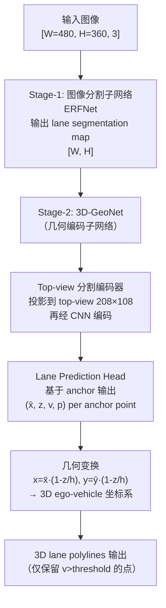

# Gen-LaneNet: A Generalized and Scalable Approach for 3D Lane Detection

**论文**: Gen-LaneNet (arXiv:2003.10656v1)
**作者**: Yuliang Guo*, Guang Chen, Peitao Zhao, Weide Zhang, Jinghao Miao, Jingao Wang, Tae Eun Choe（* equal contribution）
**机构**: Baidu Apollo
**发表**: ECCV 2020
**代码/数据**: https://github.com/yuliangguo/3D_Lane_Synthetic_Dataset

---

## 核心问题

**现有 3D 车道线检测方法（3D-LaneNet，Garnett et al., ICCV 2019）存在两个根本缺陷，导致不能泛化到未见场景。**

**缺陷 1：anchor 坐标系选择错误。** 3D-LaneNet 在 ego-vehicle 坐标系中定义 lane anchor，但把图像特征投影到 top-view 之后，lane 的位置（特别是上坡/下坡场景）与视觉特征不对齐——ground-truth 车道线在 top-view 里呈发散形，但 anchor 表示为平行线，训练信号和特征不对应，导致模型不能泛化到训练集中未出现的场景。

**缺陷 2：端到端学习耦合了图像外观和几何推断。** 当图像出现陌生光照、遮挡或天气变化时，由于几何推断和图像编码紧密耦合，模型性能急剧下降。而 3D lane 标注非常昂贵（需要高精地图、精确定位和人工校正），收集足够多样的 3D 训练数据极不现实。

Gen-LaneNet 的核心主张：
1. **使用虚拟 top-view 坐标系表达 anchor**，保证车道线 anchor 与视觉特征对齐，提升对未见场景的泛化
2. **两阶段解耦学习**：Stage-1 从图像学习 2D 分割（2D 标注廉价），Stage-2 从分割结果学习 3D 几何（3D 标注少量即可），减少对昂贵 3D 标注的依赖

---

## 方法 / 核心机制

### 坐标系和几何变换

Gen-LaneNet 引入了**虚拟 top-view 坐标系**（x̄, ȳ, 0），它和 ego-vehicle 坐标系（x, y, z）之间满足：

```
x = x̄ · (1 - z/h)
y = ȳ · (1 - z/h)
```

其中 h 是相机高度，z 是地面点的高度。这个变换**不依赖相机偏航和滚转角**，只需已知 h 和俯仰角 θ，具有通用性。

**关键性质**：一个 3D 点 (x, y, z)、其在虚拟 top-view 中的投影 (x̄, ȳ, 0) 和相机光心 (0, 0, h) 三点共线。因此，在虚拟 top-view 中预测 lane 的 x̄ 位置和高度 z，再通过上式反算真实 3D 坐标，保证了 anchor 位置与 top-view 视觉特征对齐。

### Anchor 表示

Lane anchors 定义为 N 条等间距的竖线 {X^i_A}^N_{i=1}（x 方向），给定 K 个预定义的 y-positions {y_j}^K_{j=1}，每条 anchor 表示为：

```
X^i_A = {(x̄^i_j, z^i_j, v^i_j)}^K_{j=1}
```

其中 x̄^i_j 是相对 anchor 位置的水平偏移（虚拟 top-view），z^i_j 是 3D 高度，v^i_j 是可见性概率。同时有车道线存在概率 p^i_t（t ∈ {center, lane}）。

相比 3D-LaneNet，两个新扩展：
1. anchor 点位置表示在虚拟 top-view 坐标系（而非 ego 坐标系）
2. 新增可见性属性 v，使模型能处理部分遮挡的车道线

### 模型架构



**Stage-1（图像分割）**：ERFNet（Romera et al., IEEE TITS 2018），在 2D 图像上预测 lane/non-lane 分割图。此阶段与 3D 几何完全解耦，可独立用 2D lane 标注数据训练。

**Stage-2（3D-GeoNet）**：
- **Top-view 分割编码器**：将分割输入通过 projective transformation 投影到 top-view（208×108 像素，对应 [-10m, 10m] × [1m, 101m] 的地面区域），然后用 CNN 提取特征
- **Lane Prediction Head**：基于 anchor 表示，直接预测每个 anchor 位置的 (x̄, z, v, p)，两类 lane：center-line 和 lane-line

### 架构伪代码（维度注释）

```python
# ---- 输入 ----
image: [B, 3, 360, 480]    # H=360, W=480

# ---- Stage-1: ERFNet 分割 ----
seg_map: [B, 2, 360, 480]  # 2 类: lane / non-lane

# ---- Stage-2: 3D-GeoNet ----
# Top-view 投影（planer homography，利用已知相机内参+h+θ）
topview_seg: [B, 2, 108, 208]  # 对应 y ∈ [1,101]m, x ∈ [-10,10]m

# CNN 编码器（多个卷积块）
feat: [B, C, H_f, W_f]         # 编码后的 top-view 特征

# Lane Prediction Head
# N = anchor 数（等间距 x 方向），K = y-position 数（11 个预定义 y）
# 每个 anchor：x̄ offset [K], z height [K], v visibility [K], p existence [1]
# 输出对每类（center, lane）分别预测：
pred_x:  [B, 2, N, K]   # 虚拟 top-view x 偏移
pred_z:  [B, 2, N, K]   # 3D 高度 z
pred_v:  [B, 2, N, K]   # 可见性概率
pred_p:  [B, 2, N, 1]   # anchor 存在概率

# ---- 后处理：几何变换 ----
# h = camera height (已知), 从 pred_x, pred_z 计算真实 3D 坐标
# x_3d = x̄ * (1 - z/h)
# y_3d = ȳ * (1 - z/h)   ȳ = 预定义的 y-positions
# 仅输出 v > threshold 的点
output_lanes: list of 3D polylines  # 每个 lane = [(x,y,z)_1, ..., (x,y,z)_K]
```

---

## 训练 vs 推理差异

**推理输入**：
- 单张 RGB 图像 [3, 360, 480]
- 已知相机内参（固定，来自合成数据集）
- 已知相机高度 h 和俯仰角 θ（用于 top-view 投影和最终几何变换）

**推理输出**：
- 3D lane polylines，在 ego-vehicle 坐标系中，每条 lane 是一组 (x,y,z) 点（y ∈ [1m, 101m]，仅可见点）
- 同时输出 center-line 和 lane-line

**仅训练时存在的模块**：
- Ground-truth anchor 匹配逻辑（将 GT lane 投影到 top-view，按最近 anchor x-value 关联）
- 可见性 GT 计算（基于深度图和语义分割图推导）

**行为差异**：
- 训练时 Stage-1 和 Stage-2 可以分开训练（解耦）：Stage-1 可用 2D 标注，Stage-2 可用合成 3D 标注
- 推理时两阶段串行执行

**参数来源**：
- 模型权重（ERFNet + 3D-GeoNet CNN + 预测 head）
- 相机参数（h, θ, 内参）：推理时必须外部提供，需已知相机安装位置

---

## Loss 函数

训练 loss 由三项构成（Equation 3，论文原文），对 center-line 和 lane-line 两类各自计算：

```
ℓ = - Σ_{t∈{c,l}} Σ_i (p̂^i_t · log p^i_t + (1-p̂^i_t) · log(1-p^i_t))   # BCE for 存在概率
  + Σ_{t∈{c,l}} Σ_i p̂^i_t · (‖v̂^i_t · (x^i_t - x̂^i_t)‖₁              # 可见性加权 x 偏差 (L1)
                              + ‖v̂^i_t · (z^i_t - ẑ^i_t)‖₁)             # 可见性加权 z 偏差 (L1)
  + Σ_{t∈{c,l}} Σ_i p̂^i_t · ‖v^i_t - v̂^i_t‖₁                          # 可见性向量 L1
```

相比 3D-LaneNet 的三处改变：
1. x 位置在虚拟 top-view 坐标系（而非 ego 坐标系）
2. x 和 z 的 loss 乘以可见性概率 v，不可见点不贡献损失
3. 新增可见性向量 v 的 L1 loss

---

## 消融实验

**Table 1：Anchor 表示效果（lane-line，F-score / AP）**

| 方法 | Anchor 类型 | Balanced | Rarely Observed | Visual Variations |
|------|-------------|----------|-----------------|-------------------|
| 3D-LaneNet | 旧（ego坐标系）| 86.4 / 89.3 | 72.0 / 74.6 | 72.5 / 74.9 |
| 3D-LaneNet | **新（top-view）** | 90.0 / 92.0 | 80.9 / 82.0 | 82.7 / 84.8 |
| Gen-LaneNet | 旧 | 85.1 / 87.6 | 70.0 / 73.0 | 80.9 / 83.8 |
| Gen-LaneNet | **新（top-view）** | 88.1 / 90.1 | 78.0 / 79.0 | 85.3 / 87.2 |

结论：新 anchor 对所有三类场景均有 3-10% 的提升，在 Visual Variations 最明显（10% 左右）。

**Table 2：两阶段框架上限（lane-line，F-score / AP）**

| 方法 | Balanced | Rarely Observed | Visual Variations |
|------|----------|-----------------|-------------------|
| 3D-LaneNet | 86.4 / 89.3 | 72.0 / 74.6 | 72.5 / 74.9 |
| 3D-GeoNet（理论上限）| 91.8 / 93.8 | 84.7 / 86.6 | 90.2 / 92.3 |
| Gen-LaneNet | 88.1 / 90.1 | 78.0 / 79.0 | 85.3 / 87.2 |

3D-GeoNet 输入完美 GT 分割，是两阶段框架的理论上限。Gen-LaneNet 可进一步提升（改善 Stage-1 即可），Rarely Observed 和 Visual Variations 场景提升潜力大（5-7% F-score）。

---

## 训练细节

- **优化器**：Adam，初始 lr = 5×10⁻⁴
- **Batch size**：8
- **Epochs**：30
- **所有网络从随机正态分布初始化**，从头训练（no pretrain）
- **Stage-1 ERFNet** 训练遵循原论文设置（Romera et al. 2018），只修改输入/输出尺寸
- **相机参数**：h ∈ [1.4m, 1.8m]（随机），θ ∈ [0°, 10°]（随机）；内参固定，推理时由数据集提供
- **输入尺寸**：360×480
- **Top-view 分辨率**：208×108，对应地面范围 [-10m, 10m] × [1m, 101m]（x, y）
- **y-positions（anchor 预测点）**：{3, 5, 10, 15, 20, 30, 40, 50, 65, 80, 100} m（间距渐增）
- **Yref = 5m**：用于将 GT lane 关联到最近 anchor

---

## 数据

**Apollo 3D Lane Synthetic Dataset**（论文自建，代码库一并开源）：
- 使用 Unity 游戏引擎渲染，地图基于美国硅谷真实地区
- 3 个地图：高速公路（6000帧）、城区（1500帧）、居民区（3000帧），共 10,500 帧
- 多种拍摄条件：早晨/正午/傍晚三个时段，两级车道标线磨损程度，随机相机高度和俯仰角，场景内有行驶中的 agent 车辆（产生真实遮挡）
- 每帧标注：RGB 图像 + 深度图 + 语义分割图 + 3D lane 坐标（截断于 200m）
- 3D lane 可见性标签由深度图+语义分割自动推导（前景遮挡保留，背景遮挡丢弃）

**三种数据划分**（用于不同评测维度）：

| 划分 | 训练集 | 测试集 | 评测目标 |
|------|--------|--------|---------|
| Balanced scenes | 全量 5-fold 划分 | 同分布 | 标准性能基准 |
| Rarely observed | 同 Balanced | 仅城区子集（急转弯+大高差）| 对未见场景的泛化能力 |
| Visual variations | 同 Balanced，但 3D 训练排除特定时段（凌晨）| 仅凌晨图像 | 对外观变化（光照）的鲁棒性 |

---

## 评测指标

**AP（Average Precision）**：综合评测指标，对所有操作点（召回率阈值）积分。

**F-score（最大 F-score）**：precision 与 recall 调和均值的最优操作点，代表应用中最佳性能点。

**x error / z error（near/far）**：对匹配成功的 lane pair，计算近程（0-40m）和远程（40-100m）的欧式距离误差（米）。

**Lane-to-lane 匹配方式**：
- 求解二部图最小费用流（OR-tools），全局最优匹配（比 3D-LaneNet 的贪心匹配更严格）
- point-wise cost = 两 lane 对应 y-position 处的欧式距离（仅两个都有的点，dmax=1.5m 截断）
- 匹配成功条件：75% 的 covered y-positions 点对距离 < 1.5m

---

## 关键结果 / 数据

**全系统对比（Lane-line，Table 3）**：

| Dataset Split | 方法 | F-Score | AP | x-near (m) | x-far (m) | z-near (m) | z-far (m) |
|--------------|------|---------|-----|-----------|-----------|-----------|-----------|
| Balanced | 3D-LaneNet | 86.4 | 89.3 | 0.068 | 0.477 | 0.015 | 0.202 |
| Balanced | **Gen-LaneNet** | **88.1** | **90.1** | **0.061** | **0.496** | **0.012** | **0.214** |
| Rarely Observed | 3D-LaneNet | 72.0 | 74.6 | 0.166 | 0.855 | 0.039 | 0.521 |
| Rarely Observed | **Gen-LaneNet** | **78.0** | **79.0** | **0.139** | **0.903** | **0.030** | **0.539** |
| Visual Variations | 3D-LaneNet | 72.5 | 74.9 | 0.115 | 0.601 | 0.032 | 0.230 |
| Visual Variations | **Gen-LaneNet** | **85.3** | **87.2** | **0.074** | **0.538** | **0.015** | **0.232** |

最大提升在 Visual Variations（光照泛化）：F-score +12.8，AP +12.3。说明两阶段解耦对图像外观变化最有效。

---

## 局限性

1. **仅在合成数据上评测**：论文没有真实世界评测结果，合成→真实的域差距（domain gap）是未解决的挑战，论文将其标记为未来工作
2. **相机位姿必须已知**：h（高度）和 θ（俯仰角）在推理时必须由外部提供；实际系统需要在线标定或从 IMU 估计
3. **分两阶段不可端到端微调**：虽然解耦提升泛化，但 Stage-1 错误无法通过 Stage-2 的监督信号反传修正
4. **只评测了 lane-line 和 center-line**，没有其他 lane marker 类型
5. **评测范围仅 1m-101m**，大于 100m 的车道线被截断

---

## 现状与影响

Gen-LaneNet 是**3D 车道线检测任务中的早期 camera-only 奠基工作**，同时贡献了任务方向和标准数据集。

- **Apollo 3D Lane Synthetic 数据集**：被后续几乎所有 3D lane detection 工作（PersFormer，BEV-LaneDet，Anchor3DLane 等）作为标准 benchmark 使用，是该任务事实上的标准评测集之一（直到 OpenLane 真实数据集 ECCV 2022 出现）
- **虚拟 top-view anchor 表示**：被后续工作广泛采用，是 3D lane anchor 设计的标准参考
- **两阶段解耦思路**：随着端到端方法（PersFormer, BEV-LaneDet）的发展被逐步取代，但 "少量 3D 标注 + 更多 2D 标注" 的数据效率思路仍有参考价值
- **评测指标体系（AP + F-score + x/z error）**：成为 3D lane detection 的标准评测协议，被后续工作沿用

**今天（2026）视角**：Gen-LaneNet 的架构（两阶段）不再是主流，已被单阶段端到端方法（PersFormer ECCV 2022, BEV-LaneDet CVPR 2023）取代。但 Apollo 3D Lane Synthetic 数据集仍在使用，虚拟 top-view 坐标系几何仍是理解任务的基础理论。OpenLane（基于 Waymo，ECCV 2022）提供了更大规模的真实世界 benchmark，是当前主要评测标准。

**定性**：任务奠基性工作，几何设计有开创性；架构已被超越，数据集仍活跃。

---

## 关联概念

- [MapTR](./maptr-2208.14437.md) — MapTR 构建在线向量化 HD Map，车道线是其输出的 map element 之一；两者都使用 BEV 特征表示地图元素
- [nuScenes](../30-papers/nuscenes-1903.11027.md) — nuScenes 包含车道信息，但 Gen-LaneNet 使用 Apollo 合成数据集，不用 nuScenes
- [Occ3D](./occ3d-2304.14365.md) — 3D occupancy prediction 是 lane detection 的上位任务；occupancy 建模整个体素空间，lane detection 只建模车道线几何
- [VoxFormer](./voxformer-2302.12251.md) — VoxFormer 在 3D voxel 空间预测语义，Gen-LaneNet 在虚拟 top-view 预测车道线；两者的"稀疏 3D 结构 + 相机图像"思路有相似性

## 值得看的部分 / 相关资料

- **Section 3.1（坐标系几何）**：虚拟 top-view 坐标系与 ego 坐标系变换的推导（Fig.4），是理解为什么 anchor 对齐重要的关键
- **Figure 2（上坡/下坡场景对比）**：直观看 3D-LaneNet anchor 对齐问题
- **Section 4（数据集构建策略）**：三种测试划分设计思路，对构建自动驾驶评测数据集有参考价值
- **Appendix B（代数推导）**：几何变换的完整代数证明，适合复现
- **数据集 GitHub**：https://github.com/yuliangguo/3D_Lane_Synthetic_Dataset

---

## 附录：输入特征详解

### RGB 图像

| 字段 | Shape | 含义 |
|------|-------|------|
| `image` | `[B, 3, 360, 480]` | B=batch，3=RGB，H×W=360×480 |
| `camera_height` | scalar h | 相机离地高度，单位 m，范围 [1.4, 1.8]m（合成数据随机） |
| `pitch_angle` | scalar θ | 相机俯仰角，范围 [0°, 10°] |
| `K` | `[3, 3]` | 相机内参矩阵（固定，合成数据集提供） |

坐标系：ego-vehicle 坐标系，原点为相机光心在地面的垂直投影，x 向右，y 向前，z 向上

### 中间表示：Top-View 分割图

| 字段 | Shape | 含义 |
|------|-------|------|
| `topview_seg` | `[B, 2, 108, 208]` | 分割图投影到 top-view；x ∈ [-10m, 10m]（208 px），y ∈ [1m, 101m]（108 px） |

### Anchor 预测输出（per-type，类型 t ∈ {center, lane}）

| 字段 | Shape | 含义 |
|------|-------|------|
| `pred_x` | `[B, N, K]` | 虚拟 top-view x 偏移（相对 anchor 中心），单位 m |
| `pred_z` | `[B, N, K]` | 真实 3D 高度 z，单位 m |
| `pred_v` | `[B, N, K]` | 可见性概率 ∈ [0,1] |
| `pred_p` | `[B, N, 1]` | Lane 存在概率 ∈ [0,1] |

N = anchor 数（等间距 x 方向），K = 11 个预定义 y-positions = {3,5,10,15,20,30,40,50,65,80,100} m
