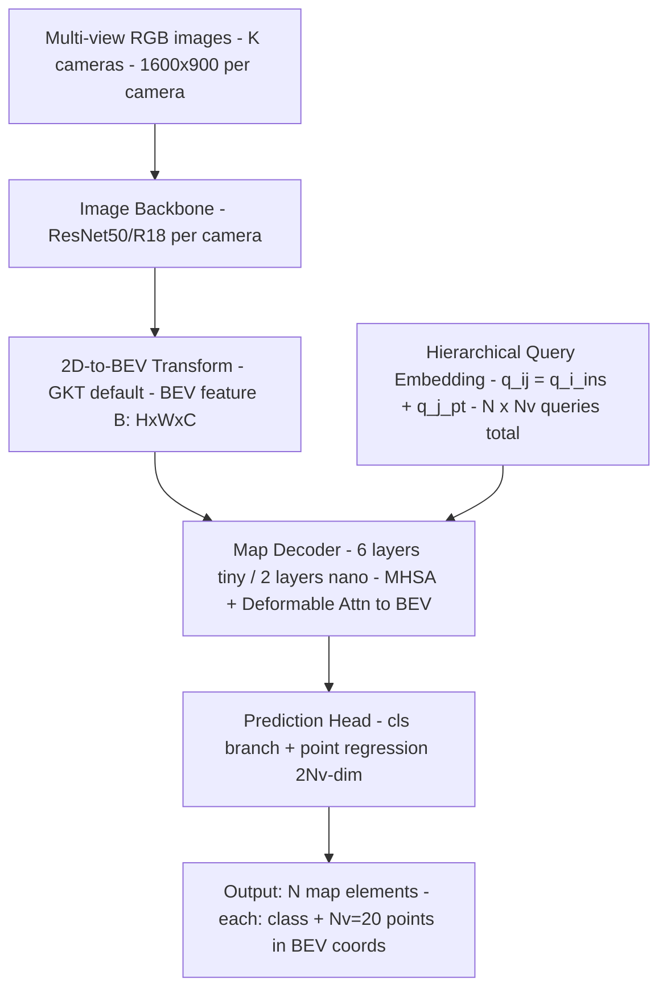

# MapTR: Structured Modeling and Learning for Online Vectorized HD Map Construction（Liao et al., ICLR 2023）

一句话总结：MapTR 把在线 HD Map 构建定义为多模态地图元素检测问题，核心贡献是"等价置换建模"——把车道线/边界/人行横道的点集表示为允许多种合法排列顺序的等价组，消除训练歧义；在 nuScenes 上以 25.1 FPS 达到 45.9 mAP（nano）/58.7 mAP（tiny），远超同期 VectorMapNet，HKUST + Horizon Robotics，ICLR 2023。

## 基本信息

- 论文：MapTR: Structured Modeling and Learning for Online Vectorized HD Map Construction
- 作者：Bencheng Liao\*、Shaoyu Chen\*、Xinggang Wang†、Tianheng Cheng、Qian Zhang、Wenyu Liu、Chang Huang
- 机构：华中科技大学（HKUST）+ Horizon Robotics（地平线机器人）
- arXiv：2208.14437（2023-01-30 v2）
- 发表：ICLR 2023

---

## 核心问题

**如何实时从车载摄像头构建向量化 HD 地图？**

传统 HD Map 构建基于 SLAM（LOAM、LIO-SAM），流程复杂、维护代价高。在线方法有两条路：

1. **BEV 语义分割**（HDMapNet）：生成栅格化地图，缺乏实例级向量信息（车道结构、拓扑关系），下游任务（运动预测、规划）难以直接使用。
2. **端到端向量化**（VectorMapNet）：首个端到端方案，但自回归逐点预测慢（2.9 FPS），且存在"置换歧义"问题——论文核心要解决的问题。

**置换歧义（Permutation Ambiguity）**：一条车道线的两个端点都可以是"起点"，多边形的每个顶点都可以是起点且可顺/逆时针遍历，同一几何形状有多种等价的点序列。强制固定某一种作为监督标签，和其他等价排列在训练时产生矛盾梯度，阻碍学习。

---

## 方法 / 核心机制

### 架构总览



### 地图元素表示

三类地图元素：
- **Pedestrian Crossing**（人行横道）→ **多边形**（封闭形状）
- **Lane Divider**（车道分隔线）→ **折线**（开放形状）
- **Road Boundary**（道路边界）→ **折线**（开放形状）

每个元素统一表示为 **N_v = 20 个有序点**。

**MapTR 的等价置换表示 (V, Γ)**：

每个元素由点集 V = {v_j} 和等价置换组 Γ = {γ^k} 联合定义：

| 形状 | 等价置换数 | 说明 |
|------|-----------|------|
| 折线（polyline）| 2 | 正向 + 反向两种起点 |
| 多边形（polygon）| 2 × N_v | 每个点都可以是起点，顺时针 + 逆时针各一 |

训练时对每个匹配的元素对，在 Γ 中**动态搜索最小化 Manhattan 距离的最优置换 γ̂**，用它作为监督目标，而非固定某一种排列。这是论文最核心的创新。

**消融结果**：去掉等价置换（用固定排列）mAP 从 50.3 → 44.4（-5.9），人行横道 AP 降幅最大（+11.9），因为多边形等价置换数最多（2×20=40）。

### 层次化查询设计

两级可学习查询（均为可训练参数）：

```
q_i^ins  ∈ R^D,  i = 0..N-1     # 实例级查询，每个实例独立
q_j^pt   ∈ R^D,  j = 0..N_v-1   # 点级查询，所有实例共享

q_ij^hie = q_i^ins + q_j^pt     # 层次化查询，用于第j个点/第i个元素
```

N_v 个点级查询共享的设计使模型隐式学习"沿形状均匀采点"的先验，而不需要为每个实例的每个点独立维护参数。

### 解码器

6 层（tiny）/ 2 层（nano）级联解码器，每层：

1. **MHSA（多头自注意力）**：所有层次化查询之间互相交流，同时建模实例间和点间的关系
2. **Deformable Attention → BEV 特征**：每个查询 q_ij 预测一个 BEV 归一化参考坐标 p_ij，在该坐标邻域采样 BEV 特征更新查询

### 伪代码（含 shape）

```python
# 输入
images: [B, K, 3, H, W]         # K=6 相机，H=900, W=1600（tiny 时 resize 0.5x）

# Per-camera 特征提取
feats = Backbone(images)         # [B, K, C, h, w]

# 2D→BEV
B_bev = GKT(feats)               # [B, C, H_bev, W_bev]  感知范围 30m×60m / 0.3m = 100×200

# 查询初始化
q_ins = learnable [N, D]         # N=50（tiny）
q_pt  = learnable [Nv, D]        # Nv=20，共享
q_hie = q_ins.unsqueeze(1) + q_pt.unsqueeze(0)  # [N, Nv, D]

# 解码器（6 层）
for layer in decoder_layers:
    q_hie = MHSA(q_hie)          # [N, Nv, D] 全局 self-attn
    q_hie = DeformAttn(q_hie, B_bev)  # [N, Nv, D]，每个点预测参考坐标采样

# 预测头
cls_scores = cls_head(q_hie)     # [N, num_cls]
pts        = pts_head(q_hie)     # [N, Nv, 2]  归一化 BEV 坐标
```

感知范围：X ∈ [-15m, 15m]，Y ∈ [-30m, 30m]。

---

## Loss 函数

```
L = λ·L_cls + α·L_p2p + β·L_dir
```

默认权重：λ=2, α=5, β=5×10⁻³

| Loss | 监督目标 | 设计动机 |
|------|---------|---------|
| **L_cls**（Focal Loss）| 每个预测实例的类别分数 | 类别不平衡（N 个 slot 中只有少数对应真实元素） |
| **L_p2p**（Manhattan 距离）| 每个点的 BEV 坐标（用最优置换 γ̂）| 直接约束几何形状 |
| **L_dir**（Cosine 相似度负数）| 相邻点之间的边方向 | 仅有 L_p2p 只约束顶点位置，边方向不受约束；加 L_dir 显式约束折线/多边形的走向精度 |

**匈牙利匹配（实例级）**：

N 个预测和 GT 元素做二分匹配，匹配代价 = Focal Loss 分类项 + Point2point 位置项（实验证明 Point2point cost 比 Chamfer distance cost 好 +2.8 mAP）。

**点级匹配**：实例匹配完成后，在 Γ 中穷举找使 Manhattan 距离最小的置换 γ̂，用于 L_p2p 和 L_dir 的计算。

---

## 训练 vs 推理差异

| 方面 | 训练 | 推理 |
|------|------|------|
| 点级置换 | 穷举 Γ 找最优 γ̂（polyline 2 种，polygon 2×N_v 种）| 不需要，直接读输出点序列 |
| 实例匹配 | 匈牙利算法将 N 个 slot 匹配到 GT | 按分类置信度阈值过滤，无 NMS |
| 数据增强 | Color jitter | 无 |

推理输入：6 路 RGB 图像（或 tiny 配置下 resize 后）。推理输出：N 个 map 元素，每个含类别 + 20 个 BEV 坐标点，直接用于下游规划/预测。

---

## 关键结果 / 数据

### nuScenes val 集（mAP，Chamfer 阈值 {0.5, 1.0, 1.5}m）

| 方法 | 模态 | Backbone | Epoch | AP_ped | AP_div | AP_bnd | **mAP** | FPS |
|------|------|---------|-------|-------|-------|-------|---------|-----|
| HDMapNet | C | EffiB0 | 30 | 14.4 | 21.7 | 33.0 | 23.0 | 0.8 |
| HDMapNet | C&L | EffiB0+PP | 30 | 13.8 | 29.6 | 46.7 | 31.0 | 0.5 |
| VectorMapNet | C | R50 | 110 | 36.1 | 47.3 | 39.3 | 40.9 | 2.9 |
| VectorMapNet | C&L | R50+PP | 110 | 37.6 | 50.5 | 47.5 | 45.2 | — |
| **MapTR-nano** | **C** | **R18** | **110** | **39.6** | **49.9** | **48.2** | **45.9** | **25.1** |
| MapTR-tiny | C | R50 | 24 | 46.3 | 51.5 | 53.1 | 50.3 | 11.2 |
| **MapTR-tiny** | **C** | **R50** | **110** | **56.2** | **59.8** | **60.1** | **58.7** | **11.2** |
| MapTR-tiny | C&L | R50+PP | 24 | — | — | — | **62.5** | 5.8 |

- MapTR-nano vs VectorMapNet-C：**+5.0 mAP，8× 更快**（25.1 vs 2.9 FPS）
- MapTR-tiny（110 epoch）vs VectorMapNet-C&L（110 epoch）：**+13.5 mAP，3× 更快**

Swin 系列 backbone：MapTR-small（Swin-S）54.3 mAP / 7.3 FPS，MapTR-base（Swin-B）55.9 mAP / 6.1 FPS。

---

## 消融实验

| 实验 | 关键发现 |
|------|---------|
| **置换建模**（Table 2）| 等价置换 vs 固定排列：**+5.9 mAP**（50.3 vs 44.4）；人行横道提升最大 +11.9 AP（多边形等价置换最多）|
| **边方向 Loss**（Table 3）| β=0（去掉 L_dir）：**-2.1 mAP**（48.2 vs 50.3）|
| **2D→BEV 方法**（Table 4）| GKT 最好（50.3），LSS 其次（49.5），IPM 最差（46.2）但参数最少 |
| **点数 N_v**（Table 5）| 20 点最优；10 点 -2.3 mAP；40 点相近但 FPS 下降 |
| **元素数量 N**（Table 6）| N=50 最佳；N=25 大幅下降（-8.7 mAP）|
| **解码层数**（Table 7）| 6 层最优；1 层仅 29.1 mAP；8 层略有下降 |
| **实例匹配代价**（Table 8）| Point2point cost vs Chamfer distance：**+2.8 mAP** |

---

## 评测指标说明

MapTR **不使用 IoU**，而是 **Chamfer 距离 AP**：

- 对每个阈值 τ ∈ {0.5, 1.0, 1.5}（单位：米），计算 AP_τ（预测和 GT 的 Chamfer 距离 ≤ τ 则算匹配成功）
- **mAP = 平均三个阈值下的 AP**

每类单独报告：AP_ped（人行横道）、AP_divider（车道线）、AP_boundary（道路边界）。

---

## 局限性

论文没有单独的局限性章节，但鲁棒性实验（Table 11-12）揭示：

- 对相机外参标定误差敏感：平移噪声 σ=0.5m 时 mAP 从 50.3 跌至 34.0；旋转噪声 σ=0.05 rad 时跌至 24.7
- 标定误差在量产部署中较常见（振动、温度变化），是实际落地的挑战
- 仅在 nuScenes（2 城市、4 地图区域）评测，泛化性未验证

---

## 现状与影响

**一句话定性：在线建图领域的奠基性工作，等价置换建模思想被广泛引用，但实现细节已被后续工作（MapTRv2、StreamMapNet 等）超越。**

- MapTR 是在线向量化 HD Map 构建的**标准基线**，到 2026 年仍被大量论文对比。
- **等价置换建模**的思想（不强制固定点序，训练时找最优排列）被后续在线建图、轨迹预测等工作引用和迁移。
- **直接超越方向**：
  - **MapTRv2**（2308.05736，同一团队）加入辅助任务、改进 BEV 编码，mAP 大幅提升。
  - **StreamMapNet** 加入时序一致性，利用跨帧建图稳定性。
  - 端到端方法（VAD、SparseDrive）把在线建图直接融入规划，不再作为独立模块。
- **思想 vs 实现分离**：等价置换思想有持续价值；具体的 GKT + ResNet 实现已被更强的 BEV backbone 替代。
- **2026 年视角**：nuScenes 上的在线建图 SOTA 已超过 70+ mAP，MapTR 的 58.7 mAP 已不代表前沿，但作为理解该方向的入门论文仍是最佳起点。

---

## 和 wiki 内其他概念的关联

- **[无图规划（HD Map Free）](../00-overview/av-mapless-planning.md)**：MapTR 是无图规划的基础设施，在线建图模块的代表起点
- **[DETR](detr-2005.12872.md)**：MapTR 沿用 DETR 的 N query + 匈牙利匹配范式，是 DETR 在地图构建上的应用
- **[nuScenes](nuscenes-1903.11027.md)**：MapTR 的主要评测数据集
- **[VAD](../00-overview/av-mapless-planning.md)**（2303.12077）：在 MapTR 之上构建无图端到端规划
- **[UniAD](uniad-2212.10156.md)**：同期无图端到端方法，UniAD 有自己的在线建图头，MapTR 是更专注的建图模块
- **[PLUTO](pluto-2404.14327.md)**：nuPlan 规划方向的 SOTA，使用 HD Map；MapTR 是 nuScenes 无图方向的对应基础
- **[Attention 直觉](../20-concepts/attention-intuition.md)**：Deformable Attention 是 MapTR decoder 的核心 cross-attention 组件

---

## 附录：完整输入特征

### 图像输入

| 字段 | 说明 |
|------|------|
| K | 相机数量 = 6（nuScenes 全向配置）|
| 原始分辨率 | 1600 × 900 per camera |
| tiny resize | ×0.5 → 800 × 450 |
| nano resize | ×0.2 → 320 × 180 |
| 坐标系 | 各相机独立，通过外参投影到 BEV |

### BEV 特征

| 字段 | 说明 |
|------|------|
| H_bev × W_bev | 感知范围 30m × 60m / BEV 分辨率 |
| BEV 分辨率 | tiny：0.3m/格 → 100 × 200；nano：0.75m/格 |
| 感知范围 | X：[-15m, 15m]，Y：[-30m, 30m]（前向为 Y 正方向）|

### 输出

| 字段 | Shape | 含义 |
|------|-------|------|
| cls_scores | [N, 3] | 三类地图元素的分类分数，N=50（tiny）|
| pts | [N, 20, 2] | 归一化 BEV 坐标点，每个元素 20 个点 |

坐标系：ego-centric BEV，以自车为原点，归一化到 [-1, 1]，使用时需乘以实际范围（X: 15m，Y: 30m）。

---

## 值得看的部分 / 相关资料

- **Section 3.1**（Map Element Modeling）：等价置换的完整数学定义，这是论文最值得精读的部分
- **Figure 3**（训练收敛曲线）：直观展示固定排列 vs 等价置换的收敛速度差异
- **Table 2**（消融实验首条）：等价置换 +5.9 mAP，是论文主张的最强证据
- **MapTRv2**（arXiv 2308.05736）：同一团队的升级版，加入 auxiliary task 和 better BEV 编码
- **VectorMapNet**（arXiv 2206.08920）：被 MapTR 直接超越的前作，理解 MapTR 贡献的对照参考
