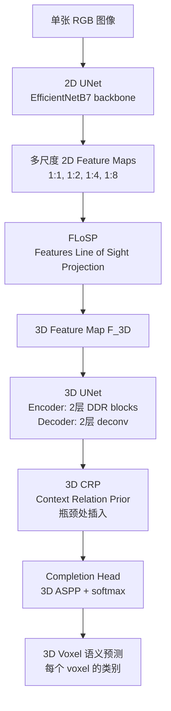

# MonoScene: Monocular 3D Semantic Scene Completion

**论文**: MonoScene (arXiv:2112.00726v2)
**作者**: Anh-Quan Cao, Raoul de Charette
**机构**: Inria
**发表**: CVPR 2022
**代码**: https://github.com/cv-rits/MonoScene

---

## 核心问题

**3D Semantic Scene Completion（SSC）能否只用单张 RGB 图像完成？**

SSC 任务目标是从不完整的观测中**联合推断场景的完整 3D 几何和语义**（即为每个 voxel 预测是否占据及语义类别）。传统方法依赖 LiDAR 点云、TSDF 或深度图作为输入。

MonoScene 是**第一个只用单目 RGB 图像**完成 SSC 的方法，同时处理 indoor（NYUv2）和 outdoor（SemanticKITTI）场景。核心挑战：从 2D 图像恢复 3D 存在深度模糊，且不同深度的 voxel 可能映射到同一像素。

---

## 方法 / 核心机制

### 整体架构



**三个关键组件**：

#### 1. FLoSP（Features Line of Sight Projection）

2D 特征映射到 3D 的核心机制：对每个 3D voxel 中心点 x_c，将其透视投影到各个 2D 特征图尺度，采样对应位置的 2D 特征，累加得到 3D 特征：

```
F_3D = Σ_{s∈S} Φ_{ρ(x_c)}(F^{1:s}_{2D})
```

其中 ρ(·) 是透视投影，Φ_a(b) 是在坐标 a 处采样 b，S = {1, 2, 4, 8} 为 4 个尺度。

**关键点**：沿光学射线方向将 2D 特征反投影到所有可能的 3D 位置，让 3D 网络自行决定利用哪些 2D 特征。不同于"把 2D 特征 resize 到 3D"，FLoSP 保留了 2D-3D 尺度解耦（disentanglement）。

#### 2. 3D Context Relation Prior（3D CRP）

在 3D UNet 瓶颈处插入的全局上下文模块，学习 4 种 voxel↔voxel 语义关系：

- `fs`（free-similar）：两 voxel 至少一个是 free 且语义相同
- `fd`（free-different）：两 voxel 至少一个是 free 且语义不同
- `os`（occupied-similar）：两 voxel 都 occupied 且语义相同
- `od`（occupied-different）：两 voxel 都 occupied 且语义不同

为内存效率，使用 supervoxel↔voxel（而非 voxel↔voxel）关系矩阵。关系矩阵通过 ASPP + sigmoid 学到，有可选的 ground truth 关系监督 L_rel。

```python
# 3D CRP
x_3d: [H, W, D, C]      # 3D UNet bottleneck feature
aspp_feats = ASPP(x_3d)  # [H, W, D, C]，大感受野
# 分成 n=4 个关系矩阵，每个 [HWD/s^3, HWD] （supervoxel×voxel）
rel_matrices = split_and_reshape(aspp_feats, n=4)
rel_matrices = sigmoid(1x1_conv(rel_matrices))  # Â_m
# 关系矩阵乘 supervoxel 特征，聚合全局上下文
context = matmul(rel_matrices, supervoxel_feats)  # [HWD, C]
output = combine(x_3d, context)  # concat + conv + DDR
```

#### 3. 新损失函数

**Scene-Class Affinity Loss（L_scal）**：优化类别级 precision、recall、specificity，分语义和几何两个版本：
- `L^sem_scal`：优化语义分类的 class-wise P/R/Spec
- `L^geo_scal`：优化几何完成（binary occupied）的 P/R/Spec

**Frustum Proportion Loss（L_fp）**：将图像划分为 `ℓ×ℓ` 个局部 patch，对应 3D 场景中的 frustum，用 KL 散度对齐预测类别分布和 ground truth 类别分布，为遮挡区域提供额外监督：

```
L_fp = Σ_k Σ_{c∈C_k} P^k(c) * log(P^k(c) / P̂^k(c))
```

**总 loss**：
```
L_total = L_ce + L_rel + L^sem_scal + L^geo_scal + L_fp
```

### 架构伪代码（维度注释）

```python
# 输入
img: [B, 3, H, W]  # H=640, W=480(NYUv2); H=1220, W=370(Sem.KITTI, cam2 cropped)

# 2D UNet（EfficientNetB7）
feat_1  = encoder_stage_1(img)    # [B, C_1, H, W]
feat_2  = encoder_stage_2(feat_1) # [B, C_2, H/2, W/2]
feat_4  = encoder_stage_3(feat_2) # [B, C_3, H/4, W/4]
feat_8  = encoder_stage_4(feat_3) # [B, C_4, H/8, W/8]
# decoder output 多尺度 F^{1:s}_2D

# FLoSP: 3D voxel 中心投影到各尺度 2D 特征并采样
# NYUv2: 3D UNet input = 60×36×60 (1:4 scale)
# Sem.KITTI: 3D UNet input = 128×128×16 (1:2 scale)
F_3D: [B, 60, 36, 60, C]   # NYUv2 示例

# 3D UNet
enc1 = DDR_block(F_3D)   # down: [B, 30, 18, 30, C]
enc2 = DDR_block(enc1)   # down: [B, 15, 9, 15, C]
bottleneck = 3D_CRP(enc2)  # [B, 15, 9, 15, C]  <-- 全局上下文
dec1 = deconv(bottleneck)  # up: [B, 30, 18, 30, C]
dec2 = deconv(dec1)        # up: [B, 60, 36, 60, C]

# Completion head
out = ASPP_3D(dec2)         # [B, 60, 36, 60, C]
out = (deconv if SemKITTI)  # 恢复到 1:1 分辨率
logits = softmax(out)       # [B, H_vox, W_vox, D_vox, n_classes]
# n_classes=13 for NYUv2 (11+free+unknown), 21 for Sem.KITTI
```

---

## 训练 vs 推理差异

| 方面 | 训练 | 推理 |
|------|------|------|
| **监督** | L_rel（关系矩阵）+ L_scal + L_fp + L_ce，仅在 ground truth 有标注的 voxel 上计算 | 无 |
| **class weighting** | L_ce 使用类别权重（逆频率加权）| 无 |
| **L_fp frustum size** | `ℓ×ℓ=8×8`（默认） | 无 |
| **3D CRP** | 可选 ground truth 关系监督 L_rel | 无监督，仅用学到的 Â_m |
| **输入** | RGB 图像 + 相机内参 | 同上，无需深度/LiDAR |

---

## Loss 函数

| Loss | 作用 | 类型 |
|------|------|------|
| L_ce | 标准逐 voxel 交叉熵 | 语义分类 |
| L^sem_scal | 场景级 class-wise P/R/Spec，语义 | 全局语义优化 |
| L^geo_scal | 场景级 P/R/Spec，仅几何 | 全局几何优化 |
| L_rel | Supervoxel↔Voxel 关系矩阵 BCE | 上下文监督（可选） |
| L_fp | 局部 frustum 类别分布 KL 散度 | 遮挡区域监督 |

---

## 消融实验

**Table 3（架构消融，NYUv2 test / SemanticKITTI val）**：

| 配置 | NYUv2 IoU | NYUv2 mIoU | SemKITTI IoU | SemKITTI mIoU |
|------|-----------|------------|--------------|---------------|
| Full | **42.51** | **26.94** | **37.12** | **11.50** |
| w/o FLoSP | 28.39 | 14.11 | 27.55 | 4.78 |
| w/o 3D CRP | 41.39 | 26.27 | 36.20 | 10.96 |
| w/o L^sem_scal | 42.82 | 25.33 | 36.78 | 9.89 |
| w/o L^geo_scal | 40.96 | 26.34 | 34.92 | 11.35 |
| w/o L_fp | 41.90 | 26.37 | 36.74 | 11.11 |

**结论**：FLoSP 贡献最大（去掉后 mIoU 下降 12.83/6.72），其余组件均有正向贡献。

---

## 训练细节

- **Backbone**：EfficientNetB7（ImageNet pretrained）
- **3D UNet**：基于 DDR（Dimension-Decomposition based Residual）block，2 encoder + 2 decoder 层
- **优化器**：AdamW，lr=1e-4，epoch 20/25 处除以 10（NYUv2/SemKITTI）
- **训练 30 epochs**，batch size=4，weight decay=1e-4
- **FLoSP scales**：S = {1, 2, 4, 8}
- **3D UNet 输入分辨率**：NYUv2 = 60×36×60（1:4），SemKITTI = 128×128×16（1:2）；SemKITTI 输出通过 deconv 恢复到全分辨率 1:1
- **训练时间**：NYUv2 约 7h（2× V100 32GB），SemKITTI 约 28h（4× V100 32GB）

---

## 数据

- **NYUv2**：1449 个 indoor 场景（Kinect），240×144×240 voxel（13 类：11 语义+1 free+1 unknown），RGBD 640×480；795/654 train/test 划分，在 1:4 scale 评测
- **SemanticKITTI**：outdoor LiDAR scans voxelized 256×256×32（0.2m，21 类），RGB cam2 1220×370；3834/815 train/val，hidden test set（online server）

---

## 评测指标

- **SC IoU**：Binary 占据预测的 IoU，衡量几何完成质量（忽略语义）
- **SSC mIoU**：所有语义类的 mean IoU
- **注意**：高 mIoU 可通过降低 IoU 换取（把更多 voxel 预测为 free），两者需一起看

---

## 关键结果 / 数据

**SemanticKITTI hidden test set（Table 1b）**：

| 方法 | 输入 | SC IoU | SSC mIoU |
|------|------|--------|----------|
| LMSCNet^rgb | x̂_occ | 31.38 | 7.07 |
| AICNet^rgb | xrgb + x̂_depth | 23.93 | 7.09 |
| JS3C-Net^rgb | x̂_pts | 34.00 | 8.97 |
| **MonoScene** | **xrgb** | **34.16** | **11.08** |

**NYUv2 test set（Table 1a）**：
MonoScene 达到 IoU=42.51，mIoU=26.94，超越所有 RGB-inferred baselines +4.03 mIoU。

与 3D 输入方法比（Table 2，更公平的对照）：
- NYUv2：MonoScene mIoU 26.9 vs LMSCNet 20.4（有 3D 输入），超越两个 3D 方法
- SemanticKITTI：比全部 3D input 方法差，说明单目 outdoor 任务仍有较大 gap

---

## 局限性

论文明确列出：
1. **细粒度几何**：难以区分语义相近类别（car/truck, chair/sofa）
2. **小物体表现差**：小物体在 SemKITTI 中占比极低（<0.3%），稀有类别预测差
3. **单视角遮挡畸变**：outdoor 场景沿光线方向可见 distortion artifacts
4. **相机域迁移**：FLoSP 依赖相机内参，训练/测试相机 FOV 差异越大效果越差（Fig. 9 验证）

---

## 现状与影响

MonoScene 是**camera-only 3D semantic scene completion 的起点（奠基工作）**。

- **任务定义**：MonoScene 将"单目图像 → 完整 3D 语义场景"确立为独立任务，为后续 TPVFormer、VoxFormer、SurroundOcc 等工作奠定基础
- **FLoSP 机制**：沿光学射线投影 2D 特征的思路被后续工作广泛采用和改进（TPVFormer 的 ICA 也有类似精神）
- **Loss 设计**：L_scal 和 L_fp 等新 loss 在后续多个工作中沿用
- **模型本身**：性能较弱（SemKITTI mIoU ~11），很快被 VoxFormer（~18）、TPVFormer（~11，但架构更轻）超越；在 Occ3D-nuScenes 上仅 6.06 mIoU（被 TPVFormer 的 27.83 大幅超越）
- **历史角色**：MonoScene 在技术上是"概念验证"——证明单目 SSC 可行，但绝对性能不高；其价值更多在于开辟了一个研究方向

**今天（2026）视角**：MonoScene 的架构不再使用，但作为"camera-only occupancy 领域的起点"被频繁引用。LiDAR-assisted 方法（VoxFormer 等）和 surround-camera 方法（TPVFormer、SurroundOcc 等）都以 MonoScene 为对比 baseline。

**定性**：奠基性工作，已被超越，但学术地位稳固。

---

## 关联概念

- [TPVFormer](./tpvformer-2302.07817.md) — 在 SSC 任务上直接与 MonoScene 对比，是其直接后继
- [VoxFormer](./voxformer-2302.12251.md) — 以 MonoScene 为主要对比 baseline，提出"reconstruction-before-hallucination"范式改进其不足
- [Occ3D](./occ3d-2304.14365.md) — Occ3D benchmark 将 MonoScene 作为最弱 baseline 评测（mIoU 仅 6.06）

## 值得看的部分 / 相关资料

- **Section 3.1（FLoSP）**：2D-3D 特征投影的核心机制，Fig.3 直观展示
- **Section 3.3（Losses）**：L_scal 和 L_fp 的设计动机和公式，对理解 SSC 任务特点有帮助
- **Table 3（消融）**：每个组件的独立贡献，FLoSP 的关键性最为突出
- **Appendix A.2**：MonoScene 3D UNet 的具体架构细节（DDR blocks，Fig.10）
- **补充视频**：https://youtu.be/qh7La1tRJmE，展示 indoor/outdoor 预测效果
