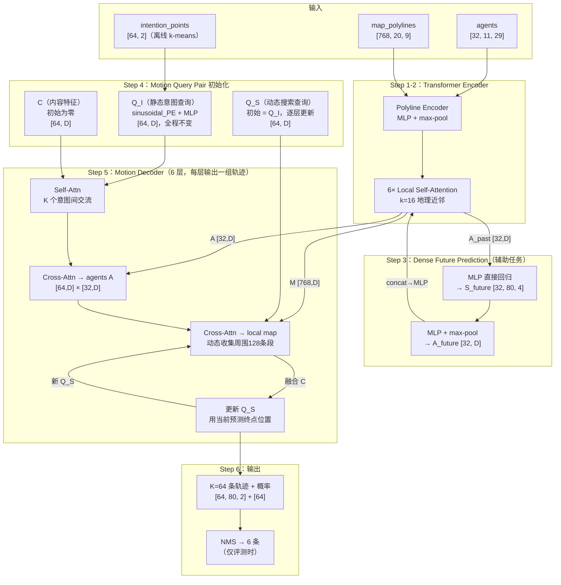

# MTR: Motion Transformer with Global Intention Localization and Local Movement Refinement（Shi et al., NeurIPS 2022）

一句话总结：MTR 提出 Motion Query Pair 机制，用 K=64 个静态意图查询（global intention localization）+ 动态搜索查询（local movement refinement）的配对组合驱动多模态轨迹预测，在 WOMD 边际预测和联合预测双榜排名第一，NeurIPS 2022。

## 基本信息

- 论文：Motion Transformer with Global Intention Localization and Local Movement Refinement
- 作者：Shaoshuai Shi、Li Jiang、Dengxin Dai、Bernt Schiele
- 机构：Max Planck Institute for Informatics, Saarland Informatics Campus
- 发表：NeurIPS 2022（36th Conference on Neural Information Processing Systems）
- arXiv：2209.13508
- 代码：https://github.com/sshaoshuai/MTR

---

## 核心问题

多模态轨迹预测有两条主流路线，各有缺陷：

**Goal-based 方法**（DenseTNT 等）：先撒大量目标候选点，再对每个候选点预测概率 + 完整轨迹。优点是降低了优化难度，每个 query 只负责一个局部区域；缺点是候选点密度决定性能——太少覆盖不够，太多计算爆炸（且是平方级增长）。

**Direct-regression 方法**（Wayformer 等）：直接从场景编码预测 K 条轨迹，不依赖候选点。优点是灵活；缺点是所有模态从同一个 agent feature 里"争夺"，频繁出现的模式主导优化，罕见但重要的模式（如急刹车）收敛慢。

**MTR 的核心洞察**：用少量（K=64）空间分布的**意图锚点（intention points）**代替密集候选点，每个锚点固定负责一个运动模式区域，既解决了 direct-regression 的模式竞争问题，又避免了 goal-based 的密度依赖问题。

---

## 方法：三个核心模块

### 架构总览



图中虚线辅助任务路径（Dense Future Prediction）仅在训练时产生 loss；推理时 A_future 仍参与特征拼接，但辅助 head 的输出不使用。

### 完整模型架构伪代码

```python
# ── 输入 ──────────────────────────────────────────────────────────────
# N_a=32 个 agent，每个 agent 历史 t=11 帧，每帧 C_a=29 个特征（位置/速度/类型等）
# 每个 agent 的历史轨迹 = 一条 polyline（时间轴方向），11 个点，每点 29 维
# → 等价于 agents: [N_a=32, t=11, C_a=29]
# 
# N_m=768 条 map polyline，每条 n=20 个点，每点 C_m=9 个特征
# map 的 polyline 是空间方向（沿车道走向），20 个点大约覆盖 10-20m
# 768 条 polyline 覆盖被预测 agent 周围约 100m 范围内的所有道路段
# → map_polylines: [N_m=768, n=20, C_m=9]
agents:       [N_a, t, C_a]         # [32, 11, 29]
map_polylines: [N_m, n, C_m]        # [768, 20, 9]

# 另外保存每个 agent/map 段的"代表性坐标"（用于计算空间近邻）
# 这些坐标独立于 token 特征，只用于找近邻，不参与 attention 计算
agent_coords: [N_a, 2]              # 每个 agent 当前帧的 (x, y)
map_coords:   [N_m, 2]              # 每条 map 段的中心点 (x, y)

# ── Step 1：Polyline Encoder（每条 polyline 编码为单个向量）─────────────
# 目的：把 [N, n_pts, C] 的 polyline 压缩成 [N, D] 的单向量
# 
# 对于 agents：[N_a=32, t=11, C_a=29]，每个 agent 是 11 个点的时序 polyline
#   → 逐点 MLP（对每个时间步独立计算）：[N_a, 11, 29] → [N_a, 11, D_hidden]
#   → 在时间步维度 max-pool：[N_a, 11, D_hidden] → [N_a, D_hidden]
# 
# 对于 map：[N_m=768, n=20, C_m=9]，每条段是 20 个空间点的折线
#   → 逐点 MLP：[N_m, 20, 9] → [N_m, 20, D_hidden]
#   → max-pool：[N_m, 20, D_hidden] → [N_m, D_hidden]
# 
# 两者用同一套 MLP + max-pool（参数共享），因为格式统一了
A_raw = MLP_maxpool(agents)        # [N_a, D]，每个 agent 的初始特征（D=256）
M_raw = MLP_maxpool(map_polylines) # [N_m, D]，每条 map 段的初始特征

# ── Step 2：Transformer Encoder（局部自注意力）──────────────────────────
# 把 agent 特征和 map 特征拼成一个 token 序列，统一处理
tokens = concat([A_raw, M_raw])    # [N_a + N_m, D]，即 [800, 256]
# 同时把坐标也拼起来，用于找近邻（注意：coords 不参与 attention，只用来找邻居）
all_coords = concat([agent_coords, map_coords])   # [N_a+N_m, 2]

for layer in range(6):             # 6 层局部 self-attention
    # 近邻查找：按实际坐标的欧氏距离，不是按 token 向量的相似度
    # 找每个 token 在地理上最近的 16 个 token（agent 或 map 都可能是邻居）
    neighbor_idx = knn(all_coords, k=16)     # [N_a+N_m, 16]，邻居的索引
    neighbors = tokens[neighbor_idx]          # [N_a+N_m, 16, D]，邻居的 token 特征
    
    # Local Self-Attention：Q=自己，KV=16 个地理近邻
    # Q: [N, D]（当前 token 自身），KV: [N, 16, D]（近邻们）
    Q = W_Q(tokens)                           # [N_a+N_m, D]
    K = W_K(neighbors)                        # [N_a+N_m, 16, D]
    V = W_V(neighbors)                        # [N_a+N_m, 16, D]
    # Q.unsqueeze(1): [N, 1, D]，和 K: [N, 16, D] 做 batch 矩阵乘法
    attn = softmax(Q.unsqueeze(1) @ K.transpose(-1,-2) / sqrt(D))  # [N, 1, 16]
    tokens = (attn @ V).squeeze(1) + tokens   # [N, D]，残差

# 分离 agent 和 map 特征
A_past = tokens[:N_a]    # [N_a, D]，融合了场景上下文的 agent 特征
M = tokens[N_a:]         # [N_m, D]，地图特征

# PE_agent：每个 agent 当前帧坐标 (x, y) 的正弦位置编码，方法同 sinusoidal_PE
# 作用：在 decoder 的 cross-attention 里，告诉 query 每个 key（agent）在空间中的位置
# 不参与 Encoder 计算，在进入 Decoder 之前提前计算好
PE_agent = sinusoidal_PE(agent_coords)   # [N_a, D]

# ── Step 3：Dense Future Prediction（辅助任务）──────────────────────────
# 目的：让 Encoder 的 agent feature 也包含"未来交互"的信息
# 
# S_future = MLP(A_past)：
#   A_past: [N_a, D]
#   MLP 输出层设计成输出 T*4 维（如 T=80 步，每步 4 个值 = x,y,vx,vy）
#   然后 reshape：[N_a, T*4] → [N_a, T, 4]
#
# 「简单 regression，没有 autoregression」是什么意思？
#   - Autoregressive（自回归）：预测第 t+1 步时，把第 t 步的输出作为输入再输入模型
#     → 循环 T 次，每次输入变化，如 RNN/GPT 的 token-by-token 生成
#   - Simple regression（简单回归）：一次性输入 A_past，直接输出所有 T 步的预测
#     → 一次前向传播，不循环，[N_a, D] → [N_a, T*4] → reshape → [N_a, T, 4]
#   这里是 simple regression——一个大 MLP，一步吐出 T=80 步的全部预测
#
# 为什么要先输出 T*4 再变回 [T, 4]？
#   MLP 只能改变最后一维，输出 [N_a, T*4]
#   reshape 只是改变"解读方式"（T*4 个数 = T 步 × 4 个值/步），数据不移动
#   这是把"一个大向量"解读成"T 个时间步的序列"的标准操作
#
# 为什么在这里（Encoder 之后）预测未来？
#   现有工作的 agent feature 只包含历史信息，不感知"未来其他 agent 会去哪里"
#   如果 agent A 要向右变道，但 agent B 正朝那里开过来，
#   仅看 A 的历史轨迹无法知道这个冲突——需要 B 的未来信息
#   Dense Future Prediction 强迫 encoder 在 A_past 里"隐式预判未来"：
#   因为 loss 要求 A_past 必须能预测自己的未来，encoder 必须学到包含未来信息的特征
#   这些未来信息随后通过 A_future 拼接，让 decoder 受益
#   → 这是辅助任务增强特征的标准范式，类似 BERT 的掩码预测
S_future = MLP(A_past).reshape(N_a, T, 4)   # [N_a, T=80, 4]，预测未来 pos + velocity

# 把预测的未来轨迹也 encode 成一个向量，拼回 agent feature
# MLP_maxpool([N_a, T, 4])：先 MLP 升维 [N_a, T, 4] → [N_a, T, D]，再 max-pool 沿 T 轴
A_future = MLP_maxpool(S_future)     # [N_a, D]

# concat 是沿特征维度拼接（dim=-1），不是沿 agent 维度
# [N_a, D] 和 [N_a, D] 在 dim=-1 拼 → [N_a, 2D]
# 然后通过 MLP 压缩回 D 维
A = MLP(concat([A_past, A_future], dim=-1))   # [N_a, 2D] → [N_a, D]

# ── Step 4：Motion Query Pair 初始化 ────────────────────────────────────
# 意图锚点：对训练集 GT 终点做 k-means 聚类，离线预计算
# 
# K=64 个锚点大概是什么样子？（以 agent-centric 坐标系为参考，单位：米）
# 由于 k-means 是从真实数据学出来的，大致分布如下：
#   - 前方直行族：(0, 5m) / (0, 10m) / (0, 20m) / (0, 30m) / (0, 50m) ...（不同距离的直行）
#   - 左转族：(-5, 5m) / (-10, 10m) / (-15, 15m) ...（不同半径的左转）
#   - 右转族：(+5, 5m) / (+10, 10m) ...
#   - 停车族：(0, 0m) / (0, 1m) / (0, 2m)（近距离慢速移动）
#   - 变道族：(-3, 20m) / (+3, 20m)（直行+横向偏移）
# 实际形态比这复杂，且每个锚点覆盖的区域大小由 k-means 的 Voronoi 边界决定
# 
# 开源代码：https://github.com/sshaoshuai/MTR
# 意图锚点的生成见 mtr/datasets/utils/generate_intention_point.py
# 锚点文件保存为 .pkl，训练时加载
intention_points: [K=64, 2]          # K 个 2D 坐标（x, y），每个代表一种运动模式

# Q_I 的生成分两步：
#   1. sinusoidal_PE(intention_points)：把每个 2D 坐标 (x, y) 编码成 D 维向量
#      做法：对 x 和 y 分别做 1D 正弦编码，各得到 D/2 维向量，再 concat：
#        PE_x = [sin(x/10000^0), cos(x/10000^0), sin(x/10000^(2/D)), cos(...), ...]  → [D/2]
#        PE_y = 同理  → [D/2]
#        PE_xy = concat([PE_x, PE_y])  → [D]
#      这一步是固定的数学变换，不含可学习参数
#      作用：(0,10m) 和 (0,12m) 的 PE 向量相近，(0,10m) 和 (-15,10m) 的相差大——
#            空间上近的锚点在向量空间里也近，模型做 attention 时自然倾向于关注相近意图
#   2. MLP(...)：再过一个小型 MLP（含可学习参数），把 D 维正弦编码变换成
#      适合 attention 计算的特征空间，MLP 权重在训练中更新
#
# Q_I 和 Wayformer 的 seeds 的对比：
#   Wayformer：seeds 是完全随机初始化的 [K, D] 可学习参数，通过训练学到含义
#   MTR：Q_I 由锚点坐标经过确定性计算得到，坐标本身就编码了意图的空间位置
#   效果：MTR 的 Q_I 在训练开始时就已经有意义（"前方 30m 的意图"和"左转意图"向量不同），
#         不需要从零学习，训练更稳定，收敛更快
Q_I = MLP(sinusoidal_PE(intention_points))   # [K, D]

# 动态搜索查询（随预测轨迹逐层更新，负责收集局部地图信息）
Q_S = Q_I.clone()                    # [K, D]，初始化和静态 query 相同

# query 内容特征（实际携带的语义信息，初始为 0）
C = zeros(K, D)                      # [K, D]

# ── Step 5：Motion Decoder（N=6 层迭代精化）────────────────────────────
# 选取被预测的 interested agent（WOMD 每个场景 8 个），以该 agent 为坐标中心
# 以下以单个 agent 为例，实际并行处理所有 interested agents
# 
# "并行"是怎么实现的？
#   WOMD 每个场景有 8 个 interested agents，每个 agent 各自需要一套 [K, D] 的 query
#   实现时在 batch 维度上扩展：把 agent 数量并入 batch
#   shapes 变为：C: [N_interested × K, D]，scene_enc: [N_interested × N_a, D]
#   然后用 batch 矩阵运算一次性算完所有 agent 的 decoder
#   → 对 PyTorch 来说和处理 B 个不同的样本一样，GPU 天然支持

for layer in range(6):
    # 5a. Self-Attention：K 个 query 之间交流，让不同意图感知彼此
    #
    # C 的作用：这是每个 query 当前积累的"场景信息"，初始为零
    #   第 1 层：C=0，还没有从场景里学到任何东西
    #   第 2 层：C 已经包含了上一层 cross-attention 聚合到的 agent/map 信息
    #   第 6 层：C 包含了经过 5 轮精化后的丰富场景信息
    #   类比：Wayformer 的 seeds 也是这样——初始随机，随层数积累信息
    #
    # Q_I 在这里的作用：区分 64 个 query 的身份
    #   如果只用 C 做 self-attention（没有 Q_I），第 1 层 query/key 都是零向量，
    #   attention 权重完全随机，64 个 query 无法区分彼此
    #   加入 Q_I 后，query = C + Q_I，每个 query 有不同的空间位置编码，
    #   attention 权重由 Q_I 决定：空间位置相近的意图（如不同距离的直行）互相关注更多
    #
    # 为什么不直接 C = C + Q_I（简单相加）而要放进 attention 做？
    #   直接加只是让每个 query 知道"自己是哪个意图"，但不感知其他意图的存在
    #   经过 self-attention，每个 query 可以看到其他 63 个意图的状态——
    #   比如"我是直行意图，但发现左转意图 C 里已经有了很强的场景信号，
    #   说明左转在这个场景里很合理，我应该调低自己的预测置信度"
    #   这种意图间的协调是直接相加做不到的
    #
    # 为什么 value=C 而不是 value=C+Q_I？
    #   attention 里 value 决定"聚合什么信息"，query/key 决定"关注谁"
    #   Q_I 是位置编码（意图的空间身份），不是场景信息——把它混入 value 会污染
    #   聚合结果，让输出 C_sa 包含位置偏置而非纯粹的场景内容
    #   标准做法（如 DETR）也是 query=key=content+PE，value=content
    #
    # self-attention 里 QKV 可以不同：
    #   "self-attention"只是说 Q/K/V 来自同一组 token（不是来自两个不同序列）
    #   但 Q/K/V 的具体构成可以不同——这里 Q=K=C+Q_I，V=C 是有意设计
    C_sa = MultiHeadAttn(
        query = C + Q_I,    # [K, D]，用位置编码参与相似度计算
        key   = C + Q_I,    # [K, D]
        value = C,          # [K, D]，只聚合纯内容，不混入位置编码
    )                       # [K, D]

    # 5b. Cross-Attention：64 个意图 query 向场景里的 agent 提问
    # query 用 [C_sa, Q_S] 拼接：C_sa 是"我目前对场景的理解"，Q_S 是"我现在关注哪个空间位置"
    # key 用 [A, PE_agent] 拼接：A 是 agent 的特征，PE_agent 是 agent 的空间位置编码
    # value 只用 A：聚合 agent 的特征内容，不混入位置编码
    # 这里 QKV 全都不同：query 是意图 query，key/value 是 agent feature
    # attention 机制只要求 Q 和 K 的最后一维相同（都是 2D），不要求所有变量一致
    C_A = MultiHeadAttn(
        query = concat([C_sa, Q_S], dim=-1),   # [K, 2D]
        key   = concat([A, PE_agent], dim=-1), # [N_a, 2D]
        value = A,                             # [N_a, D]
    )   # [K, D]

    # 5c. Dynamic Map Collection + Cross-Attention（精化轨迹的关键）
    # predicted_traj：当前层输出的 K 条轨迹均值点 Y（来自上一次迭代的 5e，或第 1 层用 Q_S 初始位置）
    # 用 predicted_traj 的终点坐标找周围最近的 128 条 map polyline
    # 好处：随着层数迭代，轨迹预测越来越准，收集到的 map 也越来越局部、越来越相关
    # 第 1 层时 predicted_traj 还不存在，用 Q_S（意图锚点位置）代替，效果类似
    predicted_traj = Y if layer > 0 else Q_S_coords   # [K, T, 2] 或 [K, 2]
    local_map = collect_nearest_polylines(M, predicted_traj, L=128)  # [K, L, D]
    # QKV 设计和 5b 同理：query 是意图 query，key/value 是 map feature（这里完全相同）
    C_M = MultiHeadAttn(
        query = concat([C_sa, Q_S], dim=-1),   # [K, 2D]
        key   = local_map,                     # [K, L, D]
        value = local_map,                     # [K, L, D]
    )   # [K, D]

    # 5d. 融合两类 cross-attention 结果
    C = MLP(concat([C_A, C_M]))   # [K, D]

    # 5e. 预测当前层的轨迹（6 维 GMM 参数）
    # 6 = (μx, μy, σx, σy, ρ, logit_prob)
    #   μx, μy：该时间步的预测位置（均值）
    #   σx, σy：x/y 方向的不确定性（标准差）
    #   ρ：x 和 y 方向误差的相关系数（-1~1），描述"向右偏的同时是否也向前偏"
    #      用于建模非轴对齐的误差椭圆，比如车辆转弯时横向和纵向误差相关
    #      ρ 出现在 loss 的 2D 高斯 NLL 公式里（联合概率密度），不加它就退化为独立假设
    #   logit_prob：这条轨迹的未归一化概率（softmax 后得到 K 条轨迹的概率分布）
    Z = MLP(C)         # [K, T, 6]
    Y = Z[..., :2]     # [K, T, 2]，取 (μx, μy) 作为轨迹点用于 5f 和 5c

    # 5f. 更新动态搜索 query：用当前预测的终点位置替换 Q_S
    # 效果：下一层的 5c 会收集新终点周围的 map，5b 的 query 也指向新位置
    # 这是"Local Movement Refinement"名称的来源——每层都在精化终点位置，地图收集随之精化
    Q_S = MLP(sinusoidal_PE(Y[:, -1, :]))   # [K, D]，Y[:,-1,:] 是 K 条轨迹各自的终点

# ── Step 6：输出（只取最后一层的 Z）────────────────────────────────────
# 中间层（层 0~4）的 Z 在训练时已经用于深度监督 loss，不在这里处理
# 这里只使用最后一层（层 5）的输出
probs = softmax(Z[..., -1])    # [K]，每条轨迹的概率
trajs = Z[..., :2]             # [K, T, 2]，K 条轨迹的均值点

# 评测时：用 NMS 把 K=64 条轨迹压缩到 6 条（不可微后处理，仅评测时执行）
# 训练时：全部 K=64 条参与 WTA loss（找最近的一条做回归+分类 loss），不做 NMS
final_trajs, final_probs = NMS(trajs, probs, threshold=2.5m, K_out=6)
```

**和 Wayformer 的关键区别**：

| | Wayformer | MTR |
|---|---|---|
| **query 初始化** | 随机初始化的 learned seeds | k-means 意图锚点（空间分布） |
| **query 是否更新** | 静态（每层相同 seeds）| 动态（Q_S 随预测更新位置）|
| **地图特征收集** | 整个场景的 road graph | 当前预测轨迹周围动态收集 |
| **encoder attention** | 全局 self-attention（展平所有 token）| 局部 self-attention（k=16 近邻）|
| **辅助任务** | 无 | Dense Future Prediction（预测所有 agent 未来）|

---

### 1. Transformer Encoder：局部自注意力场景编码

**输入**：向量化的 agent 历史轨迹（polyline 表示）和 HD map（polyline 段）。

**局部自注意力（Local Self-Attention）**：不是对所有 polyline 做 full attention（O(N²)），而是每个 polyline 只 attend 到 k=16 个最近邻 polyline。

优势一：维持局部结构信息（相邻车道的关系比远处车道更重要）。
优势二：内存效率高，可以处理更大的地图范围（全局 attention 在 768 条 polyline 时 OOM，局部 attention 在 1024 条时还能运行）。Table 4 显示局部 attention 比全局 attention 在 512 条 polyline 时 mAP 高 +1.12%。

**Dense Future Prediction（辅助任务）**：在 encoder 之后加一个轻量 regression head，直接预测场景中所有 agent 的未来轨迹和速度。这些预测的未来状态被编码后拼接到 agent feature 里，给 decoder 提供"未来交互"的上下文——现有工作通常只建模历史交互，忽略未来轨迹之间的相互影响。Table 3 显示这个辅助任务带来 +1.78% mAP 提升。

**输出**：agent feature $A \in \mathbb{R}^{N_a \times D}$ 和 map feature $M \in \mathbb{R}^{N_m \times D}$（D=256）。

---

### 2. Motion Query Pair：核心创新

每个 Motion Query Pair 由两个查询组成：

**Static Intention Query（静态意图查询）** $Q_I$：

K=64 个意图锚点 $I \in \mathbb{R}^{K \times 2}$，通过对训练集所有 GT 轨迹终点做 k-means 聚类得到，代表 K 种典型运动意图（直行到不同距离、左转、右转、停止等）。每个 $Q_I$ 是对应意图点位置的可学习 positional embedding：

```
Q_I = MLP(PE(I))   # [K, D]
```

静态意图查询从始至终不变，代表"这个 query 负责的运动模式"。作用：在 decoder 各层的 self-attention 中传播不同运动意图之间的信息。

**Dynamic Searching Query（动态搜索查询）** $Q_S$：

初始化为对应意图点位置的 embedding，但在每个 decoder 层后更新为该层预测轨迹终点的位置 embedding：

```
Q_S^{j+1} = MLP(PE(Y_T^j))   # 用第j层预测的终点更新
```

动态搜索查询随预测轨迹迭代移动，负责收集轨迹周围的局部地图特征（Dynamic Map Collection：取离当前预测轨迹最近的 L=128 条 polyline）。作用：逐层精化轨迹，越来越关注与当前预测轨迹相关的局部道路环境。

**类比**：静态 query 是"我要去哪个大方向"（全局意图定位），动态 query 是"沿着这个方向走时，我要注意什么局部细节"（局部运动精化）。

---

### 3. Decoder：N 层迭代精化

N=6 个 decoder 层堆叠，每层的计算：

```python
# Step 1：Self-Attention（意图间交互）
# 用静态 intention query 作为位置 embedding
C_sa = MultiHeadAttn(query=C + Q_I, key=C + Q_I, value=C)   # [K, D]

# Step 2：Cross-Attention to agent features
C_A = MultiHeadAttn(query=[C_sa, Q_S], key=A, value=A)       # [K, D]

# Step 3：Cross-Attention to map features（用动态 query 定位局部地图）
α(M) = collect L nearest polylines along predicted trajectory
C_M = MultiHeadAttn(query=[C_sa, Q_S], key=α(M), value=α(M)) # [K, D]

# Step 4：融合 + 预测
C = MLP([C_A, C_M])                    # [K, D]
Z = MLP(C)                             # [K, T, 6] GMM 参数（μx,μy,σx,σy,ρ,p）
Y = extract_centers(Z)                 # [K, T, 2] 预测轨迹
Q_S = MLP(PE(Y_T))                    # 用终点更新动态 query → 下一层
```

每层都输出 K 条轨迹，但用途不同：**中间层的输出只用于深度监督**（每层计算一次 loss，梯度直接反传到该层，防止梯度消失）；**只有最后一层的输出才是最终预测**，评测时经过 NMS 从 K=64 条压缩到 6 条。推理时中间层的轨迹也会用于更新 Q_S（为下一层定位局部地图），但不对外输出。

---

## 训练 Loss

MTR 的 loss 由两部分组成：

### 主 Loss：GMM 回归 + WTA 分类

对最终 decoder 层的输出（以及中间层，各层权重相等）：

$$\mathcal{L}_{\text{main}} = \mathcal{L}_{\text{reg}} + \mathcal{L}_{\text{cls}}$$

- **回归 loss** $\mathcal{L}_{\text{reg}}$：找 K=64 条中和 GT 终点最近的那条（赢家 $k^*$），对该条轨迹计算 Gaussian NLL：$-\sum_t \log \mathcal{N}(y_t \mid \mu_t, \Sigma_t)$
- **分类 loss** $\mathcal{L}_{\text{cls}}$：让赢家那条的概率最高，$-\log p_{k^*}$（交叉熵）
- **Winner-Takes-All（WTA）**：只有赢家 $k^*$ 参与 $\mathcal{L}_{\text{reg}}$，其余 K-1 条不被惩罚——迫使不同意图锚点分化成不同的运动模式专家

### 辅助 Loss：Dense Future Prediction

对 Step 3 中预测的所有 agent 未来轨迹，用 L1 regression loss：

$$\mathcal{L}_{\text{aux}} = \frac{1}{N_a \cdot T} \sum_{a=1}^{N_a} \sum_{t=1}^{T} \| S_{\text{future}}[a, t] - Y_{\text{GT}}[a, t] \|_1$$

这是 Dense Future Prediction 之所以有效的关键——loss 强迫 encoder 的 $A_{\text{past}}$ 特征里必须包含足够的信息来预测所有 agent 的未来。没有这个 loss，encoder 就不会"主动"在特征里编码未来交互信息。

**Dense Future Prediction 和意图锚点 loss 的分工**：这里预测"所有 agent 的未来"，和 decoder 用 64 个意图锚点预测是两件完全不同的事情，目标也不同：
- **Dense Future Prediction（辅助任务）**：对场景里全部 $N_a$ 个 agent 各预测一条粗糙轨迹，用简单 MLP 一次输出，没有多模态（每个 agent 只给一条）。目的不是得到精确轨迹，而是强迫 encoder 特征包含足够信息——loss 粗糙是有意为之，这个 head 只是"信息注入的工具"，推理时不使用它的输出
- **Decoder 主任务**：只对被预测的 interested agent（通常 8 个）做精细预测，输出 K=64 条多模态轨迹（覆盖不同运动意图），是最终评测用的结果

所以两个 loss 不冲突：Dense Future Prediction 是辅助手段，让 encoder 更强；意图锚点 decoder 是主线，产出最终多模态预测。

### 总 Loss

$$\mathcal{L} = \mathcal{L}_{\text{main}} + \lambda_{\text{aux}} \cdot \mathcal{L}_{\text{aux}}, \quad \lambda_{\text{aux}} = 1.0$$

每层 decoder 的输出都计算 $\mathcal{L}_{\text{main}}$（深度监督），各层权重相等。这种做法叫**深度监督（Deep Supervision）**：不只对最后一层算 loss，中间每层也有独立的 loss 信号直接反传梯度到该层。

好处是解决深层网络的梯度消失问题——6 层堆叠时，如果只有最后一层有 loss，梯度从第 6 层反传到第 1 层需要经过 5 次乘法，容易衰减到接近零，第 1 层参数几乎不更新。每层都有 loss 后，第 1 层可以直接收到梯度，训练更稳定。

这个技巧不是 MTR 独有的，在多层 decoder 结构里很常见。DETR（目标检测）的 6 层 decoder 也对每层计算匹配 loss；UniAD 的规划模块也用了类似的逐层监督。代价是计算量略增（每层都要算一次 loss），但训练更快收敛。

---

## 关键结果

### WOMD 边际预测（Table 1，测试集）

| 方法 | minADE ↓ | minFDE ↓ | Miss Rate ↓ | mAP ↑ |
|------|---------|---------|------------|-------|
| SceneTransformer | 0.6117 | 1.2116 | 0.1564 | 0.2788 |
| MultiPath++ | 0.5557 | 1.1577 | 0.1340 | 0.4092 |
| **MTR（单模型）** | **0.6050** | **1.2207** | **0.1351** | **0.4129** |
| MTR-Advanced-ens | 0.5640 | 1.1344 | 0.1160 | 0.4492 |

MTR 单模型在 mAP 上超过 MultiPath++（集成方法）：**+0.37%**（0.4129 vs 0.4092），并将 miss rate 从 15.64% 降至 13.51%。

### WOMD 联合预测（Table 2，测试集）

| 方法 | minADE ↓ | minFDE ↓ | Miss Rate ↓ | mAP ↑ |
|------|---------|---------|------------|-------|
| SceneTransformer | 0.9774 | 2.1892 | 0.4942 | 0.1192 |
| M2I | 1.3506 | 2.8325 | 0.5538 | 0.1239 |
| **MTR** | **0.9181** | **2.0633** | **0.4411** | **0.2037** |

联合预测 mAP 从 12.39%（SceneTransformer）提升到 **20.37%**，+7.98%——这是因为 MTR 的 scene-centric 编码更好地建模了两个 agent 之间的交互。

**发布时（2022-05-19）在 WOMD 边际和联合预测双榜排名第一。**

### 消融实验（Table 3，WOMD 验证集）

| 配置 | minADE | minFDE | Miss Rate | mAP |
|------|--------|--------|-----------|-----|
| 只用 latent embedding（无意图锚点） | 0.7036 | 1.4651 | 0.1845 | 0.3059 |
| + 静态意图查询（无迭代精化） | 0.6919 | 1.4217 | 0.1776 | 0.3171 |
| + 迭代精化（无局部运动精化） | 0.6833 | 1.4059 | 0.1756 | 0.3234 |
| + 局部运动精化（无 Dense Future） | 0.6735 | 1.3847 | 0.1706 | 0.3284 |
| **全部组件** | **0.6697** | **1.3712** | **0.1668** | **0.3437** |

静态意图查询的引入带来 mAP +4.26%，是最大的单项贡献。

---

## 局限性

1. **NMS 后处理**：从 K=64 条轨迹用 NMS 选 6 条，是不可微的离散操作，无法端到端优化。MTR-e2e 变体用 K=6 训练来解决这个问题，但 mAP 略低于 MTR（无 explicit intention）
2. **K-means 意图点的质量依赖**：意图点由训练集终点聚类得到，对分布 shift 敏感（训练集没覆盖的运动模式可能没有对应的意图点）
3. **Agent-centric 建模**：每个 interested agent 独立预测，N 个 agent = N 次前向传播（与 Wayformer 同样的问题）

---

## 现状与影响

**一句话定性**：MTR 是运动预测领域"意图锚点 + 迭代精化"范式的奠基作，发布时 WOMD 双榜第一，并在 Waymo Open Dataset Challenge 2022 获冠军，MTR++ 系列在 2023-2024 年持续占据 WOMD 排行榜前列。

- **MTR++（2023）**：引入多代理联合建模和更强的场景编码，进一步提升联合预测性能
- **ProphNet、QCNet 等（2023-2024）**：受 MTR 意图查询设计启发，探索不同的 query 初始化和动态更新策略
- **MotionDiffuser（2023）**：用扩散模型替换 GMM decoder，复用 MTR 风格的场景编码
- **WOMD Leaderboard**：MTR 系列（MTR、MTR++、MTR-Advanced）长期占据排行榜前列，是 2022-2024 年的标准参考

---

## 和 wiki 内其他概念的关联

- [Attention 直觉：Self/Cross/Local 三种模式](../20-concepts/attention-intuition.md)：MTR 中用到了 Local Self-Attention（Encoder）和多重 Cross-Attention（Decoder），这篇文档从直觉到变体全面解释 Q/K/V 的各种用法
- [位置编码（PE）](../20-concepts/positional-encoding.md)：MTR 的意图锚点用正弦 PE 将 2D 坐标编码成 D 维向量，Q_S 的更新也用正弦 PE 将终点坐标编码；本文档覆盖正弦/可学习/RoPE/ALiBi 各类 PE 的原理和使用场景
- [Wayformer](./wayformer-2207.05844.md)：MTR 的直接前驱工作，MTR 在 mAP 上超越 Wayformer；Wayformer 用 learned seeds，MTR 用 k-means 意图锚点——两者的 query 初始化策略不同
- [WOMD](./waymo-open-motion-dataset.md)：MTR 的训练和评测数据集，边际/联合预测双榜
- [自动驾驶模型评测全栈概览](../00-overview/av-model-evaluation.md)：mAP 是 WOMD 的主排行榜指标，MTR 是该指标下的代表性工作

## 附录：输入特征详解

### 关于输入 shape 的说明

**Agent 的 polyline 格式是什么意思？**

Agent 历史的 shape 是 `[N_a=32, t=11, C_a=29]`——32 个 agent，每个有 11 帧历史，每帧 29 个特征。

"polyline 格式"就是说：把一个 agent 的 t 帧历史看作一条折线，时间轴方向是折线的走向，每帧一个"点"（带 29 维特征）。这和地图上的 polyline 是同一个抽象——地图的 polyline 是空间方向上的折线（沿道路），agent 的 polyline 是时间方向上的折线（沿时序）。两者统一到同一个"polyline"的数据格式后，可以用同一套 Polyline Encoder 处理。

**ego 是否特殊？**

WOMD 里被预测的是 8 个"interested agents"（由数据集指定，通常是场景中有重要行为的车），自车（ego）通常也是其中之一，但没有特殊处理——它作为 N_a 个 agent 之一被统一编码。模型对每个 interested agent 各自以该 agent 为坐标原点做一次预测，对"哪个是自车"不感知。

**世界坐标 vs agent-centric 坐标的影响**

世界坐标系（固定原点）下，不同位置的 agent 坐标数值差异很大（可能差 1000m），模型难以学到泛化的位置相关模式。以被预测 agent 为原点的 agent-centric 坐标系下，所有 agent 和地图特征都是相对于"我"的偏移，模型只需要学"相对关系"，泛化性更好。代价是每次预测一个 agent 都要做一次坐标变换，但对于 N_a=32 个 agent 并行处理，开销可接受。

---

### Agent 特征（C_a = 29 维）

完整 shape：`[N_a=32, t=11, C_a=29]`，每个 agent 有 t=11 帧历史，每帧 29 个特征：

```
每帧（一个时间步）的 29 个特征：
 [0]   x              当前位置 x（agent-centric 坐标系，以 ego agent 为原点）
 [1]   y              当前位置 y
 [2]   heading_cos    cos(朝向角)      ← 用 cos/sin 代替角度，避免 ±π 的不连续性
 [3]   heading_sin    sin(朝向角)
 [4]   vx             速度 x 分量（m/s）
 [5]   vy             速度 y 分量（m/s）
 [6]   length         车辆长度（米）
 [7]   width          车辆宽度（米）
 [8]   height         车辆高度（米）
 [9]   valid          该帧是否有效（1=存在，0=遮挡或未出现）
 [10]  type_vehicle   是否是机动车（one-hot 开始）
 [11]  type_pedestrian 是否是行人
 [12]  type_cyclist   是否是骑行者
 # 以下是帧间差分（相邻帧的变化量）
 # 既然已经有速度 (vx, vy)，为什么还需要差分 (dx, dy)？
 # 速度是"当前时刻的瞬时速度估计"，差分是"实际观测到的位移"
 # 两者不完全相同：速度来自传感器估计，位移来自相邻帧位置相减
 # 差分更直接反映轨迹的实际运动，对非匀速运动更准确
 [13]  dx              Δx（当前帧 - 上一帧）
 [14]  dy              Δy
 [15]  dheading_cos    Δcos(heading)
 [16]  dheading_sin    Δsin(heading)
 [17]  dvx             Δvx
 [18]  dvy             Δvy
 # polyline 方向向量（从上一点到当前点的单位向量）
 [19]  dir_x           折线段方向 x 分量
 [20]  dir_y           折线段方向 y 分量
 # 时间步信息
 [21]  time_idx        当前帧的时间步索引（0=最早历史帧，t-1=当前帧）
 # 相对于 ego 的位置
 [22]  rel_x           相对于被预测 agent 的 x 偏移
 [23]  rel_y           相对于被预测 agent 的 y 偏移
 # ... 共 29 维（具体字段因实现版本略有差异）
```

**为什么用 polyline 格式而不是把所有帧展平**：polyline 把一个 agent 的 t 帧历史表示为 t 个点的折线，每个点包含该帧的状态 + 和上一帧的差分。这样 Polyline Encoder 就可以用同一个 MLP 处理不同长度的历史（对任意 t 都适用），而且和 map polyline 的格式统一，可以共享同一套 encoder 参数。

---

### Map Polyline 特征（C_m = 9 维）

完整 shape：`[N_m=768, n=20, C_m=9]`，768 条折线段，每段 20 个点，每点 9 个特征。

**每段 20 个点大概有多长？**：WOMD 的 map 折线按约 0.5m 一个点采样，20 个点约覆盖 10m 长度的道路段。这是单个线段的长度，整个场景里的所有线段拼起来描述了完整的路网。

**768 条 polyline 覆盖多大范围？**：MTR 取距被预测 agent 最近的 768 条（实际是论文里 N_m=768 的配置），覆盖约 100m 半径范围内的道路段。768 这个数字不是固定规则，是在"覆盖范围足够"和"内存/计算可接受"之间调出来的超参数。

**type 字段在每个点里都重复了，浪费吗？**：确实冗余，每条线段的道路类型对所有 20 个点相同。这是为了让每个点自包含（不需要查段级别的属性），方便逐点 MLP 处理。内存开销相当于额外的 `20 × 5 × N_m × 4bytes`，可接受。

每条 map polyline 被切分成若干小段（每段 20 个点），每个点 9 个特征：

```
每个点的 9 个特征：
 [0]   x              折线点位置 x（agent-centric 坐标系）
 [1]   y              折线点位置 y
 [2]   dir_x          折线段方向向量 x（从当前点到下一点的单位向量）
 [3]   dir_y          折线段方向向量 y
 [4]   type_0         道路类型 one-hot 第 0 位（LANE_SURFACE_STREET）
 [5]   type_1         道路类型 one-hot 第 1 位（ROAD_LINE）
 [6]   type_2         道路类型 one-hot 第 2 位（ROAD_EDGE）
 [7]   type_3         道路类型 one-hot 第 3 位（STOP_LINE）
 [8]   type_4         道路类型 one-hot 第 4 位（CROSSWALK）
```

---

### Polyline Encoder（PointNet-like）是什么

**问题**：一条 polyline 有 n=20 个点，每个点 C 维特征，总共 `[n, C]` 的 tensor。怎么把它压缩成一个固定大小的向量 `[D]`，代表整条 polyline 的语义？

**PointNet 思路**（Charles Qi et al., CVPR 2017，点云深度学习的奠基作）：

```python
# 输入：n 个点，每点 C 维特征
polyline: [n, C]

# Step 1：对每个点独立做 MLP（逐点特征变换）
per_point_features = MLP(polyline)   # [n, D_hidden]，每个点升维

# Step 2：max-pool 聚合所有点的信息成一个向量
global_feature = per_point_features.max(dim=0)   # [D_hidden]，取每维最大值

# 最终输出：一个固定 D 维向量，代表整条 polyline
```

**为什么用 max-pool 而不是 mean 或 sum**：max-pool 对点的排列顺序不敏感（permutation invariant）——对于点云/无序集合，把 20 个点打乱顺序，max-pool 结果不变。这对于 polyline 编码很重要：polyline 上的点是有顺序的（时序/空间），但 max-pool 捕获的是"这条 polyline 上最显著的特征"，对局部扰动鲁棒。另外，方向向量 `[dir_x, dir_y]` 会让模型知道 polyline 的走向，弥补 max-pool 丢失顺序信息的不足。

**D 的大小**：MTR 使用 D=256（所有 MLP 的输出维度统一为 256）。

---

## 值得看的部分 / 相关资料

- **Figure 1（架构总览）**：Dense Future Prediction、Dynamic Map Collection、Motion Decoder 三个模块的整体流程
- **Figure 3（动态地图收集的直觉图）**：展示三个 motion query 各自负责不同方向，dynamic searching query 随预测轨迹移动，聚焦不同局部地图区域
- **Table 3（消融）**：各组件对 mAP 的贡献拆分，是理解设计动机的最直接证据
- 相关工作：
  - Wayformer（arXiv:2207.05844，ICRA 2023）：MTR 的主要比较对象
  - SceneTransformer（arXiv:2106.08417，ICLR 2022）：另一个 WOMD 竞争方法
  - VectorNet（CVPR 2020）：MTR 向量化场景表示的来源
