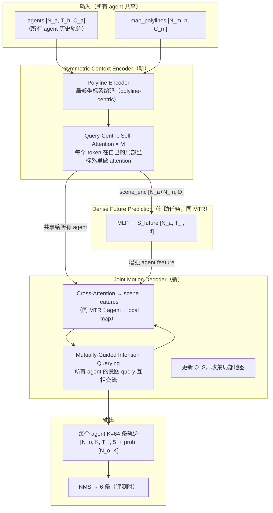

# MTR++: Multi-Agent Motion Prediction with Symmetric Scene Modeling and Guided Intention Querying（Shi et al., TPAMI 2024）

一句话总结：MTR++ 在 MTR 的基础上增加两个模块——共享场景编码的 Symmetric Context Encoder 和跨 agent 传播意图信息的 Mutually-Guided Intention Querying——使多 agent 同时预测成为可能，在 WOMD 边际和联合预测双榜夺冠（2022、2023 年 Waymo Challenge）。

## 基本信息

- 论文：MTR++: Multi-Agent Motion Prediction with Symmetric Scene Modeling and Guided Intention Querying
- 作者：Shaoshuai Shi\*、Li Jiang\*、Dengxin Dai、Bernt Schiele（\* 同等贡献）
- 机构：Max Planck Institute for Informatics, Saarland Informatics Campus
- arXiv：2306.17770（2023-06，最终版 2024-03）
- 发表：IEEE Transactions on Pattern Analysis and Machine Intelligence（TPAMI 2024）
- 代码：https://github.com/sshaoshuai/MTR

---

## 核心问题

MTR 每次只预测一个 interested agent，场景编码以该 agent 为中心（focal-agent-centric）。WOMD 每个场景有 8 个被预测 agent，MTR 需要独立做 8 次前向传播，导致：

1. **计算冗余**：8 个 agent 共享同一场景，每次编码却重复计算；随 agent 数量增长，延迟线性增长（8 agents→193ms，32 agents→更高）
2. **意图隔离**：各 agent 独立预测，不感知彼此的未来意图——agent A 和 agent B 的预测轨迹可能在空间上发生冲突，不满足场景合理性

MTR++ 的目标：在保持 MTR 预测质量的同时，支持多 agent 同时预测，并让不同 agent 的预测轨迹互相感知、保持场景一致性。

---

## 方法：两个核心改进

### 架构总览

### 改进一：Symmetric Context Encoder

**MTR 的问题**：编码器以单个 focal agent 为全局坐标原点（focal-agent-centric），所有 token 的坐标都相对于该 agent。这意味着编码的场景特征只能用于预测那一个 agent，无法共享给其他 agent。

**MTR++ 的做法**：改用 **polyline-centric 局部坐标系**——每条 polyline（agent 轨迹或 map 段）都在自己的局部坐标系里编码，坐标不依赖任何 focal agent：

$$F_A^{(l)} = \phi\!\left(\text{MLP}\!\left(\Gamma(S_A^{(g)})\right)\right), \quad F_M^{(l)} = \phi\!\left(\text{MLP}\!\left(\Gamma(S_M^{(g)})\right)\right)$$

其中 $\Gamma(\cdot)$ 是坐标变换函数，把全局坐标转换到每条 polyline 的局部坐标系（以该 polyline 当前位置和朝向为基准）。

**Query-Centric Self-Attention**：attention 计算时，每个 token 把其他 token 的坐标转换到自己的局部坐标系再做 attention：

$$F'^{(l)}_{\text{AM}[i]} = \text{MHSA}\!\left(Q: [F^{(l)}_{\text{AM}[i]}, \text{PE}(R_{\text{AM}[i,i]})],\ K: \{[F^{(l)}_{\text{AM}[j]}, \text{PE}(R_{\text{AM}[i,j]})]\}_{j\in\Omega(i)},\ V: \{F^{(l)}_{\text{AM}[j]} + \text{PE}(R_{\text{AM}[i,j]})\}_{j\in\Omega(i)}\right)$$

其中 $R_{\text{AM}[i,j]}$ 是 token $j$ 在 token $i$ 局部坐标系里的相对位置和方向。

**效果**：场景编码只需做一次，得到的 $F_{\text{AM}}^{(l)} \in \mathbb{R}^{(N_a+N_m) \times D}$ 可以直接被场景里任意 agent 的 Decoder 使用——计算量从 $O(N_o)$ 次降为 $O(1)$ 次（$N_o$ 是 interested agent 数量）。

### 改进二：Mutually-Guided Intention Querying

**MTR 的问题**：每个 agent 的 K 个意图 query 各自独立更新，不感知其他 agent 的意图——可能预测出两辆车都直行进入同一空间的冲突轨迹。

**MTR++ 的做法**：把所有 $N_o$ 个 agent 的意图 query 组织成 $E_1^{(m)} \in \mathbb{R}^{N_o \times K \times D}$，在 Decoder 的每一层，用 query-centric self-attention 让**不同 agent 的意图 query 互相交流**：

$$F'^{(m)}_{1[i]} = \text{MHSA}\!\left(Q: [F^{(m)}_{1[i]} + E^{(m)}_{1[i]}, \text{PE}(R_{1[i,i]})],\ K: \{[F^{(m)}_{1[j]} + E^{(m)}_{1[j]}, \text{PE}(R_{1[i,j]})]\}_{j\in\Omega(i)},\ V: \{F^{(m)}_{1[j]} + E^{(m)}_{1[j]} + \text{PE}(R_{1[i,j]})\}_{j\in\Omega(i)}\right)$$

其中 $i \in \{1, \ldots, N_o K\}$，每个 agent 的 K 个意图 query 同时考虑**同一 agent 内不同意图间的交流**（Within Each Agent）和**跨 agent 的意图交流**（Across Different Agents）。

**直觉**：agent A 的"直行"意图 query 看到 agent B 的"直行"意图 query 也在同一空间位置时，会降低自己的预测置信度，或调整预测方向以避免冲突。

### Loss（同 MTR，稍有调整）

$$L_{\text{SUM}} = L_{\text{GMM}} + L_{\text{DMP}}$$

- $L_{\text{GMM}}$：对最近的意图 query（赢家）计算 Gaussian NLL + 交叉熵，WTA 机制同 MTR
- $L_{\text{DMP}}$：Dense Future Prediction 的 L1 辅助 loss，同 MTR

---

## 训练 vs 推理差异

| 方面 | 训练 | 推理 |
|------|------|------|
| **输入** | WOMD 标注场景，GT 轨迹用于 loss 计算 | 任意场景的 agent 历史轨迹 + HD map polylines |
| **输出使用** | 全部 K=64 条轨迹参与 WTA loss | 用 NMS 压缩到 6 条，取概率最高的用于规划/评测 |
| **Dense Future Prediction** | 有辅助 loss，梯度反传，增强 encoder | 仍然运行（encoder 增强），但辅助 head 输出不使用 |
| **意图 query 交互** | 训练时全部 N_o 个 agent 同步更新 | 推理时同样并行，inference latency 不随 agent 数量线性增长（Encoder 只跑一次）|
| **坐标系** | polyline-centric，不需要指定 focal agent | 同训练，Encoder 输出可供任意 agent 的 Decoder 复用 |

**推理输入**：
- `agents`：场景内所有 agent 的历史轨迹 polyline，`[N_a, T_h, C_a]`
- `map_polylines`：HD map 道路段 polyline，`[N_m, n, C_m]`
- `intention_points`：离线 k-means 聚类好的 K=64 个锚点坐标（`.pkl` 文件，训练时固定）

**推理输出**：
- 每个 interested agent 的 6 条轨迹（NMS 后）：`[N_o, 6, T_f, 2]`（均值点）+ 概率 `[N_o, 6]`

---

## 关键结果

### WOMD 边际预测（Table 1，测试集）

| 方法 | minADE ↓ | minFDE ↓ | Miss Rate ↓ | mAP ↑ |
|------|---------|---------|------------|-------|
| MTR（NeurIPS 2022） | 0.6050 | 1.2207 | 0.1351 | 0.4129 |
| **MTR++** | **0.5906** | **1.1939** | **0.1298** | **0.4329** |
| MTR++_Ens（集成）| 0.5581 | 1.1166 | 0.1122 | 0.4634 |

MTR++ 单模型相比 MTR：mAP +2.00%，Miss Rate 降低 0.53pp。

### WOMD 联合预测（Table 2，测试集）

| 方法 | minADE ↓ | minFDE ↓ | Miss Rate ↓ | mAP ↑ |
|------|---------|---------|------------|-------|
| MTR | 0.9181 | 2.0633 | 0.4411 | 0.2037 |
| **MTR++** | **0.8795** | **1.9509** | **0.4143** | **0.2326** |

联合预测 mAP +2.89%，在建模多 agent 未来交互方面提升显著。

### 效率对比（Table 3，RTX 8000 GPU，32 agents per scene）

| 方法 | 参数量 | 延迟（32 agents）| 内存（32 agents）|
|------|--------|----------------|----------------|
| MTR | 65.8M | 193ms | 15.6 GB |
| MTR++ | 86.6M | 118ms | 5.2 GB |

MTR++ 参数更多，但延迟更低（-38%）、内存更少（-67%），原因是 Encoder 只跑一次。

---

## 消融实验（Table 8/9）

| 配置 | mAP ↑ |
|------|-------|
| MTR（基线） | 0.3539 |
| + Symmetric Context Encoder（MTR+） | 0.3505（略降，但效率大幅提升）|
| + Mutually-Guided Intention Querying（MTR++）| **0.3754**（+2.49pp vs MTR+）|

- 去掉意图 query 内部交互（Within Each Agent）：mAP -2.13%
- 去掉跨 agent 意图交互（Across Different Agents）：mAP -2.49%（影响更大）
- 去掉 Dense Future Prediction：mAP -1.48%
- 去掉 query-centric relative PE：mAP -2.41%

---

## 局限性

1. **mAP 整体偏低**：模型概率校准不足，约 45.5% 的 agent 最佳预测轨迹排名在第 0 位（即 rank-0 rate 最高，如 Fig. 10），但仍有大量场景最佳轨迹排名靠后，拉低 AP
2. **罕见行为覆盖不足**：在稀少的运动模式（如急刹车、掉头）上，意图锚点可能覆盖不够，仍可能生成同质化轨迹（Fig. 11 展示了失败案例）
3. **意图锚点依赖训练数据分布**：k-means 锚点对 out-of-distribution 场景（非 WOMD 数据分布）可能泛化较差

---

## 现状与影响

**一句话定性**：MTR++ 是运动预测领域"多 agent 联合预测"方向的里程碑，2022/2023 年 Waymo Challenge 双冠军，query-centric self-attention 和 mutually-guided intention querying 成为后续工作的参考范式。

- **Waymo Challenge 2022/2023**：MTR 和 MTR++ 分别夺冠，是目前 WOMD leaderboard 上最强的公开方法之一
- **后续工作**：QCNet（2023）、Forecast-MAE 等延续了 query-centric 编码的思路；MotionDiffuser（2023）复用了 MTR 风格的 scene encoder
- **截至 2026 年**：MTR++ 仍是 WOMD marginal/joint 双榜的顶尖方法之一，paper 中的 symmetric encoding + intention querying 框架被广泛引用

---

## 和 wiki 内其他概念的关联

- [MTR: Motion Transformer](./mtr-2209.13508.md)：MTR++ 的前身，理解 MTR 是阅读本文的前提
- [Wayformer](./wayformer-2207.05844.md)：同为基于 transformer 的运动预测，但 Wayformer 不做多 agent 联合预测
- [Attention 直觉](../20-concepts/attention-intuition.md)：Query-Centric Self-Attention 是 Local Self-Attention 的变体，在相对坐标系下做 attention
- [高斯混合模型（GMM）](../20-concepts/gaussian-mixture-model.md)：MTR++ 同样用 GMM 建模多模态轨迹分布，WTA loss 机制相同
- [WOMD](./waymo-open-motion-dataset.md)：主要评测数据集，marginal/joint 双榜

## 值得看的部分 / 相关资料

- **Section 4（MTR++ framework）**：对称场景编码和 mutually-guided intention querying 的完整推导
- **Table 8/9**：两个核心模块的消融，最直接地说明了各自贡献
- **Fig. 8**：随 agent 数量增加的延迟/内存对比，直观展示 symmetric encoding 的效率优势
- **Fig. 7**：多 agent 预测的定性结果，可以看到场景合理性（agent A 让行 agent B）
- MTR（arXiv:2209.13508）：本文前身，必须先读
