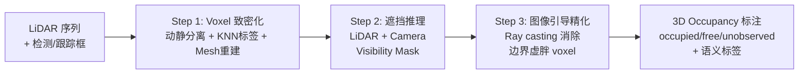
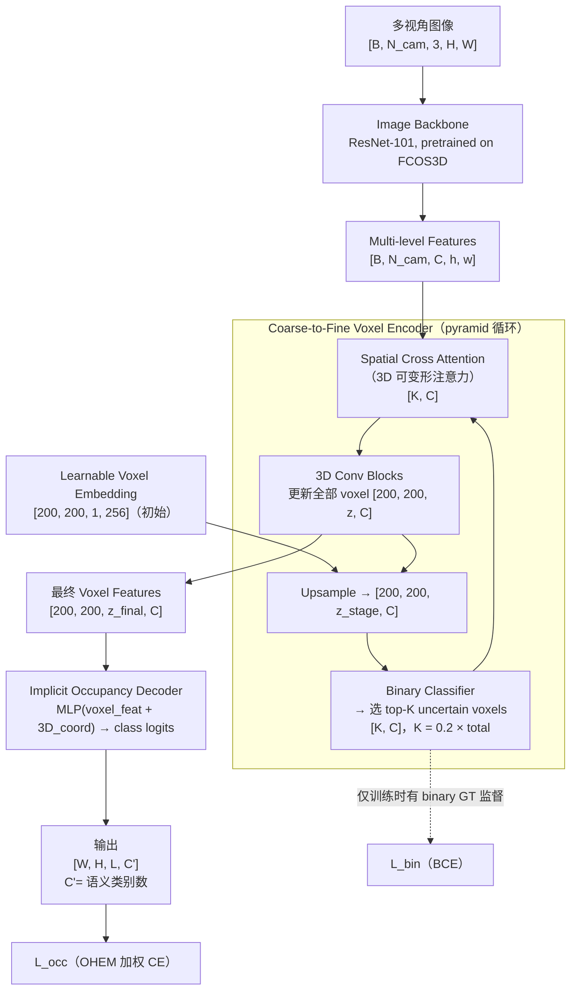

# Occ3D: A Large-Scale 3D Occupancy Prediction Benchmark for Autonomous Driving

**论文**: Occ3D (arXiv:2304.14365v3)
**作者**: Xiaoyu Tian, Tao Jiang, Longfei Yun, Yucheng Mao, Huitong Yang, Yue Wang, Yilun Wang, Hang Zhao
**机构**: Tsinghua MARS Lab, University of Southern California, Shanghai AI Lab, Shanghai Qi Zhi Institute
**发表**: NeurIPS 2023 (Datasets and Benchmarks Track)
**代码/数据**: https://tsinghua-mars-lab.github.io/Occ3D/

---

## 核心问题

**3D occupancy prediction 任务缺乏高质量的 benchmark。**

现有感知任务（3D bounding box 检测）存在两个根本局限：
1. **几何细节缺失**：bounding box 无法表达不规则物体的真实几何形状（如工程车的机械臂）
2. **无法处理 out-of-vocabulary 物体**：垃圾桶、购物车等未在 ontology 中预定义的物体被完全忽略

3D Occupancy Prediction 定义为：**联合估计场景中每个 voxel 的占据状态（free / occupied / unobserved）和语义标签**。对于不在预定义类别中的物体，统一标记为 General Object (GO)。

Occ3D 的核心贡献是**任务定义 + benchmark 建立 + 标注流程**，而非仅一个模型。

---

## 方法 / 核心机制

### 标注生成 Pipeline

Occ3D 不靠人工标注，而是通过自动化流程从 LiDAR 扫描生成稠密 occupancy 标签，分三步：



**Step 1：Voxel Densification（体素致密化）**
- **动静分离**：将点云分为动态物体（在 box 坐标系聚合，消除 motion blur）和静态背景（全局坐标系聚合）
- **KNN 标签分配**：Waymo 仅标注 2Hz 关键帧，LiDAR 扫描 10Hz；对非关键帧点用 K-nearest neighbors 从已标注帧继承语义标签
- **Mesh 重建**：多帧聚合后仍有空洞；非地面类用 VDBFusion（基于 TSDF 的体积重建）填洞；地面用局部区域点云拟合 mesh

**Step 2：Occlusion Reasoning for Visibility Mask**
- **LiDAR 可见性**：ray casting，反射到 LiDAR 的 voxel 标为 occupied，射线穿过的标为 free，其余 unobserved
- **Camera 可见性**：从相机原点向每个 occupied voxel 中心连线，第一个 occupied voxel 标 observed，之后沿射线方向标 unobserved；不在任何相机视野中的 voxel 标 unobserved
- **评测范围**：只在同时被 LiDAR 和 camera 标记为 observed 的 voxel 上评测

**Step 3：Image-guided Voxel Refinement (IGR)**
- LiDAR 噪声和位姿漂移导致物体在 3D 空间"虚胖"（边界 voxel 错误标为 occupied）
- 对每个像素做 ray casting，从相机原点出发，遇到与该像素 2D 语义标签相同的第一个 voxel 时停止，将之前穿过的 voxel 强制设为 free

### CTF-Occ 模型架构

论文提出 Coarse-to-Fine Occupancy (CTF-Occ) 作为 benchmark 基线：



**架构伪代码**（维度注释）：

```python
# ---- 输入 ----
images: [B, N_cam, 3, H_img, W_img]
# nuScenes: N_cam=6, H_img=928, W_img=1600
# Waymo:    N_cam=5, H_img=640（resize），W_img=960

# ---- Image Backbone（ResNet-101 + FPN） ----
feats: [B, N_cam, C_img, h_feat, w_feat]
# h_feat ≈ H_img/32, w_feat ≈ W_img/32（FPN 多尺度）

# ---- Learnable Voxel Embedding（初始化） ----
voxels: [B, 200, 200, 1, 256]   # 先在 z=1 初始化，后续 upsample

# ---- Coarse-to-Fine Voxel Encoder ----
# nuScenes: 2 stages，z_stage = [8, 16]
# Waymo:    3 stages，z_stage = [8, 16, 32]

for z_stage in z_stages:                      # e.g. [8, 16] for nuScenes
    voxels = trilinear_upsample(voxels,
             target=[200, 200, z_stage, 256]) # [B, 200, 200, z_stage, 256]

    # 4 个初始 encoder 层（无 token selection）
    if first_stage:
        voxels = encoder_layers(voxels)        # [B, 200, 200, z_stage, 256]

    # Binary classification: empty or not
    occ_logits = binary_cls(voxels)           # [B, 200, 200, z_stage, 1]
    K = int(0.2 * 200 * 200 * z_stage)
    top_k_idx = topk_uncertain(occ_logits, K) # [B, K] — 最不确定的 voxel 索引

    selected = voxels[top_k_idx]             # [B, K, 256]

    # Spatial Cross Attention（deformable，3D 参考点投影到 2D）
    selected = SCA(selected, feats)          # [B, K, 256]

    # 写回并做 3D Conv
    voxels = scatter_update(voxels, top_k_idx, selected)
    voxels = conv3d_blocks(voxels)           # [B, 200, 200, z_stage, 256]

# ---- Implicit Occupancy Decoder ----
# 对空间中任意 3D 坐标 (x,y,z) 查询语义
# 输入：对应 voxel 的 feature 向量 + 归一化 3D 坐标
# 支持任意输出分辨率（不依赖 voxel 网格大小）

def implicit_decoder(voxel_feat, coord_3d):
    # voxel_feat: [B, K_query, 256]
    # coord_3d:   [B, K_query, 3]   归一化坐标
    x = concat(voxel_feat, coord_3d)         # [B, K_query, 259]
    x = MLP(x)                               # 3 层 MLP
    return x                                 # [B, K_query, C']  C'=语义类别数

# nuScenes C'=17（16类+1 free），Waymo C'=15（14类+1 free）
```

---

## 训练 vs 推理差异

**推理输入**：
- 多视角 RGB 图像（nuScenes: 6 路；Waymo: 5 路）
- 相机内参和外参（用于 3D→2D 投影）
- 不需要 LiDAR 点云

**推理输出**：
- 每个 voxel 的语义类别概率 `[W, H, L, C']`
- 可通过 implicit decoder 在任意分辨率下查询，无需重训练

**仅训练时存在的模块**：
- **Binary classification head**：预测每个 voxel 是否为空，用 binary ground-truth voxel mask 监督（`L_bin`）；推理时仍存在但只用于 token selection，不单独输出
- **OHEM loss 权重计算**：在线难例挖掘，计算各类 loss 权重，推理不需要
- **Ground-truth visibility mask**：标注生成阶段产物，模型训练时作为 loss 掩码使用；推理不需要

**行为差异**：
- 训练时 binary classifier 有 GT 监督，推理时靠模型本身预测来 select token（可能引入误差传播）
- Implicit decoder 训练时按固定 voxel 分辨率采样坐标；推理时可改变查询坐标密度

**参数来源**：
- 模型权重（backbone、voxel encoder、implicit decoder）
- Learnable voxel embedding（`[200, 200, 1, 256]`，初始化后训练更新）

---

## Loss 函数

两个 loss 联合优化：

**`L_occ`（语义分类，主 loss）**：OHEM 加权的语义交叉熵

```
L_occ = Σ_k W_k · L(g_k, p_k)
```

- `W_k`：每个语义类 k 的 OHEM 权重（在线难例挖掘，动态上调难分类别的权重）
- `g_k`：第 k 个 voxel 的 ground-truth 语义标签
- `p_k`：模型预测的类别概率
- 只在 observed voxel 上计算（由 visibility mask 控制）

**`L_bin`（binary occupancy，辅助 loss）**：各 pyramid 层级的二元 BCE

```
L_bin = Σ_i L(f(g, s_i), p_i)
```

- `s_i`：第 i 个 pyramid stage 的空间分辨率
- `f(g, s_i)`：将语义 GT 下采样到分辨率 `s_i` 后的 binary occupancy mask
- `p_i`：第 i 层 binary classifier 的输出

**设计动机**：
- OHEM 解决 3D 空间中 free voxel 远多于 occupied voxel 的严重类别不平衡
- `L_bin` 在 coarse 分辨率上先定位物体位置，引导 cross-attention 聚焦非空区域，缓解 token selection 的冷启动问题

---

## 数据

**Occ3D-nuScenes**（基于 Caesar et al. nuScenes CVPR 2020 和 Fong et al. Panoptic nuScenes RAL 2022）：
- 来源：nuScenes 1000 场景，按官方划分：700 train / 150 val / 150 test（注：论文不同位置数字略有出入，Appendix 说 600/150/250）
- 总帧数：40,000 帧（标注 2Hz）
- 每帧输入：6 路 RGB 图像（360° 环视，32 线 LiDAR）
- Voxel 空间范围：[-40m, 40m] × [-40m, 40m] × [-1m, 5.4m]
- Voxel size：0.4m × 0.4m × 0.4m → grid shape = 200 × 200 × 16
- 类别：16 个常见类 + 1 个 GO（General Object）类

**Occ3D-Waymo**（基于 Sun et al. Waymo Open Dataset CVPR 2020）：
- 来源：Waymo Open Dataset 1000 sequences，798 train / 202 val
- 总帧数：200,000 帧
- 每帧输入：5 路 RGB 图像（无后视）
- Voxel 空间范围：[-40m, 40m] × [-40m, 40m] × [-5m, 7.8m]（实验设置）；标注范围 [-80m, 80m]
- Voxel size：0.05m × 0.05m × 0.05m（最高分辨率）
- 类别：14 个类 + 1 个 GO 类

**与其他数据集对比**（Table 1，论文原文）：

| 数据集 | 场景 | 是否环视 | 类别数 | 帧数 | Volume size |
|--------|------|----------|--------|------|-------------|
| SemanticKITTI | 室外 | ✗（单目） | 28 | 43,000 | 256×256×32 |
| KITTI-360 | 室外 | 鱼眼 | 19 | 90,960 | 256×256×32 |
| **Occ3D-nuScenes** | 室外 | ✓ | 16+GO | 40,000 | 200×200×16 |
| **Occ3D-Waymo** | 室外 | ✓ | 14+GO | 200,000 | 超高分辨率 |

---

## 评测指标

**IoU（Intersection over Union）**：
- 二元占据预测的 IoU，只判断 voxel 是否 occupied，不管语义
- 衡量几何完成质量（scene completion 子任务）

**mIoU（mean IoU）**：
- 所有语义类别的 IoU 平均值（including GO 类）
- 主要评测指标，同时衡量几何和语义

**评测范围约束**：
- **只在 observed voxel 上评测**（同时被 LiDAR visibility mask 和 camera visibility mask 标记为 observed）
- 未观测到的 voxel（occluded、超出传感器范围）不参与评测——这一设计解决了"标注稀疏导致评测不公平"的问题，是 Occ3D 相比 SemanticKITTI 的重要改进

**局限**：
- mIoU 可以通过提高 recall（把更多空间预测为 occupied）来虚假提升，需和 IoU 一起看
- GO 类的评测标准较宽松（所有 out-of-vocabulary 物体合并），不反映细粒度 open-set 识别能力

---

## 关键结果 / 数据

**Occ3D-nuScenes 上的 mIoU**（Table 3，camera-only methods）：

| 方法 | mIoU |
|------|------|
| MonoScene（Cao & de Charette, CVPR 2022） | 6.06 |
| BEVDet（Huang et al. 2021） | 19.38 |
| OccFormer（Zhang et al. 2023） | 21.93 |
| BEVFormer（Li et al. ECCV 2022） | 26.88 |
| TPVFormer（Huang et al. CVPR 2023） | 27.83 |
| **CTF-Occ (Ours)** | **28.53** |

**Occ3D-Waymo 上的 mIoU**（Table 4）：

| 方法 | mIoU |
|------|------|
| BEVDet | 9.88 |
| TPVFormer | 16.76 |
| BEVFormer | 16.76 |
| **CTF-Occ (Ours)** | **18.73** |
| BEVFormer-Fusion（camera + LiDAR） | 39.05 |

CTF-Occ 相比 BEVFormer 提升 +1.65 mIoU（nuScenes）和 +1.97 mIoU（Waymo）。

**消融实验**（Table 5，Occ3D-Waymo）：

| OHEM Loss | Token Selection | PED IoU | CC IoU | mIoU |
|-----------|-----------------|---------|--------|------|
| ✗ | — | 4.16 | 10.03 | 14.06 |
| ✓ | random | 5.07 | 12.95 | 16.62 |
| ✓ | uncertain | 6.27 | 13.85 | 17.37 |
| ✓ | top-k | **7.04** | **14.16** | **18.43** |

OHEM loss 和 top-k token selection 各自独立有效，合用效果最好。

**标注 Pipeline 质量验证**（Table 2，3D-2D consistency mIoU，Waymo 子集）：

| 配置 | mIoU |
|------|------|
| 单帧点云（SFP） | 13.32 |
| 多帧聚合（MFP） | 17.65 |
| MFP + voxel size=0.1 | 41.17 |
| MFP + voxel=0.1 + Mesh | 41.99 |
| MFP + voxel=0.05 + Mesh | 43.58 |
| MFP + voxel=0.05 + Mesh + IGR | **58.50** |

---

## 训练细节

- **Backbone**：ResNet-101，从 FCOS3D checkpoint 初始化（Wang et al. 2021）
- **图像尺寸**：nuScenes = 928×1600；Waymo = 640×960（resize）
- **Pyramid stages**：nuScenes = 2 stages（z: 8→16）；Waymo = 3 stages（z: 8→16→32）
- **初始 encoder 层数**：前 4 层不做 token selection，直接做全量 SCA
- **Top-k ratio**：0.2（每个 pyramid stage 均相同）
- **Learnable voxel embedding**：shape = 200×200×256，随机初始化后训练
- **Loss**：`L = L_occ + L_bin`，无额外权重超参数（论文未说明各 loss 系数）
- **GPU**：论文未在主文中说明训练硬件（Appendix 提到实验在标注 pipeline 质量验证使用 GPU 并行）

---

## 局限性

论文明确列出三条：
1. **传感器标定误差**：多帧聚合依赖精确的 LiDAR-camera 标定，标定误差会污染标注质量
2. **动态和可变形物体**：刚体假设失效——跑动的动物、人挥臂等变形动态物体会产生 motion blur
3. **General Objects 粒度不足**：nuScenes 和 Waymo 只标注有限类别，大量 OOV 物体被统一归入 GO 类，缺乏细粒度信息

---

## 现状与影响

**Occ3D-nuScenes 已成为 3D occupancy 方向的标准 benchmark**，被后续论文（SurroundOcc、OccFormer、BEV-Planner、UniOcc 等）广泛采用。

- **任务定义**：Occ3D 确立的"dense voxel + visibility mask + GO 类"范式被广泛接受；"只对可见 voxel 评测"的设计解决了 ground truth 稀疏导致的评测不公平问题
- **标注 Pipeline**：三步 pipeline 已开源，被后续 occupancy dataset（OpenOccupancy 等）参考
- **CTF-Occ 模型**：并非主流使用的模型，很快被 SurroundOcc、BEVFormer v2、RenderOcc 等取代，但作为 benchmark 基线价值保留
- **历史意义**：Occ3D 是将 occupancy prediction 推向 surround-view camera 的奠基性 benchmark 工作；此前 occupancy 任务主要依赖 SemanticKITTI（前视单目 + LiDAR 输入）

**今天（2026）视角**：Occ3D-nuScenes benchmark 仍活跃，camera-only 方法的 mIoU 已从 CTF-Occ 的 28.53 提升到 40+。更新挑战包括 occupancy flow（动态物体速度预测）、与端到端规划联合训练，以及 temporal fusion。

**定性**：奠基性 benchmark 工作，仍是标准评测平台。

---

## 关联概念

- [nuScenes](../30-papers/nuscenes-1903.11027.md) — Occ3D-nuScenes 基于 nuScenes 数据集构建，沿用其场景划分和相机配置
- [TPVFormer](./tpvformer-2302.07817.md) — 最早被 Occ3D benchmark 评测的 camera-only occupancy 方法之一
- [UniAD](./uniad-2212.10156.md) — 端到端 AD 框架，occupancy prediction 作为其中间表示
- [DETR](./detr-2005.12872.md) — DETR3D 是 Occ3D 对比的 3D 检测方法的上游架构

## 值得看的部分 / 相关资料

- **Section 3.3（标注 Pipeline）**：三步流程的完整技术细节，Appendix D 有 ray casting 伪代码
- **Section 4（3D-2D consistency）**：评测标注质量的方法论，可复用于其他 3D 标注项目
- **Table 1**：和 SemanticKITTI/KITTI-360 的数据集对比，说明 surround-view 的必要性
- **Appendix C（General Objects）**：GO 类的可视化示例（垃圾桶、购物车、飞扬的横幅等）

---

## 附录：输入特征详解

### 相机图像（主输入）

| 字段 | Shape | 含义 |
|------|-------|------|
| `images` | `[B, N_cam, 3, H, W]` | B=batch，N_cam=6（nuScenes）/5（Waymo），3=RGB，H×W=图像尺寸 |
| `cam_intrinsics` | `[B, N_cam, 3, 3]` | 每个相机的内参矩阵 K（焦距、主点） |
| `cam2ego` | `[B, N_cam, 4, 4]` | 相机坐标系 → ego 车辆坐标系的变换矩阵 |
| `ego2global` | `[B, N_cam, 4, 4]` | ego 坐标系 → 全局坐标系（多帧聚合时使用） |

- 坐标系：voxel 空间以 ego 车辆为中心，x 向前、y 向左、z 向上
- nuScenes 图像分辨率：1600×900（原始），resize 到 1600×928 后输入
- Waymo 图像分辨率：resize 到 960×640 后输入

### LiDAR 点云（仅用于标注生成，推理时不需要）

| 字段 | 含义 |
|------|------|
| 3D 坐标 (x, y, z) | LiDAR 坐标系下的点位置，需转换到 ego 坐标系 |
| 语义标签 | 来自官方数据集标注（仅关键帧有标签，非关键帧用 KNN 填充） |
| 所属 frame | 用于多帧聚合时的坐标系对齐 |

- nuScenes：32 线 LiDAR，每帧约 3 万点
- Waymo：标注 2Hz，原始 LiDAR 10Hz；非关键帧点用 KNN 从最近的关键帧继承标签

### Voxel Ground Truth（标注生成输出，训练时使用）

| 字段 | Shape | 取值 |
|------|-------|------|
| `voxel_semantics` | `[200, 200, 16]`（nuScenes） | 0=free，1-16=语义类，17=GO，255=unobserved |
| `lidar_mask` | `[200, 200, 16]` | bool，LiDAR 可见性 mask |
| `camera_mask` | `[200, 200, 16]` | bool，Camera 可见性 mask |

- 评测时只在 `lidar_mask & camera_mask == True` 的 voxel 上计算 IoU/mIoU
