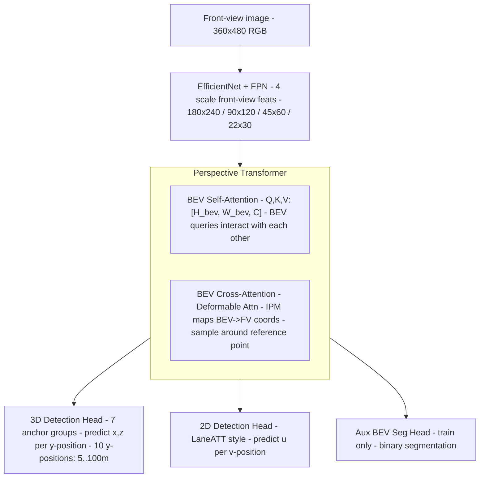

# PersFormer + OpenLane: 3D Lane Detection via Perspective Transformer and the OpenLane Benchmark（Chen et al., ECCV 2022）

一句话总结：OpenLane 是第一个基于真实世界 Waymo 数据的大规模 3D 车道线 benchmark（200K 帧、14 类、最多 24 条车道线/帧），同时发布的 PersFormer 模型用 Transformer 做前视图→BEV 空间变换，成为 OpenLane 第一个强基线，F-Score 50.5（vs 先前 SOTA 44.1），上海 AI Lab + 上海交大 + SenseTime，ECCV 2022。

## 基本信息

- 论文：PersFormer: 3D Lane Detection via Perspective Transformer and the OpenLane Benchmark
- 作者：Li Chen\*、Chonghao Sima\*、Yang Li\*（并列第一）、Zehan Zheng、Jiajie Xu、Xiangwei Geng、Hongyang Li†（通讯）、Conghui He、Jianping Shi、Yu Qiao、Junchi Yan
- 机构：上海 AI Lab + 上海交通大学 + SenseTime Research
- arXiv：2203.11089（2022-03，更新至 2022-07）
- 发表：ECCV 2022 Oral
- 代码：https://github.com/OpenPerceptionX/PersFormer_3DLane
- 数据集：https://github.com/OpenPerceptionX/OpenLane

---

## 核心问题

**为什么需要 OpenLane？**

此前 3D 车道线研究全部依赖合成数据（Apollo 3D Lane Synthetic，Guo et al., ECCV 2018）——合成数据无法覆盖真实世界的场景多样性（光照变化、降雨、路面起伏）。真实世界方法的论文结论难以相互比较。

| 问题 | 先前状态 |
|------|---------|
| 无真实世界 3D 车道线 benchmark | 只有合成数据（Apollo 3D Lane，10K 帧）|
| 场景单一 | 大多数 2D 数据集（TuSimple、CULane）只标注≤5 条车道线 |
| 无长时序追踪 ID | 多数数据集不提供跨帧 tracking |
| 类别稀少 | 类别数 ≤ 11 |

OpenLane 的解法：基于 Waymo Open Dataset 的真实驾驶数据，用 LiDAR 辅助三维标注，14 类、最多 24 条车道线/帧、追踪 ID 贯穿整段视频。

---

## OpenLane 数据集

### 段（Segment）是什么

OpenLane 的基本组织单位是**段**（segment）——Waymo 采集车在道路上连续行驶的一段视频剪辑，长约 20 秒、10 FPS，即约 200 帧/段。

```
1 段 = 连续驾驶约 20 秒 × 10 FPS = 约 200 帧（图像）
1,000 段 × 200 帧/段 = 200,000 帧
```

**为什么用时间（秒）而非距离（米）衡量长度**：同一段 20 秒的录制，在高速公路上可能跑 500 米，在城市路口可能只跑 80 米——速度差异使距离不通用；时间长度则直接对应帧数（200 帧），更便于工程对齐。

**段内有追踪 ID**：同一段内的每条车道线拥有跨帧一致的实例 ID，可以追踪"这条白虚线从帧 1 到帧 200 的完整轨迹"。这也是为什么 3D 标注流水线要先将多帧 LiDAR 点云拼接成长轨迹——利用段内的时序一致性。

**为什么有最多 24 条车道线/帧**：宽多车道高速路口、分合流区域、立交桥附近同时出现大量车道线标记（含对向车道线、引导线、减速带线等），远超普通单一车道场景的 3-5 条。约 25% 的帧超过 6 条，这是其他数据集的极限。

**LiDAR 辅助标注**：OpenLane 不是靠人工画 3D 点，而是先对图像做 2D 人工标注，再用 LiDAR 点云自动推算每条 2D 车道线的三维坐标（Z 高度）——本质是"2D 人工 + LiDAR 三维反算"，细节见下方标注流程。

### 规模统计

| 指标 | 数值 |
|------|------|
| 总标注帧数 | 200,000 帧 |
| 总段数（train+val）| 1,000 段（每段约 200 帧/20 秒）|
| 实例级车道线 | > 880,000 条 |
| 车道线类别 | 14 类 |
| 每帧最多车道线数 | 24 条（多车道路口/分合流场景）|
| 超过 6 条车道线的帧占比 | ~25% |
| 采集频率 | 10 FPS |
| 每段平均时长 | 20 秒（= 约 200 帧）|
| 数据来源 | Waymo Open Dataset |

### 数据划分

| 划分 | 段数 | 帧数（估算）|
|------|------|-----------|
| Train | 798 | ~159K |
| Val | 202 | ~41K |
| Test | 150 | ~30K（不公开标注，在线评测）|

**划分逻辑**：沿用 Waymo Open Dataset 的原始 train/val 分割，保持与其他任务（如目标检测）的可比性。

### 14 种车道线类别

| 编号 | 类别描述 | 频率（论文定性）|
|------|---------|--------------|
| 1 | Single white dash（单白虚线）| **主要**（合计约 90%↑）|
| 2 | Single white solid（单白实线）| **主要**（合计约 90%↑）|
| 3 | Double white dash（双白虚线）| 少见 |
| 4 | Double white solid（双白实线）| 少见 |
| 5 | Double white dash-solid（左虚右实白线）| 稀少 |
| 6 | Double white solid-dash（左实右虚白线）| 稀少 |
| 7 | Single yellow dash（单黄虚线）| 少见 |
| 8 | Single yellow solid（单黄实线）| 少见 |
| 9 | Double yellow dash（双黄虚线）| **主要**（合计约 90%↑）|
| 10 | Double yellow solid（双黄实线）| **主要**（合计约 90%↑）|
| 11 | Double yellow dash-solid（左虚右实黄线）| 稀少 |
| 12 | Double yellow solid-dash（左实右虚黄线）| 稀少 |
| 13 | Left curbside（左路沿）| 少见 |
| 14 | Right curbside（右路沿）| 少见 |

**分布说明**：论文（Figure 9）明确指出类别 1、2、9、10 合计约占 90%，其余 10 类合计约 10%——典型长尾分布。论文未给出每类的精确百分比，仅有定性描述。频率列中"合计约 90%"指 1+2+9+10 四类合计，不代表单类各占 22%。

### 场景标签分布

**天气（段数）**：

| 天气 | Train | Val |
|------|-------|-----|
| Clear | 515 | 145 |
| Partly cloudy | 131 | 28 |
| Overcast | 33 | 8 |
| Rainy | 107 | 18 |
| Foggy | 12 | 3 |

**场景类型**：Residential（339）、Urban（290）、Suburbs（323）、Highway（36）、Parking lot（12）

**时段**：Daytime（820）、Night（110）、Dawn/Dusk（70）

### 与先前数据集的对比（Table 1）

| 数据集 | 帧数 | 最多车道数 | 类别数 | 3D 标注 | 追踪 ID | 难度 |
|--------|------|-----------|-------|---------|---------|------|
| TuSimple | 6.4K | 5 | — | ✗ | ✗ | Easy |
| CULane | 133K | 4 | — | ✗ | ✗ | Medium |
| Apollo 3D | 10K | 6 | 13 | ✓（合成）| ✗ | Easy |
| ONCE-3DLanes | 211K | — | 8 | ✓ | ✗ | Medium |
| **OpenLane** | **200K** | **24** | **14** | **✓（真实）** | **✓** | **Hard** |

OpenLane 是首个真实世界大规模 3D 车道线 benchmark，在帧数、类别数、最大车道数、场景多样性上全面领先。

---

## 标注流程（3D 车道线如何生成）

OpenLane 3D 标注采用 7 步流水线（引用 LiDAR + 定位系统，不是人工三维标注）：

1. **生成高质量 2D 标注**（含追踪 ID、类别、2D 点）
2. **LiDAR 点云过滤**：用 3D 目标框滤除车辆、行人等障碍物点云，再投影回图像
3. **点关联**：以阈值筛选属于 2D 车道线的点云，用筛后点云插值每个 2D 标注点的 3D 坐标
4. **跨帧拼接**：用定位系统（LIO-SAM / LVI-SAM）将同一段内多帧的 3D 点云拼接成完整长车道线
5. **可见性标注**：2D 投影超出 2D 标注终点的 3D 点标记为不可见（避免不合理延伸）
6. **平滑拟合**：滤除异常点，生成最终 3D 标注
7. **大曲率处理**：当车道线无法按 x 或 y 方向排序时（急转弯），转换到临时坐标系处理后再还原

**传感器**：LiDAR（来自 Waymo 数据）+ SLAM 定位（LIO-SAM / LVI-SAM）+ 前视摄像头

**限制**：没有 LiDAR 点扫过的 2D 车道线无法生成 3D 标注，从数据集中排除。

---

## 评测指标

**匹配准则**：预测车道线和 GT 车道线在至少 **75%** 的采样 y 位置上，点距离 ≤ **1.5m**，则算 TP。采样 y 位置：(5, 10, 15, 20, 30, 40, 50, 60, 80, 100) 米。

**F-Score**（主要指标）：

```
Recall    = 匹配的 GT 车道线数 / GT 车道线总数
Precision = 匹配的预测车道线数 / 预测车道线总数
F-Score   = 2 × Precision × Recall / (Precision + Recall)
```

**X error / Z error**（精度指标，单位：米）：

- X error：横向位置误差（near = 近端 y 范围，far = 远端 y 范围）
- Z error：高度误差（near/far 同上）
- 只对 TP 样本计算；反映预测的空间精度

**Category accuracy**：只在 OpenLane 上报告，仅对匹配成功的 TP 车道线计算类别准确率。

---

## PersFormer 基线模型

> 数据集论文同时发布了 PersFormer 作为第一个 benchmark 基线，以下为其架构摘要。

### 架构概览



**BEV 空间**：20m×100m（宽×长），投影到 208×108 分辨率。

**输入分辨率**：360×480（训练）；EfficientNet backbone 输出 4 尺度特征。

**Perspective Transformer**（前视图→BEV）：

1. **Self-Attention**：BEV query 之间相互交互（Q, K, V 均来自 BEV query 空间）
2. **Cross-Attention（Deformable）**：每个 BEV 点 (x,y) 通过 IPM 找到对应前视图点 (u,v)，再用 Deformable Attention 学习偏移采样

IPM 变换（Eq. 2）：
```
(x, y, 0)^T = α_{f2b} · R_θ · K^{-1} · (u, v, 1)^T + (0, 0, -h)^T
# R_θ: 相机俯仰角旋转矩阵，K: 相机内参，h: 相机安装高度
```

**Anchor 设计**：7 组锚点，倾斜角 φ ∈ {π/2, arctan(±0.5), arctan(±1), arctan(±2)}；每个 anchor 同时投影到 3D BEV 和 2D 前视图，统一回归。

### PyTorch 风格伪代码（PersFormer 核心模块）

```python
import torch
import torch.nn as nn
import torch.nn.functional as F
from efficientnet_pytorch import EfficientNet
from ops.modules import MSDeformAttn  # Deformable DETR 的可变形注意力算子


# ─────────────────────────────────────────────
# 1. Perspective Transformer (前视图 → BEV)
# ─────────────────────────────────────────────
class PerspectiveTransformer(nn.Module):
    def __init__(self, embed_dim=256, bev_h=208, bev_w=108, n_heads=8):
        super().__init__()
        self.bev_h, self.bev_w = bev_h, bev_w

        # BEV 可学习查询（位置编码）
        self.bev_queries = nn.Embedding(bev_h * bev_w, embed_dim)
        self.bev_pos_emb = nn.Embedding(bev_h * bev_w, embed_dim)

        # Self-attention：BEV 查询之间互相交互
        self.self_attn = nn.MultiheadAttention(embed_dim, n_heads, batch_first=True)
        self.norm1 = nn.LayerNorm(embed_dim)

        # Cross-attention：Deformable Attention，从前视图特征采样
        self.cross_attn = MSDeformAttn(embed_dim, n_levels=4, n_heads=n_heads, n_points=4)
        self.norm2 = nn.LayerNorm(embed_dim)

        self.ffn = nn.Sequential(
            nn.Linear(embed_dim, embed_dim * 4),
            nn.GELU(),
            nn.Linear(embed_dim * 4, embed_dim),
        )
        self.norm3 = nn.LayerNorm(embed_dim)

    def forward(self, fv_feats, intrinsics, extrinsics):
        """
        fv_feats   : [B, sum_HW_lvl, C]  多尺度前视图特征（展平后拼接）
        intrinsics : [B, 3, 3]            相机内参 K
        extrinsics : [B, 4, 4]            相机外参（pitch、height 等）
        """
        B = fv_feats.shape[0]
        HW = self.bev_h * self.bev_w

        # 初始化 BEV 查询
        idx = torch.arange(HW, device=fv_feats.device)
        Q = self.bev_queries(idx).unsqueeze(0).expand(B, -1, -1)   # [B, H*W, C]
        Q = Q + self.bev_pos_emb(idx).unsqueeze(0)                 # [B, H*W, C]

        # Self-Attention（BEV 内部交互）
        Q2, _ = self.self_attn(Q, Q, Q)                            # [B, H*W, C]
        Q = self.norm1(Q + Q2)

        # 计算每个 BEV 点对应的前视图参考坐标（IPM）
        ref_pts_fv = ipm_transform(Q, intrinsics, extrinsics,
                                   bev_h=self.bev_h, bev_w=self.bev_w)
        # ref_pts_fv: [B, H*W, 2]  归一化 (u, v) 坐标

        # Cross-Attention（Deformable，从前视图特征采样）
        Q2 = self.cross_attn(
            query=Q,                          # [B, H*W, C]
            reference_points=ref_pts_fv,      # [B, H*W, 1, 2]  per level
            input_flatten=fv_feats,           # [B, sum_HW, C]
        )                                     # [B, H*W, C]
        Q = self.norm2(Q + Q2)

        Q = self.norm3(Q + self.ffn(Q))
        return Q.reshape(B, self.bev_h, self.bev_w, -1)            # [B, 208, 108, C]


def ipm_transform(Q, intrinsics, extrinsics, bev_h, bev_w):
    """
    将 BEV 格子坐标通过 IPM 映射到前视图坐标。
    (x, y, 0)^T = α * R_θ * K^{-1} * (u, v, 1)^T + (0, 0, -h)^T  [Eq. 2]
    此处反向求解 (u, v) from (x, y)。（推断：用相机内外参直接投影）
    """
    # 构造 BEV 格子中心点的真实世界坐标 [HW, 3]
    # ... 略，返回 [B, HW, 2] 的归一化图像坐标
    pass


# ─────────────────────────────────────────────
# 2. 3D 检测头（以 anchor 为基础）
# ─────────────────────────────────────────────
class LaneHead3D(nn.Module):
    N_Y = 10      # y 方向采样点数：(5,10,15,20,30,40,50,60,80,100)m
    N_ANCHORS = 7 # 倾斜角组数（π/2, arctan(±0.5), arctan(±1), arctan(±2)）

    def __init__(self, embed_dim=256):
        super().__init__()
        # 每个 anchor: 10 个 y 位置上预测 (x_offset, z, visibility)
        self.head = nn.Conv2d(embed_dim, self.N_ANCHORS * self.N_Y * 3, 1)

    def forward(self, bev_feat):
        # bev_feat: [B, C, 208, 108]  → reshape 到 BEV grid
        pred = self.head(bev_feat)             # [B, N_anchors*N_y*3, 208, 108]
        # 解码为 (x, z, vis) per anchor per y_position
        return pred                            # 需 reshape: [B, N_anchors, 208, N_y, 3]


# ─────────────────────────────────────────────
# 3. 完整 PersFormer 前向
# ─────────────────────────────────────────────
class PersFormer(nn.Module):
    def __init__(self):
        super().__init__()
        self.backbone = EfficientNet.from_pretrained('efficientnet-b7')
        self.fpn = FPN(...)  # 推断：4 尺度 FPN
        self.perspective_transformer = PerspectiveTransformer(embed_dim=256)
        self.head_3d = LaneHead3D(embed_dim=256)
        self.head_2d = LaneHead2D(embed_dim=256)   # LaneATT 风格
        self.aux_seg = AuxBEVSegHead(embed_dim=256) # 训练辅助，推理时不用

    def forward(self, img, intrinsics, extrinsics, training=False):
        # img: [B, 3, 360, 480]

        # ① Backbone + FPN
        fv_feats_list = self.fpn(self.backbone(img))
        # fv_feats_list: [[B,C,180,240], [B,C,90,120], [B,C,45,60], [B,C,22,30]]
        fv_feats_flat = flatten_and_cat(fv_feats_list)  # [B, sum_HW, C]

        # ② Perspective Transformer → BEV 特征
        bev_feat = self.perspective_transformer(fv_feats_flat, intrinsics, extrinsics)
        # bev_feat: [B, 208, 108, C]
        bev_feat = bev_feat.permute(0, 3, 1, 2)          # [B, C, 208, 108]

        # ③ 检测头
        pred_3d = self.head_3d(bev_feat)   # 3D 车道线
        pred_2d = self.head_2d(bev_feat)   # 2D 车道线（共享 BEV 特征，推断）

        if training:
            seg = self.aux_seg(bev_feat)   # [B, 1, 208, 108]  辅助分割（仅训练）
            return pred_3d, pred_2d, seg
        return pred_3d, pred_2d


# ─────────────────────────────────────────────
# 4. 损失函数
# ─────────────────────────────────────────────
def compute_loss(pred_3d, pred_2d, seg, gt_3d, gt_2d, gt_seg,
                 alpha=1.0, beta=1.0, gamma=1.0):
    # 3D 损失（分类 + 回归 + 可见性）
    L_cls_3d = F.cross_entropy(pred_3d['logits'], gt_3d['labels'])
    L_reg_3d = F.l1_loss(pred_3d['offsets'][gt_3d['mask']],
                          gt_3d['offsets'][gt_3d['mask']])
    L_vis_3d = F.binary_cross_entropy_with_logits(pred_3d['vis'], gt_3d['vis'])
    L_3d = L_cls_3d + L_reg_3d + L_vis_3d

    # 2D 损失（同结构）
    L_2d = cls_loss_2d + reg_loss_2d + vis_loss_2d  # 同上结构

    # 辅助分割损失
    L_seg = F.binary_cross_entropy_with_logits(seg, gt_seg)

    return alpha * L_2d + beta * L_3d + gamma * L_seg
```

### 训练配置

| 参数 | 值 |
|------|-----|
| Optimizer | Adam，β₁=0.9，β₂=0.999，weight decay=1×10⁻⁴ |
| Learning rate | 2×10⁻⁴ |
| Batch size | 8 |
| Epochs | 100 |
| Hardware | 8× NVIDIA Tesla V100 |

---

## 训练 vs 推理差异

| 方面 | 训练 | 推理 |
|------|------|------|
| 辅助 BEV 分割头 | 启用，计算 L_seg | **不启用** |
| 输入 | 360×480 图像 + 相机内外参 | 同 |
| 输出 | 3D + 2D 预测 + seg | 仅 3D + 2D 预测 |
| 后处理 | NMS on 3D anchors → 车道线集合 | 同，并按 y 位置采样 10 个点 |

**推理输入**：单张前视图 RGB 图像 (360×480) + 相机内参 + 外参（camera height, pitch angle）。

**推理输出**：N 条 3D 车道线，每条包含 10 个 y 位置上的 (x, z) 坐标（在前方 5–100m 范围内）及车道线类别。

---

## 关键结果 / 数据

### OpenLane val（F-Score by scenario）

| 方法 | All | Up&Down | Curve | Ext. Weather | Night | Intersection | Merge&Split |
|------|-----|---------|-------|-------------|-------|-------------|------------|
| 3D-LaneNet | 44.1 | 40.8 | 46.5 | 47.5 | 41.5 | 32.1 | 41.7 |
| Gen-LaneNet | 32.3 | 25.4 | 33.5 | 28.1 | 18.7 | 21.4 | 31.0 |
| **PersFormer** | **50.5** | **42.4** | **55.6** | **48.6** | **46.6** | **40.0** | **50.7** |

PersFormer 综合 F-Score +6.4 pts vs 3D-LaneNet，夜间场景提升尤其显著（41.5→46.6）。

### OpenLane val（完整指标）

| 方法 | F-Score | Cat. Acc | X-near | X-far | Z-near | Z-far |
|------|---------|---------|--------|-------|--------|-------|
| 3D-LaneNet | 44.1 | — | 0.479 | 0.572 | 0.367 | 0.443 |
| Gen-LaneNet | 32.3 | — | 0.591 | 0.684 | 0.411 | 0.521 |
| **PersFormer** | **50.5** | **92.3** | 0.485 | **0.553** | **0.364** | **0.431** |

注：PersFormer X-near 略差于 3D-LaneNet（0.485 vs 0.479），因为统一 anchor 设计对近端起点定位不如专用方法精确。

### Apollo 3D Lane Synthetic

| 场景 | PersFormer F-Score | vs 先前 SOTA |
|------|-------------------|------------|
| Balanced | **92.9** | +6.2 pts |
| Rarely Observed | **87.5** | +5.0 pts |
| Visual Variants | **89.6** | +4.3 pts |

---

## 局限性

论文明确指出的数据集局限：

1. **LiDAR 依赖**：无 LiDAR 点扫过的 2D 车道线无 3D 标注，部分场景（如极远处车道）无法标注
2. **类别长尾分布**：单白实线/虚线+双黄实线占约 90%，稀有类别数据不足
3. **平滑步骤的 U 型弯处理不完善**：临时坐标系旋转是近似方案
4. **仅前视单目摄像头**：inference 不使用 LiDAR（标注用到但推理不用）
5. **测试集标注不公开**：150 段测试集保留用于在线排行榜，离线分析受限
6. **高度变化大**：约 80% 帧的高度变化 > 1m，平地假设方法在此 benchmark 上大幅退步

---

## 现状与影响

**一句话定性：OpenLane 是 3D 车道线检测领域的标准真实世界 benchmark，至今（2026 年）仍广泛使用；PersFormer 模型已被 BEV-LaneDet 等后续工作大幅超越。**

- OpenLane 确立了真实世界 3D 车道线评测的标准，是 2022 年后该方向论文的必评数据集。BEV-LaneDet（58.4 F-Score）、后续各类方法均在此 benchmark 上评测。
- **数据集价值**：14 类标注、24 条车道线/帧、追踪 ID、高场景多样性，仍是 2026 年最完整的 3D 车道线真实数据集之一。
- **PersFormer 模型**：其 50.5 F-Score 已是历史基线；BEV-LaneDet 的 58.4、以及更新方法（70+ F-Score）已将其全面超越。Perspective Transformer 的设计思路（IPM+Deformable Attention）被后续工作引用，但具体实现已被更高效方案替代。
- **2026 年视角**：
  - 数据集仍为最常用标准基准，但 OpenLane-V2（增加中心线拓扑）代表方向的进一步复杂化
  - PersFormer 的 X-near 误差问题（anchor 起点不精确）揭示了基于 anchor 方法的内在局限，BEV-LaneDet 的 KPR（格子预测+offset）从根本上解决了这个问题

---

## 和 wiki 内其他概念的关联

- **[BEV-LaneDet](bev-lanedet-2210.06006.md)**：在 OpenLane 上评测，F-Score 58.4 vs PersFormer 50.5（+7.9）；BEV-LaneDet 专门针对 PersFormer 的不足设计了 Virtual Camera 和 KPR
- **[BEVFormer](bevformer-2203.17270.md)**：BEVFormer 的 Spatial Cross-Attention 与 PersFormer 的 Perspective Transformer 高度相关，均用 IPM + Deformable Attention 从前视图生成 BEV 特征；BEVFormer 更通用（不限于车道线）
- **[MapTR](maptr-2208.14437.md)**：MapTR 把车道线纳入更完整的地图元素集合，OpenLane 中的车道线检测可视为 MapTR 地图元素检测的一个子集
- **[无图规划（HD Map Free）](../00-overview/av-mapless-planning.md)**：OpenLane benchmark 的 3D 车道线是在线建图的关键输出之一；F-Score 是评估在线建图质量的核心指标
- **[nuScenes](nuscenes-1903.11027.md)**：OpenLane 基于 Waymo 数据（非 nuScenes）；两者在感知 benchmark 中互补
- **[自动驾驶模型评测全栈概览](../00-overview/av-model-evaluation.md)**：OpenLane 的 F-Score/X-error/Z-error 评测体系是 AV 感知层（车道线检测）的标准评测框架

---

## 值得看的部分 / 相关资料

- **Table 1**（数据集对比）：量化 OpenLane 与所有先前数据集的差距
- **Table 7**（场景分布详表，附录）：各天气/地点/时段的段数分布，理解数据集多样性
- **Appendix C.2**（标注流程详解）：7 步 3D 标注 pipeline，包括大曲率处理
- **Appendix D.1**（评测协议）：F-Score 的精确匹配算法（75% y 位置覆盖 + 1.5m 阈值）
- **Gen-LaneNet**（Guo et al., ECCV 2018）：评测指标体系的来源
- **3D-LaneNet**（Garnett et al., ICCV 2019）：OpenLane 上的第一个对比基线
- **OpenLane-V2**（Li et al., 2023）：OpenLane 的升级版，加入中心线拓扑推理（OpenDriveLab）
