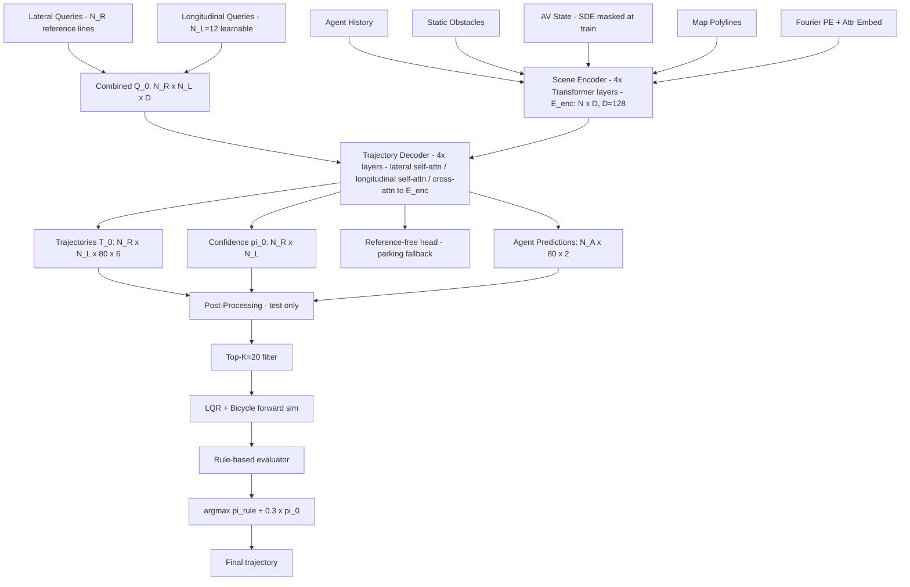

# PLUTO: Pushing the Limit of Imitation Learning-based Planning for Autonomous Driving（Cheng et al., 2024）

一句话总结：PLUTO 用纵横解耦的 Transformer 架构 + 对比模仿学习（CIL）+ 可微辅助 loss 三管齐下，成为首个在 nuPlan Val14 benchmark 上超越最强规则规划器（PDM-Closed）的纯学习方法，Score 93.21 vs 93.08，HKUST，arXiv 2024。

## 基本信息

- 论文：PLUTO: Pushing the Limit of Imitation Learning-based Planning for Autonomous Driving
- 作者：Jie Cheng, Yingbing Chen, Qifeng Chen
- 机构：The Hong Kong University of Science and Technology（HKUST）
- arXiv：2404.14327（2024-04-22）
- 代码/主页：https://jchengai.github.io/pluto
- 发表状态：arXiv preprint（未正式发表于会议）

---

## 核心问题

纯模仿学习（IL）规划器有三个顽固缺陷：

1. **横向行为缺失**：IL 能学好跟车、加减速（纵向），但换道、避障（横向）非常弱。没有结构显式建模横纵方向，模型很难分化出多样的驾驶行为。
2. **分布偏移**：测试时自车略微偏离训练分布，误差累积无法恢复——因为 IL 从未见过这些状态。
3. **因果混淆**：模型学到的关联是虚假的（e.g., 前车减速了所以我减速，而不是因为前方红灯）。没有反事实训练信号，模型无法正确归因。

**目标**：成为首个在 nuPlan 闭环 benchmark 上超越最强规则规划器（PDM-Closed，2023 nuPlan Challenge 冠军）的学习方法。

---

## 方法 / 核心机制

PLUTO 是一个 **mid-to-mid 规划器**：输入后感知结构化特征，输出多模态轨迹 + 置信度分数，测试时用后处理模块选最终轨迹。

### 架构总览（Mermaid）



### 输入编码

| 模态 | 特征 | 编码器 |
|------|------|--------|
| Agent History | Δ状态 (Δp, Δθ, Δv, b, I)，8 channels × T_H−1=19 帧 | Neighbor Attention-based FPN → E_A ∈ ℝ^{N_A×D} |
| Static Obstacles | (p, θ, b)，5 channels | 两层 MLP → E_O ∈ ℝ^{N_S×D} |
| AV State | (p, θ, v, a, steering)，SDE 训练时随机 mask | Attn-based Encoder + SDE → E_AV ∈ ℝ^{1×D} |
| Map Polylines | 8 ch/点：(p_i−p_0, p_i−p_{i-1}, p_i−p^left, p_i−p^right) | PointNet-like → E_P ∈ ℝ^{N_P×D} |
| 位置编码 PE | Fourier embedding of (p, θ) | 加到所有 token |
| 属性 E_attr | agent 类型、车道限速、信号灯状态 | 可学习 → 加到 E_0 |

场景覆盖范围：AV 周围 120 米。

### 横纵解耦查询机制

**横向查询（Q_lat）**：从 AV 所在车道出发，DFS 搜索相邻车道，得到 N_R 条参考线（reference lines），编码方式和地图 polyline 相同。这直接对应"走哪条车道"的横向意图。

**纵向查询（Q_lon）**：N_L = 12 个无锚点可学习查询，对应"在目标车道上，走多快/何时停"的纵向行为。

**组合 Q_0 = Proj(concat(Q_lat, Q_lon)) ∈ ℝ^{N_R × N_L × D}**，得到 N_R × N_L 种行为假设。

**分解自注意力**（降低复杂度）：
- 直接对 Q_0 做 self-attn：O(N_R² N_L²)，太贵
- 分解为：先对维度 0（横向）做 self-attn → 再对维度 1（纵向）做 self-attn：O(N_R² N_L + N_R N_L²)

Decoder 每层：横向 self-attn → 纵向 self-attn → cross-attn to E_enc（标准 4 层）。

### 伪代码（含 shape）

```python
# 输入
E_0 = concat(E_AV, E_O, E_P) + PE + E_attr  # [N_A+N_S+N_P+1, D], D=128
E_enc = TransformerEncoder(E_0, layers=4)     # [N, D]

# 查询构造
Q_lat = encode_reference_lines(ref_lines)     # [N_R, D]
Q_lon = learnable_queries                     # [N_L=12, D]
Q_0 = Proj(concat(Q_lat, Q_lon))              # [N_R, N_L, D]

# Decoder（4层）
for i in range(4):
    Q = SelfAttn(Q, dim=0)    # lateral:  [N_R, N_L, D]
    Q = SelfAttn(Q, dim=1)    # longitudinal: [N_R, N_L, D]
    Q = CrossAttn(Q, E_enc)   # [N_R, N_L, D]

# 输出
T_0   = MLP(Q_dec)   # [N_R, N_L, T_F=80, 6]  各点 [px,py,cosθ,sinθ,vx,vy]
pi_0  = MLP(Q_dec)   # [N_R, N_L]  置信度
tau_free = MLP(E_AV) # [T_F, 6]  无参考线时备用头
P = MLP(E_A)         # [N_A, T_F, 2]  他车预测
```

### 训练 Loss

**L = L_i + L_p + L_aux + L_c**（各权重 = 1.0）

| Loss | 作用 | 细节 |
|------|------|------|
| **L_i**（Imitation） | 对最接近 gt 轨迹的参考线/纵向 query 对做 L1_smooth 回归 + CrossEntropy 分类 | teacher-forcing 找目标 query 对 |
| **L_p**（Prediction） | 他车轨迹 L1_smooth 回归 | 辅助监督 + 支撑推理时安全过滤 |
| **L_aux**（Auxiliary） | 可微分路外惩罚 | ESDF cost map + bilinear 插值 + hinge loss（N_c=3 覆盖圆） |
| **L_c**（Contrastive） | CIL 对比学习 | triplet cosine 相似度，温度 σ=0.1 |

**可微辅助 loss 细节**：现有可微 rasterization 太慢；PLUTO 用 ESDF 距离图 + bilinear 插值，直接对轨迹点查询有向距离场，hinge loss 在覆盖圆落入非行驶区域时惩罚，速度快且全差分。

### 对比模仿学习（CIL）

核心思想：通过构造**正样本**（语义等价，gt 仍有效）和**负样本**（改变因果关系，gt 不再有效），让模型学到因果特征而不是虚假相关性。

| 增强类型 | 名称 | 作用 |
|---------|------|------|
| 正样本 T⁺ | State Perturbation | AV 轻微状态扰动，学鲁棒性 |
| 正样本 T⁺ | Non-interactive Agents Dropout | 去掉无交互他车，防止学虚假依赖 |
| 负样本 T⁻ | Leading Agents Dropout | 去掉前车，地面真值（跟车慢行）不再适用 |
| 负样本 T⁻ | Leading Agent Insertion | 插入虚拟前车阻挡，gt 速度过快 |
| 负样本 T⁻ | Interactive Agents Dropout | 去掉全部交互 agent（并线、路口） |
| 负样本 T⁻ | Traffic Light Inversion | 翻转信号灯状态，让车在绿灯场景下不能继续走 |

损失：三元组 softmax，`−log[exp(sim(z,z⁺)/σ) / (exp(sim(z,z⁺)/σ) + exp(sim(z,z⁻)/σ))]`

---

## 训练 vs 推理差异

| 方面 | 训练 | 推理 |
|------|------|------|
| AV 状态输入 | SDE 随机 mask 动态特征 | 正常使用当前状态 |
| 数据增强 | 正/负增强，每批变 3× | 无增强 |
| Contrastive head | 两层 MLP projection head 计算 z | 不使用 |
| Teacher forcing | 用 gt 轨迹选 target query 对 | 不适用 |
| 轨迹选择 | 所有 N_R×N_L 轨迹均有监督 | Top-K=20 → LQR 仿真 → 规则评分 → argmax |
| Agent 预测 | 用 gt 轨迹监督 L_p | 仅用于 post-processing 安全过滤 |

### 推理流程（Algorithm 2）

1. 模型推断 → T_0 (N_R×N_L 条轨迹), π_0 (置信度), P (他车预测)
2. Top-K=20 保留高分轨迹
3. LQR tracker + bicycle model 前向仿真 N_T 步
4. 规则评分器：安全/进度/TTC/舒适度打分 → π_rule
5. 综合：π = π_rule + 0.3 × π_0
6. argmax → 最终轨迹 τ*

注：后处理模块**只选轨迹，不修改轨迹**（区别于 GameFormer 等用非线性优化精化的方法）。

---

## 关键结果 / 数据

### Val14 闭环规划（↑越高越好）

| 类型 | 规划器 | Score | Collisions | TTC | Drivable | Progress |
|------|--------|-------|-----------|-----|---------|---------|
| 专家 | Log-Replay | 93.68 | 98.76 | 94.40 | 98.07 | 98.99 |
| 规则 | PDM-Closed（2023 冠军）| 93.08 | 98.07 | 93.30 | **99.82** | 92.13 |
| 纯学习 | PlanTF（之前 SOTA）| 85.30 | 94.13 | 90.73 | 96.79 | 89.83 |
| 纯学习 | PLUTO†（无后处理）| 89.04 | 96.18 | 93.28 | 98.53 | 89.56 |
| 混合 | GameFormer | 82.95 | 94.32 | 86.77 | 94.87 | 89.04 |
| 混合 | **PLUTO（完整版）** | **93.21** | **98.30** | **94.04** | 99.72 | **93.65** |

**关键成就**：PLUTO Score 93.21，首次超越 PDM-Closed（93.08）——学习方法首次击败最强规则规划器。

### 训练配置

- 数据：nuPlan（1,300 小时真实驾驶，1M 帧训练集）
- 硬件：4× RTX 3090
- Batch size：128，25 epoch
- Optimizer：AdamW，lr=1e-3（warmup 3 epoch → cosine decay）
- 训练时间：45 小时（含 CIL）；22 小时（不含 CIL）

---

## 消融实验

| 模型 | 描述 | Score |
|------|------|-------|
| PlanTF（对比基线）| 之前 SOTA | 87.55 |
| M0 | 仅架构 + IL loss | 87.04 |
| M1 | + SDE | 89.64 |
| M2 | + Auxiliary loss | 90.03 |
| M3 | + Reference-free head | 90.69 |
| M4 | + CIL | 91.66 |
| M5 | + Post-processing | **93.57** |
| Expert | Log-Replay | 94.24 |

**关键发现**：
- SDE 贡献最大单步提升（+2.6），主要体现在 TTC（91.43→95.14）
- CIL 贡献 +1.0，是核心因果校正机制
- Post-processing 带来最大绝对提升（+1.9），但以轻微舒适度损耗换安全性

纵向查询数量 N_L = 12 最优（N_L=6→88.89，N_L=24→87.90），更多查询增加训练难度。

α=0.3（规则分与学习分的组合权重）最优：纯规则（α=0）仅 90.64，α=0.3 达 93.57。

---

## 局限性

作者明确指出：
1. **单轨迹他车预测**：对每个 agent 只预测一条轨迹，无联合多模态预测；复杂交互场景覆盖不全。
2. **后处理失效场景**：若所有 N_R×N_L 条轨迹均不可用，后处理无法补救。
3. **后处理只选不改**：更好的设计可能是让后处理影响轨迹生成本身，而不仅仅做选择器。

---

## 现状与影响

**当前状态（2026 年视角）：仍活跃，是 nuPlan leaderboard 上的强基线。**

- PLUTO 是首个在 nuPlan 闭环基准上超越最强规则规划器的学习方法，这一里程碑意义重大：证明了纯数据驱动方法可以在城市结构化场景中超越精心设计的规则系统。
- 其核心思想——横纵解耦查询、SDE（状态 dropout 防捷径）、CIL（对比模仿学习）——被后续工作引用和扩展。
- 竞争对手方向：端到端方法（如 UniAD 的后继工作）开始直接处理原始传感器输入；但 PLUTO 所代表的"mid-to-mid + 后处理选择"路线在工业 AD stack 中仍常见，因其可解释性和模块化。
- 横纵解耦设计和 CIL 中的负样本构造（如 Traffic Light Inversion、Leading Agent Insertion）被认为是实用贡献，比论文整体架构更容易迁移。
- 2024 年后 nuPlan 研究仍活跃，PLUTO 作为基线被后续工作（如基于扩散模型的规划器）对比。

**一句话定性**：nuPlan 规划基准上的里程碑性工作，首次证明 IL 方法可超越规则规划器；核心技巧实用可迁移，整体路线仍活跃。

---

## 和 wiki 内其他概念的关联

- **[nuPlan](nuplan-2106.11810.md)**：PLUTO 的评测基准；nuPlan 的 Val14 非反应式闭环评测是 PLUTO 的主战场
- **[GameFormer](gameformer-2303.05760.md)**：同类思路（prediction + planning），nuPlan 上的对比基线（Score 82.95 vs PLUTO 93.21）；GameFormer 用博弈迭代，PLUTO 用对比学习
- **[VectorNet](vectornet-2005.04259.md)**：PLUTO 的地图编码思路（向量化 polyline）与 VectorNet 一脉相承
- **[UniAD](uniad-2212.10156.md)**：端到端 AD 方向的代表，与 PLUTO 的 mid-to-mid 路线形成对比
- **[NAVSIM](navsim-2406.15349.md)**：同为闭环评测框架，与 nuPlan 互补；PDM-Score 评估体系与 PLUTO 的评测指标有交叉
- **[位置编码](../20-concepts/positional-encoding.md)**：PLUTO 使用 Fourier 位置编码对场景坐标编码
- **[Attention 直觉](../20-concepts/attention-intuition.md)**：横纵分解 self-attn 是 Axial Attention 思路的应用

---

## 附录：完整输入特征

### Agent History（F_A ∈ ℝ^{N_A × 19 × 8}）

| 字段 | 含义 | 维度 |
|------|------|------|
| Δp_x, Δp_y | 位置增量（相对前一帧，agent-centric）| 2 |
| Δθ | 航向角增量 | 1 |
| Δv_x, Δv_y | 速度增量 | 2 |
| b_l, b_w | 边界框长度和宽度 | 2 |
| I | 观测有效指示符（0/1）| 1 |

坐标系：相对前一时刻的增量表示，非绝对坐标。历史长度 T_H = 20 帧（2 秒，10 Hz）。

### Map Polylines（F_P ∈ ℝ^{N_P × n_p × 8}）

| 字段 | 含义 | 维度 |
|------|------|------|
| p_i − p_0 | 当前点相对 polyline 起点 | 2 |
| p_i − p_{i-1} | 相对前一点（方向和距离）| 2 |
| p_i − p^left | 相对左边界点 | 2 |
| p_i − p^right | 相对右边界点 | 2 |

包含隐式车道宽度和相对位置信息。

### AV State（E_AV ∈ ℝ^{1 × D}，训练时 SDE 随机 mask）

| 字段 | 说明 |
|------|------|
| position (p) | AV 当前位置 |
| heading (θ) | 当前航向角 |
| velocity (v) | 当前速度向量 |
| acceleration (a) | 当前加速度 |
| steering angle | 当前转向角 |

SDE：训练时随机 mask 这些动态状态，防止模型走捷径（直接外推当前速度得到轨迹而不理解场景）。

---

## 值得看的部分 / 相关资料

- **Algorithm 2**（推理流程）和 **Figure 2**（架构图）：最清晰地展示了训练时的 teacher-forcing 分配和推理时的后处理流程
- **Table VI**（α 消融）：展示了规则分和学习分如何互补，纯规则 90.64 vs 混合 93.57，量化了学习分的贡献
- **Figure 4**（6 种数据增强）：CIL 负样本设计最具工程价值，每种增强对应一类因果混淆场景
- **Algorithm 1**（可微辅助 loss）：bilinear 插值 + ESDF 的实现细节，对需要类似功能的读者很实用
- PDM-Closed 论文（2023 nuPlan Challenge winner）：理解 PLUTO 的参照基线
- PlanTF：PLUTO 纯学习版本的直接对比前作
