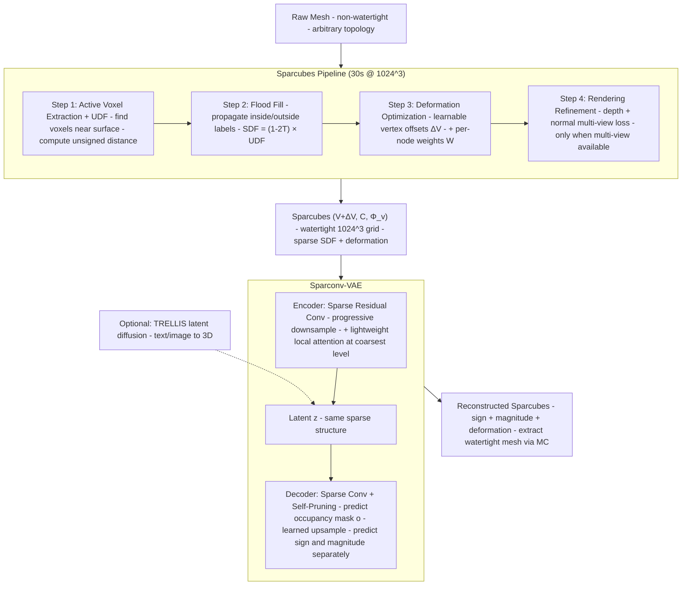

# Sparc3D: Sparse Representation and Construction for High-Resolution 3D Shapes Modeling（Li et al., 2025）

一句话总结：Sparc3D 用稀疏可变形 Marching Cubes（Sparcubes）把任意 mesh 在 30 秒内转成 1024³ 水密表面，再配合纯稀疏卷积的 VAE（Sparconv-VAE，无全局 attention）做端到端 3D 形状压缩，消除了之前 3D VAE 的模态不匹配问题（输入点云/DINOv2 → 输出 SDF），训练比 TRELLIS 等方法快 4×，与 TRELLIS latent diffusion 配合可生成高保真水密 3D 模型，NTU + Math Magic + Imperial College，arXiv 2025-05。

## 基本信息

- 论文：Sparc3D: Sparse Representation and Construction for High-Resolution 3D Shapes Modeling
- 作者：Zhihao Li\*（NTU，Math Magic 实习期间完成）、Yufei Wang（NTU）、Heliang Zheng（Math Magic，项目主导）、Yihao Luo（Imperial-X）、Bihan Wen（NTU，通讯）
- 机构：Nanyang Technological University + Math Magic + Imperial College London
- arXiv：2505.14521（2025-05）
- 状态：preprint，under review
- 项目页：https://lizhihao6.github.io/Sparc3D（也叫 sparc3d.org）
- 代码：https://github.com/lizhihao6/Sparc3D

---

## 核心问题

**高质量 3D 形状生成的两大瓶颈：(1) 把任意 mesh 转成水密（watertight）表示时丢细节；(2) 3D VAE 输入和输出的"模态不匹配"导致需要重量级 attention。**

主流 3D 生成 pipeline（如 TRELLIS、Dora、3DShape2VecSet）是两阶段：

1. **VAE**：把 3D mesh 压缩到 latent 空间
2. **Latent Diffusion**：在 latent 空间上做扩散生成

但 VAE 这一步存在两个问题：

| 问题 | 具体表现 |
|------|---------|
| **Mesh → 水密表示丢细节** | 经典 pipeline 用 UDF（无符号距离）→ SDF（有符号距离）需要减去 2 个 voxel 大小，**有效分辨率减半**；Marching Cubes 后得到的是 double-layer mesh，只保留最大连通分量，**小但重要的部件被丢弃** |
| **VAE 输入输出模态不匹配** | VAE 输入是 surface 点 + 法向量（或 DINOv2 特征），输出是体素 SDF 值——两个完全不同的数据形态，需要重量级 cross-attention 桥接，导致模型复杂、训练慢 |

**Sparc3D 的核心立场**：
- **Sparcubes** 解决问题 1：用稀疏 cube 网格 + 可变形顶点直接优化几何，不需要 UDF→SDF 转换，30 秒内做完 1024³ 重网格化
- **Sparconv-VAE** 解决问题 2：输入输出**都用同一个稀疏体素结构**（Sparcubes 输出），全程稀疏 3D 卷积，不需要全局 attention

---

## 方法 / 核心机制

### 架构总览



### Sparcubes（稀疏可变形 Marching Cubes）

**目标**：把任意原始 mesh（可能不水密、有破洞、多组件）转成 1024³ 分辨率的水密表面，几乎不丢细节。

**关键洞察**：不需要在全空间计算精确 SDF，只在表面附近的稀疏体素上工作。

**Pipeline 四步**（Figure 3）：

```
Step 1：Active Voxel Extraction + UDF
  - 找出离 mesh 表面距离 < ε 的"活跃 voxel"（稀疏集合）
  - 对每个 voxel 顶点 x 计算 UDF(x) = min_{y ∈ M} ‖x - y‖₂
  - 得到稀疏体素网格 Φ，距离值集中在表面附近

Step 2：Flood Fill 粗符号标注
  - 从已知的外部区域（如包围盒角点）开始
  - 用 volumetric flood fill 算法传播 inside/outside 标签 T(x) ∈ {0,1}
  - SDF(x) = (1 - 2T(x)) · UDF(x)
  - 给每个 voxel 一个粗糙的符号，但还不够精确

Step 3：Gradient-based 可变形优化
  - 不直接精修 SDF，而是优化稀疏 cube 的顶点位置
  - 给定 (V, C, Φ_v)：顶点集 V、活跃 cube 集 C、SDF 值 Φ_v
  - 优化得到 (V + ΔV, C, Φ_v)，让零等值面更准确
  - 关键技巧：沿 ∇UDF 微调 vertex 位置：x' = x - η·∇UDF(x)
  - 在距离表面远的区域（Φ > 0），SDF 估计可能不准（开放表面/遮挡问题）
    用顶点移动而非全局重算 SDF 来隐式修正

Step 4：Rendering Refinement（可选）
  - 当有多视角图像/深度图/法线图时启用
  - 计算可微渲染 loss：L = ‖R^D(M_r) - I^D_obs‖² + ‖R^N(M_r) - I^N_obs‖²
  - 利用 voxel 结构只在可见区域渲染，计算成本低
```

最终输出 `Sparcubes = (V, C, Φ_v, ΔV)`，是后续 VAE 的输入和监督目标。

### Sparconv-VAE（稀疏卷积 VAE，无全局 attention）

**目标**：用纯稀疏 3D 卷积压缩 Sparcubes 到 latent z，再解码回 Sparcubes，不引入模态转换。

**和已有 VAE 的对比**：

| 方法 | 输入 | 输出 | 桥接方式 |
|------|------|------|---------|
| 3DShape2VecSet/Dora/Hunyuan2 | 点云 + 法向量 | 全局 latent vector | 重 attention（VecSet-based）|
| TRELLIS | DINOv2 特征 | SDF voxel | 重 attention |
| **Sparconv-VAE** | **Sparcubes** | **Sparcubes** | **纯稀疏 3D 卷积**（同一形态）|

**Encoder**：sparse residual conv blocks 渐进下采样，最粗分辨率加一个轻量 local attention 聚合邻域信息。

**Decoder**：交替的 sparse residual conv + **self-pruning upsample block**：
- 每个 self-pruning block 先预测"哪些子 voxel 应该被占据"——一个二值 occupancy mask `o`
- 监督：`L_occ = BCE(ô, o)`
- 然后用学习到的上采样 refine 这些 voxel 的特征
- 这样可以从粗到细动态扩展稀疏结构，不需要稠密体素

**输出分支**：把 SDF 值 φ 拆成符号和大小两个分支预测：
- 符号：`L_φ_sign = BCE(sign(φ̂), sign(φ))`（sign-sensitive）
- 大小：`L_φ_mag = ‖φ̂ - φ‖₂`
- 变形：`L_δ = ‖δ̂ - δ‖₂`
- KL：`L_KL = KL(q(z|φ,δ) ‖ p(z))`

**总 loss**：

```
L = λ_occ · L_occ + λ_sign · L_φ_sign + λ_mag · L_φ_mag + λ_δ · L_δ + λ_KL · L_KL
```

### Hole Filling（推理时的孔洞修补）

预测的 occupancy mask 可能不完美，留下小孔。利用 Sparcubes 本身就是水密结构这一性质：

1. 提取所有有向半边（每个三角面发出 3 条有向边）
2. 找到只出现一次的边——这些是边界边
3. 沿边界边游走构成闭合环
4. 用经典的 ear-filling 算法填充：每次选最尖的凸角（angle A 最小）三角化

公式（Eq. 8）：`A_i = atan2(‖d_{i-1→i} × d_{i→i+1}‖₂, -d_{i-1→i} · d_{i→i+1})`

每次三角化最小角 ear，更新边界，直到所有小孔关闭。

---

## 模型输入详解

### Tensor Shape 变换全流程

```
阶段 0：原始 mesh
  顶点集 V_raw + 三角面索引 F_raw（任意拓扑，可能不水密）

        ↓  Sparcubes：active voxel 提取 + UDF

阶段 1：稀疏 voxel 网格
  V: [N_v, 3]      ← N_v 个活跃 voxel 顶点的 3D 坐标
  C: [N_c, 8]      ← N_c 个活跃 cube，每个有 8 个角点索引
  Φ_v: [N_v]       ← 每个顶点的（粗糙）SDF 值
  N_v、N_c 远小于 1024³ ≈ 10⁹

        ↓  Step 3 优化得到顶点位移

阶段 2：Sparcubes 表示
  V + ΔV: [N_v, 3]  ← 优化后顶点位置
  Φ_v:    [N_v]     ← 精化的 SDF 值
  ΔV:     [N_v, 3]  ← 变形量

        ↓  Sparconv-VAE encoder

阶段 3：latent
  z: 稀疏特征张量（结构同 Sparcubes，每个 voxel 一个 latent 向量）

        ↓  Sparconv-VAE decoder（self-pruning upsample）

阶段 4：重建的 Sparcubes
  ô, sign(φ̂), |φ̂|, δ̂

        ↓  Marching Cubes 抽取

阶段 5：输出水密 mesh
  V_out + F_out（保证 watertight，1024³ 分辨率）
```

---

## PyTorch 伪代码（简化版）

> Sparcubes 的核心操作（flood fill、UDF 计算）是论文用 custom CUDA kernel 实现的，伪代码做了高度简化以体现数据流。

```python
import torch
import torch.nn as nn
import torch.nn.functional as F
import torchsparse                              # 稀疏 3D 卷积库


# ─────────────────────────────────────────────
# 1. Sparcubes：raw mesh → 水密稀疏 cube grid
# ─────────────────────────────────────────────
class Sparcubes:
    """非可学习模块，主要是几何处理 + 可微优化"""

    def __init__(self, resolution=1024, epsilon=2.0):
        self.resolution = resolution    # 1024³ 体素分辨率
        self.epsilon = epsilon          # 表面附近 voxel 提取阈值

    def __call__(self, mesh):
        # Step 1: 找活跃 voxel + 计算 UDF
        V, C = extract_active_voxels(mesh, self.resolution, self.epsilon)
        # V: [N_v, 3]    voxel 顶点坐标（整数 grid）
        # C: [N_c, 8]    cube 顶点索引

        udf = compute_udf(V, mesh)       # [N_v]    无符号距离

        # Step 2: Flood fill 标注 inside/outside
        T = flood_fill_from_boundary(C)   # [N_v] ∈ {0,1}
        sdf = (1 - 2 * T) * udf           # [N_v]    粗糙 SDF

        # Step 3: 优化 vertex 位移
        delta_V = torch.zeros_like(V, requires_grad=True)
        optimizer = torch.optim.Adam([delta_V], lr=1e-3)
        for _ in range(N_iters):
            # 沿 ∇UDF 微调 vertex 位置
            grad_udf = compute_udf_gradient(V + delta_V, mesh)
            loss = align_zero_level_set(V + delta_V, sdf, mesh)
            loss.backward()
            optimizer.step()

        # Step 4（可选）：rendering refinement
        if multi_view_available:
            for _ in range(N_render_iters):
                mesh_r = extract_mesh_marching_cubes(V + delta_V, C, sdf)
                rendered_depth = differentiable_render_depth(mesh_r, cameras)
                rendered_normal = differentiable_render_normal(mesh_r, cameras)
                loss = (rendered_depth - obs_depth).pow(2).mean() + \
                       (rendered_normal - obs_normal).pow(2).mean()
                loss.backward()
                optimizer.step()

        return V, C, sdf, delta_V   # Sparcubes 表示


# ─────────────────────────────────────────────
# 2. Sparconv-VAE Encoder（纯稀疏卷积）
# ─────────────────────────────────────────────
class SparconvEncoder(nn.Module):
    def __init__(self, d_model=64, n_levels=4):
        super().__init__()
        # 多级 sparse residual conv blocks
        self.down_blocks = nn.ModuleList([
            SparseResBlock(d_model * 2**i, d_model * 2**(i+1))
            for i in range(n_levels)
        ])
        # 最粗分辨率加 local attention（不是全局）
        self.local_attn = LocalSparseAttention(d_model * 2**n_levels)
        # 输出 mu, log_sigma
        self.mu_proj = torchsparse.Conv3d(d_model * 2**n_levels, d_latent, 1)
        self.logvar_proj = torchsparse.Conv3d(d_model * 2**n_levels, d_latent, 1)

    def forward(self, sparcubes):
        # sparcubes: 稀疏张量，每个 voxel 携带 sign/mag/deform 特征
        x = embed_sparcubes_features(sparcubes)
        for block in self.down_blocks:
            x = block(x)                # 稀疏卷积，逐级降分辨率
        x = self.local_attn(x)          # 仅在邻域内做 attention
        mu = self.mu_proj(x)
        logvar = self.logvar_proj(x)
        z = mu + torch.exp(0.5 * logvar) * torch.randn_like(mu)
        return z, mu, logvar


# ─────────────────────────────────────────────
# 3. Self-Pruning Upsample Block（解码核心）
# ─────────────────────────────────────────────
class SelfPruningUpsampleBlock(nn.Module):
    def __init__(self, in_c, out_c):
        super().__init__()
        self.occ_head = torchsparse.Conv3d(in_c, 8, 1)   # 8 个子 voxel 的 occupancy
        self.upsample = LearnableSparseUpsample(in_c, out_c)

    def forward(self, x_sparse):
        # x_sparse: 当前级别的稀疏特征
        occ_logits = self.occ_head(x_sparse)              # [N, 8]
        occ_mask = (occ_logits.sigmoid() > 0.5)           # 哪些子 voxel 保留

        # 按 occupancy mask 扩展稀疏结构 + 学习上采样特征
        x_finer = self.upsample(x_sparse, occ_mask)
        return x_finer, occ_logits


# ─────────────────────────────────────────────
# 4. Sparconv-VAE Decoder
# ─────────────────────────────────────────────
class SparconvDecoder(nn.Module):
    def __init__(self, d_latent=64, d_model=64, n_levels=4):
        super().__init__()
        self.up_blocks = nn.ModuleList([
            SelfPruningUpsampleBlock(
                d_model * 2**(n_levels-i), d_model * 2**(n_levels-i-1)
            ) for i in range(n_levels)
        ])
        # 输出：sign, magnitude, deformation
        self.sign_head = torchsparse.Conv3d(d_model, 1, 1)
        self.mag_head = torchsparse.Conv3d(d_model, 1, 1)
        self.deform_head = torchsparse.Conv3d(d_model, 3, 1)

    def forward(self, z):
        x = z
        occ_logits_list = []
        for block in self.up_blocks:
            x, occ_logits = block(x)
            occ_logits_list.append(occ_logits)

        sign = self.sign_head(x).sigmoid()       # 符号
        mag = self.mag_head(x)                    # 距离大小
        deform = self.deform_head(x)              # 顶点变形
        return sign, mag, deform, occ_logits_list


# ─────────────────────────────────────────────
# 5. 总 loss
# ─────────────────────────────────────────────
def compute_loss(pred, target):
    L_occ = sum(F.binary_cross_entropy_with_logits(o, t)
                for o, t in zip(pred['occ'], target['occ']))
    L_sign = F.binary_cross_entropy(pred['sign'], target['sign'])
    L_mag = F.l1_loss(pred['mag'], target['mag'])
    L_delta = F.mse_loss(pred['deform'], target['deform'])
    L_kl = -0.5 * (1 + pred['logvar'] - pred['mu'].pow(2) - pred['logvar'].exp()).sum()

    return (lambda_occ * L_occ + lambda_sign * L_sign +
            lambda_mag * L_mag + lambda_delta * L_delta + lambda_kl * L_kl)
```

---

## 训练 vs 推理差异

| 方面 | 训练 | 推理 |
|------|------|------|
| **Sparcubes 步骤** | 同推理 | 同 |
| **VAE 输入** | 真实 Sparcubes | 同（图像/文本通过 latent diffusion） |
| **Self-pruning occupancy** | 学习 BCE loss | sigmoid > 0.5 阈值二值化 |
| **VAE sampling** | reparam: μ + σ·ε | 直接用 μ |
| **Diffusion 阶段** | 不参与 Sparconv-VAE 训练 | 用 TRELLIS latent flow 采样 z |
| **Hole filling** | 不启用 | 启用（修补 occupancy mask 误差）|
| **classifier-free guidance** | — | scale = 3.5, 25 steps（匹配 TRELLIS）|

**推理流程**：图像/文本 → TRELLIS latent diffusion → z → Sparconv-VAE decoder → Sparcubes → Marching Cubes → 水密 mesh → hole filling → 输出可 3D 打印的 mesh。

---

## Loss 函数

| 组件 | Loss | 监督 |
|------|------|------|
| Occupancy mask | BCE | 每层 self-pruning block 的子 voxel 占据 |
| Sign | BCE on sign(φ) | SDF 符号（inside/outside）|
| Magnitude | L2 / L1 | SDF 绝对值（距离大小）|
| Deformation | L2 | 顶点变形量 ΔV |
| KL | 标准 VAE KL | latent z 接近标准高斯 |

**为什么把 SDF 拆成 sign + magnitude？** SDF 符号是离散决策（inside/outside），用 BCE；magnitude 是连续值，用 L2。统一一个 head 回归 SDF 会让模型在符号边界附近不稳定。

具体 λ 权重未在正文给出，论文标注"详见 Supplementary Material"。

---

## 训练配置

| 参数 | 值 |
|------|-----|
| 训练数据 | Objaverse + Objaverse-XL，0.5M assets |
| Sparconv-VAE 训练 | 32 × A100，batch size 32，AdamW lr=1e-4，~2 天 |
| Latent Diffusion 训练 | 64 × A100，batch size 64，~10 天（fine-tune TRELLIS） |
| 推理采样 | classifier-free guidance scale 3.5，25 steps |
| 评测数据集 | ABO、Objaverse、Wild（论文自建的复杂物体测试集） |

---

## 关键结果

### Watertight Remeshing（Table 1）

Sparcubes vs Dora-wt（[2]），在 3 个数据集上的 Chamfer Distance、ANC、F1 score（CD↓，ANC↑，F1↑）：

| 方法 | ABO CD↓ | ABO F1↑ | Objaverse CD↓ | Objaverse F1↑ | Wild CD↓ | Wild F1↑ |
|------|---------|---------|---------------|---------------|----------|---------|
| Dora-wt-512 | 1.16 | 83.18 | 4.25 | 61.35 | 67.2 | 64.99 |
| Dora-wt-1024 | 1.07 | 84.56 | 4.35 | 63.84 | 63.7 | 65.90 |
| **Sparcubes-512** | **1.01** | **85.21** | **3.09** | **64.81** | **0.47** | **96.95** |
| **Sparcubes-1024** | **1.00** | **85.39** | **3.01** | **65.65** | **0.46** | **97.06** |

**关键发现**：
- Sparcubes-512 已经超过 Dora-wt-1024（"我们的低分辨率 = 别人的高分辨率"）
- Wild 数据集（多组件复杂物体）差距巨大：F1 96.95 vs 65.90，CD 差 100×

### VAE Reconstruction（Table 2）

Sparconv-VAE vs TRELLIS / Craftsman / Dora / XCubes：

| 方法 | ABO CD↓ | ABO F1↑ | Objaverse CD↓ | Objaverse F1↑ | Wild F1↑ |
|------|---------|---------|---------------|---------------|---------|
| TRELLIS | 1.32 | 80.59 | 4.29 | 59.27 | 94.04 |
| Craftsman | 1.51 | 77.47 | 2.53 | 55.28 | 92.07 |
| Dora | 1.45 | 78.54 | 4.85 | 54.37 | 62.07 |
| XCubes | 1.42 | 77.57 | 3.67 | 51.65 | 73.74 |
| **Ours-512** | **1.01** | **85.33** | **3.09** | **64.92** | **96.97** |
| **Ours-1024** | **1.00** | **85.41** | **3.00** | **65.75** | **97.12** |

全面超越 4 个对比方法。

### 训练速度

- Sparcubes 转换：512³ 仅 15 秒、1024³ 仅 30 秒（vs Dora 等的 ~90 秒）
- Sparconv-VAE 训练：< 2 天收敛（vs TRELLIS、3DShape2VecSet 的 ~7 天）

---

## 消融实验

### Conversion Cost（4.3）

| 方法 | 512³ 转换时间 | 1024³ 转换时间 |
|------|--------------|---------------|
| Dora / Craftsman / Hunyuan2 | ~30s | ~90s |
| **Sparcubes** | **~15s** | **~30s** |

3× 速度提升。

### Modality Mismatch Removal

模态一致设计避免了 UDF→SDF 转换步骤，节省 512³ 时多 20 秒、1024³ 时多 70 秒。

### Training Cost

| 方法 | 训练时间 |
|------|---------|
| TRELLIS、3DShape2VecSet、Craftsman | ~7 天 |
| **Sparconv-VAE** | **< 2 天** |

4× 加速来自模态一致设计——不需要重 attention 桥接输入输出。

### 2D Rendering Loss 是否有帮助

对 Sparconv-VAE 加 mask/depth/normal 渲染 loss 几乎没有改善——3D 监督已经包含所有几何信息，2D 渲染本质上是 3D 的投影。

---

## 局限性

论文 Conclusion 明确给出（Section 5 末）：

- **不保留纹理信息**：Sparcubes 重网格化过程丢弃原始 mesh 的颜色/材质
- **完全封闭 mesh 的内部结构会丢失**：对包含内部结构的全封闭 mesh，重网格化只保留外表面，内部细节被丢弃

其他潜在局限（隐含）：
- 1024³ 推理仍需 ~30 秒，对实时应用偏慢
- 严重依赖 Objaverse 训练数据分布，对极端罕见拓扑可能泛化差
- 需要 TRELLIS 作为 latent diffusion 后端，没有独立的生成模型

---

## 现状与影响

**一句话定性：2025 年 5 月的最新工作，3D 形状生成 VAE 阶段的当前 SOTA；用稀疏卷积彻底替代 attention 的设计是亮点，论文已被多个 3D 生成项目作为新基线引用，工业落地（如 sparc3d.org 商业化）已经在推进，但尚未到"被取代"阶段。**

- **当时（2025-05）的贡献**：
  - 首次提出**模态一致 VAE**——输入输出同一种数据形态（Sparcubes），不需要 cross-attention 桥接
  - 1024³ 高分辨率水密重网格化在 30 秒内完成（之前 ~90 秒）
  - VAE 训练时间从 7 天降到 < 2 天
- **2026 年视角**：
  - 仍是 3D 形状 VAE 最强基线之一
  - "稀疏卷积取代 attention" 的思路被后续 3D 生成方法借鉴
  - 缺乏端到端的 text/image-to-3D 能力（依赖 TRELLIS latent diffusion）；后续工作可能整合扩散到统一框架
  - 已商业化（sparc3d.org），定位是 3D 打印 / AR/VR / 游戏资产生成
- **核心思想 vs 实现路线**：
  - 思想（**消除模态不匹配，纯稀疏卷积**）大概率会被后续工作继承
  - 具体的 Sparcubes 优化 pipeline 比较工程化，可能被更简洁的端到端方案替代

---

## 和 wiki 内其他概念的关联

**注：Sparc3D 是 3D 形状生成方法，和 wiki 主线（自动驾驶感知、LLM）相关性较弱。** 列出关联仅供参考：

- **[Occ3D](occ3d-2304.14365.md)**：都涉及 voxel/SDF 3D 表示，但 Occ3D 是自动驾驶的 occupancy benchmark（场景级、稀疏感知），Sparc3D 是 3D 资产生成（物体级、密集重建）
- **[TPVFormer](tpvformer-2302.07817.md) / [VoxFormer](voxformer-2302.12251.md)**：都用 sparse voxel 表示但应用领域完全不同（AD 场景感知 vs 3D 资产建模）
- **VAE 概念**：Sparconv-VAE 是经典 VAE（encoder→latent→decoder + KL 正则），加入 self-pruning 处理稀疏结构

---

## 附录：完整输入特征

### 原始 mesh 输入

| 字段 | 类型 | 说明 |
|------|------|------|
| V_raw | `[N_v_raw, 3]` | 顶点 3D 坐标 |
| F_raw | `[N_f, 3]` | 三角面顶点索引 |
| 拓扑 | 任意 | 可不水密、可多组件 |

### Sparcubes 中间表示

| 字段 | Shape | 说明 |
|------|-------|------|
| V | `[N_v, 3]` | 活跃 voxel 顶点坐标（整数 grid 索引）|
| C | `[N_c, 8]` | 活跃 cube 的 8 角点索引 |
| Φ_v | `[N_v]` | 每个顶点的 SDF 值（负=内部，正=外部）|
| ΔV | `[N_v, 3]` | 学习到的顶点位移 |
| T | `[N_v]` ∈ {0,1} | flood fill 标签 |

### Sparconv-VAE 输入/输出

| 字段 | 说明 |
|------|------|
| 输入 | Sparcubes 张量：`{φ ∈ Φ_v, δ ∈ ΔV}` |
| latent z | 稀疏特征张量，结构同 Sparcubes 但分辨率降低 |
| 输出 | `{ô (occupancy), sign(φ̂), |φ̂|, δ̂}` |

### 训练数据

| 数据集 | 规模 | 用途 |
|--------|------|------|
| Objaverse | ~800K 3D 对象 | VAE 训练（高质量子集 0.5M）|
| Objaverse-XL | 10M+ | VAE 训练补充 |
| ABO | 真实物品 3D 扫描 | 评测（含 Amazon 产品）|
| Wild | 论文自建 | 评测复杂多组件物体 |

---

## 值得看的部分 / 相关资料

- **Figure 2**：前人 SDF 提取 pipeline 的两大缺陷（resolution degradation + missing geometry）的直观展示
- **Figure 3**：Sparcubes 四步流程图，理解整个几何处理 pipeline 的关键
- **Section 3.3 Sparconv-VAE**：sign + magnitude 分离 head 的设计，以及 self-pruning upsample 的工作机制
- **Table 1 vs Table 2**：清晰对比 Sparcubes（重网格化）和 Sparconv-VAE（端到端重建）各自的 SOTA 提升
- **Figure 5**：定性 VAE 重建对比，看 Sparc3D 如何修复开放表面、保留内部结构
- **TRELLIS**（Xiang et al., 2024）：本文的 latent diffusion 后端，理解 3D latent diffusion 范式的入口
- **Objaverse / Objaverse-XL**（Deitke et al., 2023）：当前 3D 生成的标准训练数据集
- **Marching Cubes**（Lorensen & Cline, 1987）：经典 isosurface 提取算法，所有 SDF→mesh 的基础
