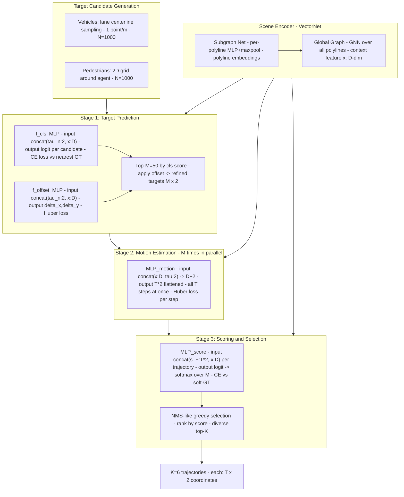

# TNT: Target-driveN Trajectory Prediction（Zhao et al., Waymo / Google, CoRL 2020）

一句话总结：TNT 把轨迹预测分解为三阶段流水线——先预测未来终点（目标点）、再以目标为条件回归完整轨迹、最后打分选 K 条多样化输出；用 VectorNet 编码场景，在 Argoverse/INTERACTION/SDD 全面超越 DESIRE/MultiPath 等基线，奠定了"目标条件化预测"范式，Waymo + Google Research，CoRL 2020。

## 基本信息

- 论文：TNT: Target-driveN Trajectory Prediction
- 作者：Hang Zhao\*、Jiyang Gao\*（并列第一）、Tian Lan、Chen Sun、Benjamin Sapp、Balakrishnan Varadarajan、Yue Shen、Yi Shen、Yuning Chai、Cordelia Schmid、Congcong Li、Dragomir Anguelov
- 机构：Waymo LLC + Google Research
- arXiv：2008.08294（2020）
- 发表：CoRL 2020

---

## 核心问题

**如何生成可解释、多模态、覆盖完整的轨迹预测？**

先前方法用 CVAE/GAN/Flow 模型把意图编码为隐变量，导致三个问题：

1. **不可解释**：隐变量无法查询（"agent 左转的概率是多少？"无法回答）
2. **测试时需要大量采样**，否则模式覆盖不足
3. **模式坍塌**：多样性难以保证

锚点方法（MultiPath、CoverNet）用预聚类轨迹簇作为锚，但锚是高维的（整条轨迹），且与数据集/任务强耦合。

**TNT 的核心立场**：将"多模态意图"分解为**低维的终点分布**（单点坐标，易覆盖、易解释）+ **以终点为条件的单模态运动估计**。终点是"目标"（Target），整个框架因此叫 Target-driveN。

---

## 方法 / 核心机制

### 三阶段架构总览



### 场景编码器：VectorNet 两级结构

使用 **VectorNet**（Gao et al., CVPR 2020）处理场景，分为两级：

#### 第一级：子图网络（Subgraph Network）——每条折线独立编码

HD Map 元素（车道线、交通标志）和智能体历史轨迹均被分解为**折线（polyline）**，每条折线由若干向量组成。

**向量格式**：每个向量 `v = [p_s, p_e, f, id_p]`：
- `p_s`（2D）：向量起点坐标
- `p_e`（2D）：向量终点坐标
- `f`：特征向量（车道状态、agent 类型等，维度不定）
- `id_p`：所属折线索引

**坐标系**：以目标 agent 在最后观测时刻的位置为原点归一化。

子图网络对每条折线内的所有向量做 **MLP + maxpooling**，得到该折线的单一嵌入向量（polyline embedding）。这是一个 PointNet 式结构，处理每条折线内变长的向量序列。

#### 第二级：全局图（Global Graph）——折线间交互建模

将所有折线的 polyline embedding 作为节点，通过一个**图注意力网络（GNN/Transformer）**建模折线之间的交互关系。

输出：目标 agent 对应节点的最终表示，即**全局上下文特征 x**（维度 D，论文未在 TNT 正文中显式给出；TNT 各 MLP 的隐层维度为 64，x 的维度与之对齐）。

**例外（Stanford Drone Dataset）**：SDD 无 HD Map，改用 **ResNet-50** 直接编码 800×800 像素鸟瞰图，输出同样是单一特征向量 x。

---

### Stage 1：目标点预测（分类 + 偏移回归）

#### 候选目标集的生成

N=1000 个候选目标点在推理时也需要实时生成：

| agent 类型 | 候选集生成方式 | 候选点数量 |
|-----------|-------------|----------|
| 车辆（Argoverse）| 车道中心线均匀采样，每米至少一个点 | N≈1000 |
| 车辆（INTERACTION）| 车道边界采样，每米至少一个点 | N≈1000 |
| 行人（PAID）| 20m×20m 网格，0.5m 格，中心点为候选 | N=1600 |
| 行人（SDD）| 300×300 像素网格，格大小=6 像素 | N=2500 |

车辆候选来自地图结构（"语义引导"），行人候选来自几何网格（无地图先验）。

#### 分布建模（Eq. 2）

每个候选目标点 τ^n = (x^n, y^n) 的预测分布拆解为：

```
p(τ^n | x) = π(τ^n | x) · N(Δx^n | ν_x^n(x)) · N(Δy^n | ν_y^n(x))
```

分两步：
1. **粗粒度分类 π**：哪个候选格子是最可能的终点位置
2. **细粒度偏移回归 ν**：在选中格子内，gt 在格内的精确偏移量 (Δx, Δy)

**网络结构**：两个并行的 2-layer MLP（各 64 hidden units），输入均为：

```
input_n = concat(τ^n, x)   # [2 + D]  每个候选点单独拼接全局上下文
```

- **分类 MLP f**：`f(τ^n, x) → scalar logit`；N 个候选点并行计算后做 softmax → π
- **偏移 MLP ν**：`ν(τ^n, x) → (Δx^n, Δy^n)`，只对被选中的候选 u 计算 loss

注意：这是对 N 个候选点的**并行独立评分**，每个候选点的打分只依赖其自身坐标和共享的全局上下文 x，候选点之间**没有交互**。

#### Loss（Eq. 3）

```
L_S1 = L_CE(π, u)  +  L_Huber(ν_x(τ^u, x), Δx^u)  +  L_Huber(ν_y(τ^u, x), Δy^u)
```

- u = argmin_n ||τ^n − τ_gt||（离 gt 最近的候选点索引）
- 分类 loss 只有一个正例（u），其他 N-1 个候选点都是负例
- 偏移 loss 只对 u 计算（离 gt 最近的那个格子的内部偏移）

#### Top-M 选取

按 π 分类概率降序排列，取 Top **M = 50**，加上对应的偏移预测得到精细化目标坐标：

```
τ̃^m = τ^m + ν(τ^m, x)    # [M=50, 2]  精细化的目标坐标
```

---

### Stage 2：以目标为条件的运动估计

#### 核心设计决策

**问题**：如何用一个目标坐标生成完整的 T 步轨迹？

**TNT 的选择**：假设"给定目标后，轨迹在各时步上条件独立且单模态"：

```
p(s_F | τ, x) = ∏_{t=1}^{T} p(s_t | τ, x)
```

- **条件独立**：各时步的坐标由同一个 (τ, x) 独立生成，无时序依赖（不是 RNN，不是自回归）
- **单模态**：给定目标后不再需要多模态——多模态已经由 M=50 个不同目标承担，每个目标对应的运动就是单峰的

这一假设在短时预测（3s）下通过消融实验得到验证（CVAE 替换单模态 Huber，结果相近）。

#### 网络结构

**一个 2-layer MLP**（64 hidden units），对 M 个目标**并行**（每个目标独立）前向：

```
input_m = concat(x, τ̃^m)       # [D + 2]  上下文 + 目标坐标

traj_m  = MLP_motion(input_m)   # [T * 2]  所有 T 步坐标偏移，一次性输出

# reshape 后得到轨迹
traj_m  = traj_m.reshape(T, 2)  # [T, 2]  第 t 步的预测坐标 (x_t, y_t)
```

**关键**：T 步坐标全部**同时**输出为一个 T×2 向量，不存在时序递推。这比 RNN 快，且端到端可训练。

对 M=50 个目标并行运行，得到 **M=50 条完整轨迹**，形状 [M, T, 2]。

#### 训练时 teacher forcing（Eq. 参考 Section 3.2）

训练时 Stage 2 的目标输入不来自 Stage 1 的预测，而是使用 **gt 目标（u 的精细坐标）**：

```
# 训练时
traj_pred = MLP_motion(concat(x, τ^gt))   # 用 gt 目标，避免 Stage 1 误差传播

# 推理时
traj_m = MLP_motion(concat(x, τ̃^m))       # 用 Stage 1 预测的目标
```

#### Loss（Eq. 4）

```
L_S2 = Σ_{t=1}^{T} L_Huber(ŝ_t, s_t)
```

T 个时步的坐标偏移分别计算 Huber Loss 后求和。

---

### Stage 3：轨迹打分与多样化选择

#### 打分网络

M=50 条轨迹分别打分，每条轨迹的打分输入为轨迹展平 + 上下文：

```
input_m = concat(s_F^m.flatten(), x)   # [T*2 + D]  轨迹展平 + 全局上下文

logit_m = MLP_score(input_m)           # scalar

φ(s_F^m | x) = softmax_m(logit_m)     # [M=50]  归一化概率分布
```

**MLP_score** = 2-layer MLP，64 hidden units，M 条轨迹**并行**独立计算后做 softmax。

#### Soft-GT 监督信号（Eq. 6 的 ψ）

打分的 gt 标签不是 one-hot，而是基于与 gt 轨迹距离的软标签：

```
D(s^m, s_GT) = max_{t=1..T} ||s_t^m - s_t^GT||_2      # 最大逐步 L2 距离（最坏时刻）

ψ(s_F^m) = softmax_m(-D(s^m, s_GT) / α),  α = 0.01    # 距离近 → 值大
```

温度 α=0.01 使 softmax 非常尖锐，接近 one-hot（最近的那条轨迹得到几乎全部概率），训练效果等价于 winner-takes-all。

**Loss（Eq. 6）**：

```
L_S3 = L_CE(φ, ψ)   # 交叉熵：预测分布 φ 对齐软标签 ψ
```

#### 类 NMS 多样化选择

打分只确保"最好"，但 K=6 条输出还需要**多样化**（覆盖不同可能的行驶路径）：

```
算法（贪心）：
  sorted_trajs = sort(M trajs by score, descending)
  selected = [sorted_trajs[0]]  # 先取最高分
  for traj in sorted_trajs[1:]:
      D_to_selected = min(max_step_L2(traj, s) for s in selected)
      if D_to_selected > threshold:
          selected.append(traj)
      if len(selected) == K:
          break
```

- 距离度量：同 ψ 的 max-step L2（最坏时刻距离）
- 输出：K=6 条轨迹（PAID K=3，SDD K=5），兼顾高分和多样性

---

## 完整前向传播伪代码（含 shape）

```python
# === 输入 ===
# 每条折线由若干向量组成，向量 = [p_s:2, p_e:2, f:F, id:1]
map_polylines:   list of [N_v_i, 2+2+F+1]  # N_p 条折线，每条 N_v_i 个向量
agent_history:   list of [T_h, 2+2+F+1]    # N_a 个 agent 历史（折线格式）
# Argoverse: T_h = 20 帧 (2s @ 10Hz), T_future = 30 帧 (3s @ 10Hz)

# === VectorNet 编码 ===
# Step 1: 子图 - 每条折线独立编码
poly_embeddings = []
for poly in map_polylines + agent_history:    # 每条折线
    v = MLP_subgraph(poly)                    # [N_v_i, D_sub]  逐向量 MLP
    e = maxpool(v, dim=0)                     # [D_sub]  折线级表示
    poly_embeddings.append(e)
P = stack(poly_embeddings)                    # [N_p + N_a, D_sub]

# Step 2: 全局图 - 折线间交互
X = GlobalGNN(P)                              # [N_p + N_a, D]
x = X[target_agent_idx]                       # [D]  目标 agent 的全局上下文特征

# === Stage 1: 目标预测 ===
candidates = sample_targets(map)              # [N=1000, 2]  候选目标坐标 (ego-centric)
x_expand = x.unsqueeze(0).expand(N, -1)       # [N, D]  广播上下文

# 分类：N 个候选点并行打分
inp_cls = concat(candidates, x_expand, dim=1) # [N, 2+D]
logits  = MLP_cls(inp_cls)                    # [N]  每个候选点一个 logit
pi      = softmax(logits)                     # [N]  目标分布

# 偏移回归：同样并行
offsets = MLP_offset(inp_cls)                 # [N, 2]  每个候选点的精细偏移 (Δx, Δy)

# 训练 loss（用最近候选点 u 的偏移）：
u = argmin(||candidates - tau_gt||)           # scalar 索引
L_S1 = CE(logits, u) + Huber(offsets[u], delta_u)

# Top-M 精细化目标
top_idx    = argtopk(pi, M=50)               # [M]  下标
top_cands  = candidates[top_idx]             # [M, 2]
top_offsets= offsets[top_idx]                # [M, 2]
tau_m      = top_cands + top_offsets         # [M, 2]  精细化目标坐标

# === Stage 2: 目标条件轨迹估计（M 个目标并行）===
x_expand2 = x.unsqueeze(0).expand(M, -1)     # [M, D]
inp_motion = concat(x_expand2, tau_m, dim=1) # [M, D+2]
traj_flat  = MLP_motion(inp_motion)           # [M, T*2]  T=30 for Argoverse
trajs      = traj_flat.reshape(M, T, 2)       # [M, T, 2]  M 条完整轨迹

# 训练 loss（teacher forcing：用 gt 目标 tau_gt）：
inp_tf  = concat(x.unsqueeze(0), tau_gt.unsqueeze(0), dim=1)  # [1, D+2]
pred_tf = MLP_motion(inp_tf).reshape(1, T, 2)                 # [1, T, 2]
L_S2 = Huber(pred_tf, s_gt.reshape(1, T, 2)).sum()

# === Stage 3: 打分与选择 ===
trajs_flat = trajs.reshape(M, T*2)            # [M, T*2]
x_expand3  = x.unsqueeze(0).expand(M, -1)    # [M, D]
inp_score  = concat(trajs_flat, x_expand3, dim=1)  # [M, T*2+D]
score_logits = MLP_score(inp_score)           # [M]  logits
phi          = softmax(score_logits)          # [M]  轨迹概率分布

# 训练 loss（软标签）：
D_to_gt = max_over_T(L2(trajs, s_gt))        # [M]  每条轨迹与 gt 的最大逐步距离
psi = softmax(-D_to_gt / alpha=0.01)         # [M]  软 GT 标签（近 gt 者值大）
L_S3 = CE(phi, psi)

# 推理：NMS 式多样化选择
final_trajs = nms_select(trajs, phi, K=6)    # [K=6, T, 2]
```

---

## 训练 vs 推理差异

| 方面 | 训练 | 推理 |
|------|------|------|
| **Stage 1 监督** | 用最近候选点 u 的 one-hot + offset 作为 GT | 不需要 |
| **Stage 2 输入目标** | **Teacher forcing**：用 GT 目标坐标 τ_gt，不依赖 Stage 1 输出 | 用 Stage 1 预测的 Top-M=50 个精细化目标 |
| **Stage 2 轨迹数量** | 只预测 1 条轨迹（GT 目标对应的那条）| 并行预测 M=50 条 |
| **Stage 3 标签** | Soft-GT ψ 由 GT 轨迹的 max-step 距离计算 | 不需要，直接用 φ 排序 |
| **候选目标来源** | 从 map/grid 采样，N=1000（和推理相同）| 从 map/grid 实时采样 N=1000 |
| **输出** | 三项 loss（λ₁L_S1 + λ₂L_S2 + λ₃L_S3）| K=6 条轨迹 + 对应概率分数 |
| **各 MLP 参数共享** | 三个 Stage 的 MLP 各自独立训练，端到端 | 同，无推理时专用路径 |

**关键推理时序**：

```
采样候选点 N=1000
→ Stage 1 并行打分（2 MLP forward × N）
→ 取 Top-M=50 + 偏移精化
→ Stage 2 并行轨迹预测（1 MLP forward × M=50）
→ Stage 3 并行打分（1 MLP forward × M=50）
→ 贪心 NMS 选 K=6
```

总计：约 1000+50+50 次 MLP forward pass（轻量，MLP 只有 2 层 64 units）。

---

## Loss 函数汇总

| 阶段 | Loss 名称 | 内容 | 权重 |
|------|---------|------|------|
| Stage 1 | L_S1 | CrossEntropy（目标分类）+ Huber（目标偏移）| λ₁ = 0.1 |
| Stage 2 | L_S2 | Huber（每步坐标偏移）| λ₂ = 1.0 |
| Stage 3 | L_S3 | CrossEntropy（轨迹打分 vs Soft-GT）| λ₃ = 0.1 |
| 总计 | L | λ₁L_S1 + λ₂L_S2 + λ₃L_S3 | — |

---

## 关键结果 / 数据

### Argoverse Forecasting（val set）

| 方法 | minFDE₆ | minADE₆ | MR@2m |
|------|---------|---------|-------|
| DESIRE | 1.77 | 0.92 | 0.18 |
| MultiPath | 1.68 | 0.80 | 0.14 |
| **TNT** | **1.29** | **0.73** | **0.09** |

### INTERACTION（val set）

| 方法 | minFDE₆ | minADE₆ |
|------|---------|---------|
| DESIRE | 0.88 | 0.32 |
| MultiPath | 0.99 | 0.30 |
| **TNT** | **0.67** | **0.21** |

### Stanford Drone Dataset（单位：像素）

| 方法 | minFDE₅ | minADE₅ |
|------|---------|---------|
| Social GAN | 41.44 | 27.25 |
| DESIRE | 34.05 | 19.25 |
| PECNet | 25.98 | 12.79 |
| **TNT** | **21.16** | **12.23** |

---

## 消融实验

**阶段逐步累加（Argoverse val）**：

| 配置 | minFDE₅₀ | minFDE₆ | MR₆ |
|------|---------|---------|-----|
| S1 only（目标预测覆盖）| 0.533 | 1.629 | 0.216 |
| S1 + S2（加轨迹回归）| 0.534 | 1.632 | 0.216 |
| S1 + S2 + S3（加打分选择）| — | **1.292** | **0.093** |

**关键发现**：Stage 3 是让 MR 从 21.6% → 9.3% 的关键——仅靠覆盖 50 条候选并不够，还需要打分筛选。Stage 2 的 FDE 和 Stage 1 几乎持平（1.632 vs 1.629），说明运动估计的主要贡献体现在 ADE（中间时刻精度）。

**目标候选密度（Argoverse，1m vs 5m 采样）**：1m 采样 FDE 1.29，5m 采样 1.55，差距显著——目标点覆盖密度直接影响上限。

**目标偏移回归的贡献**：有 vs 无目标 offset regression，Stage 1 的 minFDE₅₀ = 0.53 vs 0.69，提升 **0.16m**。

**运动估计的模型选择（Table 5）**：单模态 Huber 和单样本 CVAE 效果相同（0.73 minADE₆），10 样本 CVAE 仅小幅提升（0.71），验证了"给定目标后运动是单模态"的假设。

---

## 评测指标说明

| 指标 | 含义 |
|------|------|
| **minADE_K** | K 条预测中，ADE（全时步平均 L2）最小的那条；衡量"最佳轨迹整体精度" |
| **minFDE_K** | K 条预测中，FDE（终点 L2）最小的那条；衡量"最佳终点精度" |
| **MR@2m** | K 条预测中无一条终点在 gt 2m 以内的比例；衡量"覆盖失败率" |

注：minADE/minFDE 是 oracle 指标——总是选最佳预测，不反映排名能力；Stage 3 的打分质量无法被这些指标直接衡量。

---

## 局限性

论文无专门局限性章节。隐含局限：

1. **长时预测假设失效**：Stage 2 假设"给定目标后轨迹单模态"在短时成立，长时（>3s）不成立。论文建议迭代中间目标，但未实现。
2. **目标候选依赖地图质量**：车辆候选从车道线采样，地图错误或无图场景下候选集退化。
3. **Stage 2 并行独立预测各步**（conditionally independent），可能导致物理不一致（连续步之间无显式约束）。
4. **每阶段参数量轻（2 层 MLP，64 units）**：表达能力有限，后续 Transformer-based 方法（Wayformer、MTR）完全超越。

---

## 现状与影响

**一句话定性：运动预测领域的奠基性范式论文；"目标条件化预测"思路至今仍活跃，但具体实现（VectorNet + 浅层 MLP）已被深度 Transformer 方法全面超越。**

- TNT 是第一篇将"目标点"作为显式中间表示的主流预测论文，清晰分离了"去哪里（意图）"和"怎么走（运动）"两个子问题。
- **直接影响**：
  - **GoRela、HiVT、MTR、MTR++** 均延续"目标意图 + 条件轨迹"的分解思路
  - **Wayformer** 在架构上超越了 TNT 的浅层 MLP，但问题定义一脉相承
  - **MTR** 的 Motion Query Pair 概念直接来源于 TNT 的"目标 query"设计
- **今天（2026）的视角**：
  - Argoverse 上 minFDE₆ = 1.29 → 当前 SOTA 已达 ~0.5 以下
  - VectorNet + 2 层 MLP 的具体实现已被完全替代
  - "目标条件化"思想仍是主流，但"目标"的形式从单点扩展为意图 token、anchor trajectory 等更丰富的表示
  - 论文写作清晰（三阶段分解、端到端、可解释），仍是该方向最好的入门论文之一

---

## 和 wiki 内其他概念的关联

- **[VectorNet](vectornet-2005.04259.md)**：TNT 直接使用 VectorNet 作为场景编码器；两篇论文均来自 Waymo，第一作者有交叉
- **[MTR: Motion Transformer](mtr-2209.13508.md)**：MTR 的 Motion Query Pair（静态意图锚点）直接继承了 TNT 的目标 query 设计，是 TNT 思路在 Transformer 时代的深化
- **[MTR++](mtrpp-2306.17770.md)**：进一步扩展到多 agent 联合预测
- **[Wayformer](wayformer-2207.05844.md)**：同样在 Argoverse/WOMD 上评测，架构更强，可视为 TNT 的后继竞争方法
- **[Argoverse Motion Forecasting](argoverse-motion-forecasting.md)**：TNT 的主要评测数据集，Argoverse Challenge 2020
- **[高斯混合模型（GMM）](../20-concepts/gaussian-mixture-model.md)**：TNT 的目标分布 π 是 softmax over 离散候选点，本质是混合模型的一种变体；Stage 2 的单模态假设是 GMM 退化为单高斯的特例
- **[Loss Functions](../20-concepts/loss-functions.md)**：TNT 三阶段 loss 涵盖分类 CE、回归 Huber、概率打分 CE，是多任务 loss 设计的经典案例

---

## 附录：完整输入特征

### Agent 历史轨迹（通过 VectorNet 编码）

每条历史轨迹表示为折线，每个向量：

| 字段 | 含义 |
|------|------|
| p_s | 向量起点坐标 (x, y)，以目标 agent 最后观测位置为原点 |
| p_e | 向量终点坐标 (x, y) |
| f | 特征向量（可含 agent 类型、速度等；具体维度论文未给出）|
| id_p | 所属折线 ID（区分不同 agent 的轨迹）|

### HD Map 元素（通过 VectorNet 编码）

同上格式；`f` 包含车道类型、交通标志状态等语义信息。

PAID 数据集地图要素：人行横道、车道边界、停止/让行标志。

### 目标候选点

车辆：从车道中心线（Argoverse）或车道边界（INTERACTION）均匀采样，N=1000，间距 ≤ 1m。

行人：以 agent 为中心的规则网格（Argoverse PAID：20m×20m/0.5m；SDD：300px×300px/6px）。

### SDD 图像输入（无地图时的替代）

| 字段 | 值 |
|------|-----|
| 输入格式 | 800×800 像素鸟瞰 RGB 图像 |
| 裁剪方式 | 以目标 agent 为中心裁剪 |
| 编码器 | ResNet-50（替代 VectorNet）|

---

## 值得看的部分 / 相关资料

- **Figure 1**：三阶段流水线示意图，最直观的整体理解入口
- **Table 1**（三阶段消融）：量化各阶段贡献，Stage 3 的打分对 MR 的影响最关键
- **Table 5**（运动估计模型比较）：验证"给定目标后单模态"假设的核心实验
- **VectorNet**（arXiv 2005.04259，Gao et al., CVPR 2020）：TNT 的场景编码器
- **MultiPath**（Chai et al., CoRL 2019）：TNT 的主要对比基线，理解二者设计差异有助于理解 TNT 的贡献
- **MTR**（arXiv 2209.13508）：TNT 思路的 Transformer 时代升级版
