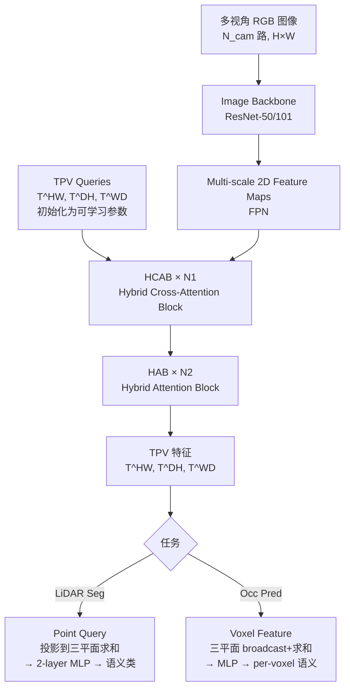

# TPVFormer: Tri-Perspective View for Vision-Based 3D Semantic Occupancy Prediction

**论文**: TPVFormer (arXiv:2302.07817v2)
**作者**: Yuanhui Huang*, Wenzhao Zheng*, Yunpeng Zhang, Jie Zhou, Jiwen Lu（*equal contribution）
**机构**: Tsinghua University (Beijing National Research Center for Information Science and Technology, Dept. of Automation), PhiGent Robotics
**发表**: CVPR 2023
**代码**: https://github.com/wzzheng/TPVFormer

---

## 核心问题

**BEV 表示丢失了高度维度，无法精细描述 3D 场景结构；voxel 表示精细但计算代价 O(HWD) 过高。**

主流 BEV 方法（如 BEVFormer）将 3D 场景压缩为一张 H×W 的 BEV 特征图，每个 BEV 格子对应一根"柱子"（pillar），柱子内所有 z 值共享同一特征。这在 3D 检测上效果不错，但对需要精细 z 轴结构的 occupancy prediction 任务来说信息不足。

直接用 voxel 表示虽然精细，但存储和计算开销是 O(HWD)，难以部署。

TPVFormer 提出用**三个互相垂直平面（Tri-Perspective View，TPV）**来描述 3D 空间：

- **T^HW**（顶视图，H×W）— 对应 BEV
- **T^DH**（侧视图，D×H）— 补充 z-y 方向
- **T^WD**（前视图，W×D）— 补充 x-z 方向

任意 3D 点 (x,y,z) 的特征 = 它在三个平面上的投影特征之和。存储和计算复杂度降至 O(HW+DH+WD)，比 voxel 低一个量级。

---

## 方法 / 核心机制

### TPV 表示

三个平面：
```
T^HW ∈ R^{H×W×C}  (top view)
T^DH ∈ R^{D×H×C}  (side view)  
T^WD ∈ R^{W×D×C}  (front view)
```

任意 3D 点 (x,y,z) 的特征：
```
t_{h,w} = S(T^HW, (h,w)) = S(T^HW, P_hw(x,y))
t_{d,h} = S(T^DH, (d,h)) = S(T^DH, P_dh(z,x))
t_{w,d} = S(T^WD, (w,d)) = S(T^WD, P_wd(y,z))
f_{x,y,z} = A(t_{h,w}, t_{d,h}, t_{w,d})   # A = 求和，S = 双线性插值
```

相比 BEV，TPV 三个平面互相垂直，每个点的 z 方向信息被侧视图和前视图补充，不会丢失高度维度。

### TPVFormer 架构



**两类 Transformer Block**：

| Block | 构成 | 作用 |
|-------|------|------|
| HCAB（前 N1 层） | ICA + CVHA | 同时做 image cross-attention 和 cross-view hybrid-attention，获取视觉信息 + 三平面间交互 |
| HAB（后 N2 层） | CVHA only | 仅做三平面间的 cross-view hybrid-attention，强化上下文信息编码 |

**Image Cross-Attention (ICA)**：

每个 TPV query t_{h,w}（位于 top plane 的 (h,w)）通过逆投影函数 P^{-1}_{hw} 找到其在世界坐标系中的参考点集合 Ref^{world}_{h,w}（沿垂直方向均匀采样 N_ref^{HW} 个 3D 点），再投影到各相机图像平面得到 Ref^{pix}_{h,w}，然后用可变形注意力（Deformable Attention）从图像特征图采样：

```
ICA(t_{h,w}, I) = (1/|N^val_{h,w}|) Σ_{j∈N^val_{h,w}} DA(t_{h,w}, Ref^{pix,j}_{h,w}, I_j)
```

**Cross-View Hybrid-Attention (CVHA)**：

允许三个 TPV 平面的 query 相互交换信息。以 top plane 的 query t_{h,w} 为例，其参考点集合由三部分构成：
```
R_{h,w} = R^{top}_{h,w} ∪ R^{side}_{h,w} ∪ R^{front}_{h,w}
CVHA(t_{h,w}) = DA(t_{h,w}, R_{h,w}, T)
```

### 架构伪代码（维度注释）

```python
# --- 输入 ---
images: [B, N_cam, 3, H_img, W_img]      # N_cam=6 (nuScenes)

# --- Image Backbone ---
feats: [B, N_cam, C_img, h, w]           # 多尺度 feature maps

# --- TPV Queries（可学习参数 + 3D 位置编码）---
T_HW: [H, W, C]     # top plane
T_DH: [D, H, C]     # side plane
T_WD: [W, D, C]     # front plane
# TPVFormer-Base: H=W=200, D=16, C=128; TPVFormer-Small: H=W=100, D=8, C=128

# --- HCAB 层（N1 次） ---
for _ in range(N1):
    T_HW = ICA(T_HW, feats)   # image cross-attention
    T_DH = ICA(T_DH, feats)
    T_WD = ICA(T_WD, feats)
    T_HW, T_DH, T_WD = CVHA(T_HW, T_DH, T_WD)  # cross-view

# --- HAB 层（N2 次） ---
for _ in range(N2):
    T_HW, T_DH, T_WD = CVHA(T_HW, T_DH, T_WD)

# --- 应用：点特征（LiDAR Seg）---
# 对查询点 (x,y,z)，投影到三平面采样然后求和
f_xyz = bilinear(T_HW, (h,w)) + bilinear(T_DH, (d,h)) + bilinear(T_WD, (w,d))
pred = MLP(f_xyz)   # [N_pts, n_classes]

# --- 应用：Voxel 特征（Occ Pred）---
# 将三平面 broadcast 到 full 3D，求和，得到 H×W×D×C
V = broadcast(T_HW, D) + broadcast(T_DH, W) + broadcast(T_WD, H)  # [H,W,D,C]
pred = MLP(V)   # [H,W,D,n_classes]
```

---

## 训练 vs 推理差异

| 方面 | 训练 | 推理 |
|------|------|------|
| **监督信号** | 使用稀疏 LiDAR 点的语义标签 + pseudo-per-voxel labels | 无需 LiDAR |
| **LiDAR Seg 任务** | 用 LiDAR 点位置生成 pseudo voxel labels 监督 voxel 预测 | 仅用相机图像；用 LiDAR 点坐标（不是点云本身）查询 TPV 特征来计算 metrics |
| **分辨率** | 固定训练分辨率 | 可以任意分辨率推理（双线性插值），无需重训练 |
| **Loss** | cross-entropy + lovász-softmax（两者分别作用于 voxel 和 point 预测） | 无 |

---

## Loss 函数

对 LiDAR segmentation 任务同时使用两种 loss：
- **Cross-Entropy (CE) loss**：逐 voxel 分类 loss，提升分类准确率
- **Lovász-Softmax loss**（Berman et al., CVPR 2018）：可微的 IoU 代理 loss，优化 IoU 指标

两种 loss 分别施加于 voxel-level 预测和 point-level 预测（见 Table 3 消融）。

对 Semantic Scene Completion 任务，沿用 MonoScene 的 loss 设置（除 relation loss 外）。

---

## 消融实验

**Table 4：TPV 分辨率 vs feature 维度对 LiDAR segmentation point mIoU 的影响**

| 方法 | 分辨率 | Feature 维度 | mIoU |
|------|--------|--------------|------|
| BEVFormer | 100×100 | 256 | 50.37 |
| BEVFormer | 200×200 | 256 | 56.21 |
| TPVFormer | 100×100×8 | 256 | 64.15 |
| TPVFormer | 200×200×16 | 128 | **68.86** |

结论：TPV 在所有配置下都优于 BEV，提高分辨率对 TPV 的提升更大。

**Table 5：HCAB 和 HAB 数量对 SSC 任务的影响**

| #HCAB | #HAB | SC IoU | SSC mIoU |
|-------|------|--------|----------|
| 2 | 4 | 35.55 | 10.49 |
| 3 | 2 | 35.61 | **11.36** |
| 4 | 0 | 35.79 | 10.82 |

结论：HCAB 多有利于 SC（几何精度），但 HAB 对 SSC（语义）也有贡献，最优是适度混合。

**Table 3：Loss 类型对比**

同时用 voxel 和 point 作为两种 loss 的输入可以达到最高 point mIoU（64.80），单独用 voxel loss 会让 point mIoU 显著下降（63.17）。

---

## 训练细节

- **LiDAR Seg（nuScenes）**：
  - Backbone：TPVFormer-Base = ResNet101-DCN initialized from FCOS3D；TPVFormer-Small = ResNet-50 (ImageNet pretrained)
  - TPV 分辨率：Base = 200×200×16，Small = 100×100×8（Small 上采样 2×用于更细致的监督）
  - 图像输入：Base = 1600×900（多尺度），Small = 800×450
  - 训练 24 epochs，batch size 8，8 块 A100 GPU
  - 优化器：AdamW，lr=2e-4，weight decay=0.01，cosine scheduler，前 500 步 linear warmup
  - 图像增强：与 BEVFormer 相同

- **SSC（SemanticKITTI）**：
  - 2D backbone：EfficientNetB7（与 MonoScene 相同）
  - TPV 分辨率：128×128×16（生成与 MonoScene 相同尺寸的 3D voxel 特征）
  - 图像输入：cam2 cropped 到 1220×370，feature dim=96
  - lr=2e-4，weight decay=0.01，cosine scheduler

---

## 数据

- **Panoptic nuScenes（LiDAR Seg 任务）**：1000 场景，6 路 360° 环视相机，32 线 LiDAR，标注 2Hz；官方划分 700/150/150
- **SemanticKITTI（SSC 任务）**：outdoor LiDAR scans voxelized 到 256×256×32 格（0.2m voxel），21 类（19 语义+1 free+1 unknown）；22 sequences，10/1/11 train/val/test 划分

---

## 评测指标

- **LiDAR Seg**：mIoU（所有语义类的 mean Intersection over Union）
- **SSC**：SC IoU（几何完成，忽略语义）+ SSC mIoU（语义场景完成）

---

## 关键结果 / 数据

**nuScenes LiDAR segmentation（test set，Table 1）**：

TPVFormer-Base 达到 **mIoU=69.4%**，与多数 LiDAR-only 方法相当（Cylinder3D++ 77.3%），TPVFormer-Small 达到 59.2%。在仅用相机图像的情况下与 LiDAR 方法打平是关键贡献。

**SemanticKITTI SSC（validation set，Table 7）**：

| 方法 | SC IoU | SSC mIoU |
|------|--------|----------|
| MonoScene** | 36.86 | 11.08 |
| TPVFormer | **35.61** | **11.36** |

注：TPVFormer 在 mIoU 上超越 MonoScene，但 SC IoU 略低，参数量更少（6.0M vs 15.7M），FLOPs 更低（128G vs 500G）。

---

## 局限性

- **只有稀疏 LiDAR 监督**：在 3D occupancy prediction 任务（所有 voxel 都需要预测）上，TPVFormer 输出是稀疏的（无 dense ground truth 训练），论文仅做定性分析
- **没有专用 dense occupancy benchmark**：论文发表时 Occ3D 还未正式建立；TPVFormer 后来在 Occ3D-nuScenes 上被广泛评测
- **高度压缩仍有损失**：TPV 比 voxel 少一个量级的复杂度，但三平面交叉查询的近似精度不如全 voxel

---

## 现状与影响

TPVFormer 是 **camera-only 3D occupancy prediction 的经典 baseline 和奠基性工作**。

- **三平面 TPV 表示**的思路被后续多个工作采用和扩展（如 Tri-Perspective 的概念被反复引用）
- 作为基线方法，TPVFormer 出现在 Occ3D、SurroundOcc、OpenOccupancy 等几乎所有 occupancy benchmark 的对比表里
- **模型本身**：已逐渐被更强的方法取代（BEVFormer v2、RenderOcc、OccGen 等），但作为轻量 baseline 仍有参考价值
- **参数效率**：6.0M 参数 + 128G FLOPs，比 MonoScene（15.7M + 500G）显著更轻

**今天（2026）视角**：TPVFormer 的具体架构不再是 SOTA，但它确立的"用 2D transformer 把相机特征提升到 3D TPV 平面"的范式仍有影响；Occ3D-nuScenes 上约 27-28 mIoU 的结果被后来的工作逐步超越到 40+。

**定性**：奠基性工作，camera-only occupancy 任务的标准 baseline，架构上已被超越。

---

## 关联概念

- [Occ3D](./occ3d-2304.14365.md) — TPVFormer 是 Occ3D benchmark 评测的基线之一；Occ3D 建立了 TPVFormer 的主要评测平台
- [MonoScene](./monoscene-2112.00726.md) — TPVFormer 在 SSC 任务上直接与 MonoScene 比较，是其直接后继
- [DETR](./detr-2005.12872.md) — 可变形注意力（Deformable DETR，Zhu et al. ICLR 2021）是 TPVFormer 中 ICA 和 CVHA 的核心注意力机制
- [nuScenes](../30-papers/nuscenes-1903.11027.md) — TPVFormer 的主要评测数据集

## 值得看的部分 / 相关资料

- **Section 3.1（Generalizing BEV to TPV）**：TPV 的数学定义和与 BEV/voxel 的对比，是理解动机的关键
- **Figure 3（TPV 表示可视化）**：直观看 voxel/BEV/TPV 三种表示的区别
- **Section 3.2（TPVFormer）**：ICA 和 CVHA 的详细公式
- **Figure 6（任意分辨率推理）**：展示 TPV 分辨率可变的优势
