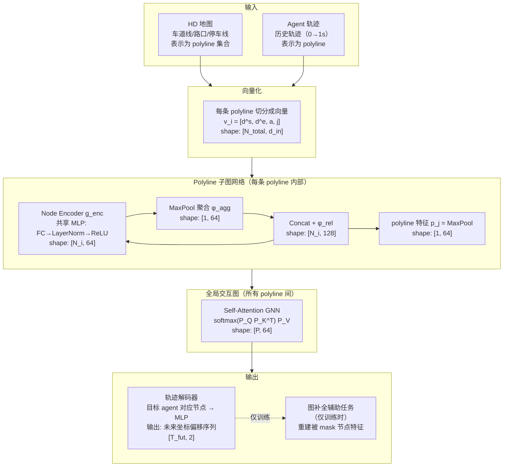

# VectorNet: Encoding HD Maps and Agent Dynamics from Vectorized Representation（Gao et al., CVPR 2020）

一句话总结：第一个把 HD 地图和 agent 轨迹统一表示为向量集合、用层次化图神经网络做行为预测的框架——polyline 子图提取局部几何特征，全局交互图建模跨 polyline 依赖，辅助图补全任务增强表征；比光栅化 ConvNet baseline 减少 70% 参数量和 200×+ FLOPs，同时在 Argoverse 上超越 state-of-the-art，成为后续运动预测方法的标准输入编码范式。

## 基本信息

- 论文：VectorNet: Encoding HD Maps and Agent Dynamics from Vectorized Representation
- 作者：Jiyang Gao\*、Chen Sun\*、Hang Zhao、Yi Shen、Dragomir Anguelov、Congcong Li、Cordelia Schmid（\* 等同贡献）
- 机构：¹ Waymo LLC；² Google Research
- 发表：CVPR 2020
- arXiv：2005.04259（2020 年 5 月）

---

## 核心问题

**传统行为预测方法把 HD 地图和轨迹渲染成图像再用 ConvNet 编码，引入有损渲染、感受野受限、计算成本高三个根本问题。**

HD 地图天然是结构化向量数据（车道线是 spline、路口是多边形、停车线是线段），agent 轨迹天然是时序向量序列。主流方法（IntentNet、MultiPath、PRECOG 等）把这些数据光栅化成鸟瞰图后用 ConvNet 编码，带来：

1. **有损渲染**：几何精度受像素分辨率限制，稀疏但精确的语义信息（速度限制、停车标志属性）难以编码
2. **感受野受限**：ConvNet 的有效感受野受限于 kernel 大小和图像分辨率；扩大感受野需要更大 kernel 或更高分辨率，计算代价平方增长
3. **计算冗余**：对每个目标 agent 都要重新裁剪特征图，FLOPs 随目标数平方增长

**VectorNet 的核心洞察**：HD 地图和轨迹都可以表示为有向量的集合（polylines），向量天然保留了几何精度和语义属性，可以直接送入图神经网络，无需光栅化。

---

## 模型架构

### 架构图



### 伪代码（含 shape 注释）

```python
# ---- 符号约定 ----
# P     : 场景中 polyline 总数（地图要素 + agent 轨迹之和）
# N_i   : 第 i 条 polyline 的向量节点数
# N_total: 所有节点数之和 = sum(N_i)
# d_in  : 输入节点特征维度（起止坐标 4 + 属性 + polyline_id）
# d     : 隐层维度，默认 64
# T_fut : 未来预测步数（Argoverse: 30 步 @10Hz = 3s）

# ---- Step 1: 向量化（数据预处理）----
# v_i = [d^s_i, d^e_i, a_i, j]
# d^s, d^e: 向量起止点 2D 坐标，以目标 agent 最后观测位置为原点归一化
# a_i: 语义属性（道路类型/速度限制/时间戳等）
# j: polyline ID，用于构建子图邻接

# nodes: [N_total, d_in]

# ---- Step 2: Polyline 子图网络 ----
# 对每条 polyline P_j（含 N_j 个节点）独立处理

for j in range(P):
    v = nodes[polyline_j]                     # [N_j, d_in]
    for l in range(L_sub):                    # L_sub=3 层
        enc = MLP_shared(v)                   # [N_j, d]  FC→LN→ReLU
        agg = maxpool(enc, dim=0)             # [1,   d]  置换不变聚合
        agg = agg.expand(N_j, d)             # [N_j, d]
        v   = concat([enc, agg], dim=-1)      # [N_j, 2d] relational op
    polyline_feat[j] = maxpool(v, dim=0)      # [1, d]   polyline 级表示

# polyline_feats: [P, d]

# ---- Step 3: 全局交互图 ----
# 所有 polyline 特征全连接，单层自注意力
P_mat = polyline_feats                        # [P, d]
for l in range(L_global):                    # L_global=1 层
    Q = Linear(P_mat)                         # [P, d]
    K = Linear(P_mat)                         # [P, d]
    V = Linear(P_mat)                         # [P, d]
    attn = softmax(Q @ K.T / sqrt(d))         # [P, P]
    P_mat = attn @ V                          # [P, d]

# global_feats: [P, d]

# ---- Step 4: 轨迹预测头 ----
target_feat = global_feats[target_agent_idx] # [d]
traj = MLP_traj(target_feat)                 # [T_fut * 2]
traj = traj.reshape(T_fut, 2)               # [T_fut, 2]  归一化坐标偏移

# ---- Step 5: 图补全辅助任务（仅训练）----
# 随机 mask 部分 polyline 节点的特征，用 p_i^id（位置标识嵌入）替换
# 要求模型从全局图上下文重建被 mask 节点
masked_feat = global_feats[masked_idx]       # [M, d]
pred_feat   = MLP_node(masked_feat)          # [M, d]
L_node = huber_loss(pred_feat, target_feat)  # Huber loss
```

---

## 训练 vs 推理差异

| 项目 | 训练时 | 推理时 |
|---|---|---|
| **图补全辅助任务** | 随机 mask 部分 polyline 节点特征，附加 Huber loss 重建被 mask 节点 | **关闭**，不 mask，不计算 L_node |
| **坐标归一化** | 以目标 agent 最后观测位置为原点归一化 | 同训练，推理时同样需要归一化处理 |
| **目标 agent**  | 每次只预测一个 target agent；若批内有多个 agent，各自独立归一化后拼为 batch | 同训练，每个目标单独处理 |
| **loss** | $\mathcal{L} = \mathcal{L}_{traj} + \alpha \mathcal{L}_{node}$，$\alpha=1.0$ | 仅推理，不计算 loss |
| **dropout** | BatchNorm/LayerNorm 处于 train 模式 | eval 模式 |

**推理输入**：
- 来自自动感知系统的历史轨迹（含噪声，非 GT 标注）
- HD 地图的结构化向量（车道线、路口、停车标志等，以目标 agent 位置为中心截取）

**推理输出**：
- 目标 agent 的未来轨迹坐标偏移序列，shape `[T_fut, 2]`（相对于最后观测位置的归一化坐标）
- 原始 VectorNet 仅输出单条最可能轨迹（K=1），多模态输出需要替换解码器

---

## Loss 函数

**总损失**（式 9）：

$$\mathcal{L} = \mathcal{L}_{traj} + \alpha \mathcal{L}_{node}, \quad \alpha = 1.0$$

**$\mathcal{L}_{traj}$**：负 Gaussian log-likelihood，对 groundtruth 未来轨迹。

预测以逐步坐标偏移参数化，从最后观测位置出发，坐标系以目标 agent heading 旋转对齐。

**$\mathcal{L}_{node}$**：Huber loss，被 mask 节点的特征重建误差。

为避免模型通过学习节点特征的绝对量级来作弊，在送入全局图之前对 polyline 节点特征做 L2 归一化。

**设计动机**：图补全任务受 BERT masked language model 启发（论文明确引用 Devlin et al. 2019），把语言建模的自监督思路推广到无序图结构——随机遮盖部分节点，强迫模型通过邻居上下文重建，从而学到 polyline 之间的依赖关系，而非单纯依赖目标 agent 自身的历史轨迹。

---

## 消融实验

### 上下文输入类型（Table 2，Argoverse）

| 上下文输入 | 图补全 | DE@3s | ADE |
|---|---|---|---|
| 仅目标轨迹（none）| — | 2.98 | 2.36 |
| + map | 否 | 2.18 | 1.75 |
| + map + agents | 否 | 2.14 | 1.72 |
| + map | 是 | 2.11 | 1.70 |
| **+ map + agents** | **是** | **2.06** | **1.66** |

**最大收益来自加入地图信息**（ADE 2.36→1.75），说明 HD 地图中的车道结构对轨迹预测贡献远大于他车轨迹。图补全辅助任务一致性提升，在 ADE（长时程）效果更显著。

### 图深度与宽度（Table 3，DE@3s）

| Polyline 子图深度 | 全局图深度 | In-house | Argoverse |
|---|---|---|---|
| 1 | 1 | 1.09 | 3.89 |
| **3** | **1** | **1.00** | **3.67** |
| 3 | 2 | 0.99 | 3.69 |
| 3（width 128）| 1 | 1.00 | 3.93 |

**polyline 子图深度（3层）比全局图深度影响更大**；加宽 MLP 不提升甚至轻微下降（Argoverse 数据集小，过拟合）。

### FLOPs 与参数量（Table 4）

| 模型 | FLOPs | #Param | DE@3s (Argoverse) |
|---|---|---|---|
| ResNet18-k3-c3-r400（最佳 ConvNet）| 10.56G | 246K | 4.81 |
| **VectorNet（含辅助任务）** | **0.041G×n** | **72K** | **3.67** |

- ConvNet FLOPs 固定（以场景为中心渲染），VectorNet FLOPs 随目标 agent 数 n 线性增长，但单 agent 仅 0.041G，约 **200× 差距**
- 参数量 72K vs 246K，**减少 70%**，且精度提升 12%（4.81→3.67）

---

## 训练细节

- 优化器：Adam，初始学习率 0.001
- 学习率调度：每 5 epoch 乘以 0.3（阶梯衰减）
- 训练总轮数：25 epochs
- Batch 训练：8 GPU 同步训练
- 隐层维度：d = 64（所有 MLP hidden size 固定为 64）
- Polyline 子图层数：3 层；全局图层数：1 层
- 输入归一化：向量坐标以目标 agent 最后观测时刻的位置为原点归一化；全局图输入 polyline 特征做 L2 归一化

---

## 数据

**Argoverse Motion Forecasting**（公开 benchmark）：
- 333K 5 秒序列；211K 训练 / 41K 验证 / 80K 测试
- 采样频率 10Hz；(0, 2]s 为观测，(2, 5]s 为预测目标
- 每个序列含一个"interesting" agent（变道、让行等场景）+ 地图特征

**Waymo In-house Dataset**（内部）：
- 2.2M 训练 + 0.55M 测试轨迹（4 秒，(0, 1]s 观测，(1, 4]s 预测）
- 含 HD 地图要素：车道边界、停车标志、让行标志、人行横道、减速带
- 轨迹来自真实驾驶，分布包含静止、直行、转弯、变道、倒车（保留自然分布）
- 未来轨迹为人工标注（与 Argoverse 机器生成未来轨迹不同）

---

## 评测指标

**DE@ts（Displacement Error at t seconds）**：预测终点与 GT 终点的 L2 距离（米），在 t=1/2/3 秒各测一次。直观但只看终点，忽略中间路径准确性。

**ADE（Average Displacement Error）**：整条预测轨迹与 GT 的逐帧平均 L2 距离（米）。比 DE@ts 更全面，但对早期预测点（容易预测）和晚期点（难预测）权重相同。

两个指标均在 K=1（最可能轨迹单条预测）下报告，Argoverse 上使用 minADE/minFDE（K>1）时更能体现多模态预测能力，但 VectorNet 原文仅报告 K=1。

---

## 局限性

1. **单模态预测**：MLP 解码器只输出单条轨迹（K=1），不直接支持多模态未来预测；作者在结论中明确指出需要结合 MultiPath/PRECOG 等多模态解码器
2. **全连接全局图的规模问题**：全连接自注意力计算代价 O(P²)，密集场景（polyline 数量多时）代价上升；作者通过限制为单层缓解，但未根本解决
3. **目标 agent 逐一推理**：特征以目标 agent 为中心归一化，预测多个 agent 时需要为每个目标单独重算（FLOPs 随目标数线性增长）；论文提到共享坐标系作为 future work
4. **输入依赖感知结果**：轨迹来自自动感知系统（有噪声），论文未评估感知误差对预测精度的影响

---

## 现状与影响

一句话定性：**VectorNet 确立了"HD 地图 + 轨迹统一向量化 → 层次化图网络"的行为预测标准范式，被此后几乎所有主流运动预测方法（MTR、Wayformer、MotionDiffuser、UniAD 等）直接沿用或扩展，是 2020–2024 年该领域的事实编码标准；其具体实现（GNN + maxpool）逐渐被 Transformer self-attention 替换，但向量化输入表示的核心思路从未被取代。**

- **直接影响**：
  - **MTR（NeurIPS 2022）**：在 VectorNet 向量化编码基础上引入 Motion Query Pair，把全局交互图的输出进一步用于迭代轨迹精化，Waymo Challenge 2022 冠军
  - **Wayformer（ICRA 2023）**：用 VectorNet 风格的向量化输入，系统对比 Early/Late/Hierarchical 融合策略
  - **MotionDiffuser（CVPR 2023）**：在 VectorNet 编码的场景表征上用扩散模型生成多 agent 联合轨迹分布
  - **UniAD（CVPR 2023 Best Paper）**：端到端 AV 系统运动预测模块的地图/agent 编码沿用 VectorNet 层次化向量化思路
- **核心贡献的持久性**：向量化表示已成为 Waymo Open Motion Dataset、nuScenes、Argoverse 2 等 benchmark 的标准输入格式；图补全辅助任务是自监督场景表征学习在 AV 领域的早期成功实践
- **被扩展的维度**：多模态解码（MultiPath++ / Anchor / Diffusion-based）；并行多 agent 预测（改进坐标系，MTR/Wayformer 等）；GNN 替换为 Transformer（等价但工程更高效）
- **当时 vs 2026 的视角**：核心贡献"向量化表示比光栅化更高效且保留结构信息"今天仍然成立；但 70% 参数量减少这个数字的意义已被重新定义——现代预测模型（MTR++、Scene Transformer 等）参数量已在 10M–100M 级别，VectorNet 的 72K 更像是轻量先验而非绝对规模目标

---

## 和 wiki 内其他概念的关联

- [图神经网络（GNN）](../20-concepts/gnn.md)：VectorNet 是 GNN 在自动驾驶场景理解中的典型应用——polyline 子图用消息传递聚合局部几何，全局图用自注意力建模跨 polyline 交互；两层层次化结构对应 GNN 的"局部→全局"归纳偏置
- [PointNet：点云深度学习](pointnet-1612.00593.md)：VectorNet 的 polyline 子图网络是 PointNet 的直接扩展——去掉 polyline 分组和属性编码后两者等价；两者共享"逐元素 MLP + 置换不变 maxpool"的核心思路，VectorNet 增加了方向、属性和分组 inductive bias
- [Attention 直觉：Self/Cross/Local](../20-concepts/attention-intuition.md)：全局交互图的 GNN 等价于全局 self-attention（$\text{softmax}(P_Q P_K^T)P_V$），与 Transformer encoder 数学形式完全相同；VectorNet 是在图网络框架内独立推导出 self-attention 的案例
- [MTR: Motion Transformer](mtr-2209.13508.md)：MTR 在 VectorNet 向量化编码基础上引入 Motion Query Pair，把静态意图锚点与动态搜索查询解耦；VectorNet 是 MTR 架构的直接前驱
- [Wayformer](wayformer-2207.05844.md)：Wayformer 系统对比不同融合策略，输入编码沿用 VectorNet 向量化范式；两者是同一编码哲学下不同融合架构的对比研究
- [MotionDiffuser](motiondiffuser-2306.03083.md)：MotionDiffuser 的场景编码基于向量化表示，置换不变 denoiser 建立在 VectorNet 式的 polyline 特征之上
- [Argoverse Motion Forecasting](argoverse-motion-forecasting.md)：VectorNet 发布时在 Argoverse benchmark 达到 SOTA，Argoverse 是 VectorNet 的主要公开评测基准

---

## 值得看的部分

- **Section 3.1（向量化表示）+ Figure 1**：左右对比光栅化与向量化两种输入表示，是理解整篇论文动机最直观的一页；向量节点特征 $\mathbf{v}_i = [\mathbf{d}^s, \mathbf{d}^e, \mathbf{a}, j]$ 的定义简洁但信息量大
- **Section 3.2 末尾（与 PointNet 的关系）**：作者明确指出当 $\mathbf{d}^s = \mathbf{d}^e$ 且去掉属性时退化为 PointNet——这个连接是理解两篇论文关系的关键
- **Figure 2（整体架构图）**：Input vectors → Polyline subgraphs → Global interaction graph → 双任务输出，四列展示完整数据流
- **Table 4（FLOPs 和参数量对比）**：0.041G×n vs 10.56G，200×+ 差距说明向量化不只是表示问题，还是工程效率革命
- **Table 2（消融）**：加地图信息带来最大提升（ADE 2.36→1.75），图补全辅助任务在长时程一致有益
- **Figure 4（注意力可视化）**：全局交互图的 attention 在面临多选择时（路口分叉）聚焦到正确候选车道，提供了模型"看哪里"的定性理解

---

## 附录：输入特征详解

### 模态 1：HD 地图向量

坐标系：以目标 agent **最后观测时刻的位置**为原点，目标 agent heading 方向为 x 轴，右手系旋转归一化。

选择"最后观测时刻"而非其他时刻（如序列起点或固定绝对坐标系），原因有两点：
1. **预测连续性**：模型输出的是从该时刻起的未来坐标偏移，以此为原点使预测目标的起始点恒为 (0, 0)，简化解码器的任务
2. **局部化特征**：场景特征以当前位置为中心归一化后，模型只需关注"相对于我现在在哪里"的局部上下文，不需要学习全局绝对坐标下的位置先验

替代方案及其取舍：
- **序列起点为原点**：历史轨迹的时序特征（位移量）会积累偏差，且预测头的输出值域更大；部分后续工作（如 Wayformer）采用此方案
- **地图固定坐标系（绝对坐标）**：便于多 agent 共享同一坐标系、并行预测，但模型需要学习不同地理位置下的位置先验，泛化难度增加；VectorNet 论文将此列为 future work（Section 3.1 末尾）

每个向量节点 $\mathbf{v}_i$：

| 字段 | 维度 | 含义 | 示例 |
|---|---|---|---|
| $d^s_x, d^s_y$ | 2 | 向量起点 2D 坐标（归一化后，单位 m）| (−5.2, 3.1) |
| $d^e_x, d^e_y$ | 2 | 向量终点 2D 坐标（归一化后，单位 m）| (−4.8, 3.4) |
| $a$ | 可变 | 语义属性，编码为拼接向量（见下方说明）| — |
| $j$ | 1 | polyline ID（整数），标识属于哪条 polyline | 3 |

属性字段 $a$ 的编码方式：离散类型（道路类型、交通灯颜色等）做 one-hot 编码，连续量（速度限制、道路宽度等）直接作为标量拼入，最终拼接成一个固定长度向量。例如：道路类型有 6 类（车道/路口/人行横道/停车区/减速带/其他），编码为 6 维 one-hot；速度限制取归一化值（如 50km/h → 0.5，最大 100km/h 归一化）。完整属性集合在论文附录中给出，各数据集略有不同。

每条 polyline 包含多个向量（控制点顺序相连），典型值：车道线 5–30 个向量，路口多边形 4–8 个。

### 模态 2：Agent 轨迹向量

历史轨迹（0→1s，in-house；0→2s，Argoverse），采样间隔 0.1s。

| 字段 | 维度 | 含义 | 示例 |
|---|---|---|---|
| $d^s_x, d^s_y$ | 2 | 时间步 t 的位置（归一化坐标）| (0.0, 0.0) |
| $d^e_x, d^e_y$ | 2 | 时间步 t+1 的位置（归一化坐标）| (1.3, 0.1) |
| $a$ | 可变 | agent 属性：速度、朝向、时间戳（从最后观测时刻往前计）、对象类型（车/行人/骑行者）| t=−1, type=vehicle |
| $j$ | 1 | polyline ID，同一 agent 的历史轨迹共享同一 polyline ID | 22 |

目标 agent 历史轨迹是一条 polyline，其他 agent 的历史轨迹各自构成独立 polyline。非目标 agent 的**未来**轨迹在训练和推理时均不使用（不输入模型）。
