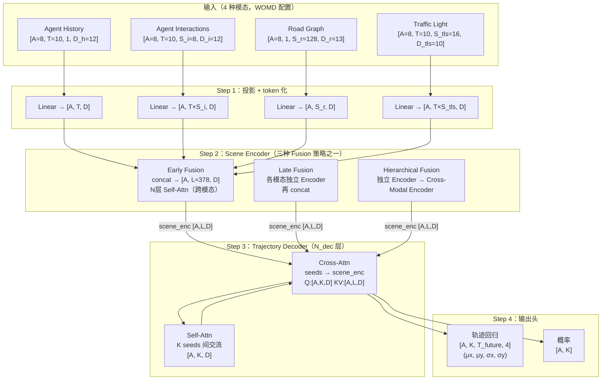

# Wayformer: Motion Forecasting via Simple & Efficient Attention Networks（Nayakanti et al., Waymo, 2022）

一句话总结：Wayformer 提出一个简洁同质化的 attention 架构家族，通过系统对比 Late/Early/Hierarchical 三种模态融合策略和 Factorized/Latent Query 两种提速手段，发现最简单的 Early Fusion 在多数配置下效果最好，在 WOMD 和 Argoverse 双榜上达到 SOTA，arXiv 2207.05844。

## 基本信息

- 论文：Wayformer: Motion Forecasting via Simple & Efficient Attention Networks
- 作者：Nigamaa Nayakanti\*、Rami Al-Rfou\*、Aurick Zhou、Kratarth Goel、Khaled S. Refaat、Benjamin Sapp（\* 同等贡献）
- 机构：Waymo
- arXiv：2207.05844（2022-07）
- 发表：ICRA 2023

---

## 核心问题

运动预测的输入是异质多模态的，来自不同信息源、维度不一致：

**Agent History** `[A, T, D_h]`
- A：场景中需要预测的 **interested agent 数量**（WOMD 每个场景指定 8 个感兴趣的 agent）。**这里的 agent 不是自车，而是场景里要被预测的他车/行人**——每个 agent 用以自己为中心的坐标系独立做一次预测，得到 A 组独立的预测结果。类比：不是"batch 是 8 辆车"，而是"这个场景里我需要预测 8 个目标，每个目标各预测一次"
- T：历史帧数，WOMD 是 10 帧（1 秒，10Hz），Argoverse 2 是 50 帧（5 秒）
- D_h：每帧的状态特征维度，包含：位置(x,y)、速度(vx,vy)、加速度(ax,ay)、朝向、尺寸(长/宽/高)、类型(车/人/自行车) 等，约 10-15 维

**Agent Interactions** `[A, T, S_i, D_i]`
- S_i：每个 agent 周围的 context agent 数量（固定取最近的 S_i 个，通常 8-16）
- D_i：context agent 的状态特征，和 D_h 类似但转换到以该 agent 为中心的相对坐标系

> **interactions 里的数据会有重复吗？** 会，但这是 ego-centric 设计的代价。如果 agent-1 和 agent-2 互相是对方的邻居，那 agent-1 的 interactions 包含 agent-2 的数据，agent-2 的 interactions 也包含 agent-1 的数据——相同的绝对状态被编码了两次，但用的是不同的相对坐标系。这是 Wayformer 局限之一（Section 7 明确指出），UniAD 的 scene-centric 设计正是为了解决这个问题。

**Road Graph** `[A, 1, S_r, D_r]`
- S_r：距离每个 agent 最近的道路段数量（通常取最近的 S_r=128 段）
- D_r：每个道路段的特征：起点(x,y)、终点(x,y)、道路类型（直道/弯道/路口）等，约 13 维
- 时间维度为 1：道路是静态的，没有时序变化

**Traffic Light State** `[A, T, S_tls, D_tls]`
- S_tls：每个 agent 附近的交通灯数量（通常取最近的 S_tls=16 个）
- D_tls：每个交通灯的状态特征：位置、信号状态（红/黄/绿/未知）、置信度

**输入规模估算**（WOMD 配置，A=8，T=10）：
```
Agent History:      [8, 10, 1, 12]  → 8 个 agent × 10 帧 × 12 维
Agent Interactions: [8, 10, 8, 12]  → 8 个 agent × 10 帧 × 8 个邻居 × 12 维
Road Graph:         [8, 1,  128, 13] → 8 个 agent × 128 条道路段 × 13 维
Traffic Light:      [8, 10, 16, 10]  → 8 个 agent × 10 帧 × 16 个信号灯 × 10 维
```

### 架构总览



三种 Fusion 策略共享同一个 Decoder 结构，区别只在 Scene Encoder 部分。Early Fusion（所有模态直接 concat 后统一做 Self-Attn）在大模型配置下效果最好。

### 完整模型 QKV 伪代码（Early Fusion）

先给一个从输入到输出的完整流程，说明 Q/K/V 在每个环节的来源：

```python
# ── 输入维度 ──────────────────────────────────────────────────────────
# A=8 个 agent，T=10 帧历史，D=256 隐层维度
# 四种模态原始 shape：
#   history:      [A, T, 1, D_h=12]
#   interactions: [A, T, S_i=8, D_i=12]
#   roadgraph:    [A, 1, S_r=128, D_r=13]
#   tls:          [A, T, S_tls=16, D_tls=10]

# ── Step 1：投影到公共维度 D，展平为 token 序列 ────────────────────────
history_tokens    = Linear(D_h, D)(history)         # [A, T,       D]
interact_tokens   = Linear(D_i, D)(interactions)    # [A, T*S_i,   D]  展平时序和邻居维度
roadgraph_tokens  = Linear(D_r, D)(roadgraph)       # [A, S_r,     D]
tls_tokens        = Linear(D_tls, D)(tls)           # [A, T*S_tls, D]

# 加 positional embedding（可学习，0 初始化）
history_tokens   += PE_time[0:T]                    # 时序 token 加时间 PE
# road graph 不加 PE（静态，顺序不重要）

# ── Step 2：Early Fusion Scene Encoder（N 层 Transformer Self-Attention）─
# 把所有 token 拼成一个序列
tokens = concat([history_tokens, interact_tokens, roadgraph_tokens, tls_tokens])
# tokens: [A, L=378, D]

for layer in encoder_layers:   # N 层，论文中 N=4 或 6
    # Self-Attention：Q/K/V 全来自同一序列
    # 每个 token 都可以 attend 到所有其他 token（跨模态）
    Q = W_Q(tokens)   # [A, L, D]   ← 每个 token 作为 query，"我想关注什么"
    K = W_K(tokens)   # [A, L, D]   ← 每个 token 作为 key，"我能提供什么信息"
    V = W_V(tokens)   # [A, L, D]   ← 每个 token 作为 value，"我实际携带的信息"
    
    # Attention 权重：[A, L, L]，表示每对 token 之间的关联强度
    attn = softmax(Q @ K.T / sqrt(D))
    tokens = attn @ V + tokens   # 残差连接
    tokens = FFN(tokens) + tokens

scene_enc = tokens   # [A, L, D]，融合了所有模态信息的 token 序列

# ── Step 3：Trajectory Decoder（N_dec 层 Transformer Cross-Attention）──
# K 个可学习的 seed 向量，每个代表一种意图
seeds = nn.Parameter(randn(K, D))   # [K, D]，e.g. K=64

# A 和 batch 的区别：
#   B（batch）：训练时一次处理多个不同场景，e.g. B=16 个场景
#   A（agents）：同一场景内同时处理多个 agent，e.g. A=8 个被预测对象
#   完整 shape: [B, A, L, D]，代码里通常把 B*A 合并处理
#
# seeds 是模型参数（nn.Parameter），和权重矩阵 W_Q/W_K/W_V 性质相同：
#   - 训练时：通过反向传播更新，最终学到 K 种不同的"意图方向"
#   - 推理时：直接使用训练好的固定值，不需要输入任何东西，也不是随机的
#   类比：就像 W_Q 的权重在推理时是固定的，seeds 也是固定的已训练参数
#
# seeds 对所有场景/agent 共享——同一组 K 个 seeds 用于所有场景
# 每个 agent 使用同一组 K 个 seeds，但 cross-attention 时各自 attend 不同的 scene_enc
# 所以同一个 seed 对 agent-1 和 agent-2 会产生不同的输出轨迹
#
# expand 的含义（见文末附录）：
#   seeds: [K, D]  → seeds.expand(A, K, D) → [A, K, D]
#   就是把 [K, D] 这个 tensor "复制" A 份，但不占额外内存（共享同一块内存）
#   相当于：torch.stack([seeds] * A, dim=0)，但更高效
queries = seeds.expand(A, K, D)     # [A, K, D]

# 直觉：K 个 seeds 是 K 个"意图专家"，每个 agent 都用这 K 个专家来生成 K 条候选轨迹
# 最终输出 [A, K, T_future, 4]：A 个 agent × K 条轨迹 × T 步 × 4 个高斯参数
# 每个 agent 独立得到 K 条候选，专家的"能力"（seeds 参数）是共享的，但输出因场景不同而不同

for layer in decoder_layers:
    # Self-Attention in Decoder（masked self-attention）
    # 作用：让 K 个 query 彼此感知，避免多个 seed 都去预测同一种意图
    # 是否必须？不是强制的——有些架构直接跳过这步，把 seeds 直接送 cross-attention
    # Wayformer 保留它，因为实验显示有轻微改善；原始 DETR 也有这一步
    Q = W_Q_self(queries)   # [A, K, D]
    K_ = W_K_self(queries)  # [A, K, D]  ← QKV 都来自同一个 queries，self-attention
    V_ = W_V_self(queries)  # [A, K, D]
    queries = softmax(Q @ K_.T / sqrt(D)) @ V_ + queries

    # Cross-Attention：query 来自 seeds，key/value 来自 scene_enc
    # 每个 seed 向场景特征"询问"：在这个场景里，我这种意图对应的轨迹是什么？
    Q = W_Q_cross(queries)   # [A, K, D]   ← seed（意图 query）
    K_ = W_K_cross(scene_enc)  # [A, L, D] ← 场景特征（提供信息）
    V_ = W_V_cross(scene_enc)  # [A, L, D] ← 场景特征（实际内容）
    
    # Cross-attention 的维度关系：
    # Q: [A, K, D]，K_: [A, L, D]，V_: [A, L, D]
    # Q @ K_.T = [A, K, D] @ [A, D, L] = [A, K, L]  ← 每个 query 对每个 token 的关注度
    # 注意：Q 的第二维 K（意图数）≠ K_ 的第二维 L（token 数），不需要相等
    #       Q 和 K 的最后一维 D 必须相等（才能做点积）
    # softmax 沿 L 维度归一化（每个 query 在所有 L 个 token 上的权重和为 1）
    attn = softmax(Q @ K_.T / sqrt(D), dim=-1)   # [A, K, L]
    # attn @ V_: [A, K, L] @ [A, L, D] = [A, K, D]  ← 输出 shape 由 Q 的前缀决定
    # cross-attention 输出 shape 始终和 Q 相同（[A, K, D]），而不是 K/V 的 shape
    queries = attn @ V_ + queries         # [A, K, D]

# ── Step 4：输出头 ────────────────────────────────────────────────────
# 每个 query（意图）独立预测一条轨迹
# 这里的 D 是 Encoder 隐层维度（256），T_future 和 4 是输出头的固定参数
# D（256）和 T_future*4（80*4=320）是两个独立的超参数，互不影响
# T_future=80（WOMD: 8s × 10Hz），4=(μ_x, μ_y, σ_x, σ_y)，都由任务固定
traj = Linear(D_hidden, T_future*4)(queries)   # [A, K, T_future*4] → reshape → [A, K, T_future, 4]
prob = Linear(D_hidden, 1)(queries).squeeze(-1) # [A, K]，未归一化 log-prob
prob = softmax(prob, dim=-1)                    # [A, K]，各条轨迹的概率

# ── label（GT）的 shape 和 loss 计算 ─────────────────────────────────
# GT 轨迹：[A, T_future, 2]  ← 真实 (x, y) 序列，没有概率/方差
# 分类 label：one-hot，k*=argmin_k FDE(traj[k], GT)  ← 找 K=64 条（训练时）里最近的
# 注意：WTA 是在原始 K=64 条里选，而不是 aggregation 后的 6 条；
#       aggregation 只在评测时做，训练时用全部 K=64 条计算 loss
# Wayformer 是他车预测模型，不预测主车（ego）轨迹
# 原因：WOMD 的任务定义就是预测 8 个 interested agent（他车），不包含 ego
# 规划是另一个任务，需要额外的 cost function、交规约束、安全保障，不能直接套用预测框架
```

**QKV 角色总结**：

| 位置 | Q 来自 | K 来自 | V 来自 | 作用 |
|------|--------|--------|--------|------|
| Encoder Self-Attention | 同一 token 序列 | 同一 token 序列 | 同一 token 序列 | 跨模态信息融合，每个 token 聚合整个场景的信息 |
| Decoder Self-Attention | K 个 seed | K 个 seed | K 个 seed | 意图间信息共享，让不同 seed 感知彼此 |
| Decoder Cross-Attention | K 个 seed | 场景编码 | 场景编码 | 每个 seed（意图）从场景特征里提取和自己相关的信息 |

---

### 如何统一成 Transformer 的输入格式

Transformer 期望的输入格式是 `[batch, seq_len, d_model]`（批次 × 序列长度 × 特征维度）。

四种模态的"特征维度"不同（12、12、13、10），"序列结构"也不同（有的有时序，有的没有）。统一的步骤：

**第一步：线性投影（Projection Layer）**

每种模态有自己的线性层，把最后一维映射到公共维度 D（论文中 D=64/128/256 可配）。**D 是 Encoder 的隐层维度，和 Decoder 输出头的 `T_future*4` 是完全不同的两个 D**——前者是内部特征维度（可随意配置），后者是输出头的目标维度（由预测任务决定）。论文使用 D=256 的隐层，同时 T_future=80（8 秒×10Hz），输出头是 `Linear(256, 80*4)`：

```python
# 以 Agent History 为例
x_history: [A, T, S_h, D_h]  # S_h=1，去掉这维得 [A, T, D_h]
projected = Linear(D_h, D)(x_history)  # → [A, T, D]
```

**第二步：展平为序列（token 化）**

Transformer 的输入是 `[batch, seq_len, D]`——一个一维的 token 序列，每个 token 是 D 维向量。问题是：各模态的中间维度有时序（T）、有空间（S_i、S_r）、甚至两者都有（T×S_i）。

**"展平为 token"就是把所有中间维度压扁成一个 seq_len 维度**，A 维度保持不动：

```python
# 原始 shape:  [A, T,    D]  → 展平后: [A, T,      D]   T 个 token，每个 D 维
# 原始 shape:  [A, S_r,  D]  → 展平后: [A, S_r,    D]   S_r 个 token
# 原始 shape:  [A, T, S_i, D]  → reshape → [A, T*S_i, D]   T*S_i 个 token

# 所以 A 和 D 是固定的，中间的 token 数量全部加起来：
total_tokens = T + S_r + T*S_i + T*S_tls
# = 10 + 128 + 10*8 + 10*16 = 10 + 128 + 80 + 160 = 378 个 token
```

**和 LLM 的对比**：LLM 输入是 `[B, seq, D]`，seq 是 token 数，没有 A 维度。Wayformer 多了一个 A 维度，因为要同时处理 A=8 个 agent，每个 agent 各自有一份 token 序列。等价于 LLM 的 batch 里每个样本是一个 agent 的场景视角，A 维度可以理解为"同时处理 A 个独立的序列"。完整形状是 `[B, A, L, D]`，其中 B 是批次、A 是 agent 数、L 是 token 序列长度。

**第三步：添加 Positional Embedding**

每个 token 加上位置编码，告诉模型这个 token 在时序或空间中的位置（见下方详细说明）。

**第四步：拼接（Early Fusion）或分组处理（Late/Hierarchical Fusion）**

Early Fusion：把所有模态的 token 直接拼接：
```python
tokens = concat([history_tokens, interaction_tokens, roadgraph_tokens, tls_tokens])
# 总 token 数 = T + T×S_i + S_r + T×S_tls
# 例：10 + 80 + 128 + 160 = 378 个 token，每个 D 维
# 输入 Transformer: [A, 378, D]  （A 个 agent 各自处理一次）
```

---

## 方法：三种 Fusion 策略详解

### Late Fusion（晚融合）

每种模态有自己独立的 attention encoder，分别编码后才合并。

```python
# 输入：4 种模态，各自展平为序列
history_enc    = AttentionEncoder_H(history_tokens)     # [A, T, D]
interact_enc   = AttentionEncoder_I(interact_tokens)    # [A, T*S_i, D]
roadgraph_enc  = AttentionEncoder_R(roadgraph_tokens)   # [A, S_r, D]
tls_enc        = AttentionEncoder_TLS(tls_tokens)       # [A, T*S_tls, D]

# 拼接后送给 decoder
scene_enc = concat([history_enc, interact_enc, roadgraph_enc, tls_enc])
# [A, T + T*S_i + S_r + T*S_tls, D]

# Trajectory Decoder cross-attend to scene_enc
trajectories = TrajectoryDecoder(scene_enc)  # [A, K, T_future, 4]
```

**特点**：模态间信息交流发生在 Decoder 的 cross-attention 阶段，Encoder 各自独立。计算量最低，但跨模态的联合理解最弱（比如"交通灯变红时，前方车辆可能减速"这种跨模态推理只能靠 Decoder 做）。

---

### Early Fusion（早融合）

所有模态直接拼成一个序列，只用一个 Cross-Modal Encoder。

```python
# 所有模态投影后拼接
all_tokens = concat([history_tokens, interact_tokens, roadgraph_tokens, tls_tokens])
# [A, L_total, D]，L_total = T + T*S_i + S_r + T*S_tls ≈ 300-400 个 token

# 单一 Cross-Modal Encoder，所有 token 之间都可以互相 attend
scene_enc = CrossModalEncoder(all_tokens)  # [A, L_total, D]

# Trajectory Decoder
trajectories = TrajectoryDecoder(scene_enc)  # [A, K, T_future, 4]
```

**特点**：最简单，参数最少（只有一个 encoder）。模型从第一层就能做跨模态 attention——交通灯 token 可以直接 attend 到 agent 的历史 token。缺点：token 数最多，计算量最大（self-attention 是 O(L²)）。

**为什么效果反而最好（大模型时）**：Early Fusion 给模型最大自由度去发现跨模态的关联，不需要设计"先看什么后看什么"的顺序。Late Fusion 的分开编码引入了架构偏见——模型只能在 Decoder 阶段才能做跨模态推理，而 Decoder 通常比 Encoder 浅。

---

### Hierarchical Fusion（层级融合）

先做 Late Fusion 的各独立模态编码，再用一个 Cross-Modal Encoder 融合。

```python
# Stage 1：各模态独立编码（和 Late Fusion 一样）
history_enc   = AttentionEncoder_H(history_tokens)
interact_enc  = AttentionEncoder_I(interact_tokens)
roadgraph_enc = AttentionEncoder_R(roadgraph_tokens)
tls_enc       = AttentionEncoder_TLS(tls_tokens)

# Stage 2：拼接后再过一个 Cross-Modal Encoder
combined = concat([history_enc, interact_enc, roadgraph_enc, tls_enc])
scene_enc = CrossModalEncoder(combined)  # [A, L_total, D]

# Trajectory Decoder
trajectories = TrajectoryDecoder(scene_enc)  # [A, K, T_future, 4]
```

**Cross-Modal Encoder 本质上仍然是 Self-Attention**：输入是多模态 token 拼接成的序列，Q/K/V 全来自这个序列自身，每个 token 可以 attend 到来自任意模态的 token。"Cross-Modal"强调的是"跨模态之间可以交互"，不是说用了 cross-attention（cross-attention 要求 Q 和 K/V 来自不同源）。

**特点**：Encoder 深度被分配给"模态内编码"和"跨模态融合"两部分。在中等延迟预算（16-32ms）时效果最好——既有一定的模态内特征提取，又有跨模态交互。

---

## Positional Embedding 详解

### 是什么

Transformer 的 self-attention 是排列不变的（permutation equivariant）——把输入序列打乱顺序，得到的输出也只是相应打乱，不感知"谁在前面谁在后面"。

但驾驶场景里顺序有意义：agent 在时序上的轨迹（1秒前、0.5秒前、现在）是有因果关系的；道路段按行驶方向排列也有意义。Positional Embedding 把位置信息加进每个 token，让模型能利用顺序。

具体做法：给每个 token 加一个和位置相关的向量：
```
token_with_pos[t] = token[t] + PE[t]
```

### 0 初始化 vs 正弦/余弦

**正弦/余弦 PE（原始 Transformer 的做法）**：固定的数学函数，$PE[t][2i] = \sin(t / 10000^{2i/D})$，$PE[t][2i+1] = \cos(...)$。在 NLP 里效果好，因为词的位置（第几个词）是明确有意义的。

**可学习 PE（0 初始化）**：每个位置有一个可学习的向量，从 0 开始训练。Wayformer 的论文提到这样做让模型自己决定要不要使用位置信息（如果某个模态不需要顺序，PE 就学到接近 0 的值，相当于"关掉"）。

**哪些模态加 PE，PE 的 shape 是什么？**

四种模态的情况各不同：

| 模态 | token 序列含义 | 加 PE？ | 理由 |
|------|-------------|---------|------|
| Agent History | 时序帧（1秒前、0.5秒前、现在…） | **加时间 PE** | 时序有因果关系，顺序重要 |
| Agent Interactions | 时序×邻居（时间步 t，邻居 j） | **可加时间 PE** | 时序维度有意义，邻居维度无序 |
| Road Graph | 道路段（按行驶方向排列） | **通常不加或 0 初始化** | 段的排列顺序相对不重要 |
| Traffic Light | 时序×信号灯（时间步 t，信号灯 j） | **可加时间 PE** | 交通灯状态随时间变化有意义 |

PE 的 shape 是 `[max_T, D]`——有 max_T 个位置，每个位置是一个 D 维向量。

加的操作是**按元素相加**，不改变维度：

```python
# token: [A, T, D]，PE: [T, D]（广播到 A 维度）
token_with_pos = token + PE[0:T]   # 仍然是 [A, T, D]
```

**论文的具体做法**：Wayformer 对所有模态都配备可学习 PE，初始化为 0。0 初始化的作用：模型自己决定要不要用位置信息——Road Graph 的 PE 可能训练后接近 0（"不需要顺序"），History 的 PE 会学到非零值（"顺序很重要"）。

**论文的消融**：没有对 PE 做单独的消融，但理论依据是：用统一的可学习 PE 比手动为每种模态指定是否加 PE 更灵活。

**和 NLP 的区别**：NLP 里"第 5 个词"的位置是绝对有意义的（句子结构依赖词序）；驾驶场景里"第 3 帧历史"和"附近第 4 条车道"的"位置"是完全不同类型的信息，用统一的正弦函数不合适——可学习的 PE 更灵活。

---

## Trajectory Decoder：K 条轨迹是什么

Decoder 输出的不是一条轨迹，而是 **K 个 Gaussian 分量**（GMM，高斯混合模型），每个分量代表一种可能的未来。

**K 条轨迹的来源**：K 个可学习的初始向量（learned seeds），每个 seed 是一个 D 维向量，随机初始化，训练后学到特定含义。

**"锚点"是什么意思**：这里"锚点"只是一个直觉比喻，不是真正的空间坐标。seed 本质是一个抽象的"意图向量"——训练过程中，通过 loss 的驱动，不同的 seed 会被迫分化成不同的"专家"：某个 seed 对应直行、某个对应左转、某个对应减速停车等。这不是人为规定的，是 loss 自然驱动的结果。

**loss 是如何驱动这些 seed 分化的**：每次训练，找 K 条预测中和 GT 最近的那条，只对**那一条**计算回归 loss（让它更接近 GT）和分类 loss（提高它的概率）。其他 K-1 条不受惩罚。效果：哪个 seed 碰巧离 GT 近，它就被强化，逐渐专门化为那种运动模式。不同场景里 GT 各不相同，所以不同 seed 各自被不同场景强化，最终分化成不同的"意图专家"。

这种机制叫 **Winner-Takes-All（WTA）**：每次只更新"赢家"（最近的那条），让每个 seed 各司其职，避免所有 seed 都学到同一个平均轨迹。

```python
# K 个可学习的 seed 向量
seeds: [K, D]  # 随机初始化，训练时学习

# 每个 seed cross-attend to scene encoding
for i in range(K):
    seed_i = cross_attention(seeds[i], scene_enc)   # [D]
    
# 解码为轨迹：每条轨迹是 T_future 个高斯分布
traj_i = Linear(D, T_future * 4)(seed_i)  # 每步输出 (μ_x, μ_y, σ_x, σ_y)
prob_i = Linear(D, 1)(seed_i)             # 这条轨迹的概率（未归一化 log-prob）
```

**GMM 和高斯分量是什么**：每条预测轨迹不是一条确定的线，而是 T 个时间步的概率分布——每步输出一个 2D 高斯分布 $\mathcal{N}(\mu_x, \mu_y, \sigma_x, \sigma_y)$，表示"agent 在这一步最可能在 $(\mu_x, \mu_y)$ 附近，不确定性是 $(\sigma_x, \sigma_y)$"。整条轨迹是 T 个高斯的序列。K 条轨迹就是 K 个这样的序列，形成混合高斯模型（GMM）：

```
第 k 条轨迹 = [N(μ_x1,μ_y1,σ_x1,σ_y1), ..., N(μ_xT,μ_yT,σ_xT,σ_yT)]  （T 步）
概率 p_k        ← 这条轨迹被选中的概率
```

"轨迹点"就是每步高斯分布的均值 $(\mu_x, \mu_y)$，不确定性 $(\sigma)$ 描述模型对这步预测有多自信。

**K=6 的含义**：对于评测（WOMD/Argoverse 标准），只取 K=6 条轨迹参与计算。训练时用 K=64 个 Gaussian 分量，通过 trajectory aggregation 压缩到 6 条。

**Trajectory Aggregation 是什么**：K=64 条轨迹里有很多是冗余的——比如 10 条都在预测"直行到 30 米外"，终点很接近。Aggregation 是**不可学习的后处理步骤**，只在评测时用，不在训练中使用，不影响任何参数。

```python
def trajectory_aggregation(trajs, probs, K_out=6, dist_threshold=2.5):
    """
    trajs:  [K_in=64, T, 2]  ← K 条轨迹，每步 (μ_x, μ_y)
    probs:  [K_in=64]        ← 每条轨迹的概率
    return: [K_out=6, T, 2], [K_out=6]
    """
    endpoints = trajs[:, -1, :]   # [K_in, 2]，只看终点
    selected = []
    remaining = list(range(len(trajs)))

    while len(selected) < K_out and remaining:
        # 从剩余轨迹里选概率最高的
        best_idx = max(remaining, key=lambda i: probs[i])
        selected.append(best_idx)
        remaining.remove(best_idx)

        # 删掉终点距离 best 太近的（冗余轨迹）
        best_end = endpoints[best_idx]
        remaining = [
            i for i in remaining
            if np.linalg.norm(endpoints[i] - best_end) > dist_threshold
        ]

    return trajs[selected], probs[selected]
```

**这部分不是可学习的**：没有参数，不参与梯度计算，只是 NMS（非极大值抑制）在轨迹上的应用。

**dist_threshold 是评测规则里定义的**：WOMD 官方评测工具用 2.5m 作为终点距离阈值（论文 Appendix C）。

**如果选不到 K_out=6 条怎么办**：伪代码里 `while len(selected) < K_out and remaining` 会在 remaining 耗尽时提前结束。实践中 K=64 条轨迹几乎总能选出 6 条，因为只要有 6 条终点相互距离 > 2.5m 就够了——K=64 条分布在各个方向，终点差距通常远大于 2.5m。如果场景极其简单（车只能直行，所有 64 条都在 2.5m 范围内），选出的条数会小于 6，此时评测指标会按实际选出的数量计算，或用重复填充到 6 条（具体处理方式取决于评测脚本）。

**GT（Ground Truth）是什么**：GT 轨迹是数据集里记录的真实车辆在未来时间步的真实位置序列——传感器实际观测到的轨迹，通过后处理标注得到。GT 是"真实发生的那条轨迹"。

**GT 一定是对的吗**：不是。有几个层面的问题：
- **标注误差**：传感器精度和标注算法有误差，记录的轨迹不是真实物理位置的完美复现
- **未来的不确定性**：同一个场景再来一遍，驾驶员可能做出不同决策（选择直行或转弯），GT 只是"这次实际发生的那种"，不是"唯一正确的选择"
- **多模态性**：这也是 minADE/minFDE 用 min-over-K 而不是 mean-over-K 的根本原因——真实未来有多种合理可能，评测只能判断"K 条里最接近实际发生的那条有多近"，而不能说"其他 K-1 条都是错的"

**Loss 计算**：训练时找 K 条中和 GT 最接近的那条（最优匹配，Winner-Takes-All），计算两部分 loss：
- 分类 loss：提高最优匹配那条的概率（log-likelihood of the correct mode）
- 回归 loss：让最优匹配那条的轨迹更接近 GT（Gaussian negative log-likelihood）

---

## 训练 Loss

Wayformer 的 loss 分两部分，对应 Decoder 的两个输出：

**分类 Loss（选哪条 GMM 分量）**：

$$i^* = \arg\min_{k \in \{1,\ldots,K\}} \text{FDE}(\hat{Y}_k, Y_{\text{GT}})$$

$$\mathcal{L}_{\text{cls}} = -\log p_{i^*}$$

- $K$：训练时的轨迹数（Wayformer 用 K=64）
- $i^*$：K 条轨迹里 FDE 最小的那条的索引（赢家）
- $p_{i^*}$：赢家那条的预测概率（softmax 归一化后）
- 等价于 one-hot 标签的交叉熵，目标是让模型给赢家更高概率

**WTA 的选择在 K=64 原始输出里做**，不是 aggregation 后的 6 条。Aggregation 只在评测时做，训练全程用全部 K=64 条。

**Loss 公式里为什么没有 A 和 B（batch）维度？**

这是机器学习里普遍的写法习惯：loss 公式通常写一个样本的情况，实际训练时对 batch 内所有样本取均值。完整的计算是：

$$\mathcal{L}_{\text{total}} = \frac{1}{B \cdot A} \sum_{b=1}^{B} \sum_{a=1}^{A} \mathcal{L}^{(b,a)}$$

其中 $\mathcal{L}^{(b,a)}$ 是第 $b$ 个场景、第 $a$ 个 agent 的 loss。框架（PyTorch）自动对 batch 维度做均值（`loss.mean()`），不需要手动写出来。这和普通 DNN 的情况一样——写交叉熵 $-\log p_y$ 时也没写 batch 维度，但实际是 `loss = cross_entropy(logits, labels).mean()`。

**回归 Loss（最好那条的轨迹质量）**：

对赢家 $i^*$ 那条轨迹的每一步，计算预测高斯分布对 GT 位置的负对数似然：

$$\mathcal{L}_{\text{reg}} = -\sum_{t=1}^{T} \log \mathcal{N}(y_t \mid \hat{\mu}_t, \hat{\Sigma}_t)$$

展开（假设 x、y 方向独立，$\hat{\Sigma}_t = \text{diag}(\hat{\sigma}_{x,t}^2, \hat{\sigma}_{y,t}^2)$）：

$$= \sum_{t=1}^{T} \left[ \underbrace{\frac{(y_{x,t} - \hat{\mu}_{x,t})^2}{2\hat{\sigma}_{x,t}^2}}_{\text{x方向均值误差}} + \underbrace{\frac{(y_{y,t} - \hat{\mu}_{y,t})^2}{2\hat{\sigma}_{y,t}^2}}_{\text{y方向均值误差}} + \underbrace{\log \hat{\sigma}_{x,t} + \log \hat{\sigma}_{y,t}}_{\text{方差正则（防止 σ 塌缩到 0）}} \right]$$

- $y_t = (y_{x,t}, y_{y,t})$：GT 在第 $t$ 步的真实 (x, y) 位置
- $\hat{\mu}_t = (\hat{\mu}_{x,t}, \hat{\mu}_{y,t})$：模型预测的均值位置
- $\hat{\sigma}_{x,t}, \hat{\sigma}_{y,t}$：模型预测的 x/y 方向不确定性（标准差）
- 前两项：均值越偏离 GT，且 $\sigma$ 越小（越自信），惩罚越重
- 后两项：防止模型把 $\sigma$ 缩到 0 来规避前两项的惩罚——$\log \sigma \to -\infty$ 时反向惩罚

**总 Loss**：

$$\mathcal{L} = \mathcal{L}_{\text{cls}} + \lambda \cdot \mathcal{L}_{\text{reg}}$$

**$\lambda$ 如何设置**：论文中 $\lambda = 1$（等权重）。这是一个需要调的超参数，但论文没有做 $\lambda$ 的消融实验——作者直接用了 1，在 WOMD 上效果好。不同任务/数据集可能需要调整，一般范围是 0.5~2.0。

**关键机制——Winner-Takes-All（WTA）**：只有赢家 $i^*$ 参与两个 loss 的计算，其余 K-1 条不被惩罚。迫使不同 seed 各自专门化；如果所有 K 条都计算 loss，所有 seed 会退化成预测相同的"平均轨迹"。

---

## 关键结果

### Benchmark Results（Table 1）

**WOMD 2021（Early Fusion + LQ + Multi-Axis）**：

| 指标 | Wayformer Early Fusion | 次好方法 | 含义 |
|------|----------------------|---------|------|
| minFDE ↓ | **1.126m** | 1.158m（MultiPath++） | 最近条终点误差 |
| minADE ↓ | **0.545m** | 0.556m（MultiPath++） | 最近条全程平均误差 |
| MR ↓ | **0.123** | 0.134（MultiPath++） | 12.3% 场景最近条超阈值 |
| Overlap ↓ | **0.127** | 0.131（MultiPath++） | 预测轨迹碰撞率 |
| mAP ↑ | **0.412** | 0.409（MultiPath++） | 置信度排序质量 |

**Argoverse 2021（Brier-minFDE 为主指标）**：

| 指标 | Wayformer Early Fusion | DCMS（次好） | 含义 |
|------|----------------------|------------|------|
| Brier-minFDE ↓ | **1.7451** | 1.7564 | 距离 + 置信度综合分 |
| MR ↓ | **0.0192** | 0.0194 | 未命中率 |
| minADE ↓ | 0.7672 | 0.7659 | 全程平均误差 |

**Brier-minFDE 是什么**：`(1 - p_best)² + minFDE`，其中 `p_best` 是最接近 GT 那条轨迹的预测概率。同时惩罚距离误差和置信度校准——如果你给最好条的概率很低，Brier 项会增大总分。详见 [Argoverse 文档](./argoverse-motion-forecasting.md)。

**DCMS 是什么**：Diverse Conditional Motion Set，Waymo 内部方法，排行榜匿名提交（无公开论文），被 Wayformer 超越。

### 关键消融结论

**Early Fusion 效果最好**（尤其在大模型上）：
**延迟的硬件背景**：论文中的延迟数据在**单块 GPU（推测为 V100/A100）** 上测得，是推理一个 batch 的时间。车载芯片（NVIDIA Orin、高通 SA8540P 等）算力约为高端 GPU 的 1/5～1/20，16ms 在 GPU 上对应车端约 80～320ms——已经超过了 10Hz（100ms/帧）的实时性要求。实际部署时需要配合 TensorRT 量化和 Latent Query 加速把延迟压到 10ms 以下。

- 低延迟（≤16ms）：Late Fusion 最优（计算省）
- 中延迟（16~32ms）：Hierarchical 有优势
- 高容量/高延迟（>32ms）：Early Fusion 追上甚至超过 Hierarchical
- 随模型容量增大，对融合策略的敏感度下降——最简单的方法在足够大的模型上也足够好

**Factorized Attention（分解注意力）**：

在前面的伪代码里，interactions 的 T 和 S_i 被展平成了 `T*S_i` 个 token，然后所有 token 一起做 self-attention。这是 **Multi-Axis Attention（全轴注意力）**——最贵的版本，复杂度 $O((T \cdot S_i)^2)$。

Factorized Attention 是一种**不展平**的替代方案：保留时序和空间两个维度，分开做 attention：

```python
# 假设 interactions 保持 [A, T, S_i, D] 的形状，不展平

# Factorized：先对时序维度做 attention（每个空间位置独立）
# [A, T, S_i, D] → 沿 T 维做 self-attention → [A, T, S_i, D]
x = temporal_attention(x)   # O(T²) per spatial position

# 再对空间维度做 attention（每个时间步独立）
# [A, T, S_i, D] → 沿 S_i 维做 self-attention → [A, T, S_i, D]
x = spatial_attention(x)    # O(S_i²) per time step

# 总复杂度 O(T²·S_i + T·S_i²)，远小于全轴 O((T·S_i)²)
```

**沿单轴做 attention 的实现方式**：不是真的用 for 循环，而是用 reshape 把"不参与 attention 的维度"放进 batch 维度：

```python
x: [A, T, S_i, D]

# 沿 T 轴做 attention（每个空间位置独立，S_i 进 batch）
x_t = x.reshape(A * S_i, T, D)      # 把 S_i 合并进 batch
x_t = self_attention(x_t)            # 标准 attention，序列长度 T
x   = x_t.reshape(A, T, S_i, D)     # 还原

# 沿 S_i 轴做 attention（每个时间步独立，T 进 batch）
x_s = x.permute(0, 2, 1, 3)         # [A, S_i, T, D]
x_s = x_s.reshape(A * T, S_i, D)    # 把 T 合并进 batch
x_s = self_attention(x_s)            # 序列长度 S_i
x   = x_s.reshape(A, S_i, T, D).permute(0, 2, 1, 3)  # 还原
```

处理完后，x 仍然是 `[A, T, S_i, D]`——和输入 shape 一样。后续的模态融合（Early Fusion）还是把 T×S_i 展平成 L 个 token 拼接到其他模态上，这一步没有变化。Factorized 只影响 Encoder 内部的 attention 计算方式，不影响 Fusion 的数据组织。

有两种变体：Sequential（先全部时序层再全部空间层）和 Interleaved（时序和空间交替）。

前面伪代码里写的是展平+全轴 attention 的版本（Multi-Axis），这是 Wayformer 消融实验中的基准配置。Factorized 是可选的加速变体，用来在质量允许的范围内减少计算量。

**Factorized Attention 的来源和通用性**：这个思路最早来自图像生成领域（Axial Transformer，Wang et al. 2020），Video Transformer（2021）把它用到视频的时序×空间维度。本质上是一种通用策略——**只要输入有明确的多维结构**（时序×空间、行×列、传感器×时间），都可以用。已被用于视频理解（TimeSformer）、图像生成（Axial Diffusion）、驾驶（Wayformer）等多个领域。

**为什么没有"成为通用方法被所有模型使用"**：它有前提条件——输入必须有清晰的多维结构。LLM 处理的文本 token 序列只有一个维度（位置），没有"时序×空间"这样的结构，Factorized Attention 不适用。对于真正有多维结构的任务（视频/图像/驾驶），它确实已经是主流选择。通用 LLM 更常用的加速是 FlashAttention（无质量损失，详见 [Attention 优化技术](../20-concepts/attention-optimization.md)）。

**Factorized Attention** 提速 Late Fusion 明显，对 Early/Hierarchical 提速有限（cross-modal encoder 里 road graph 被 tile 到时序维度，token 数增多，抵消了加速效果）。

**Latent Queries（潜在查询）**：

也是一种加速变体，可以叠加在任意 Fusion 策略上。伪代码里的 Encoder 是全量 self-attention：`[A, L, D]` 做 $O(L^2)$ 的 attention。Latent Queries 在第一层把 L 个 token 压缩到 $L_{\text{out}} < L$ 个：

```python
# 标准 Encoder（伪代码里的版本）
tokens: [A, L=378, D]
for layer in encoder_layers:
    tokens = self_attention(tokens)   # O(L²) = O(378²) ≈ 143K 次操作

# Latent Queries 版本
latent = nn.Parameter(randn(L_out, D))   # e.g. L_out = 0.5 * L = 189，可学习
latent = latent.expand(A, L_out, D)      # [A, L_out, D]

# 第一层：cross-attention，latent 作为 query，原始 token 作为 K/V
# 把 L 个 token 的信息压缩进 L_out 个 latent vector
latent = cross_attention(Q=latent, KV=tokens)   # O(L_out * L)，线性

# 后续层：在短序列上做 self-attention
for layer in remaining_encoder_layers:
    latent = self_attention(latent)   # O(L_out²) << O(L²)
```

不是简单的 `Linear(L, L_out)`——那只是线性变换，没有注意力机制；Latent Queries 用 cross-attention 让每个 latent 向量自己"决定"要从原始 token 里聚合什么信息，更灵活。原理和 Perceiver（Jaegle et al., 2021）相同。

这部分确实没有在前面的伪代码里体现——伪代码写的是基础版本（无加速）。Factorized Attention 和 Latent Queries 是可插拔的加速模块，论文里对它们做了单独的消融实验。对全部 Fusion 策略都能 **2-16× 提速**，几乎无质量损失，是最值得使用的加速手段。

---

## 附录：各模态输入特征详解

以 WOMD 配置（A=8，T=10，D=256）为例，展示每种模态的原始数据结构及其含义。

### 坐标系约定

Wayformer 采用 **agent-centric 坐标系**：以被预测 agent 在当前帧（最后一帧历史）的位置为原点，agent 朝向为 x 轴正方向，左侧为 y 轴正方向。每个 interested agent 各自有一套坐标系，同一场景里 8 个 agent 的坐标系互不相同。

- Road Graph 的起点/终点坐标在原始数据里是绝对世界坐标，输入模型前会转换到以每个 agent 为中心的相对坐标
- Traffic Light 的停止线位置同样转换为相对坐标
- Agent History 的历史帧坐标：t=9（当前帧）的 (x,y) 约为 (0,0)，t=0（1秒前）的坐标反映了 agent 从哪里开过来

---

### Agent History `[A=8, T=10, 1, D_h=12]`

每个 agent 的历史轨迹，T=10 帧（过去 1 秒，10 Hz），D_h=12 个特征：

| 索引 | 字段名 | 单位 | 取值范围 | 含义 | 例子 |
|------|--------|------|---------|------|------|
| [0] | x | 米 | ±50m（典型） | 纵向位置（朝向方向） | `0.0`（当前帧）/ `-8.5`（1秒前，agent 从后方驶来） |
| [1] | y | 米 | ±20m（典型） | 横向位置（左正右负） | `0.0`（当前帧）/ `0.3`（轻微偏左） |
| [2] | vx | m/s | -30 ~ 30 | 纵向速度 | `13.5`（约 50 km/h 向前行驶） |
| [3] | vy | m/s | -5 ~ 5 | 横向速度 | `-0.2`（轻微向右漂移） |
| [4] | ax | m/s² | -5 ~ 5 | 纵向加速度 | `-1.2`（轻踩刹车减速） |
| [5] | ay | m/s² | -3 ~ 3 | 横向加速度 | `0.1`（轻微方向盘回正） |
| [6] | heading | 弧度 | -π ~ π | 全局朝向角（0=东，π/2=北） | `1.57`（朝北行驶） |
| [7] | width | 米 | 1.5 ~ 2.5 | 车身宽度 | `1.9`（普通轿车） |
| [8] | length | 米 | 3.5 ~ 6.0 | 车身长度 | `4.5`（普通轿车） |
| [9] | height | 米 | 1.2 ~ 3.5 | 车身高度 | `1.5`（普通轿车）/ `3.2`（卡车） |
| [10] | type_car | — | 0 或 1 | 是否机动车（车/摩托=1，行人/自行车=0） | `1` |
| [11] | valid | — | 0 或 1 | 该帧是否有有效观测（遮挡/超出感知范围=0） | `1`（正常可见） |

第四维 `S_h=1` 表示"每帧只有一个对象（自身）"，和 Interactions 的 `S_i=8`（每帧 8 个邻居）格式统一，方便用同一套 Polyline Encoder 处理。

---

### Agent Interactions `[A=8, T=10, S_i=8, D_i=12]`

每个 agent 在每个时间步，周围最近 S_i=8 个邻居的状态。特征字段和 Agent History 完全相同（同一套 12 维），但坐标系转换到以该 agent 为中心（邻居的位置是"相对于我"的位置）。

**例子**：agent-0 在 t=9（当前帧）的邻居列表：
```
邻居 0：(x=8.2, y=0.1, vx=12.8, ...)  → 前方 8m，几乎同速行驶的车
邻居 1：(x=-5.1, y=0.0, vx=14.1, ...) → 后方 5m，稍快的跟车
邻居 2：(x=3.3, y=3.6, vx=0.0, ...)   → 右前方约 5m，停着的车
...
```

注意：WOMD 的 Agent Interactions 特征和 Agent History 格式相同，**不包含 lane ID 字段**。模型通过 attention 机制隐式建立 agent 与道路的关联。

`T×S_i = 80` 个 token：每个 token 表示"在第 t 帧，第 j 个邻居相对于我的状态"。

---

### Road Graph `[A=8, 1, S_r=128, D_r=13]`

距离每个 agent 最近的 S_r=128 条道路折线段，时间维度为 1（道路静态）：

| 索引 | 字段名 | 单位 | 含义 | 例子 |
|------|--------|------|------|------|
| [0-1] | start_x, start_y | 米（相对） | 道路段起点，相对 agent 坐标 | `(2.1, -3.4)`（agent 右前方 4m 处） |
| [2-3] | end_x, end_y | 米（相对） | 道路段终点 | `(6.8, -3.5)`（沿车道方向延伸 5m） |
| [4] | direction | 弧度 | 道路段方向角 | `0.03`（近似平行于 x 轴，即沿 agent 朝向方向延伸） |
| [5] | road_type | — | 0=直道，1=弯道，2=路口，3=人行横道，4=停车区 | `0`（普通直道） |
| [6] | speed_limit | km/h | 限速 | `50`（城市道路）/ `120`（高速）/ `0`（未知） |
| [7] | is_bidirectional | — | 0 或 1，是否双向通行 | `0`（单向）/ `1`（双向） |
| [8-9] | rel_x, rel_y | 米（相对） | 道路段中心点相对 agent 的位置（和 [0-3] 有冗余，方便检索） | `(4.5, -3.45)` |
| [10] | segment_id | — | 场景内局部整数编号（0~127） | `42`（该场景的第 42 条道路段） |
| [11] | is_intersection | — | 0 或 1，是否处于路口区域 | `0`（普通路段）/ `1`（路口内） |
| [12] | lane_width | 米 | 车道宽度 | `3.5`（标准城市车道）/ `3.75`（高速车道） |

**segment_id 说明**：场景内局部编号，不是全局 HD map 的 UUID。不同场景的 segment #42 是完全不同的道路段，通常作为索引使用而非直接输入浮点特征。

---

### Traffic Light State `[A=8, T=10, S_tls=16, D_tls=10]`

距离每个 agent 最近的 S_tls=16 个交通灯在 T=10 帧的状态：

| 索引 | 字段名 | 单位 | 含义 | 例子 |
|------|--------|------|------|------|
| [0-1] | stop_x, stop_y | 米（相对） | 停止线位置，相对 agent 坐标 | `(25.3, -1.2)`（前方 25m 的停止线） |
| [2] | signal_state | — | 0=未知，1=绿，2=红，3=黄，4=闪烁红，5=箭头绿，6=停止 | `2`（红灯） |
| [3] | confidence | — | 0~1，感知系统检测置信度 | `0.97`（高置信）/ `0.45`（遮挡/距离远，置信低） |
| [4-5] | pole_x, pole_y | 米（相对） | 信号灯杆位置 | `(25.1, 4.8)`（停止线旁路边） |
| [6] | pole_heading | 弧度 | 信号灯朝向（面向哪个方向的车流） | `-1.57`（面向南方来车） |
| [7] | lane_id | — | 受此灯控制的车道编号 | `3`（对应 Road Graph 里 segment_id=3 的车道） |
| [8] | distance | 米 | 信号灯到 agent 的直线距离 | `26.1` |
| [9] | valid | — | 0 或 1，超出感知范围时为 0 | `1`（有效）/ `0`（超出 50m 感知范围） |

**关于重叠**：8 个 interested agent 处于同一场景，相邻 agent 各自最近的 128 条道路段和 16 个信号灯会大量重叠——只是每个 agent 的相对坐标不同。这是 agent-centric 设计的重复编码代价（Wayformer 局限之一，UniAD 的 scene-centric 设计解决了这个问题）。

---

## 附录：scene_enc 用于相似场景搜索

scene_enc `[A, L, D]` 包含丰富场景信息，可用于场景搜索。

**向量搜索的实际做法**

你说得对：pool 后得到 `[A, D]` 仍然是矩阵，`[A×L×D]` 的扁平化向量也完全可以做相似搜索。实际选择取决于"相似"的含义：

| 方案 | 做法 | 适合搜索什么 |
|------|------|------------|
| 展平 `[A*L*D]` | reshape 成一个长向量 | 整个场景全局相似（所有 agent + 所有 token） |
| pool 到 `[A, D]` 再展平 `[A*D]` | mean-pool + reshape | 场景中所有 agent 综合的相似 |
| pool 到 `[D]`（选一个 agent） | mean-pool，取第 a 行 | 某个特定 agent 视角的场景相似 |

FAISS 等向量检索库要求每个检索单元是一个 1D 向量（`[d]`），"d 多大"没有限制。把 `[A×L×D]` 展平成长度 `A*L*D` 的向量是合法的，只是向量很长（8×378×256≈775K 维），相似度计算慢，且语义上所有 token 等同对待（没有利用结构）。pool 后再用是在"降维保留关键信息"和"计算效率"之间的权衡，不是必须的。

**[CLS] token 是什么，需要有 label 吗**：[CLS]（Classification token）是 BERT 等模型在序列开头加的特殊 token，训练时有明确任务（如句子分类），所以第 0 个 token 的输出会聚焦在整体语义。Wayformer 没有 [CLS] token，没有专门训练某个 token 来表示"整体场景"，所以直接取第 0 个 token 没有特殊含义。用 mean-pool 或 max-pool 是更合理的选择。

**实际用法**：TrafficGen 用了类似的 encoder 输出做场景 embedding，通过 t-SNE 可视化分析不同数据集之间的 domain gap（详见 ScenarioNet 论文）。

---

## 附录：训练数据规模

| 数据集 | 训练场景数 | 验证场景数 | 总时长 |
|--------|----------|----------|--------|
| WOMD（主要） | ~487K | ~44K | 约 27 小时 |
| Argoverse 1 | ~205K | ~39K | — |

**训练配置**（论文 Section 4.2）：

- 优化器：AdamW，学习率 2e-4，线性衰减到 0，总步数 1M
- Batch size：每 worker 16，共 16 个 TPU v3 core，等效 global batch = 256
- 模型大小：hidden dim 64/128/256 和 depth 1/2/4 层的组合（0.3M ~ 20M 参数）
- 硬件：16 个 TPU v3 core，训练约 1M steps

**训练了几个 epoch？**

WOMD 训练集约 487K 场景，每个场景可以提取约 1 个训练样本（1秒历史 + 8秒预测的窗口）。

```
1M 步 × 256 batch = 2.56 亿个训练样本
2.56 亿 ÷ 487K ≈ 525 epoch
```

**这不是说数据不够，而是说数据在被反复使用**：525 epoch 远超通常认为的"充分训练"标准（NLP 通常 3-10 epoch）。对于小模型（20M 参数）和 487K 场景这个数据量，重复使用是正常的——模型早就"看过"所有数据，后期的梯度更新主要是在精化细节而不是学新知识。

是否过拟合取决于验证集表现，论文没有报告训练/验证 loss 曲线，但最终验证集指标正常，说明没有严重过拟合。

**这只是 WOMD 参赛数据，Waymo 实际用的数据量远大于此**：Waymo 车队累积了数千万英里路测数据，内部训练数据量可能是论文数据集的 100 倍以上。参赛规则要求只能用 WOMD 官方数据，禁止外部数据——所以论文结果是"在规则约束下"的最优，不代表 Waymo 实际系统的数据量。**如果你有自己的数据且不参赛**，掺入私有数据通常会有帮助，尤其是覆盖 WOMD 中少见的场景（某些地理区域、特殊天气、特殊道路结构等）。

**16 个 TPU 的分布式训练**：这是**数据并行**（data parallel）——16 个 TPU core 各自持有一份完整的模型参数，每个 core 处理不同的 mini-batch（每个 worker 16 个样本），计算梯度后通过 AllReduce 操作在所有 core 间**同步梯度并平均**，每个 core 用平均梯度更新自己的模型。数据是切分的（每个 core 看不同的样本），模型参数是共享同步的（最终所有 core 的参数相同）。训练结束时取任意一个 core 的参数即可，它们完全一样。

**训练时间估算**：20M 参数的模型，1M 步，batch 256，在 16 块 TPU v3（每块约 420 TFLOPS）上：估计约 **6-12 小时**（论文未明确说明，TPU v3 训练效率高，这个量级在一天内完成很正常）。

---

## 附录：expand 与 broadcast

**broadcast（广播）**：PyTorch/NumPy 在做逐元素运算时，如果两个 tensor 形状不同但兼容，会自动沿缺失的维度"扩展"，不复制数据。

```python
# 加法广播示例
a = torch.ones(3, 4)   # [3, 4]
b = torch.ones(4)      # [4]
c = a + b              # [3, 4]，b 被广播到每行
```

**expand**：显式地把 tensor 扩展到指定形状，但**不分配新内存**（和广播一样，底层是视图/stride trick）。

```python
seeds = torch.randn(K, D)          # [K, D]，真实数据
queries = seeds.expand(A, K, D)    # [A, K, D]，没有分配新内存
# queries[0] 和 queries[1] 指向同一块内存，内容相同

# 区别于 repeat（会真实复制数据）：
queries_copy = seeds.unsqueeze(0).repeat(A, 1, 1)  # [A, K, D]，分配 A 倍内存
```

**expand 在 Wayformer 里的语义**：K 个 seeds 代表 K 种"通用意图专家"，对所有 agent 共享。expand 之后每个 agent 都拿到同一组 seeds 作为初始 query，但随后通过 cross-attention 从各自不同的 scene_enc 里提取信息，输出轨迹因此不同。

---

## 附录：评测指标定义

| 指标 | 计算方式 | 评判什么 | 越小/大越好 |
|------|---------|---------|-----------|
| **minADE** | K 条中最近的那条，全程每步欧氏距离均值 | 最佳条的整体轨迹准确性 | ↓ 越小越好 |
| **minFDE** | K 条中最近的那条，终点欧氏距离 | 最佳条的长期意图准确性 | ↓ 越小越好 |
| **MR（Miss Rate）** | 最近条终点误差超阈值的场景比例（WOMD: 2m，Argoverse: 速度自适应） | 真正困难场景的覆盖率 | ↓ 越小越好 |
| **mAP（WOMD）** | 各轨迹类型的 Average Precision，按置信度排序 | 置信度校准质量 | ↑ 越大越好 |
| **Brier-minFDE** | `(1-p_best)² + minFDE`，p_best=最好条的预测概率 | 距离+置信度综合 | ↓ 越小越好 |
| **Overlap** | 预测轨迹和其他 agent 真实位置发生碰撞的比例 | 轨迹的物理合理性 | ↓ 越小越好 |

详细定义见 [自动驾驶模型评测全栈概览](../00-overview/av-model-evaluation.md)。

---

## 局限性

1. **Ego-centric 建模的重复计算**：每个 agent 做一次完整编码，密集场景中 N 个 agent 需要 N 次前向传播
2. **稀疏抽象场景描述**：输入是折线段 + 状态向量，缺少视觉细节（行人姿态、车轮角度等）
3. **每个 agent 独立预测**：各 agent 的未来轨迹独立生成，无法建模多 agent 之间的因果依赖

---

## 现状与影响

**一句话定性**：Wayformer 是运动预测领域"transformer 统一化"方向的代表作，提供了系统的融合策略分析和效率优化工具箱，Early Fusion + Latent Query 的配置成为后续工作的参考基线。

- **MTR（Motion Transformer，NeurIPS 2023）**：进一步引入 motion query pair（motion intention priors），在 WOMD 2023 上超越 Wayformer
- **MotionDiffuser（2023）**：用扩散模型替换 GMM decoder，复用 Wayformer 风格的 scene encoder
- **WOMD Leaderboard**：发布时双榜 SOTA，2023 年后被 MTR 系列超越，框架思路持续被引用

---

## 和 wiki 内其他概念的关联

- [WOMD](./waymo-open-motion-dataset.md)：Wayformer 的主要训练和评测数据集
- [Argoverse Motion Forecasting](./argoverse-motion-forecasting.md)：Argoverse benchmark 详细介绍，Brier-minFDE 指标来源
- [自动驾驶模型评测全栈概览](../00-overview/av-model-evaluation.md)：运动预测指标体系，Wayformer 是核心参考点
- [TrafficGen](./trafficgen-2210.06609.md)：同样使用向量化 HD map 表示，场景编码思路相近
- [NAVSIM](./navsim-2406.15349.md)：NAVSIM 中 Wayformer 风格模型被横向比较

## 值得看的部分 / 相关资料

- **Section 3（Wayformer）全文**：Figure 2/3 是理解三种 Fusion + 两种加速的核心
- **Figure 4（效率-质量 Pareto 曲线）**：不同延迟预算下各策略的优劣，工程参考价值高
- **Table 1（Benchmark Results）**：WOMD 和 Argoverse 双榜详细对比
- MTR（arXiv:2209.13508，NeurIPS 2023）：Wayformer 的直接后继
- MultiPath++（arXiv:2111.14973）：Table 1 中主要竞争对手，同为 Waymo 工作
- VectorNet（CVPR 2020）：向量化场景表示的奠基工作
